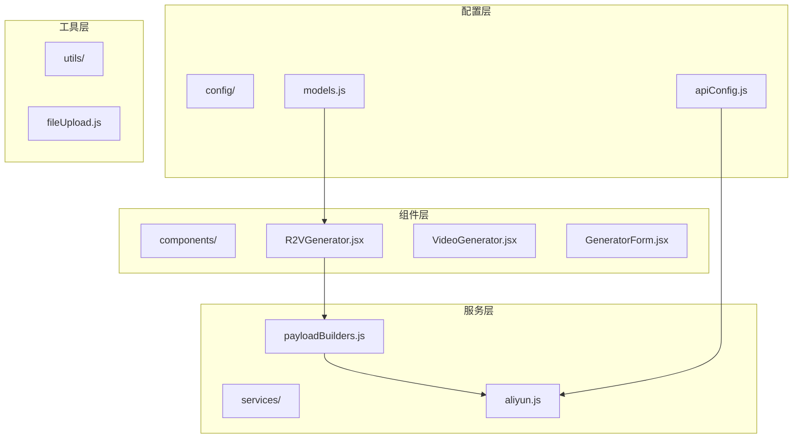
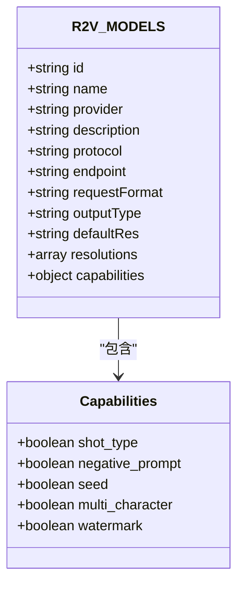
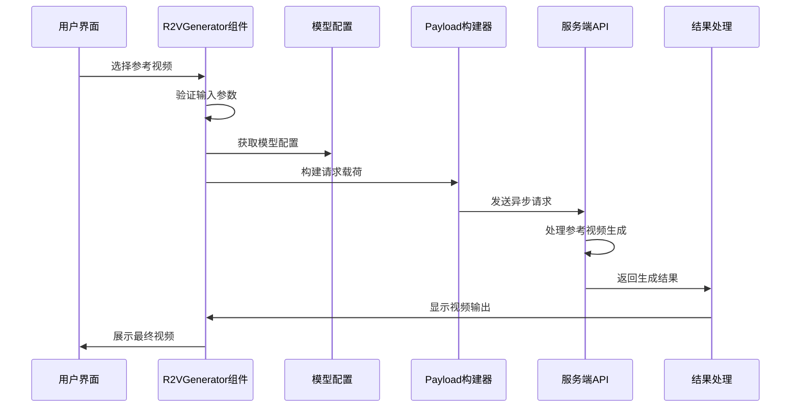
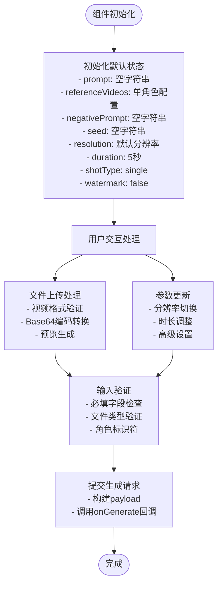
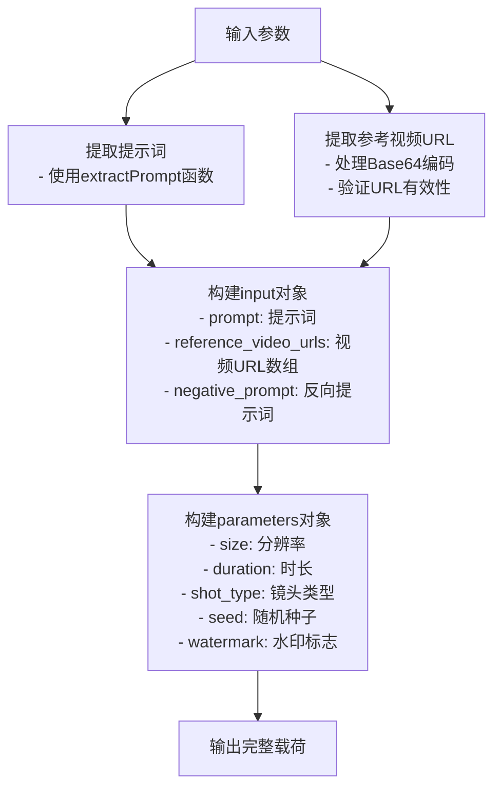
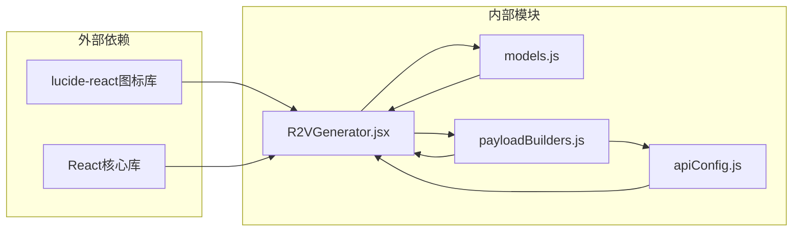
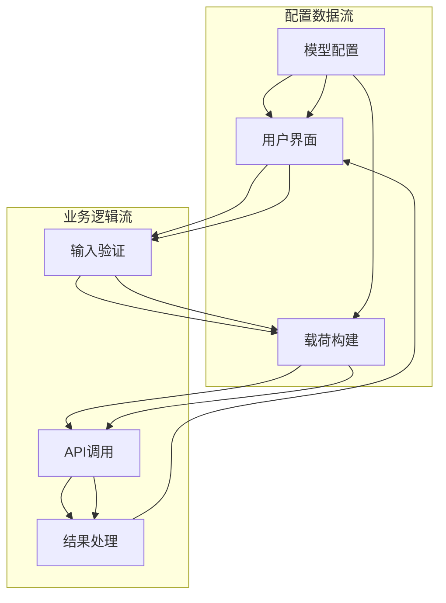
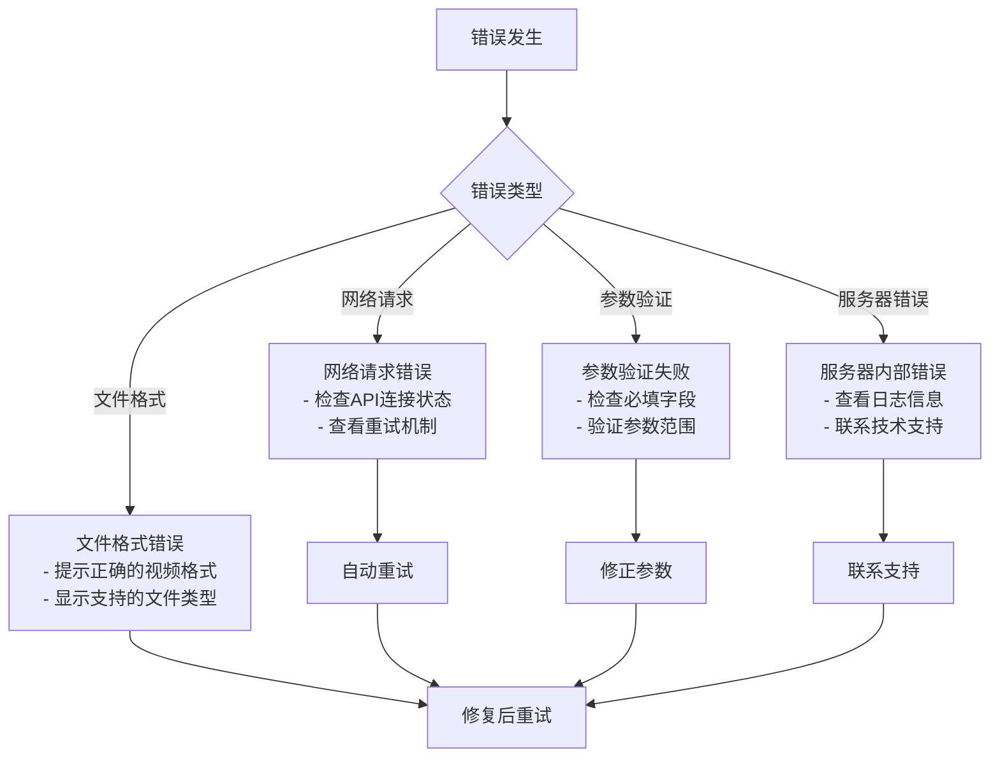

# 参考视频模型配置

<cite>
**本文档引用的文件**
- [models.js](file://src/config/models.js)
- [R2VGenerator.jsx](file://src/components/R2VGenerator.jsx)
- [payloadBuilders.js](file://src/services/payloadBuilders.js)
- [apiConfig.js](file://src/config/apiConfig.js)
</cite>

## 目录
1. [简介](#简介)
2. [项目结构](#项目结构)
3. [核心组件](#核心组件)
4. [架构概览](#架构概览)
5. [详细组件分析](#详细组件分析)
6. [依赖关系分析](#依赖关系分析)
7. [性能考虑](#性能考虑)
8. [故障排除指南](#故障排除指南)
9. [结论](#结论)

## 简介

本文档专注于通义万相前端应用中的参考视频模型配置，特别是万相2.6-R2V（参考生视频）模型。该模型是基于参考视频的角色形象和音色生成系统，支持多镜头叙事、多角色支持和水印功能。本文将深入解释R2V_MODELS数组中定义的参考视频生成模型配置，详细说明其特殊功能、工作原理、输入要求和输出特点，并提供最佳实践和应用场景指导。

## 项目结构

通义万相前端应用采用模块化的React架构设计，主要包含以下关键目录结构：

**图表来源**
- [models.js](file://src/config/models.js#L1-L1012)
- [R2VGenerator.jsx](file://src/components/R2VGenerator.jsx#L1-L359)
- [payloadBuilders.js](file://src/services/payloadBuilders.js#L1-L829)

**章节来源**
- [models.js](file://src/config/models.js#L1-L1012)
- [R2VGenerator.jsx](file://src/components/R2VGenerator.jsx#L1-L359)

## 核心组件

### R2V_MODELS配置

参考视频模型的核心配置位于models.js文件中，定义了完整的模型参数和能力集：

**图表来源**
- [models.js](file://src/config/models.js#L218-L239)

### 模型能力矩阵

| 能力项 | 描述 | 支持状态 |
|--------|------|----------|
| shot_type | 镜头类型控制 | 支持（single/multi） |
| negative_prompt | 反向提示词 | 支持 |
| seed | 随机种子 | 支持 |
| multi_character | 多角色支持 | 支持 |
| watermark | 水印功能 | 支持 |

**章节来源**
- [models.js](file://src/config/models.js#L218-L239)

## 架构概览

参考视频生成系统的整体架构采用分层设计，确保了良好的可维护性和扩展性：

**图表来源**
- [R2VGenerator.jsx](file://src/components/R2VGenerator.jsx#L83-L112)
- [payloadBuilders.js](file://src/services/payloadBuilders.js#L649-L665)

## 详细组件分析

### R2VGenerator组件

R2VGenerator组件是参考视频生成的核心UI组件，负责用户交互和参数收集：

#### 组件状态管理

**图表来源**
- [R2VGenerator.jsx](file://src/components/R2VGenerator.jsx#L1-L359)

#### 角色管理系统

组件支持多角色参考视频配置，每个角色都有独立的视频源和标识符：

| 角色配置 | 字段说明 | 默认值 | 用途 |
|----------|----------|--------|------|
| character1 | 主要角色 | character1 | 第一个参考角色 |
| character2 | 第二个角色 | character2 | 第二个参考角色 |
| character3 | 第三个角色 | character3 | 第三个参考角色 |

**章节来源**
- [R2VGenerator.jsx](file://src/components/R2VGenerator.jsx#L8-L10)
- [R2VGenerator.jsx](file://src/components/R2VGenerator.jsx#L63-L78)

### Payload构建器

payloadBuilders.js文件实现了策略模式的载荷构建器，专门处理不同模型格式的请求构造：

#### referenceToVideo构建器

**图表来源**
- [payloadBuilders.js](file://src/services/payloadBuilders.js#L649-L665)

**章节来源**
- [payloadBuilders.js](file://src/services/payloadBuilders.js#L649-L665)

### 模型配置详解

#### 万相2.6-R2V模型特性

| 配置属性 | 值 | 说明 |
|----------|----|------|
| id | wan2.6-r2v | 模型唯一标识符 |
| name | 万相2.6-R2V (参考生视频) | 用户可见名称 |
| provider | 阿里通义实验室 | 模型提供商 |
| description | 基于参考视频的角色形象和音色生成，支持多镜头叙事 | 模型功能描述 |
| protocol | async_r2v | 异步协议类型 |
| endpoint | /services/aigc/video-generation/video-synthesis | API端点路径 |
| requestFormat | referenceToVideo | 请求格式标识符 |
| outputType | video | 输出类型为视频 |
| defaultRes | 1080P | 默认输出分辨率 |
| resolutions | ['720P', '1080P'] | 支持的分辨率选项 |

**章节来源**
- [models.js](file://src/config/models.js#L218-L239)

## 依赖关系分析

### 组件间依赖关系

**图表来源**
- [R2VGenerator.jsx](file://src/components/R2VGenerator.jsx#L1-L3)
- [models.js](file://src/config/models.js#L1-L10)
- [payloadBuilders.js](file://src/services/payloadBuilders.js#L1-L6)

### 数据流依赖

**图表来源**
- [models.js](file://src/config/models.js#L218-L239)
- [R2VGenerator.jsx](file://src/components/R2VGenerator.jsx#L83-L112)
- [payloadBuilders.js](file://src/services/payloadBuilders.js#L649-L665)

**章节来源**
- [models.js](file://src/config/models.js#L1-L1012)
- [R2VGenerator.jsx](file://src/components/R2VGenerator.jsx#L1-L359)
- [payloadBuilders.js](file://src/services/payloadBuilders.js#L1-L829)

## 性能考虑

### 内存优化策略

1. **文件处理优化**
   - 使用Base64编码减少网络传输开销
   - 及时清理预览URL避免内存泄漏
   - 限制同时上传的参考视频数量

2. **渲染性能**
   - 条件渲染高级设置面板
   - 按需加载视频预览
   - 优化状态更新频率

3. **网络请求优化**
   - 合理的超时设置（120秒）
   - 指数退避重试机制
   - 状态轮询间隔优化

### 最佳实践建议

1. **输入文件优化**
   - 推荐使用MP4或MOV格式
   - 控制单个视频大小不超过10MB
   - 建议时长控制在2-30秒范围内

2. **参数配置建议**
   - 分辨率选择：720P适合快速预览，1080P适合正式输出
   - 时长设置：5秒适合测试，10秒适合完整片段
   - 镜头类型：单镜头适合简单场景，多镜头适合复杂叙事

## 故障排除指南

### 常见问题及解决方案

| 问题类型 | 症状 | 可能原因 | 解决方案 |
|----------|------|----------|----------|
| 文件上传失败 | 无法选择视频文件 | 文件格式不支持 | 确保使用MP4或MOV格式 |
| 生成请求失败 | 提交按钮禁用 | 缺少必要参数 | 检查提示词和参考视频 |
| 输出质量差 | 视频模糊或失真 | 分辨率设置不当 | 调整到更高分辨率 |
| 性能问题 | 页面响应缓慢 | 同时上传过多视频 | 减少并发上传数量 |

### 错误处理机制

**章节来源**
- [R2VGenerator.jsx](file://src/components/R2VGenerator.jsx#L42-L58)
- [apiConfig.js](file://src/config/apiConfig.js#L9-L19)

## 结论

参考视频模型配置系统为通义万相应用提供了强大的视频生成能力。通过精心设计的配置架构、直观的用户界面和可靠的后端服务，该系统能够满足从个人创作到商业应用的各种需求。

### 关键优势

1. **灵活的配置系统**：支持多种分辨率、时长和镜头类型的组合
2. **多角色支持**：能够同时处理多个参考角色的视频生成
3. **高质量输出**：提供1080P高清输出选项
4. **用户友好**：直观的界面设计和实时预览功能

### 应用场景建议

1. **短视频创作**：利用多镜头叙事功能制作创意短视频
2. **角色动画**：基于参考视频生成角色动画内容
3. **教学演示**：创建基于参考视频的教学视频
4. **产品展示**：生成产品的动态展示视频

该系统的设计充分考虑了用户体验和技术实现的平衡，为参考视频生成提供了稳定可靠的技术支撑。