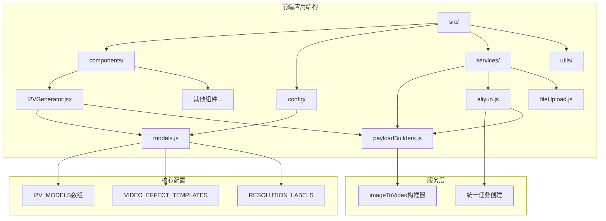
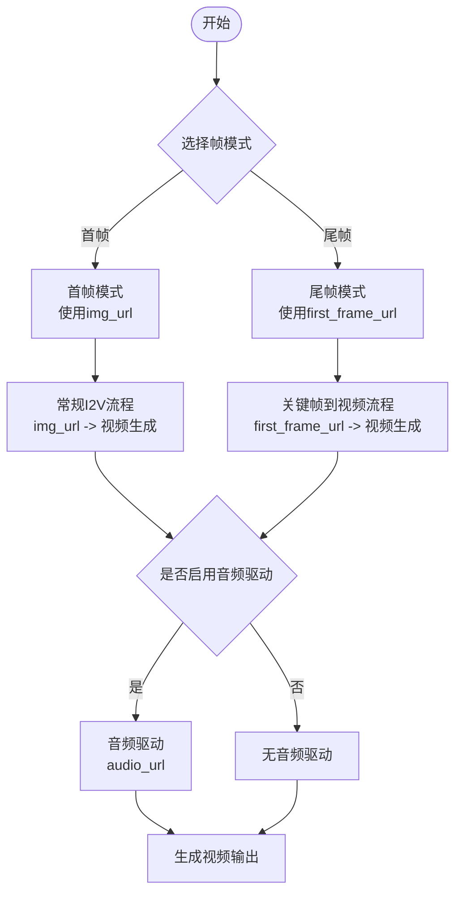
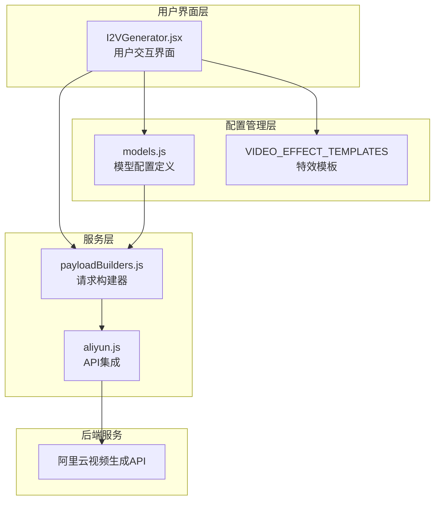
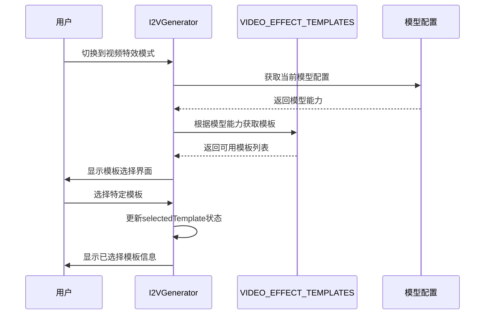
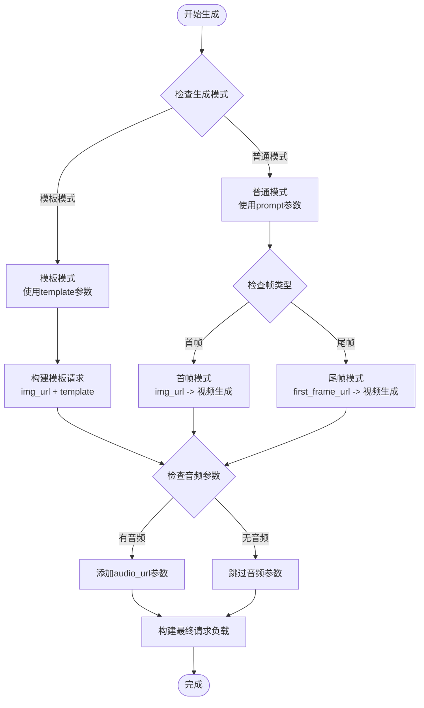
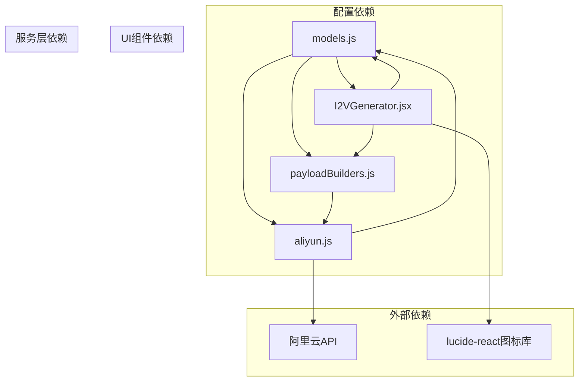
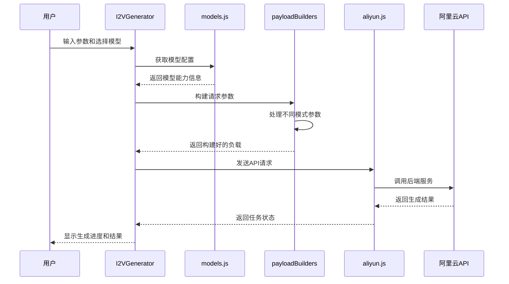

# 图像到视频模型配置

<cite>
**本文档引用的文件**
- [models.js](file://src/config/models.js)
- [I2VGenerator.jsx](file://src/components/I2VGenerator.jsx)
- [payloadBuilders.js](file://src/services/payloadBuilders.js)
- [aliyun.js](file://src/services/aliyun.js)
- [README.md](file://README.md)
</cite>

## 目录
1. [简介](#简介)
2. [项目结构](#项目结构)
3. [核心组件](#核心组件)
4. [架构概览](#架构概览)
5. [详细组件分析](#详细组件分析)
6. [依赖关系分析](#依赖关系分析)
7. [性能考虑](#性能考虑)
8. [故障排除指南](#故障排除指南)
9. [结论](#结论)
10. [附录](#附录)

## 简介

本文档深入解析通义万相前端应用的图像到视频（Image-to-Video, I2V）模型配置系统。该系统提供了完整的图生视频生成能力，包括多个版本的I2V模型，支持关键帧选择、音频驱动和多镜头叙事等高级功能。

I2V模型配置位于`src/config/models.js`文件中，通过结构化的数据定义实现了模型能力的统一管理和动态配置。前端组件`src/components/I2VGenerator.jsx`负责用户界面交互，服务层`src/services/payloadBuilders.js`负责请求参数构建，后端集成`src/services/aliyun.js`负责与阿里云API的通信。

## 项目结构

该项目采用React + Vite技术栈，采用模块化组织方式：



**图表来源**
- [models.js](file://src/config/models.js#L1-L1012)
- [I2VGenerator.jsx](file://src/components/I2VGenerator.jsx#L1-L588)

**章节来源**
- [models.js](file://src/config/models.js#L1-L1012)
- [README.md](file://README.md#L1-L17)

## 核心组件

### I2V_MODELS数组结构

I2V_MODELS数组定义了所有图像到视频生成模型的配置信息，每个模型包含以下核心属性：

| 属性 | 类型 | 描述 |
|------|------|------|
| id | string | 模型唯一标识符 |
| name | string | 模型显示名称 |
| provider | string | 提供商信息 |
| description | string | 模型功能描述 |
| protocol | enum | 通信协议（ASYNC_I2V） |
| endpoint | string | API端点路径 |
| requestFormat | string | 请求格式标识 |
| outputType | enum | 输出类型（VIDEO） |
| defaultRes | string | 默认分辨率 |
| resolutions | array | 支持的分辨率列表 |
| capabilities | object | 能力配置对象 |

### 关键帧选择功能

关键帧选择（frame_selection）是I2V模型的核心特性之一，支持两种帧模式：

1. **首帧模式（First Frame）**：传统的图像到视频生成
2. **尾帧模式（Last Frame）**：关键帧到视频生成（KF2V）



**图表来源**
- [I2VGenerator.jsx](file://src/components/I2VGenerator.jsx#L146-L158)
- [models.js](file://src/config/models.js#L150-L157)

**章节来源**
- [models.js](file://src/config/models.js#L138-L216)
- [I2VGenerator.jsx](file://src/components/I2VGenerator.jsx#L289-L318)

## 架构概览

整个I2V模型配置系统采用分层架构设计：



**图表来源**
- [I2VGenerator.jsx](file://src/components/I2VGenerator.jsx#L1-L588)
- [models.js](file://src/config/models.js#L960-L1008)
- [payloadBuilders.js](file://src/services/payloadBuilders.js#L577-L643)
- [aliyun.js](file://src/services/aliyun.js#L50-L71)

## 详细组件分析

### 模型配置详解

#### 万相2.6-I2V（Flash）

```mermaid
classDiagram
class Wan26I2VFlash {
+string id : "wan2.6-i2v-flash"
+string name : "万相2.6-I2V (Flash)"
+string provider : "阿里通义实验室"
+string description : "2.6代图生视频极速版，支持多镜头与音频"
+string protocol : "ASYNC_I2V"
+string endpoint : "/services/aigc/video-generation/video-synthesis"
+string requestFormat : "imageToVideo"
+string outputType : "VIDEO"
+string defaultRes : "1080P"
+array resolutions : ["480P", "720P", "1080P"]
+object capabilities : {
+bool prompt_extend : true
+bool shot_type : true
+bool audio : true
+bool negative_prompt : true
+bool seed : true
+bool frame_selection : true
}
}
```

**图表来源**
- [models.js](file://src/config/models.js#L139-L157)

#### 万相2.6-I2V（Pro）

| 特性 | 支持情况 | 说明 |
|------|----------|------|
| 多镜头叙事 | ✅ | 支持单镜头和多镜头模式 |
| 音频驱动 | ✅ | 支持音频同步生成 |
| 关键帧选择 | ✅ | 支持首帧和尾帧模式 |
| 分辨率 | 720P/1080P | 默认1080P |
| 性能 | 专业版 | 高质量输出 |

#### 万相2.5-I2V

| 特性 | 支持情况 | 说明 |
|------|----------|------|
| 多镜头叙事 | ❌ | 不支持多镜头 |
| 音频驱动 | ✅ | 支持音频驱动 |
| 关键帧选择 | ✅ | 支持关键帧到视频 |
| 分辨率 | 480P/720P/1080P | 默认1080P |
| 版本 | 预览版 | 功能相对简化 |

#### 万相2.2-I2V（Flash）

| 特性 | 支持情况 | 说明 |
|------|----------|------|
| 多镜头叙事 | ❌ | 不支持多镜头 |
| 音频驱动 | ❌ | 不支持音频驱动 |
| 关键帧选择 | ❌ | 不支持关键帧到视频 |
| 分辨率 | 480P/720P/1080P | 默认720P |
| 版本 | 极速版 | 性能优化但功能受限 |

**章节来源**
- [models.js](file://src/config/models.js#L138-L216)

### 用户界面组件分析

I2VGenerator.jsx组件实现了完整的用户交互界面，包含以下核心功能：

#### 模板选择系统



**图表来源**
- [I2VGenerator.jsx](file://src/components/I2VGenerator.jsx#L39-L57)
- [models.js](file://src/config/models.js#L960-L1008)

#### 参数构建流程



**图表来源**
- [I2VGenerator.jsx](file://src/components/I2VGenerator.jsx#L113-L172)
- [payloadBuilders.js](file://src/services/payloadBuilders.js#L577-L643)

**章节来源**
- [I2VGenerator.jsx](file://src/components/I2VGenerator.jsx#L1-L588)

### 请求构建器分析

payloadBuilders.js中的imageToVideo函数实现了I2V模型的请求参数构建：

#### 模板模式处理

当使用视频特效模板时，请求构建器会：
1. 使用`template`参数替代传统的`prompt`
2. 继续支持`img_url`作为输入图像
3. 应用模板特定的生成参数

#### 普通模式处理

对于常规的图像到视频生成：
1. 继承videoGeneration的基础参数
2. 添加`img_url`参数作为输入图像
3. 支持关键帧到视频的特殊参数
4. 处理音频驱动参数

**章节来源**
- [payloadBuilders.js](file://src/services/payloadBuilders.js#L577-L643)

## 依赖关系分析

### 组件间依赖关系



**图表来源**
- [models.js](file://src/config/models.js#L1-L1012)
- [I2VGenerator.jsx](file://src/components/I2VGenerator.jsx#L1-L5)
- [payloadBuilders.js](file://src/services/payloadBuilders.js#L804-L828)
- [aliyun.js](file://src/services/aliyun.js#L50-L71)

### 数据流分析



**图表来源**
- [I2VGenerator.jsx](file://src/components/I2VGenerator.jsx#L113-L172)
- [payloadBuilders.js](file://src/services/payloadBuilders.js#L577-L643)
- [aliyun.js](file://src/services/aliyun.js#L50-L71)

**章节来源**
- [models.js](file://src/config/models.js#L931-L939)
- [I2VGenerator.jsx](file://src/components/I2VGenerator.jsx#L1-L588)
- [payloadBuilders.js](file://src/services/payloadBuilders.js#L577-L643)
- [aliyun.js](file://src/services/aliyun.js#L50-L71)

## 性能考虑

### 模型性能对比

| 模型版本 | 生成速度 | 输出质量 | 功能完整性 | 适用场景 |
|----------|----------|----------|------------|----------|
| 2.2-I2V Flash | ⭐⭐⭐⭐⭐ | ⭐⭐ | ⭐⭐ | 快速原型、测试场景 |
| 2.5-I2V | ⭐⭐⭐⭐ | ⭐⭐⭐ | ⭐⭐⭐ | 基础应用、成本敏感 |
| 2.6-I2V Pro | ⭐⭐⭐ | ⭐⭐⭐⭐⭐ | ⭐⭐⭐⭐⭐ | 专业应用、高质量需求 |
| 2.6-I2V Flash | ⭐⭐⭐⭐⭐ | ⭐⭐⭐⭐ | ⭐⭐⭐⭐ | 性能优先、实时应用 |

### 优化建议

1. **分辨率选择**：根据应用场景选择合适的分辨率，避免不必要的计算开销
2. **模板使用**：优先使用预定义模板减少生成时间
3. **参数优化**：合理设置时长和分辨率参数，平衡质量和性能
4. **缓存策略**：对常用模板和参数组合进行缓存

## 故障排除指南

### 常见问题及解决方案

#### 模型配置错误
**问题**：模型ID不存在或配置无效
**解决方案**：
1. 检查模型ID是否在I2V_MODELS数组中
2. 验证模型配置的完整性
3. 确认协议和端点配置正确

#### 参数构建失败
**问题**：请求参数构建异常
**解决方案**：
1. 检查输入参数的格式和类型
2. 验证模型能力配置
3. 确认请求格式匹配

#### API调用错误
**问题**：与阿里云API通信失败
**解决方案**：
1. 检查API密钥配置
2. 验证网络连接
3. 查看API响应状态码

**章节来源**
- [aliyun.js](file://src/services/aliyun.js#L50-L71)
- [payloadBuilders.js](file://src/services/payloadBuilders.js#L577-L643)

## 结论

通义万相的图像到视频模型配置系统展现了现代AI应用的优秀架构设计。通过结构化的配置管理、灵活的参数构建和完善的错误处理机制，系统为用户提供了强大而易用的图生视频生成功能。

主要优势包括：
- **模块化设计**：清晰的职责分离和依赖管理
- **配置驱动**：通过数据定义实现功能扩展
- **用户体验**：直观的界面和丰富的功能选项
- **性能优化**：针对不同场景的性能调优

未来可以考虑的功能扩展包括更精细的性能监控、更多的模板类型以及更智能的参数推荐系统。

## 附录

### 最佳实践指南

#### 模型选择建议
1. **性能优先**：选择2.2-I2V Flash版本
2. **质量优先**：选择2.6-I2V Pro版本
3. **功能平衡**：选择2.5-I2V版本

#### 参数配置建议
1. **分辨率选择**：根据目标平台选择合适分辨率
2. **时长控制**：一般5-10秒为最佳观看体验
3. **模板使用**：优先使用预定义模板提高成功率

#### 扩展开发指南
1. **新增模型**：在I2V_MODELS数组中添加新配置
2. **参数扩展**：在payloadBuilders中添加新的参数处理逻辑
3. **界面适配**：在I2VGenerator中添加相应的UI控件

**章节来源**
- [models.js](file://src/config/models.js#L138-L216)
- [I2VGenerator.jsx](file://src/components/I2VGenerator.jsx#L1-L588)
- [payloadBuilders.js](file://src/services/payloadBuilders.js#L577-L643)