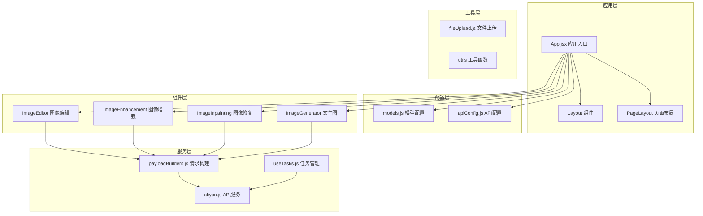
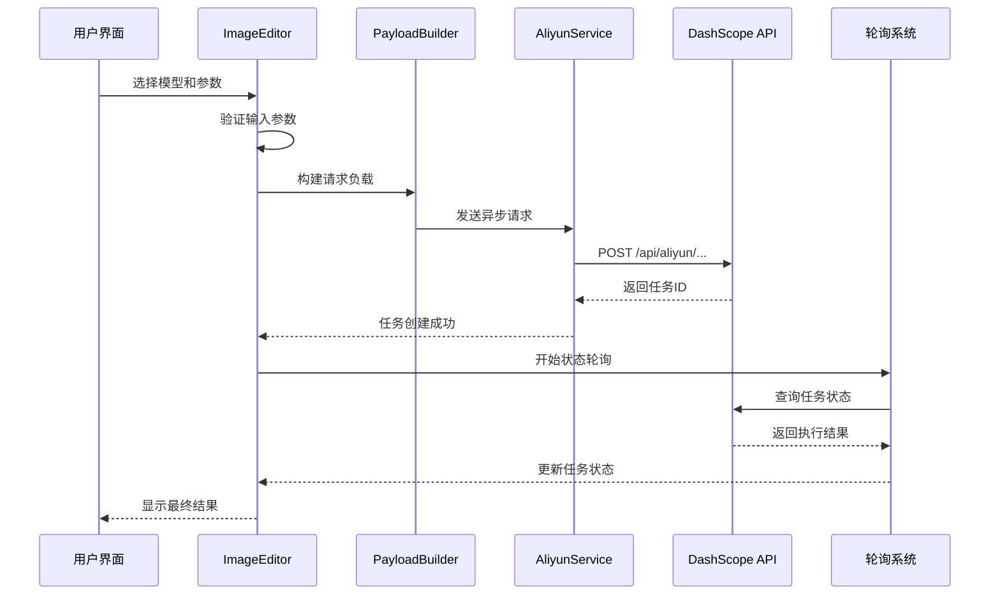
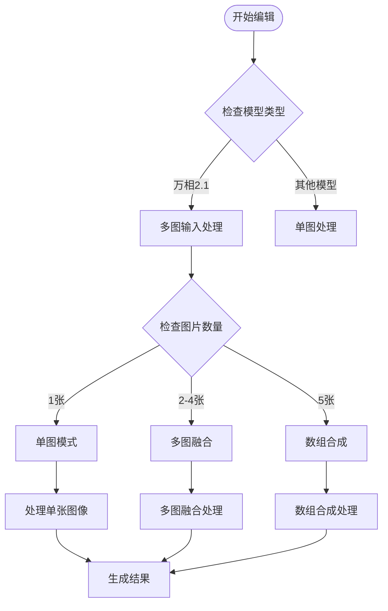
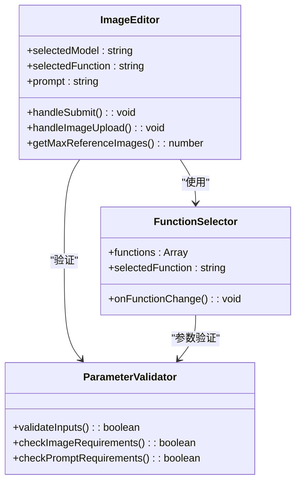
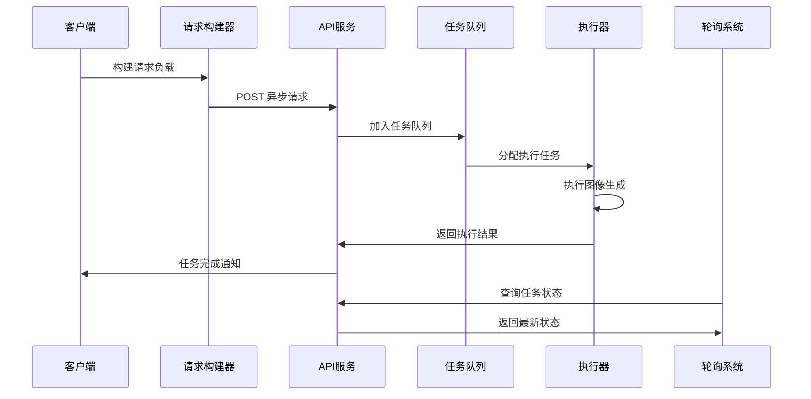
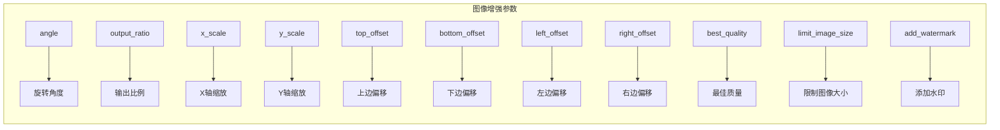
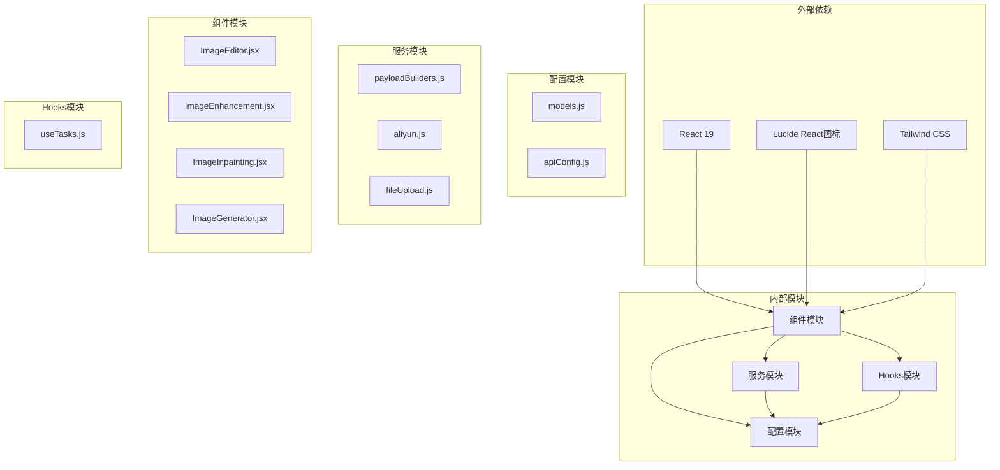
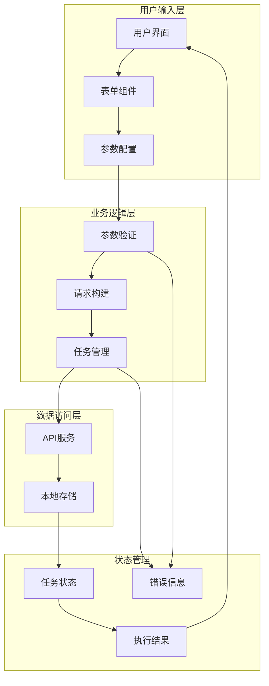

# 万相通用图像编辑模型

<cite>
**本文档引用的文件**
- [models.js](file://src/config/models.js)
- [apiConfig.js](file://src/config/apiConfig.js)
- [App.jsx](file://src/App.jsx)
- [ImageEditor.jsx](file://src/components/ImageEditor.jsx)
- [ImageEnhancement.jsx](file://src/components/ImageEnhancement.jsx)
- [ImageInpainting.jsx](file://src/components/ImageInpainting.jsx)
- [payloadBuilders.js](file://src/services/payloadBuilders.js)
- [useTasks.js](file://src/hooks/useTasks.js)
- [aliyun.js](file://src/services/aliyun.js)
- [ImageGenerator.jsx](file://src/components/ImageGenerator.jsx)
</cite>

## 目录
1. [简介](#简介)
2. [项目结构](#项目结构)
3. [核心组件](#核心组件)
4. [架构概览](#架构概览)
5. [详细组件分析](#详细组件分析)
6. [依赖关系分析](#依赖关系分析)
7. [性能考虑](#性能考虑)
8. [故障排除指南](#故障排除指南)
9. [结论](#结论)

## 简介

万相通用图像编辑模型是一个基于阿里云DashScope平台的React应用，提供了强大的图像编辑和生成能力。该系统支持万相2.1和2.5两个版本的通用图像编辑模型，具备丰富的编辑功能和灵活的配置选项。

本项目采用现代化的前端技术栈，包括React 19、Vite构建工具和Tailwind CSS样式框架，为用户提供了直观易用的图形界面和流畅的交互体验。

## 项目结构

该项目采用模块化的组件架构，主要分为以下几个核心部分：

**图表来源**
- [App.jsx](file://src/App.jsx#L1-L377)
- [models.js](file://src/config/models.js#L1-L1012)

**章节来源**
- [App.jsx](file://src/App.jsx#L1-L377)
- [models.js](file://src/config/models.js#L1-L1012)

## 核心组件

### 模型配置系统

系统通过统一的模型配置文件管理所有支持的AI模型，包括：

- **异步文本到图像协议**：支持万相2.1和2.5的通用图像编辑模型
- **多模型支持**：涵盖Qwen图像编辑系列、万相图像生成系列等
- **功能分类**：按图像编辑、图像合成、特效类、创意类进行分类
- **能力标识**：通过capabilities对象标识各模型的具体功能特性

### 异步任务管理系统

采用先进的异步任务管理模式，支持：

- **智能轮询策略**：根据任务状态动态调整轮询间隔
- **乐观更新**：任务创建时立即显示临时状态
- **批量查询**：支持同时查询多个任务状态
- **本地存储**：持久化保存历史任务记录

### 统一的请求构建器

通过策略模式实现请求格式的标准化：

- **多格式支持**：支持多种请求格式（multimodalMessages、text2image等）
- **参数验证**：自动验证必需参数和格式
- **错误处理**：提供详细的错误信息和处理建议

**章节来源**
- [models.js](file://src/config/models.js#L1-L1012)
- [useTasks.js](file://src/hooks/useTasks.js#L1-L333)
- [payloadBuilders.js](file://src/services/payloadBuilders.js#L1-L829)

## 架构概览

系统采用分层架构设计，确保了良好的可维护性和扩展性：

**图表来源**
- [ImageEditor.jsx](file://src/components/ImageEditor.jsx#L163-L230)
- [payloadBuilders.js](file://src/services/payloadBuilders.js#L50-L160)
- [aliyun.js](file://src/services/aliyun.js#L50-L160)
- [useTasks.js](file://src/hooks/useTasks.js#L164-L246)

## 详细组件分析

### 万相2.1通用图像编辑模型

#### 功能特性

万相2.1通用图像编辑模型支持以下核心编辑功能：

| 功能类别 | 功能名称 | 描述 |
|---------|----------|------|
| 全局风格化 | stylization_all | 对整张图像进行风格转换 |
| 局部风格化 | stylization_local | 仅对选定区域进行风格化处理 |
| 指令编辑 | description_edit | 基于文本指令的图像编辑 |
| 局部重绘 | description_edit_with_mask | 基于遮罩的局部内容重绘 |
| 去文字水印 | remove_watermark | 移除图像中的文字水印 |
| 扩图 | expand | 按比例或指定方向扩展图像 |
| 图像超分 | super_resolution | 提升图像分辨率和清晰度 |
| 图像上色 | colorization | 为黑白图像添加色彩 |
| 线稿生图 | doodle | 将线稿转换为完整图像 |
| 参考卡通形象生图 | control_cartoon_feature | 基于参考卡通形象生成图像 |

#### 多图输入输出能力

系统支持灵活的多图处理机制：

**图表来源**
- [ImageEditor.jsx](file://src/components/ImageEditor.jsx#L57-L69)
- [models.js](file://src/config/models.js#L328-L380)

#### 功能选择机制

系统通过统一的功能选择机制管理不同编辑功能：

**图表来源**
- [ImageEditor.jsx](file://src/components/ImageEditor.jsx#L39-L42)
- [ImageEditor.jsx](file://src/components/ImageEditor.jsx#L163-L230)

**章节来源**
- [models.js](file://src/config/models.js#L328-L359)
- [ImageEditor.jsx](file://src/components/ImageEditor.jsx#L1-L973)

### 万相2.5通用图像编辑模型

#### 协议支持

万相2.5版本采用同步多模态协议，提供更快的响应速度：

- **协议类型**：SYNC_MULTIMODAL
- **调用方式**：同步请求，无需轮询等待
- **适用场景**：对响应速度要求较高的应用场景
- **限制条件**：仅支持单图编辑和多图融合

#### 配置参数

| 参数名称 | 类型 | 默认值 | 说明 |
|---------|------|--------|------|
| model | string | qwen-image-edit-max | 模型ID |
| input | object | - | 输入数据对象 |
| parameters | object | - | 生成参数 |
| prompt | string | - | 主要提示词 |
| negative_prompt | string | - | 反向提示词 |
| size | string | 1024*1024 | 输出尺寸 |
| n | number | 1-6 | 输出图像数量 |
| prompt_extend | boolean | true | 智能改写提示词 |
| watermark | boolean | false | 添加水印 |
| seed | number | - | 随机种子 |

**章节来源**
- [models.js](file://src/config/models.js#L360-L380)
- [payloadBuilders.js](file://src/services/payloadBuilders.js#L125-L150)

### 异步文本到图像协议

#### 协议特点

系统支持异步文本到图像协议，适用于万相2.1和2.5的通用图像编辑模型：

- **异步处理**：提交任务后立即返回，后台异步执行
- **状态轮询**：通过轮询机制获取任务执行状态
- **错误恢复**：支持任务重试和错误处理
- **批量管理**：支持同时管理多个并发任务

#### 请求流程

**图表来源**
- [aliyun.js](file://src/services/aliyun.js#L50-L160)
- [useTasks.js](file://src/hooks/useTasks.js#L164-L246)

**章节来源**
- [models.js](file://src/config/models.js#L1-L10)
- [aliyun.js](file://src/services/aliyun.js#L1-L215)
- [useTasks.js](file://src/hooks/useTasks.js#L1-L333)

### 图像增强组件

#### 支持的功能

图像增强组件提供多种图像处理功能：

| 功能类型 | 功能名称 | 参数配置 |
|---------|----------|----------|
| 扩图 | expand | angle, output_ratio, x_scale, y_scale |
| 超分辨率 | super_resolution | best_quality, limit_image_size |
| 图像上色 | colorization | prompt, style |
| 边缘扩展 | out_painting | top_offset, bottom_offset, left_offset, right_offset |

#### 高级参数

**图表来源**
- [ImageEnhancement.jsx](file://src/components/ImageEnhancement.jsx#L43-L54)
- [ImageEnhancement.jsx](file://src/components/ImageEnhancement.jsx#L104-L145)

**章节来源**
- [ImageEnhancement.jsx](file://src/components/ImageEnhancement.jsx#L1-L513)

### 图像修复组件

#### 局部重绘功能

图像修复组件支持精确的局部内容编辑：

- **遮罩支持**：支持白色区域编辑、黑色区域保护
- **风格控制**：可选择不同的艺术风格
- **颜色配置**：支持多种遮罩颜色设置
- **参数验证**：自动验证输入参数的有效性

#### 去水印功能

专门的去水印功能支持：

- **智能识别**：自动识别图像中的文字水印
- **精确移除**：仅移除指定的水印内容
- **内容填充**：智能填充被移除区域的内容
- **质量保证**：保持图像整体质量不受影响

**章节来源**
- [ImageInpainting.jsx](file://src/components/ImageInpainting.jsx#L1-L482)

## 依赖关系分析

### 核心依赖关系

系统采用模块化设计，各组件间依赖关系清晰：

**图表来源**
- [package.json](file://package.json#L12-L31)
- [models.js](file://src/config/models.js#L1-L1012)
- [payloadBuilders.js](file://src/services/payloadBuilders.js#L1-L829)

### 数据流分析

系统采用单向数据流设计，确保数据的一致性和可预测性：

**图表来源**
- [ImageEditor.jsx](file://src/components/ImageEditor.jsx#L163-L230)
- [useTasks.js](file://src/hooks/useTasks.js#L256-L312)
- [payloadBuilders.js](file://src/services/payloadBuilders.js#L77-L119)

**章节来源**
- [package.json](file://package.json#L1-L33)
- [models.js](file://src/config/models.js#L1-L1012)

## 性能考虑

### 异步处理优化

系统采用异步处理策略，有效提升了用户体验：

- **即时响应**：任务提交后立即返回，避免长时间等待
- **智能轮询**：根据任务状态动态调整轮询频率
- **批量查询**：支持同时查询多个任务状态，减少网络开销
- **乐观更新**：任务创建时立即显示临时状态

### 内存管理

- **Base64压缩**：自动压缩大图片的Base64编码
- **本地存储清理**：定期清理过期任务记录
- **资源释放**：及时释放不再使用的内存资源

### 网络优化

- **超时控制**：合理的请求超时设置
- **重试机制**：智能的网络错误重试策略
- **缓存策略**：合理利用浏览器缓存机制

## 故障排除指南

### 常见问题及解决方案

#### API密钥问题

**问题症状**：任务创建失败，提示API密钥无效

**解决步骤**：
1. 检查API密钥格式是否正确
2. 确认API密钥权限是否足够
3. 验证网络连接是否正常
4. 重新登录并保存API密钥

#### 图像上传失败

**问题症状**：图片上传过程中断或失败

**解决步骤**：
1. 检查图片格式是否支持（jpg、png、webp）
2. 确认图片大小是否超过限制（8MB）
3. 验证网络连接稳定性
4. 尝试重新上传或使用其他浏览器

#### 任务状态异常

**问题症状**：任务长时间处于RUNNING状态

**解决步骤**：
1. 检查任务是否仍在执行中
2. 查看是否有网络中断情况
3. 尝试刷新页面重新获取状态
4. 联系技术支持获取帮助

#### 参数配置错误

**问题症状**：任务创建时报参数错误

**解决步骤**：
1. 检查必需参数是否完整填写
2. 验证参数格式是否正确
3. 确认模型版本兼容性
4. 参考模型文档修正参数

**章节来源**
- [aliyun.js](file://src/services/aliyun.js#L14-L36)
- [useTasks.js](file://src/hooks/useTasks.js#L30-L84)

## 结论

万相通用图像编辑模型是一个功能强大、架构清晰的现代Web应用。通过统一的配置管理和模块化设计，系统实现了以下目标：

### 技术优势

- **统一接口**：通过配置驱动的方式支持多种AI模型
- **灵活扩展**：新增模型只需修改配置文件，无需修改核心代码
- **用户体验**：提供直观的图形界面和流畅的交互体验
- **性能优化**：采用异步处理和智能轮询策略

### 功能特色

- **多模型支持**：涵盖万相2.1和2.5的多种编辑功能
- **多图处理**：支持单图、多图融合和数组合成
- **参数定制**：提供丰富的参数配置选项
- **错误处理**：完善的错误处理和用户提示机制

### 发展前景

该系统为图像编辑领域提供了一个优秀的技术基础，未来可以进一步扩展：

- **更多模型集成**：支持更多AI模型和服务
- **功能增强**：添加更多图像编辑功能
- **性能优化**：持续改进系统性能和用户体验
- **生态建设**：构建完整的AI图像处理生态系统

通过持续的技术创新和功能完善，万相通用图像编辑模型将成为图像处理领域的重要工具和平台。