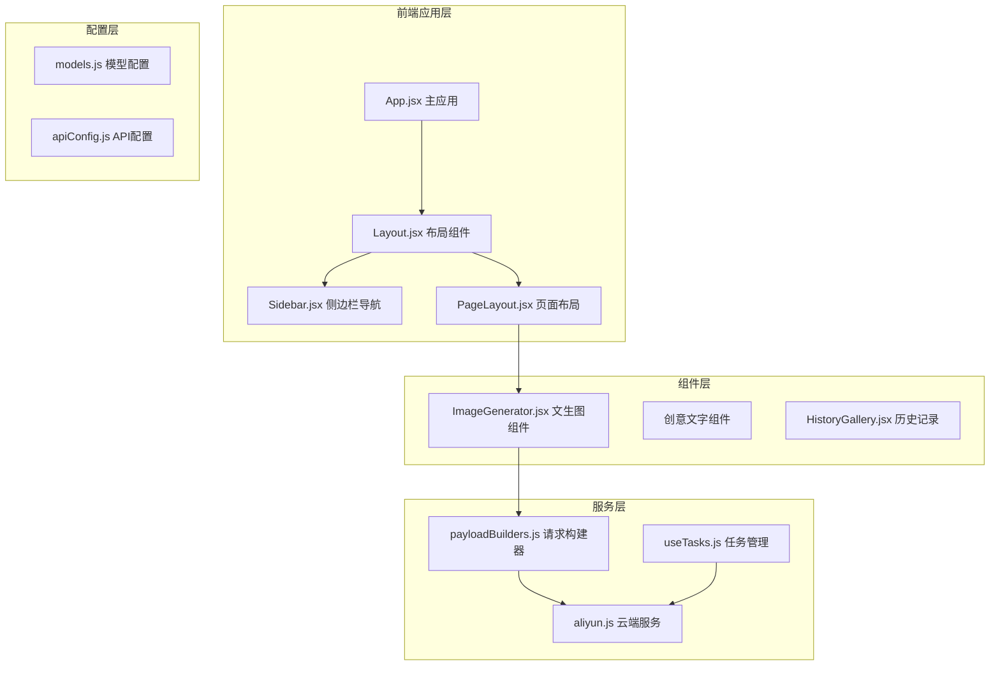
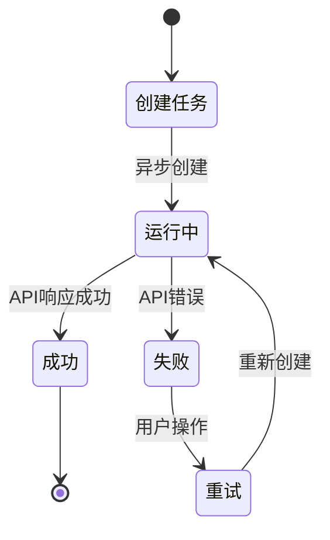
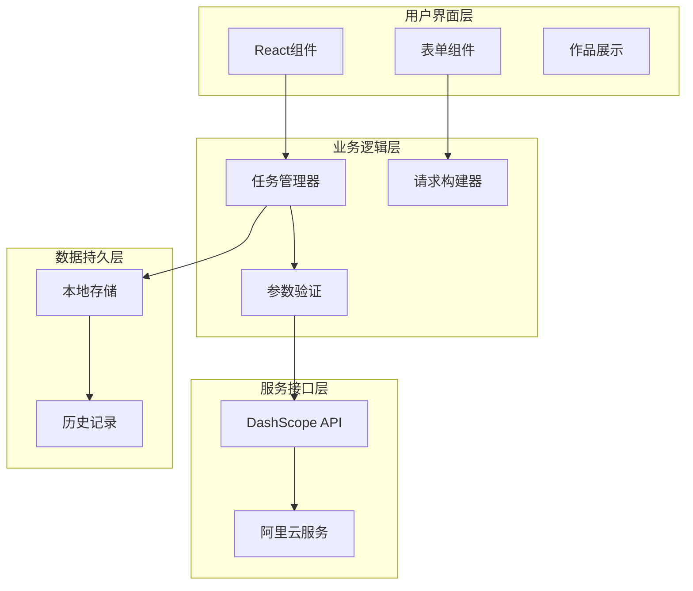
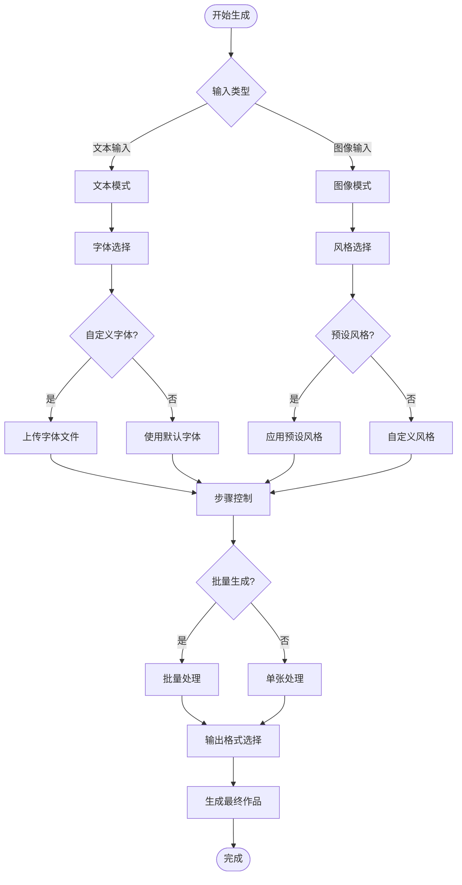
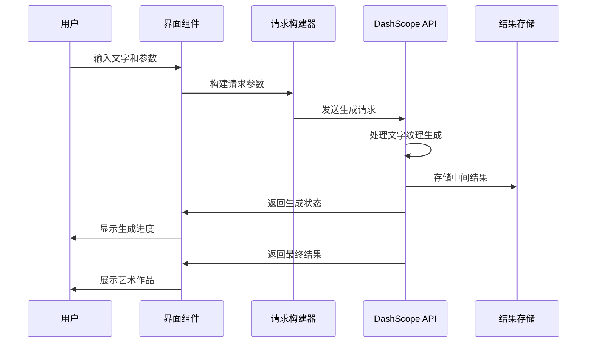
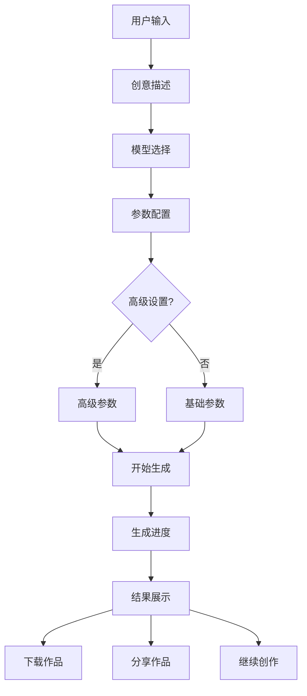
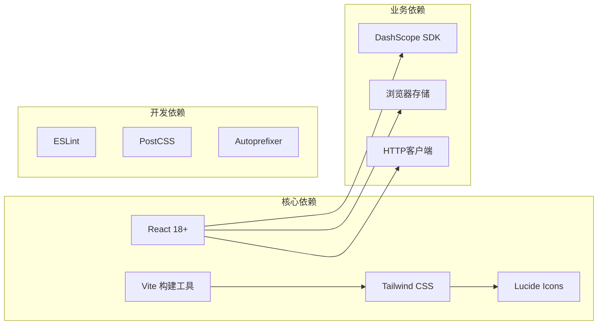

# 创意类模型

<cite>
**本文档引用的文件**
- [App.jsx](file://src/App.jsx)
- [Sidebar.jsx](file://src/components/Sidebar.jsx)
- [PageLayout.jsx](file://src/components/PageLayout.jsx)
- [models.js](file://src/config/models.js)
- [payloadBuilders.js](file://src/services/payloadBuilders.js)
- [useTasks.js](file://src/hooks/useTasks.js)
</cite>

## 目录
1. [简介](#简介)
2. [项目结构](#项目结构)
3. [核心组件](#核心组件)
4. [架构概览](#架构概览)
5. [详细组件分析](#详细组件分析)
6. [依赖关系分析](#依赖关系分析)
7. [性能考虑](#性能考虑)
8. [故障排除指南](#故障排除指南)
9. [结论](#结论)

## 简介

通义万相创意类模型是基于阿里云DashScope平台构建的AI创意工具集合，专注于文字艺术创作和海报设计。本项目实现了两个核心的文字创意模型：文字变形（WordArt Semantic）和文字纹理（WordArt Texture），为用户提供从简单文字到复杂艺术作品的完整创作流程。

该项目采用React + Vite技术栈，通过模块化的组件架构实现了高度可扩展的创意工具集。系统支持实时API密钥配置、任务队列管理、历史记录存储等企业级功能，为创意工作者提供了专业级的AI艺术创作体验。

## 项目结构

项目采用清晰的分层架构设计，主要目录结构如下：

**图表来源**
- [App.jsx](file://src/App.jsx#L1-L377)
- [models.js](file://src/config/models.js#L1-L800)
- [payloadBuilders.js](file://src/services/payloadBuilders.js#L1-L829)

**章节来源**
- [App.jsx](file://src/App.jsx#L1-L377)
- [Sidebar.jsx](file://src/components/Sidebar.jsx#L1-L149)

## 核心组件

### 创意文字模型配置

系统为创意文字功能提供了两个专门的模型配置：

#### 文字变形模型 (WordArt Semantic)
- **模型ID**: `wordart-semantic`
- **功能特性**: 文字轮廓语义变形，支持通过自然语言提示词实现文字边缘智能变形
- **输出格式**: PNG、SVG格式支持
- **高级功能**: 字体选择、自定义字体、批量生成、步骤控制
- **价格**: 0.04元/张

#### 文字纹理模型 (WordArt Texture)
- **模型ID**: `wordart-texture`
- **功能特性**: 为文字添加立体材质、光影、场景融合等艺术效果
- **输入模式**: 支持文本输入和图像输入两种模式
- **风格选项**: 材质风格、场景风格、光照风格、预设风格
- **高级功能**: 参考图像、透明通道、批量生成、短边尺寸控制
- **价格**: 0.04元/张

**章节来源**
- [models.js](file://src/config/models.js#L736-L787)

### 任务管理系统

系统实现了完整的任务生命周期管理：

**图表来源**
- [useTasks.js](file://src/hooks/useTasks.js#L256-L332)

**章节来源**
- [useTasks.js](file://src/hooks/useTasks.js#L1-L333)

## 架构概览

系统采用分层架构设计，确保了良好的可维护性和扩展性：

**图表来源**
- [payloadBuilders.js](file://src/services/payloadBuilders.js#L1-L829)
- [useTasks.js](file://src/hooks/useTasks.js#L1-L333)

## 详细组件分析

### 文字变形模型 (WordArt Semantic)

文字变形模型专注于将静态文字转换为具有艺术感的变形文字，支持复杂的语义理解和视觉表达。

#### 核心功能特性

| 功能类别 | 具体特性 | 技术实现 |
|---------|----------|----------|
| 文字变形 | 智能轮廓变形、形状变换 | 基于语义理解的几何变换算法 |
| 艺术融合 | 纹理与材质融合、风格迁移 | 多通道图像处理和风格合成 |
| 字体控制 | 内置字体选择、自定义字体上传 | 字体渲染引擎和TTF支持 |
| 输出格式 | PNG透明背景、SVG矢量格式 | 多格式图像编码器 |

#### 参数配置详解

**图表来源**
- [payloadBuilders.js](file://src/services/payloadBuilders.js#L428-L454)

**章节来源**
- [payloadBuilders.js](file://src/services/payloadBuilders.js#L428-L454)

### 文字纹理模型 (WordArt Texture)

文字纹理模型专注于为文字添加丰富的立体材质和光影效果，创造具有真实感的艺术作品。

#### 技术实现架构

**图表来源**
- [payloadBuilders.js](file://src/services/payloadBuilders.js#L457-L509)

#### 高级功能实现

| 功能模块 | 实现原理 | 性能特点 |
|---------|----------|----------|
| 立体材质 | 三维表面法线计算、光照模型 | GPU加速渲染 |
| 光影场景 | 环境光遮蔽、阴影投射 | 实时渲染优化 |
| 场景融合 | 背景提取、前景分离 | 深度学习分割 |
| 自定义风格 | 风格迁移网络、特征匹配 | 在线风格转换 |

**章节来源**
- [payloadBuilders.js](file://src/services/payloadBuilders.js#L457-L509)

### 交互式生成流程

系统提供了直观的用户交互界面，支持从简单到复杂的创意文字生成：

**图表来源**
- [App.jsx](file://src/App.jsx#L71-L103)

**章节来源**
- [App.jsx](file://src/App.jsx#L71-L103)

## 依赖关系分析

系统的核心依赖关系体现了清晰的职责分离：

**图表来源**
- [package.json](file://package.json#L1-L50)

**章节来源**
- [package.json](file://package.json#L1-L50)

### 组件耦合度分析

系统采用了低耦合的设计原则：

- **配置与实现分离**: 模型配置独立于具体实现
- **接口抽象**: 通过payload builders抽象不同API格式
- **状态管理**: 独立的hooks模块管理应用状态
- **样式隔离**: Tailwind CSS提供组件级样式隔离

## 性能考虑

### 优化策略

1. **异步任务处理**: 使用轮询机制监控长时间运行的任务
2. **缓存机制**: 本地存储减少重复请求
3. **资源压缩**: 图像输出前进行压缩优化
4. **懒加载**: 组件按需加载，减少初始包大小

### 性能监控

系统实现了智能的轮询策略：
- 新创建任务使用1秒间隔快速响应
- 活跃任务使用2秒标准间隔
- 长时间运行任务使用5秒最大间隔
- 自适应调整确保最佳用户体验

## 故障排除指南

### 常见问题及解决方案

| 问题类型 | 症状描述 | 解决方案 |
|---------|----------|----------|
| API密钥错误 | 无法创建任务 | 检查API密钥配置，确保网络连接正常 |
| 生成超时 | 任务长时间运行 | 检查网络状况，适当调整参数 |
| 格式不支持 | 输出格式异常 | 确认浏览器支持情况，尝试其他格式 |
| 内存不足 | 页面卡顿 | 清理历史记录，关闭多余标签页 |

### 调试工具

系统提供了完善的调试功能：
- 控制台日志输出详细的API交互信息
- 任务状态实时显示和更新
- 错误信息友好提示
- 开发者工具集成

**章节来源**
- [useTasks.js](file://src/hooks/useTasks.js#L164-L246)

## 结论

通义万相创意类模型通过精心设计的架构和丰富的功能特性，为用户提供了专业级的AI创意工具。系统不仅实现了文字变形和文字纹理两大核心功能，还通过模块化的组件设计、完善的任务管理和友好的用户界面，确保了良好的用户体验。

未来的发展方向包括：
- 增加更多创意风格模板
- 优化生成速度和质量
- 扩展多语言支持
- 增强协作和分享功能

该系统为企业级创意工作流提供了坚实的技术基础，是AI艺术创作领域的重要实践案例。