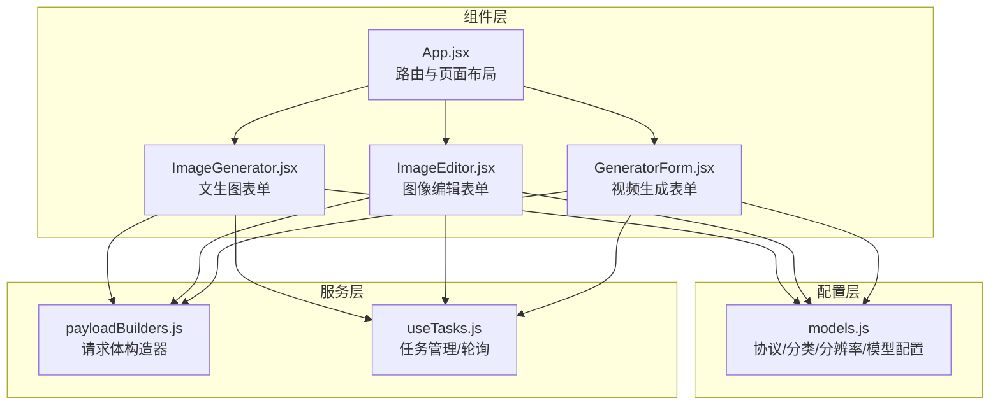
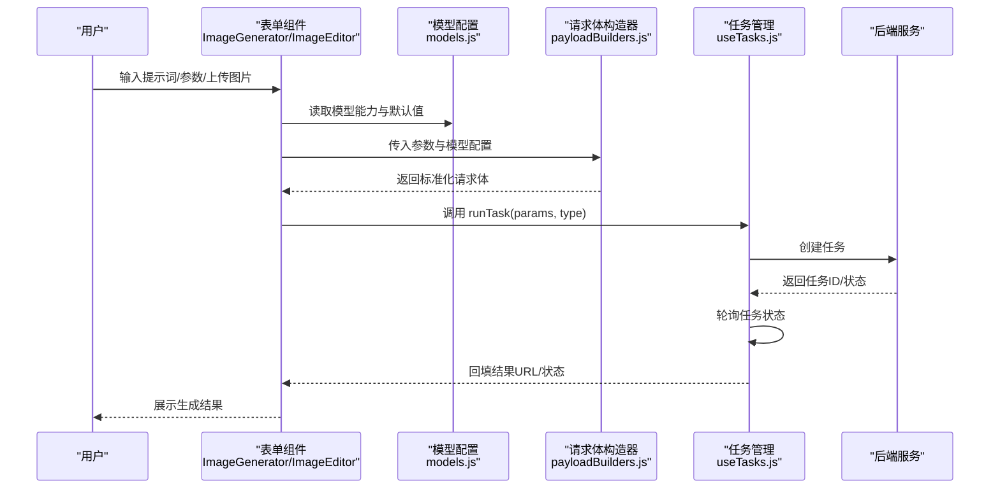
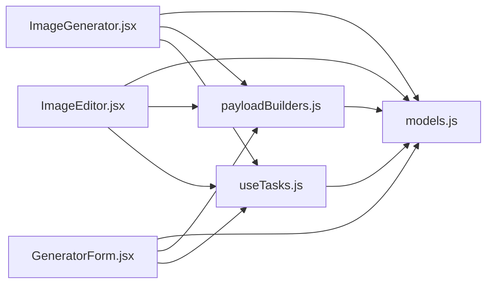

# 图像生成与编辑模型配置

<cite>
**本文引用的文件**
- [models.js](file://src/config/models.js)
- [App.jsx](file://src/App.jsx)
- [ImageGenerator.jsx](file://src/components/ImageGenerator.jsx)
- [ImageEditor.jsx](file://src/components/ImageEditor.jsx)
- [payloadBuilders.js](file://src/services/payloadBuilders.js)
- [useTasks.js](file://src/hooks/useTasks.js)
- [GeneratorForm.jsx](file://src/components/GeneratorForm.jsx)
</cite>

## 目录
1. [简介](#简介)
2. [项目结构](#项目结构)
3. [核心组件](#核心组件)
4. [架构总览](#架构总览)
5. [详细组件分析](#详细组件分析)
6. [依赖关系分析](#依赖关系分析)
7. [性能考量](#性能考量)
8. [故障排查指南](#故障排查指南)
9. [结论](#结论)
10. [附录](#附录)

## 简介
本技术文档聚焦于通义万相前端应用的“图像生成与编辑”模型配置体系，系统性梳理 IMAGE_MODELS 数组中定义的丰富模型族谱，涵盖：
- 通义千问图像编辑系列（Qwen Image Edit Max/Plus/）
- 万相2.1/2.5/2.6通用图像编辑与文生图系列
- 多种特效类与创意类模型（背景生成、AI试衣、创意文字等）
- 同步与异步模型的差异、输出能力与UI呈现方式
- 最佳实践与扩展指南

目标是帮助开发者与产品人员快速理解模型能力边界、参数映射与UI交互逻辑，指导后续模型接入与功能扩展。

## 项目结构
前端采用React + Vite架构，模型配置集中在配置文件中，业务组件负责UI与交互，服务层负责请求构建与任务调度。

图表来源
- [models.js](file://src/config/models.js#L1-L1012)
- [App.jsx](file://src/App.jsx#L1-L377)
- [ImageGenerator.jsx](file://src/components/ImageGenerator.jsx#L1-L249)
- [ImageEditor.jsx](file://src/components/ImageEditor.jsx#L1-L973)
- [GeneratorForm.jsx](file://src/components/GeneratorForm.jsx#L1-L208)
- [payloadBuilders.js](file://src/services/payloadBuilders.js#L1-L829)
- [useTasks.js](file://src/hooks/useTasks.js#L1-L333)

章节来源
- [models.js](file://src/config/models.js#L1-L1012)
- [App.jsx](file://src/App.jsx#L1-L377)

## 核心组件
- 模型配置中心：集中定义协议、输出类型、分类、分辨率标签、各模型族（视频/图像/数字人/图像翻译）的配置与能力开关。
- 请求体构造器：基于模型配置与用户参数，按不同请求格式（多模态消息、标准文生图、函数式编辑等）构建标准化请求体。
- 任务管理钩子：封装任务创建、轮询、状态更新、重试与本地持久化，统一处理同步/异步模型的差异。
- UI表单组件：文生图、图像编辑、视频生成等表单，按模型能力动态渲染参数控件与默认值。

章节来源
- [models.js](file://src/config/models.js#L1-L1012)
- [payloadBuilders.js](file://src/services/payloadBuilders.js#L1-L829)
- [useTasks.js](file://src/hooks/useTasks.js#L1-L333)
- [ImageGenerator.jsx](file://src/components/ImageGenerator.jsx#L1-L249)
- [ImageEditor.jsx](file://src/components/ImageEditor.jsx#L1-L973)
- [GeneratorForm.jsx](file://src/components/GeneratorForm.jsx#L1-L208)

## 架构总览
下图展示了从UI到服务层的关键调用链路，体现“模型配置 → 请求体构造 → 任务创建/轮询 → 结果回填”的闭环。

图表来源
- [ImageGenerator.jsx](file://src/components/ImageGenerator.jsx#L32-L48)
- [ImageEditor.jsx](file://src/components/ImageEditor.jsx#L163-L230)
- [models.js](file://src/config/models.js#L265-L788)
- [payloadBuilders.js](file://src/services/payloadBuilders.js#L125-L150)
- [useTasks.js](file://src/hooks/useTasks.js#L256-L312)

## 详细组件分析

### 模型配置与能力开关
- 协议与输出类型
  - 协议：同步多模态（SYNC_MULTIMODAL）、异步文生图（ASYNC_T2I）、异步视频（ASYNC_VIDEO）、异步图生视频（ASYNC_I2V）、异步参考生视频（ASYNC_R2V）、视频编辑统一模型（ASYNC_VACE_PLUS）、语音驱动视频（ASYNC_S2V）。
  - 输出类型：图像（IMAGE）、视频（VIDEO）。
- 分类与用途
  - 文生图（TEXT_TO_IMAGE）
  - 图像编辑（IMAGE_EDITING）
  - 图像合成（IMAGE_SYNTHESIS）
  - 特效类（SPECIAL_EFFECT）
  - 创意类（CREATIVE）
- 分辨率标签：提供常用分辨率的友好名称，便于UI展示。
- 能力开关（capabilities）：统一以布尔或集合形式表达模型支持的能力，如负向提示词、水印、随机种子、风格、输出数量、功能列表等。

章节来源
- [models.js](file://src/config/models.js#L2-L37)
- [models.js](file://src/config/models.js#L18-L25)
- [models.js](file://src/config/models.js#L27-L37)

### 通义千问图像编辑模型（Qwen Image Edit Max/Plus/）
- 模型定位：多图输入/多图输出的指令式图像编辑，支持文字修改、物体增删移动、动作迁移、风格迁移、细节增强等。
- 协议与输出：同步多模态，输出图像；支持负向提示词、提示词扩展、水印、随机种子、输出数量（1-6）。
- UI与参数：表单组件中按能力开关渲染对应控件；提交时通过多模态消息格式构造请求体。

章节来源
- [models.js](file://src/config/models.js#L265-L327)
- [ImageEditor.jsx](file://src/components/ImageEditor.jsx#L163-L230)
- [payloadBuilders.js](file://src/services/payloadBuilders.js#L125-L150)

### 万相2.1通用图像编辑模型（Wanx 2.1 Image Edit）
- 模型定位：全局/局部风格化、指令编辑、局部重绘、去水印、扩图、超分、上色、线稿生图、参考卡通形象生图。
- 协议与输出：异步文生图，输出图像；支持水印、随机种子、输出数量（1-4），并提供丰富的功能列表。
- UI与参数：表单组件按功能列表动态渲染操作项；提交时通过函数式编辑格式构造请求体。

章节来源
- [models.js](file://src/config/models.js#L328-L359)
- [ImageEditor.jsx](file://src/components/ImageEditor.jsx#L174-L189)
- [payloadBuilders.js](file://src/services/payloadBuilders.js#L196-L220)

### 万相2.5通用图像编辑模型（Wan 2.5 I2I Preview）
- 模型定位：多图融合与编辑，支持1-3张输入、1-4张输出，同步调用。
- 协议与输出：同步多模态，输出图像；支持负向提示词、提示词扩展、水印、随机种子、输出数量。
- UI与参数：表单组件按能力开关渲染；提交时通过图像数组合成格式构造请求体。

章节来源
- [models.js](file://src/config/models.js#L360-L380)
- [payloadBuilders.js](file://src/services/payloadBuilders.js#L174-L190)

### 万相2.6图像生成与编辑模型（Wan 2.6 Image）
- 模型定位：图像生成与编辑，支持图文混排输出（enable_interleave）。
- 协议与输出：异步文生图，输出图像；支持负向提示词、提示词扩展、水印、随机种子、图文混排开关、最大图像数、输出数量。
- UI与参数：表单组件按能力开关渲染；提交时通过多模态消息格式构造请求体，若无图片且支持图文混排，则强制启用混排模式。

章节来源
- [models.js](file://src/config/models.js#L381-L402)
- [payloadBuilders.js](file://src/services/payloadBuilders.js#L125-L150)

### 万相2.6/2.5/2.2/2.1文生图模型（T2I）
- 模型定位：纯文生图，支持在总像素面积与宽高比约束内自由选尺寸。
- 协议与输出：异步文生图，输出图像；支持负向提示词、提示词扩展、水印、随机种子、风格（部分模型）。
- UI与参数：表单组件按能力开关渲染；提交时通过标准文生图格式构造请求体。

章节来源
- [models.js](file://src/config/models.js#L403-L557)
- [payloadBuilders.js](file://src/services/payloadBuilders.js#L156-L168)

### 特效类与创意类模型
- 背景生成（Background Generation）：主体商品背景生成，支持文本/图像/图文结合/边缘元素引导等。
- AI试衣（AI Try-on）：基础版与Plus版，支持人像与服装图输入，质量与细节差异体现在能力开关与定价。
- 创意文字（WordArt）：文字变形与文字纹理，支持字体选择、风格参考、批量生成、PNG/SVG输出等。

章节来源
- [models.js](file://src/config/models.js#L665-L787)
- [payloadBuilders.js](file://src/services/payloadBuilders.js#L369-L398)
- [payloadBuilders.js](file://src/services/payloadBuilders.js#L404-L425)
- [payloadBuilders.js](file://src/services/payloadBuilders.js#L431-L454)
- [payloadBuilders.js](file://src/services/payloadBuilders.js#L460-L509)

### 同步与异步模型的差异
- 同步模型（SYNC_MULTIMODAL）
  - 典型：Qwen图像编辑系列、万相2.5 I2I Preview。
  - 行为：创建任务后直接返回结果URL，无需轮询。
  - UI：表单提交后立即展示结果。
- 异步模型（ASYNC_*）
  - 典型：万相T2I系列、图像编辑系列（除Qwen外）、视频相关系列。
  - 行为：创建任务后进入轮询流程，根据状态更新UI。
  - UI：显示加载状态与进度，完成后回填结果URL。

章节来源
- [models.js](file://src/config/models.js#L2-L10)
- [useTasks.js](file://src/hooks/useTasks.js#L291-L304)

### 输出能力与UI展示
- 输出类型：IMAGE/VIDEO，用于决定结果字段（imgUrl/videoUrl）与UI卡片样式。
- 能力开关：按模型capabilities渲染表单控件（负向提示词、水印、随机种子、风格、输出数量、功能列表等）。
- 分辨率：按模型默认分辨率与支持列表动态渲染，避免非法组合。

章节来源
- [models.js](file://src/config/models.js#L13-L16)
- [ImageGenerator.jsx](file://src/components/ImageGenerator.jsx#L14-L26)
- [ImageEditor.jsx](file://src/components/ImageEditor.jsx#L82-L88)

### 请求体构造策略
- 多模态消息（multimodalMessages）：用于Qwen图像编辑与万相2.6图像生成，支持图片与文本混合，必要时强制启用图文混排。
- 标准文生图（text2image）：用于万相T2I系列，支持风格与负向提示词。
- 函数式图像编辑（functionImageEdit）：用于万相2.1通用图像编辑，支持指定功能与基图。
- Sketch到图像（sketchToImage）、局部重绘（localRepaint）、风格重绘（styleRepaint）、画面扩展（outPainting）、虚拟模特（virtualModel）、背景生成（backgroundGeneration）、AI试衣（aiTryon）、创意文字（wordartSemantic/wordartTexture）等均有独立构造器，严格校验必填参数并规范化字段名。

章节来源
- [payloadBuilders.js](file://src/services/payloadBuilders.js#L125-L150)
- [payloadBuilders.js](file://src/services/payloadBuilders.js#L156-L168)
- [payloadBuilders.js](file://src/services/payloadBuilders.js#L196-L220)
- [payloadBuilders.js](file://src/services/payloadBuilders.js#L226-L249)
- [payloadBuilders.js](file://src/services/payloadBuilders.js#L255-L277)
- [payloadBuilders.js](file://src/services/payloadBuilders.js#L299-L319)
- [payloadBuilders.js](file://src/services/payloadBuilders.js#L325-L345)
- [payloadBuilders.js](file://src/services/payloadBuilders.js#L351-L363)
- [payloadBuilders.js](file://src/services/payloadBuilders.js#L369-L398)
- [payloadBuilders.js](file://src/services/payloadBuilders.js#L404-L425)
- [payloadBuilders.js](file://src/services/payloadBuilders.js#L431-L454)
- [payloadBuilders.js](file://src/services/payloadBuilders.js#L460-L509)

### 任务管理与轮询机制
- 乐观提交：先插入临时任务，再异步更新真实任务ID与状态。
- 轮询策略：根据任务年龄与状态变化动态调整轮询间隔，新任务快速轮询，稳定任务降低频率。
- 结果回填：区分标准与多模态两种输出格式，自动提取第一张图片URL或choices中的图片内容。
- 本地存储：清理base64数据，避免占用过多存储空间；超出配额时截断最近20条。

章节来源
- [useTasks.js](file://src/hooks/useTasks.js#L256-L312)
- [useTasks.js](file://src/hooks/useTasks.js#L86-L104)
- [useTasks.js](file://src/hooks/useTasks.js#L164-L246)
- [useTasks.js](file://src/hooks/useTasks.js#L30-L84)

## 依赖关系分析
- 组件对配置的依赖：表单组件通过模型配置筛选可用模型、解析默认分辨率与能力开关，保证UI与后端一致。
- 组件对服务的依赖：请求体构造器与任务管理钩子解耦于具体UI，便于新增模型时仅需修改配置与构造器。
- 服务对配置的依赖：任务轮询时根据模型输出类型决定结果字段，确保UI正确回填。

图表来源
- [ImageGenerator.jsx](file://src/components/ImageGenerator.jsx#L1-L249)
- [ImageEditor.jsx](file://src/components/ImageEditor.jsx#L1-L973)
- [GeneratorForm.jsx](file://src/components/GeneratorForm.jsx#L1-L208)
- [models.js](file://src/config/models.js#L1-L1012)
- [payloadBuilders.js](file://src/services/payloadBuilders.js#L1-L829)
- [useTasks.js](file://src/hooks/useTasks.js#L1-L333)

章节来源
- [ImageGenerator.jsx](file://src/components/ImageGenerator.jsx#L1-L249)
- [ImageEditor.jsx](file://src/components/ImageEditor.jsx#L1-L973)
- [GeneratorForm.jsx](file://src/components/GeneratorForm.jsx#L1-L208)
- [models.js](file://src/config/models.js#L1-L1012)
- [payloadBuilders.js](file://src/services/payloadBuilders.js#L1-L829)
- [useTasks.js](file://src/hooks/useTasks.js#L1-L333)

## 性能考量
- 轮询策略优化：新任务快速轮询，稳定任务降低频率，减少API压力与前端开销。
- 本地存储优化：移除base64数据，避免内存与存储压力；配额不足时截断最近任务。
- 请求体构造：按能力开关拼装参数，避免冗余字段导致的网络与解析成本。
- UI渲染：按模型能力动态渲染控件，减少无效DOM节点与事件绑定。

## 故障排查指南
- 提交时报错“必须上传至少一张图片”：检查所选模型是否需要图片输入（如Qwen图像编辑、万相2.6图像生成在无图片时需启用图文混排）。
- 无法看到结果：确认任务状态是否达到成功，检查轮询是否仍在进行；若长时间无结果，尝试重试。
- 参数无效：确认所选分辨率与模型支持范围一致；确认负向提示词/水印/随机种子等能力开关是否被模型支持。
- 存储异常：若出现存储配额错误，系统会自动截断最近任务，请在历史记录中清理不再需要的任务。

章节来源
- [payloadBuilders.js](file://src/services/payloadBuilders.js#L136-L138)
- [payloadBuilders.js](file://src/services/payloadBuilders.js#L178-L180)
- [payloadBuilders.js](file://src/services/payloadBuilders.js#L200-L202)
- [useTasks.js](file://src/hooks/useTasks.js#L77-L83)
- [useTasks.js](file://src/hooks/useTasks.js#L230-L233)

## 结论
本项目通过“配置驱动 + 策略构造 + 任务轮询”的架构，实现了对多模型族的统一接入与灵活扩展。IMAGE_MODELS 数组提供了清晰的能力开关与默认行为，UI组件按能力动态渲染，服务层以构造器与轮询机制适配同步/异步差异。遵循本文最佳实践与扩展指南，可高效接入新模型并维护一致的用户体验。

## 附录

### 模型能力对照表（节选）
- 通义千问图像编辑系列：负向提示词、提示词扩展、水印、随机种子、输出数量（1-6）
- 万相2.1通用图像编辑：水印、随机种子、输出数量（1-4）、功能列表（风格化/重绘/扩图/上色等）
- 万相2.5通用图像编辑：负向提示词、提示词扩展、水印、随机种子、输出数量（1-4）
- 万相2.6图像生成与编辑：负向提示词、提示词扩展、水印、随机种子、图文混排、最大图像数、输出数量
- 万相T2I系列：负向提示词、提示词扩展、水印、随机种子、风格（部分模型）
- 特效/创意类：背景生成、AI试衣、创意文字等，按各自能力开关提供参数

章节来源
- [models.js](file://src/config/models.js#L265-L788)