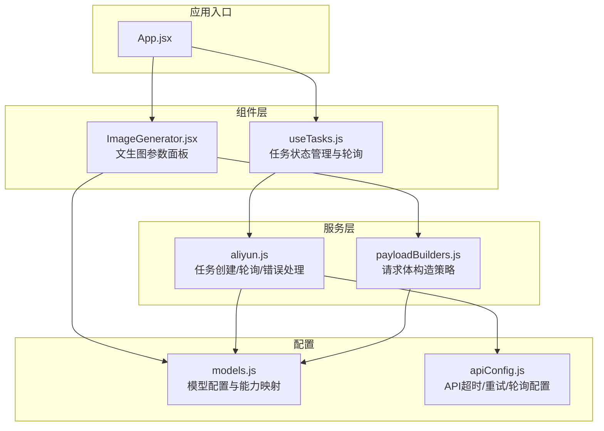
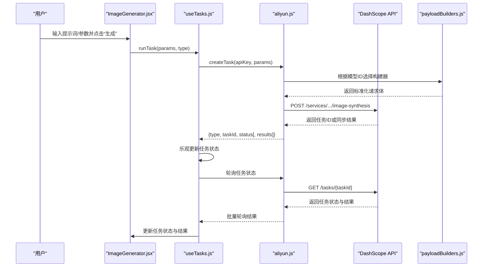
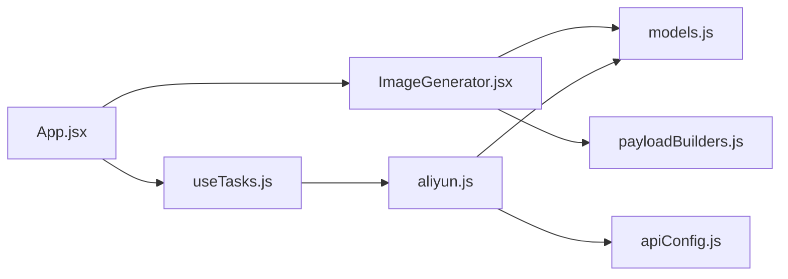

# 文生图模型

<cite>
**本文引用的文件列表**
- [README.md](file://README.md)
- [App.jsx](file://src/App.jsx)
- [ImageGenerator.jsx](file://src/components/ImageGenerator.jsx)
- [models.js](file://src/config/models.js)
- [payloadBuilders.js](file://src/services/payloadBuilders.js)
- [aliyun.js](file://src/services/aliyun.js)
- [apiConfig.js](file://src/config/apiConfig.js)
- [useTasks.js](file://src/hooks/useTasks.js)
- [App.css](file://src/App.css)
- [main.css](file://src/main.css)
</cite>

## 目录
1. [简介](#简介)
2. [项目结构](#项目结构)
3. [核心组件](#核心组件)
4. [架构总览](#架构总览)
5. [详细组件分析](#详细组件分析)
6. [依赖关系分析](#依赖关系分析)
7. [性能考量](#性能考量)
8. [故障排查指南](#故障排查指南)
9. [结论](#结论)
10. [附录](#附录)

## 简介
本项目为通义万相文生图（Text-to-Image, T2I）能力的前端应用，围绕阿里云 DashScope 平台提供的异步文本到图像协议，提供统一的模型注册、参数构建、任务创建与轮询查询能力。项目覆盖从万相2.6到2.0以及V1版本的文生图模型，支持提示词扩展、负向提示词、水印、随机种子、分辨率选择、输出数量等关键参数；并提供可视化界面，便于用户进行文生图任务的参数配置与结果管理。

## 项目结构
项目采用前端单页应用（React + Vite）结构，核心目录与职责如下：
- src/components：页面与功能组件，如文生图生成器、任务历史等
- src/config：配置文件，包括模型配置、API常量等
- src/services：服务层，封装与DashScope API交互逻辑
- src/hooks：自定义Hook，如任务状态管理
- src/utils：工具模块（当前仓库未包含具体实现）
- public：静态资源（当前仓库未包含）

图表来源
- [App.jsx](file://src/App.jsx#L42-L377)
- [models.js](file://src/config/models.js#L1-L1012)
- [payloadBuilders.js](file://src/services/payloadBuilders.js#L1-L829)
- [aliyun.js](file://src/services/aliyun.js#L1-L215)
- [apiConfig.js](file://src/config/apiConfig.js#L1-L35)
- [useTasks.js](file://src/hooks/useTasks.js#L1-L333)

章节来源
- [README.md](file://README.md#L1-L17)
- [App.jsx](file://src/App.jsx#L42-L377)

## 核心组件
- 模型配置与能力映射：集中定义各版本文生图模型的能力开关、默认分辨率、支持的参数项（如负向提示词、提示词扩展、水印、随机种子、风格、参考图等），并提供模型查找工具。
- 请求体构建器：基于模型能力与用户参数，构造符合DashScope协议的请求体，涵盖标准T2I、多模态消息、草图生图、局部重绘、扩图、风格重绘、背景生成、AI试衣、创意文字等格式。
- 任务服务：封装异步任务创建、轮询查询、超时与重试策略、错误分类与提示，统一返回任务状态与结果。
- 文生图组件：提供直观的参数面板，包括提示词、负向提示词、分辨率、输出数量、提示词扩展开关、随机种子等，支持一键生成与成本估算。
- 任务Hook：负责本地存储、乐观提交、自适应轮询、批量轮询、状态更新与重试。

章节来源
- [models.js](file://src/config/models.js#L1-L1012)
- [payloadBuilders.js](file://src/services/payloadBuilders.js#L1-L829)
- [aliyun.js](file://src/services/aliyun.js#L1-L215)
- [ImageGenerator.jsx](file://src/components/ImageGenerator.jsx#L1-L249)
- [useTasks.js](file://src/hooks/useTasks.js#L1-L333)

## 架构总览
异步文本到图像的典型流程如下：
1. 用户在文生图组件中填写提示词与参数，选择模型与分辨率。
2. 组件将参数交由任务Hook，进行乐观提交，生成临时任务。
3. 任务Hook调用服务层创建任务，服务层根据模型配置选择对应请求体构建器，构造请求体并发送至DashScope。
4. 服务层根据模型是否异步，返回任务ID或同步结果。
5. 任务Hook启动自适应轮询，定期查询任务状态，解析结果并更新UI。
6. 用户可在历史中查看、重试或删除任务。

图表来源
- [ImageGenerator.jsx](file://src/components/ImageGenerator.jsx#L32-L48)
- [useTasks.js](file://src/hooks/useTasks.js#L256-L312)
- [aliyun.js](file://src/services/aliyun.js#L50-L160)
- [payloadBuilders.js](file://src/services/payloadBuilders.js#L125-L168)

## 详细组件分析

### 模型配置与能力映射（models.js）
- 协议与输出类型：定义了异步文本到图像、异步视频生成、异步图生视频、异步参考生视频、异步视频编辑统一模型、异步语音到视频等协议；输出类型区分图像与视频。
- 分辨率标签：提供常见分辨率标签与人类可读名称，便于UI展示。
- 文生图模型族：
  - 万相2.6：包含T2I、图像生成与编辑、I2I等，支持负向提示词、提示词扩展、水印、随机种子、风格、参考图、启用交错输出、最大输出数量等。
  - 万相2.5：提供预览版T2I与I2I，能力与2.6相近但部分能力受限。
  - 万相2.2：提供极速版与专业版，强调速度与稳定性提升。
  - 万相2.1：提供极速版与专业版，延续2.2的改进。
  - 万相2.0：提供极速版。
  - V1：提供基础文生图能力，支持风格、负向提示词、水印、随机种子、参考图与强度、参考模式等。
- 能力开关：每个模型配置包含capabilities对象，用于决定UI是否显示对应参数控件与服务端是否接受相应参数。

章节来源
- [models.js](file://src/config/models.js#L1-L1012)

### 请求体构建器（payloadBuilders.js）
- 多格式策略：针对不同模型与任务类型，提供独立的请求体构建函数，遵循“策略模式”，新增模型只需在配置中声明即可复用核心逻辑。
- 通用参数处理：统一处理尺寸/分辨率、输出数量、提示词扩展、负向提示词、水印、随机种子、风格等参数，并根据模型能力进行条件注入。
- 特定格式支持：
  - 标准T2I：输入提示词与负向提示词，附加参数。
  - 多模态消息：支持文本与图片混合输入，用于图像编辑与图文混排输出。
  - 草图生图、局部重绘、扩图、风格重绘、背景生成、AI试衣、创意文字等专用格式。
- 参数校验：对必需参数缺失的情况抛出明确错误，避免无效请求。

章节来源
- [payloadBuilders.js](file://src/services/payloadBuilders.js#L1-L829)

### 任务服务（aliyun.js）
- 任务创建：根据模型ID获取配置，选择请求格式与构建器，构造请求体并发送POST请求；异步模型返回任务ID，同步模型返回直接结果。
- 超时与重试：请求与轮询均设置超时；网络错误与超时具备指数退避重试机制；对模型未知、请求格式未知等错误不再重试。
- 错误处理：对API错误进行分类与友好提示，区分网络错误、超时、模型未知等情况。
- 轮询策略：提供通用轮询方法，支持批量轮询与超时控制。

章节来源
- [aliyun.js](file://src/services/aliyun.js#L1-L215)

### 文生图组件（ImageGenerator.jsx）
- 参数面板：包含提示词、负向提示词、分辨率、输出数量、提示词扩展开关、随机种子、艺术风格等。
- 模型选择：仅展示“文本到图像”类别模型，自动适配所选模型的分辨率与能力。
- 成本估算：根据模型单价与输出数量计算预估费用。
- 行为：将用户输入与参数标准化为任务参数，交由任务Hook执行。

章节来源
- [ImageGenerator.jsx](file://src/components/ImageGenerator.jsx#L1-L249)

### 任务Hook（useTasks.js）
- 乐观提交：创建临时任务ID，立即渲染，随后以真实任务ID替换。
- 本地存储：持久化任务列表，清理敏感的base64数据，避免占用过多空间。
- 自适应轮询：根据任务创建时间与轮询次数动态调整轮询间隔，兼顾响应性与资源消耗。
- 批量轮询：并发查询多个任务状态，合并更新。
- 状态更新：仅在媒体URL或状态发生实质性变化时更新，避免无意义重渲染。

章节来源
- [useTasks.js](file://src/hooks/useTasks.js#L1-L333)

## 依赖关系分析
- 组件依赖：App.jsx作为路由与页面容器，调度各功能页面；ImageGenerator.jsx依赖模型配置与请求体构建器。
- 服务依赖：aliyun.js依赖模型配置与API配置；payloadBuilders.js依赖模型配置。
- Hook依赖：useTasks.js依赖服务层与模型配置，负责UI状态与轮询逻辑。

图表来源
- [App.jsx](file://src/App.jsx#L42-L377)
- [ImageGenerator.jsx](file://src/components/ImageGenerator.jsx#L1-L249)
- [models.js](file://src/config/models.js#L1-L1012)
- [payloadBuilders.js](file://src/services/payloadBuilders.js#L1-L829)
- [aliyun.js](file://src/services/aliyun.js#L1-L215)
- [apiConfig.js](file://src/config/apiConfig.js#L1-L35)
- [useTasks.js](file://src/hooks/useTasks.js#L1-L333)

## 性能考量
- 轮询策略：采用自适应间隔，新任务与早期轮询更频繁，长时间任务逐步降低轮询频率，平衡响应性与资源消耗。
- 批量轮询：并发查询多个任务状态，减少等待时间。
- 本地存储优化：移除base64数据，避免LocalStorage溢出；必要时仅保留最近任务。
- 请求体构建：按需注入参数，避免冗余字段导致的网络与服务端开销。
- UI渲染：仅在状态或媒体URL变化时更新，减少不必要的重渲染。

[本节为通用性能讨论，无需特定文件引用]

## 故障排查指南
- 未知模型或请求格式
  - 现象：创建任务时报错“未知模型”或“未知请求格式”。
  - 排查：确认模型ID存在于模型配置中，且请求格式与模型一致。
  - 参考
    - [aliyun.js](file://src/services/aliyun.js#L54-L68)
    - [models.js](file://src/config/models.js#L1011-L1012)
- 网络错误或超时
  - 现象：请求超时或网络错误提示。
  - 排查：检查网络连通性；确认API基础地址与超时配置；观察重试日志。
  - 参考
    - [aliyun.js](file://src/services/aliyun.js#L84-L116)
    - [apiConfig.js](file://src/config/apiConfig.js#L9-L19)
- 轮询超时
  - 现象：轮询长时间无响应。
  - 排查：检查任务ID是否正确；确认DashScope服务可用；适当增大轮询超时。
  - 参考
    - [aliyun.js](file://src/services/aliyun.js#L171-L187)
    - [apiConfig.js](file://src/config/apiConfig.js#L22-L27)
- 参数缺失导致的请求失败
  - 现象：某些模型需要特定输入（如草图生图必须提供草图）。
  - 排查：查看对应构建器的参数校验逻辑，补齐必填项。
  - 参考
    - [payloadBuilders.js](file://src/services/payloadBuilders.js#L226-L249)
    - [payloadBuilders.js](file://src/services/payloadBuilders.js#L577-L643)
- 同步/异步模型差异
  - 现象：同步模型直接返回结果，异步模型返回任务ID。
  - 排查：根据模型配置的异步标志判断处理路径。
  - 参考
    - [aliyun.js](file://src/services/aliyun.js#L121-L145)
    - [models.js](file://src/config/models.js#L273-L278)

章节来源
- [aliyun.js](file://src/services/aliyun.js#L50-L160)
- [apiConfig.js](file://src/config/apiConfig.js#L9-L27)
- [payloadBuilders.js](file://src/services/payloadBuilders.js#L226-L249)
- [payloadBuilders.js](file://src/services/payloadBuilders.js#L577-L643)
- [models.js](file://src/config/models.js#L273-L278)

## 结论
本项目通过配置驱动与策略模式，实现了对通义万相多版本文生图模型的统一接入与管理。异步文本到图像协议的使用保证了大模型推理的稳定与可扩展性；完善的参数体系与UI交互提升了易用性；自适应轮询与本地存储优化保障了用户体验与系统性能。建议在生产环境中结合业务场景选择合适版本与参数组合，并持续关注DashScope平台能力更新。

[本节为总结性内容，无需特定文件引用]

## 附录

### 异步文本到图像协议使用要点
- 任务创建：根据模型ID与请求格式构造请求体，发送POST请求；异步模型返回任务ID，同步模型返回直接结果。
- 轮询查询：使用任务ID轮询任务状态，直至完成；完成后解析媒体URL并更新UI。
- 超时与重试：请求与轮询分别设置超时；网络错误与超时具备指数退避重试。
- 参考
  - [aliyun.js](file://src/services/aliyun.js#L50-L160)
  - [apiConfig.js](file://src/config/apiConfig.js#L9-L27)

章节来源
- [aliyun.js](file://src/services/aliyun.js#L50-L160)
- [apiConfig.js](file://src/config/apiConfig.js#L9-L27)

### 支持的分辨率选项
- 文生图模型支持的分辨率在模型配置中定义，UI通过分辨率标签映射展示给用户。
- 常见分辨率包括但不限于：1280×1280、1104×1472、1472×1104、960×1696、1696×960、1024×1024、768×768、512×512、720×1280、768×1152、1280×720等。
- 参考
  - [models.js](file://src/config/models.js#L27-L37)
  - [models.js](file://src/config/models.js#L402-L421)

章节来源
- [models.js](file://src/config/models.js#L27-L37)
- [models.js](file://src/config/models.js#L402-L421)

### 负向提示词、提示词扩展、水印与随机种子
- 负向提示词：在模型能力允许的情况下，UI提供输入框，服务端将参数注入请求体。
- 提示词扩展：默认启用，可切换；用于增强细节描述。
- 水印：默认关闭，可切换；用于标识生成内容。
- 随机种子：在模型能力允许的情况下，可固定种子以保证结果可复现。
- 参考
  - [ImageGenerator.jsx](file://src/components/ImageGenerator.jsx#L90-L121)
  - [payloadBuilders.js](file://src/services/payloadBuilders.js#L77-L119)

章节来源
- [ImageGenerator.jsx](file://src/components/ImageGenerator.jsx#L90-L121)
- [payloadBuilders.js](file://src/services/payloadBuilders.js#L77-L119)

### 不同版本的功能差异与适用场景
- 万相2.6
  - 特点：支持负向提示词、提示词扩展、水印、随机种子、风格、参考图、启用交错输出、最大输出数量等；适合高质量与多样化需求。
  - 参考
    - [models.js](file://src/config/models.js#L402-L421)
- 万相2.5
  - 特点：提供预览版T2I与I2I，能力与2.6相近但部分能力受限；适合探索性与成本敏感场景。
  - 参考
    - [models.js](file://src/config/models.js#L423-L440)
- 万相2.2/2.1/2.0
  - 特点：提供极速版与专业版，强调速度与稳定性；适合对性能有较高要求的场景。
  - 参考
    - [models.js](file://src/config/models.js#L442-L478)
    - [models.js](file://src/config/models.js#L479-L535)
    - [models.js](file://src/config/models.js#L518-L535)
- V1
  - 特点：提供基础文生图能力，支持风格、负向提示词、水印、随机种子、参考图与强度、参考模式等；适合兼容性与基础需求。
  - 参考
    - [models.js](file://src/config/models.js#L537-L557)

章节来源
- [models.js](file://src/config/models.js#L402-L421)
- [models.js](file://src/config/models.js#L423-L440)
- [models.js](file://src/config/models.js#L442-L478)
- [models.js](file://src/config/models.js#L479-L535)
- [models.js](file://src/config/models.js#L518-L535)
- [models.js](file://src/config/models.js#L537-L557)

### 最佳实践建议
- 模型选择：根据质量与性能需求选择版本；对需要负向提示词与风格控制的场景优先考虑2.6及以上版本。
- 参数配置：合理设置分辨率与输出数量，避免过大尺寸导致资源浪费；在需要一致性时启用随机种子。
- 轮询策略：在大批量任务场景下，利用自适应轮询减少资源消耗；对实时性要求高的场景缩短轮询间隔。
- 错误处理：对网络与超时错误进行重试；对模型未知与请求格式错误进行明确提示与定位。
- 参考
  - [useTasks.js](file://src/hooks/useTasks.js#L86-L104)
  - [aliyun.js](file://src/services/aliyun.js#L20-L36)

章节来源
- [useTasks.js](file://src/hooks/useTasks.js#L86-L104)
- [aliyun.js](file://src/services/aliyun.js#L20-L36)