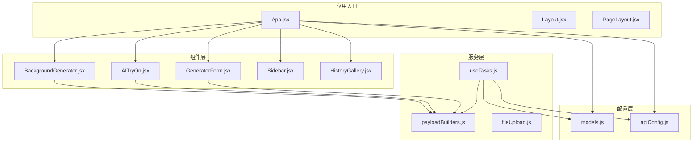
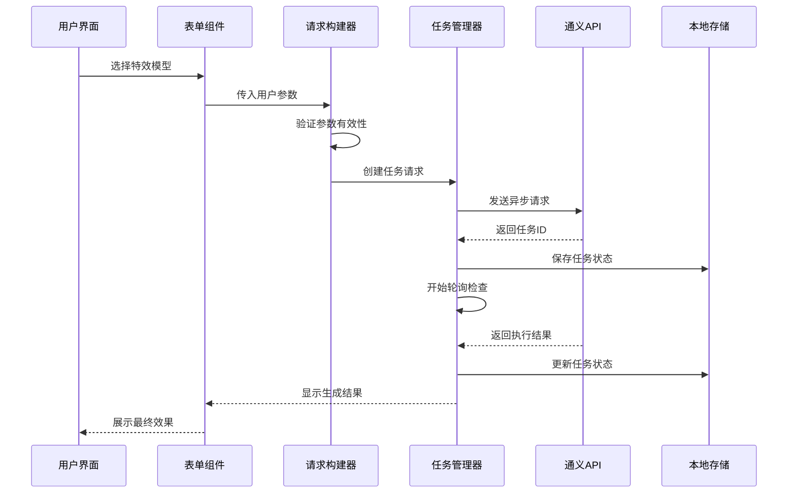
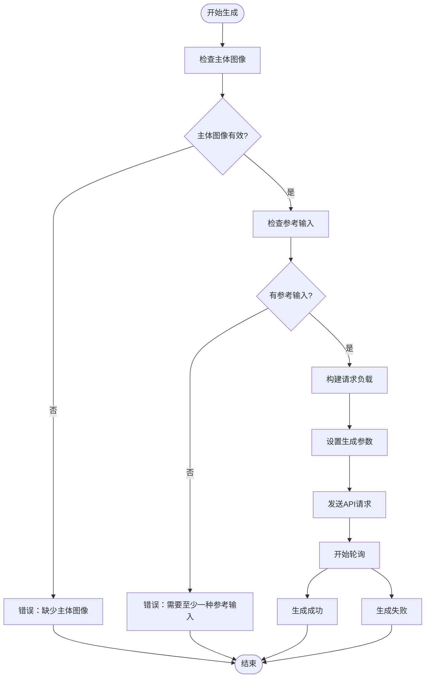
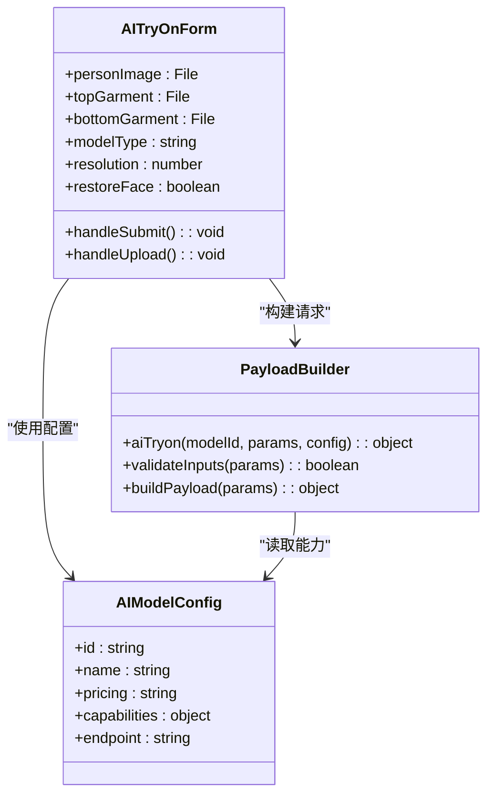
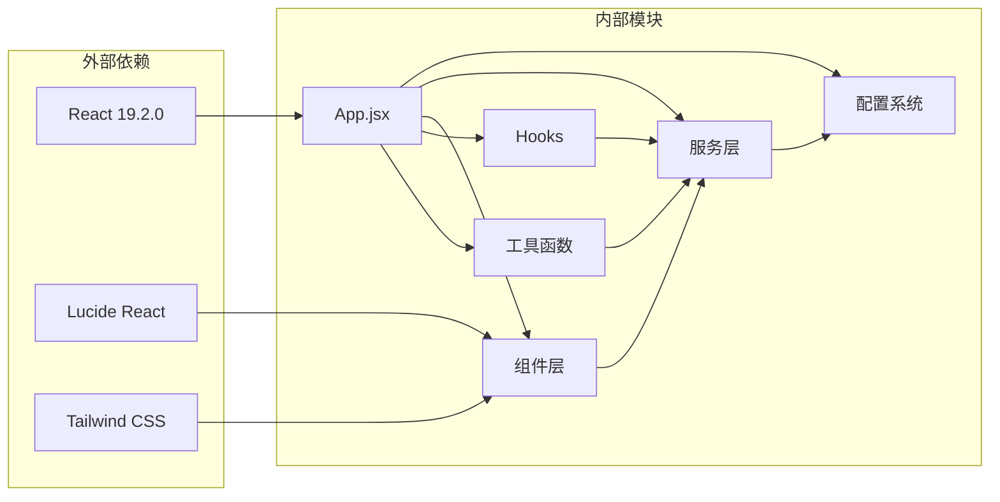

# 特效类模型

<cite>
**本文档引用的文件**
- [README.md](file://README.md)
- [models.js](file://src/config/models.js)
- [apiConfig.js](file://src/config/apiConfig.js)
- [payloadBuilders.js](file://src/services/payloadBuilders.js)
- [App.jsx](file://src/App.jsx)
- [BackgroundGenerator.jsx](file://src/components/BackgroundGenerator.jsx)
- [AITryOn.jsx](file://src/components/AITryOn.jsx)
- [GeneratorForm.jsx](file://src/components/GeneratorForm.jsx)
- [useTasks.js](file://src/hooks/useTasks.js)
- [fileUpload.js](file://src/utils/fileUpload.js)
</cite>

## 目录
1. [简介](#简介)
2. [项目结构](#项目结构)
3. [核心组件](#核心组件)
4. [架构概览](#架构概览)
5. [详细组件分析](#详细组件分析)
6. [依赖关系分析](#依赖关系分析)
7. [性能考虑](#性能考虑)
8. [故障排除指南](#故障排除指南)
9. [结论](#结论)
10. [附录](#附录)

## 简介
本项目是通义万相特效类模型的前端应用，专注于提供以下特效功能：
- **图像背景生成**：为主商品生成背景图，适用于电商和海报场景
- **AI试衣**：上传模特图和服装图，实现AI虚拟试穿效果
- **鞋靴模特**：输入多视角鞋靴系列图片，对输入模特模板图的鞋子区域进行AI试穿

这些特效功能基于阿里通义实验室的通义万相模型系列，提供了从文生图到图像编辑的完整AI生成解决方案。

## 项目结构
项目采用React + Vite技术栈构建，主要目录结构如下：

**图表来源**
- [App.jsx](file://src/App.jsx#L1-L377)
- [models.js](file://src/config/models.js#L1-L1012)
- [payloadBuilders.js](file://src/services/payloadBuilders.js#L1-L829)

**章节来源**
- [README.md](file://README.md#L1-L17)
- [App.jsx](file://src/App.jsx#L1-L377)

## 核心组件
特效类模型的核心组件包括：

### 特效模型配置
项目通过统一的配置系统管理所有特效模型，包括：
- **背景生成模型**：支持多种引导方式（文本、图像、图文结合、边缘元素引导）
- **AI试衣模型**：基础版和Plus版，支持不同的质量级别和价格策略
- **鞋靴模特模型**：支持多视角鞋靴系列图片的AI试穿

### 请求构建器
每个特效模型都有对应的请求构建器，负责：
- 将用户输入转换为API所需的格式
- 处理模型特定的参数验证
- 组织请求负载结构

### 任务管理系统
统一的任务管理机制支持：
- 异步任务的创建和轮询
- 本地存储和历史记录
- 错误处理和重试机制

**章节来源**
- [models.js](file://src/config/models.js#L646-L735)
- [payloadBuilders.js](file://src/services/payloadBuilders.js#L347-L425)
- [useTasks.js](file://src/hooks/useTasks.js#L1-L333)

## 架构概览
系统采用分层架构设计，确保了良好的可维护性和扩展性：

**图表来源**
- [AITryOn.jsx](file://src/components/AITryOn.jsx#L15-L50)
- [BackgroundGenerator.jsx](file://src/components/BackgroundGenerator.jsx#L91-L149)
- [useTasks.js](file://src/hooks/useTasks.js#L256-L312)

## 详细组件分析

### 图像背景生成模型

#### 功能特性
图像背景生成模型提供以下核心能力：
- **主体图像处理**：支持带透明背景的主体图像
- **多源参考**：支持参考图像、参考提示词、边缘引导等多种输入方式
- **版本选择**：v2（速度快）和v3（效果好）两个版本
- **噪声控制**：可调节的噪声等级影响生成质量
- **权重调节**：参考提示词与参考图像的权重平衡

#### 输入要求
- **主体图像**：必须上传，建议使用PNG格式
- **参考图像**：可选，用于风格参考
- **参考提示词**：可选，描述期望的背景内容
- **边缘引导**：可选，支持前景和背景边缘元素

#### 输出控制参数
- **生成数量**：1-4张可选
- **模型版本**：v2或v3
- **噪声等级**：0-999范围
- **提示词权重**：0-1范围

**图表来源**
- [BackgroundGenerator.jsx](file://src/components/BackgroundGenerator.jsx#L91-L149)
- [payloadBuilders.js](file://src/services/payloadBuilders.js#L369-L398)

**章节来源**
- [BackgroundGenerator.jsx](file://src/components/BackgroundGenerator.jsx#L1-L420)
- [payloadBuilders.js](file://src/services/payloadBuilders.js#L369-L398)
- [models.js](file://src/config/models.js#L666-L687)

### AI试衣模型

#### 功能特性
AI试衣模型提供两种版本：
- **基础版 (aitryon)**：0.20元/张，速度快
- **Plus版 (aitryon-plus)**：0.50元/张，质量更高

支持的功能包括：
- **多服装类型**：上装、下装单独或组合试穿
- **分辨率控制**：支持原图、576x1024、720x1280
- **人脸处理**：可选择保留原脸或生成新脸
- **质量增强**：Plus版提供更好的清晰度和纹理细节

#### 输入要求
- **模特图像**：必须上传，全身正面照，光照良好
- **服装图像**：至少上传上装或下装之一
- **图像格式**：PNG/JPG格式
- **尺寸限制**：150px-4096px

#### 输出控制参数
- **模型类型**：基础版或Plus版
- **分辨率**：-1（原图）、1024、1280
- **人脸处理**：true/false
- **计费策略**：不同版本价格不同

**图表来源**
- [AITryOn.jsx](file://src/components/AITryOn.jsx#L1-L251)
- [payloadBuilders.js](file://src/services/payloadBuilders.js#L404-L425)
- [models.js](file://src/config/models.js#L690-L734)

**章节来源**
- [AITryOn.jsx](file://src/components/AITryOn.jsx#L1-L251)
- [payloadBuilders.js](file://src/services/payloadBuilders.js#L404-L425)
- [models.js](file://src/config/models.js#L690-L734)

### 鞋靴模特模型

#### 功能特性
鞋靴模特模型支持：
- **多视角输入**：支持多视角鞋靴系列图片
- **AI试穿**：对输入模特模板图的鞋子区域进行AI试穿
- **布局重绘**：实现模特鞋靴布局重绘生成
- **缩放控制**：支持鞋子大小的缩放调节

#### 输入要求
- **模板图像**：模特模板图
- **鞋靴图像**：多视角鞋靴系列图片
- **缩放参数**：控制鞋子大小的比例

#### 输出控制参数
- **生成数量**：1-4张可选
- **缩放比例**：根据需求调节

**章节来源**
- [models.js](file://src/config/models.js#L647-L663)
- [payloadBuilders.js](file://src/services/payloadBuilders.js#L351-L363)

## 依赖关系分析

**图表来源**
- [package.json](file://package.json#L12-L31)
- [App.jsx](file://src/App.jsx#L1-L25)

### 核心依赖关系
- **配置系统**：集中管理所有模型配置和API端点
- **服务层**：封装API调用和任务管理逻辑
- **组件层**：提供用户交互界面和输入验证
- **工具函数**：处理文件上传、压缩和格式转换

**章节来源**
- [package.json](file://package.json#L12-L31)
- [models.js](file://src/config/models.js#L1-L1012)

## 性能考虑
系统在性能方面采用了多项优化措施：

### 文件处理优化
- **智能压缩**：超过8MB的图片自动压缩到Canvas，减少传输体积
- **Base64缓存**：避免重复转换，提高响应速度
- **类型验证**：严格的文件类型和大小检查

### 任务管理优化
- **自适应轮询**：根据任务年龄动态调整轮询间隔
- **批量查询**：支持多个任务的批量状态查询
- **本地存储**：持久化任务状态，支持断点续传

### 前端性能优化
- **懒加载**：按需加载组件，减少初始加载时间
- **状态管理**：优化的React状态更新策略
- **内存管理**：及时清理临时数据和事件监听器

## 故障排除指南

### 常见问题及解决方案

#### API密钥相关问题
- **问题**：API密钥未配置
- **解决方案**：通过设置界面输入有效的API密钥
- **预防措施**：定期检查密钥有效性

#### 文件上传问题
- **问题**：图片上传失败
- **解决方案**：检查文件格式和大小限制，尝试重新上传
- **预防措施**：使用支持的格式（PNG/JPG），控制文件大小

#### 生成任务失败
- **问题**：异步任务长时间无响应
- **解决方案**：检查网络连接，适当延长轮询间隔
- **预防措施**：合理设置超时时间和重试次数

#### 参数验证错误
- **问题**：请求参数无效
- **解决方案**：检查必需参数是否完整，参数值是否在允许范围内
- **预防措施**：使用表单验证和实时反馈

**章节来源**
- [useTasks.js](file://src/hooks/useTasks.js#L164-L246)
- [fileUpload.js](file://src/utils/fileUpload.js#L149-L181)

## 结论
通义万相特效类模型提供了完整的AI生成解决方案，具有以下优势：

### 技术优势
- **模块化设计**：清晰的分层架构便于维护和扩展
- **统一配置**：集中管理所有模型配置，便于统一维护
- **智能优化**：多项性能优化措施提升用户体验

### 功能特色
- **多样化的特效**：涵盖背景生成、AI试衣、鞋靴模特等多个领域
- **灵活的参数控制**：丰富的参数选项满足不同需求
- **完善的错误处理**：全面的错误处理和用户反馈机制

### 最佳实践建议
1. **合理选择模型版本**：根据需求平衡质量和速度
2. **优化输入质量**：提供高质量的输入图像提升生成效果
3. **监控资源使用**：注意文件大小和生成数量的限制
4. **定期更新配置**：及时更新模型配置和API端点信息

## 附录

### 使用示例

#### 背景生成使用示例
1. 上传主体图像（PNG格式）
2. 选择参考图像或输入背景描述
3. 调整生成参数（数量、版本、噪声等级）
4. 点击生成按钮等待结果

#### AI试衣使用示例
1. 上传模特图像（全身正面照）
2. 上传上装或下装图像
3. 选择模型版本和分辨率
4. 调整人脸处理选项
5. 开始试穿生成

#### 鞋靴模特使用示例
1. 准备多视角鞋靴图片
2. 上传模特模板图
3. 设置鞋子缩放比例
4. 生成多角度试穿效果

### 配置参数参考

#### 背景生成参数
- **n**：生成数量（1-4）
- **model_version**：模型版本（v2/v3）
- **noise_level**：噪声等级（0-999）
- **ref_prompt_weight**：提示词权重（0-1）

#### AI试衣参数
- **resolution**：分辨率控制（-1/1024/1280）
- **restore_face**：人脸处理（true/false）
- **pricing**：计费策略（0.20元/张或0.50元/张）

#### 鞋靴模特参数
- **scale**：缩放比例
- **n**：生成数量（1-4）