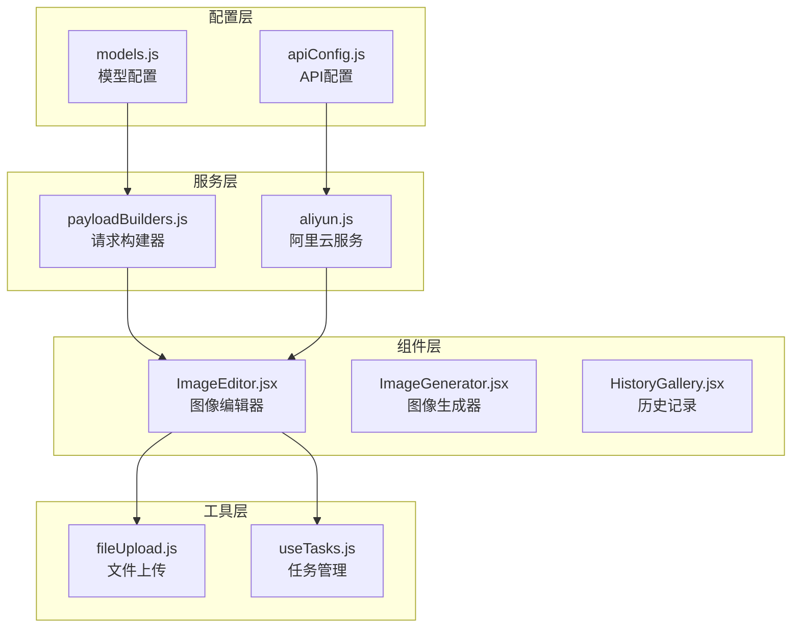
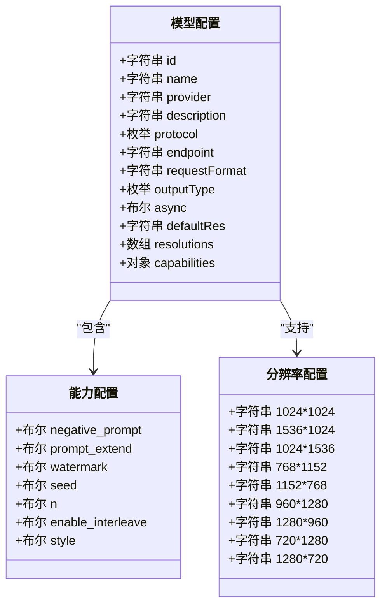
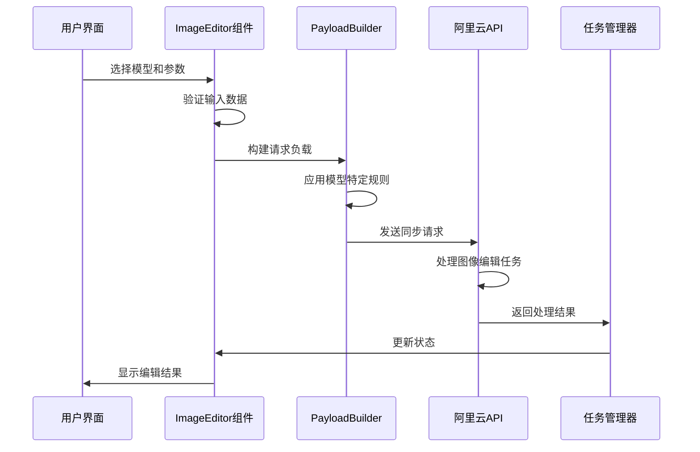
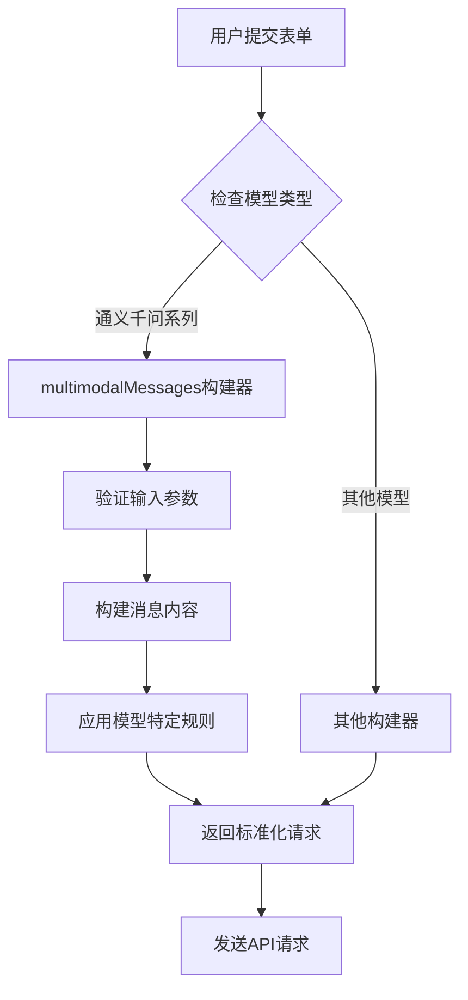
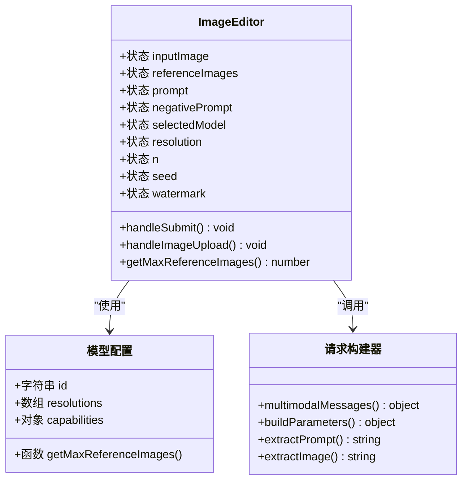
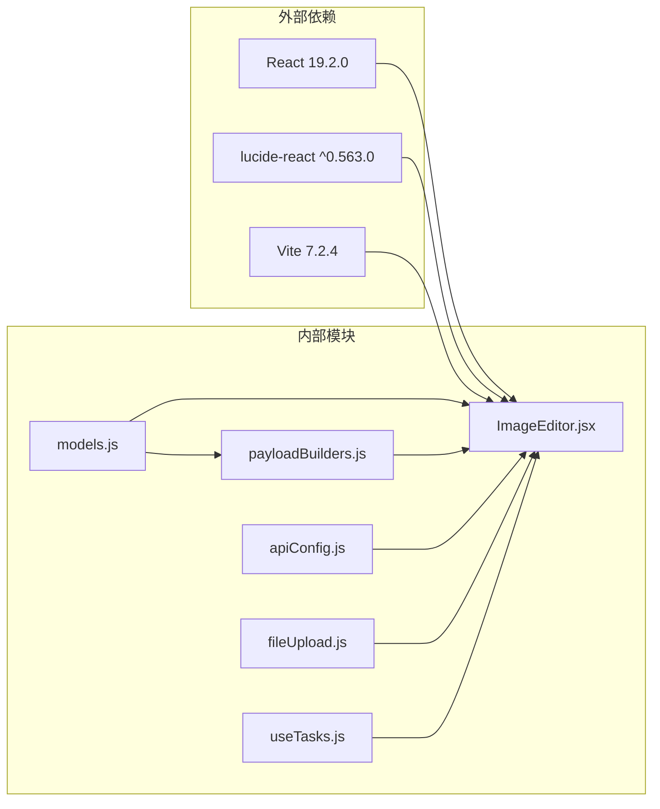

# 通义千问图像编辑模型

<cite>
**本文档引用的文件**
- [models.js](file://src/config/models.js)
- [ImageEditor.jsx](file://src/components/ImageEditor.jsx)
- [payloadBuilders.js](file://src/services/payloadBuilders.js)
- [apiConfig.js](file://src/config/apiConfig.js)
- [package.json](file://package.json)
</cite>

## 目录
1. [简介](#简介)
2. [项目结构](#项目结构)
3. [核心组件](#核心组件)
4. [架构概览](#架构概览)
5. [详细组件分析](#详细组件分析)
6. [依赖关系分析](#依赖关系分析)
7. [性能考虑](#性能考虑)
8. [故障排除指南](#故障排除指南)
9. [结论](#结论)

## 简介

本文档详细介绍了通义千问图像编辑模型的技术规格和使用方法。该系统提供了三个级别的图像编辑能力：Max、Plus和基础版，分别对应不同的功能复杂度和输出能力。所有模型都采用同步多模态协议，支持丰富的配置参数和灵活的使用场景。

## 项目结构

该项目采用React + Vite构建的前端应用，主要包含以下核心模块：

**图表来源**
- [models.js](file://src/config/models.js#L1-L1012)
- [ImageEditor.jsx](file://src/components/ImageEditor.jsx#L1-L973)
- [payloadBuilders.js](file://src/services/payloadBuilders.js#L1-L829)

**章节来源**
- [models.js](file://src/config/models.js#L1-L1012)
- [package.json](file://package.json#L1-L33)

## 核心组件

### 模型配置系统

系统通过统一的配置文件管理所有图像编辑模型，采用标准化的数据结构定义每个模型的能力和参数。

#### 模型分类体系

**图表来源**
- [models.js](file://src/config/models.js#L265-L327)

### 通义千问图像编辑模型

系统定义了三个级别的通义千问图像编辑模型，每个级别都有特定的功能定位和使用场景。

**章节来源**
- [models.js](file://src/config/models.js#L267-L327)

## 架构概览

系统采用分层架构设计，通过策略模式实现不同模型格式的请求构建，确保代码的可扩展性和维护性。

**图表来源**
- [ImageEditor.jsx](file://src/components/ImageEditor.jsx#L163-L230)
- [payloadBuilders.js](file://src/services/payloadBuilders.js#L125-L150)

## 详细组件分析

### 通义千问-图像编辑-Max

Max版本是功能最完整的图像编辑模型，专为复杂编辑需求设计。

#### 技术规格

| 特性 | 规格 |
|------|------|
| 支持的输入图像数量 | 1-4张 |
| 输出图像数量 | 1-6张 |
| 默认分辨率 | 1024×1024 |
| 支持的分辨率 | 1024×1024, 1536×1024, 1024×1536, 768×1152, 1152×768, 960×1280, 1280×960, 720×1280, 1280×720 |
| 负向提示词 | ✅ 支持 |
| 提示词扩展 | ✅ 支持 |
| 水印 | ✅ 支持 |
| 随机种子 | ✅ 支持 |
| 同步处理 | ✅ 支持 |

#### 功能特点

Max模型支持复杂的图像编辑操作：
- 精确修改图内文字内容
- 增删或移动物体
- 改变主体动作
- 迁移图片风格
- 增强画面细节

**章节来源**
- [models.js](file://src/config/models.js#L267-L287)

### 通义千问-图像编辑-Plus

Plus版本在功能完整性和易用性之间取得平衡，适合大多数编辑场景。

#### 技术规格

| 特性 | 规格 |
|------|------|
| 支持的输入图像数量 | 1-4张 |
| 输出图像数量 | 1-6张 |
| 默认分辨率 | 1024×1024 |
| 支持的分辨率 | 1024×1024, 1536×1024, 1024×1536, 768×1152, 1152×768, 960×1280, 1280×960, 720×1280, 1280×720 |
| 负向提示词 | ✅ 支持 |
| 提示词扩展 | ✅ 支持 |
| 水印 | ✅ 支持 |
| 随机种子 | ✅ 支持 |
| 同步处理 | ✅ 支持 |

#### 使用场景

Plus模型适合以下场景：
- 日常图像编辑任务
- 中等复杂度的图像修改
- 需要稳定性能的生产环境

**章节来源**
- [models.js](file://src/config/models.js#L288-L308)

### 通义千问-图像编辑

基础版本专注于核心编辑功能，提供简洁高效的解决方案。

#### 技术规格

| 特性 | 规格 |
|------|------|
| 支持的输入图像数量 | 1张 |
| 输出图像数量 | 1张 |
| 默认分辨率 | 1024×1024 |
| 支持的分辨率 | 1024×1024 |
| 负向提示词 | ✅ 支持 |
| 水印 | ✅ 支持 |
| 随机种子 | ✅ 支持 |
| 同步处理 | ✅ 支持 |

#### 适用场景

基础模型适合以下场景：
- 简单的图像编辑需求
- 快速原型开发
- 资源受限的环境

**章节来源**
- [models.js](file://src/config/models.js#L309-L327)

### 请求构建器系统

系统采用策略模式实现不同模型格式的请求构建，确保代码的可扩展性和维护性。

**图表来源**
- [payloadBuilders.js](file://src/services/payloadBuilders.js#L125-L150)

**章节来源**
- [payloadBuilders.js](file://src/services/payloadBuilders.js#L77-L119)

### 图像编辑器组件

ImageEditor组件提供直观的用户界面，支持多种编辑参数的配置。

#### 核心功能

**图表来源**
- [ImageEditor.jsx](file://src/components/ImageEditor.jsx#L15-L42)
- [payloadBuilders.js](file://src/services/payloadBuilders.js#L125-L150)

#### 参数配置

编辑器支持以下核心参数：

| 参数 | 类型 | 默认值 | 描述 |
|------|------|--------|------|
| prompt | 文本 | 空 | 主要编辑提示词 |
| negativePrompt | 文本 | 空 | 负向提示词 |
| resolution | 字符串 | "1024×1024" | 输出分辨率 |
| n | 数字 | 1 | 输出图像数量 |
| seed | 数字 | 空 | 随机种子 |
| watermark | 布尔 | false | 是否添加水印 |
| promptExtend | 布尔 | true | 是否启用提示词扩展 |

**章节来源**
- [ImageEditor.jsx](file://src/components/ImageEditor.jsx#L22-L31)

## 依赖关系分析

系统采用模块化设计，各组件间依赖关系清晰明确。

**图表来源**
- [package.json](file://package.json#L12-L31)
- [models.js](file://src/config/models.js#L1-L1012)

**章节来源**
- [package.json](file://package.json#L1-L33)

## 性能考虑

### 同步处理优势

所有通义千问图像编辑模型均采用同步处理模式，具有以下优势：

- **实时响应**：用户无需等待异步任务完成
- **简化流程**：避免复杂的轮询机制
- **资源控制**：更好的内存和CPU使用控制
- **用户体验**：更快的交互反馈

### 性能优化策略

1. **图像压缩**：自动检测大图像并进行压缩处理
2. **缓存机制**：本地预览和临时文件管理
3. **并发控制**：合理的API调用频率控制
4. **错误恢复**：自动重试和降级策略

## 故障排除指南

### 常见问题及解决方案

#### 模型选择问题

**问题**：无法选择某些模型
**原因**：模型配置不正确或网络问题
**解决**：检查模型配置文件和网络连接

#### 图像上传问题

**问题**：图像上传失败
**原因**：文件过大或格式不支持
**解决**：检查文件大小限制（8MB）和格式要求

#### 编辑参数错误

**问题**：编辑结果不符合预期
**原因**：参数配置不当
**解决**：检查提示词、负向提示词和分辨率设置

**章节来源**
- [ImageEditor.jsx](file://src/components/ImageEditor.jsx#L124-L145)
- [apiConfig.js](file://src/config/apiConfig.js#L8-L19)

## 结论

通义千问图像编辑模型系统提供了从基础到专业的完整解决方案。通过统一的配置管理和灵活的组件设计，系统能够满足不同层次的图像编辑需求。

### 最佳实践建议

1. **模型选择**：根据复杂度需求选择合适的模型级别
2. **参数优化**：合理设置分辨率和输出数量
3. **提示词设计**：编写清晰具体的编辑指令
4. **性能监控**：关注图像大小和处理时间
5. **错误处理**：建立完善的异常处理机制

### 适用场景指导

- **Max模型**：复杂编辑任务、专业应用场景
- **Plus模型**：日常编辑、中等复杂度任务
- **基础模型**：简单编辑、快速原型开发

该系统通过模块化的架构设计和标准化的接口规范，为通义千问图像编辑功能提供了稳定可靠的技术支撑。