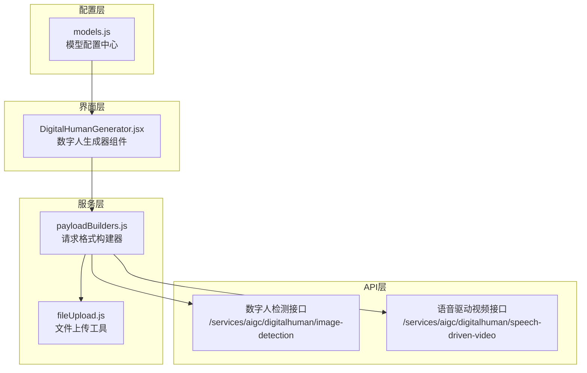
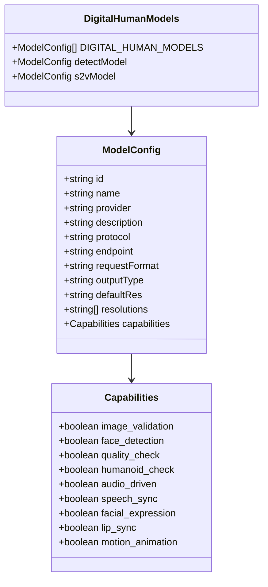
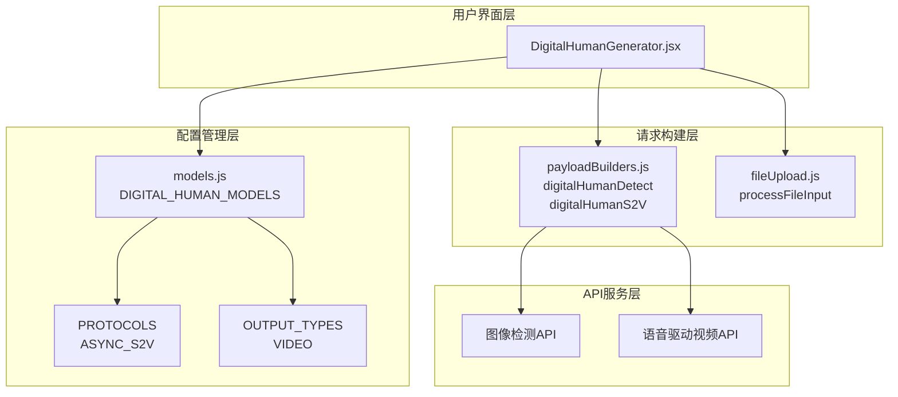
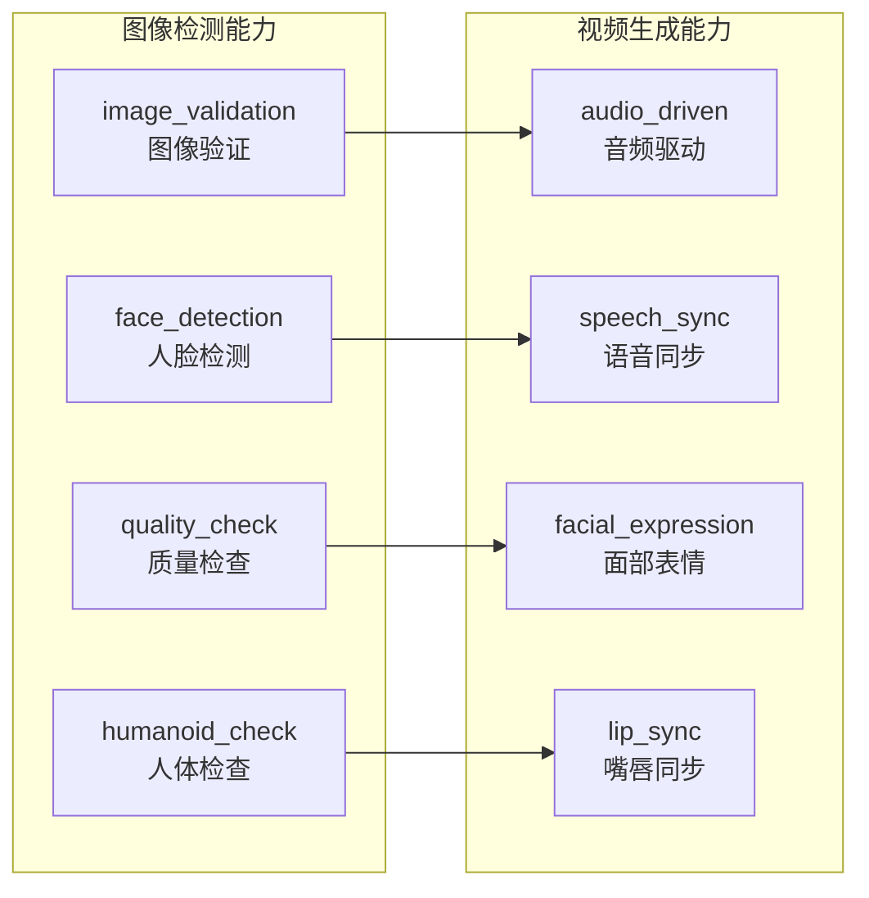
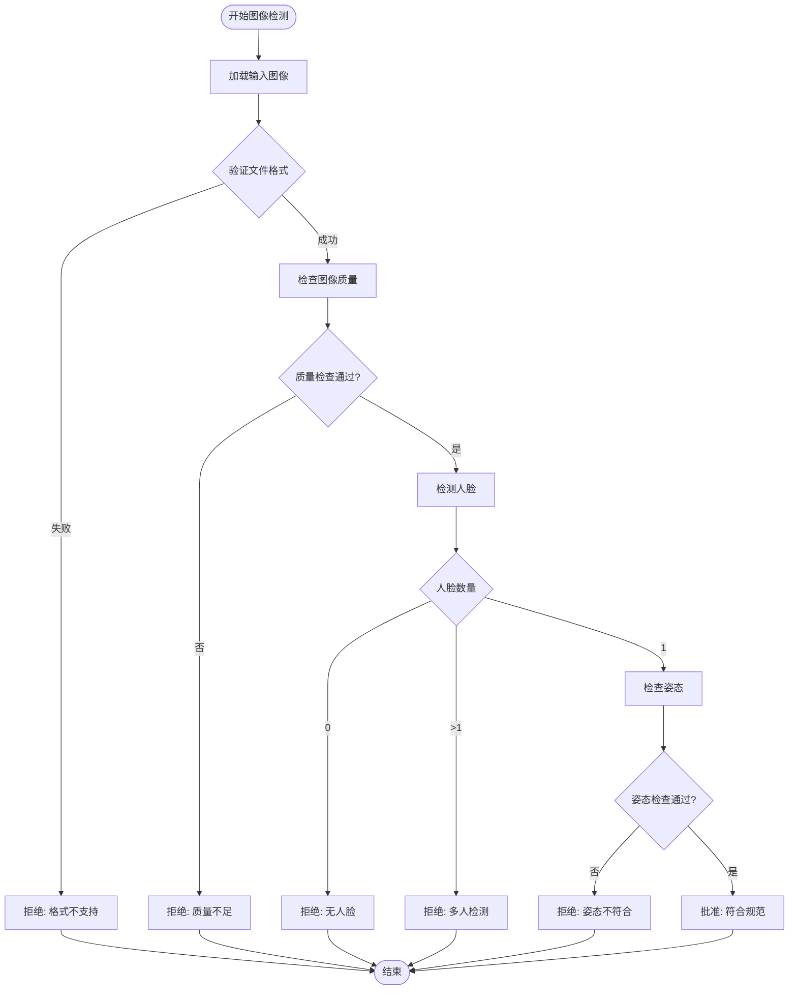
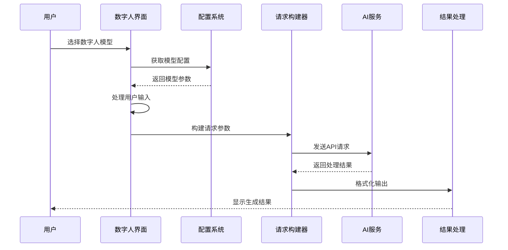
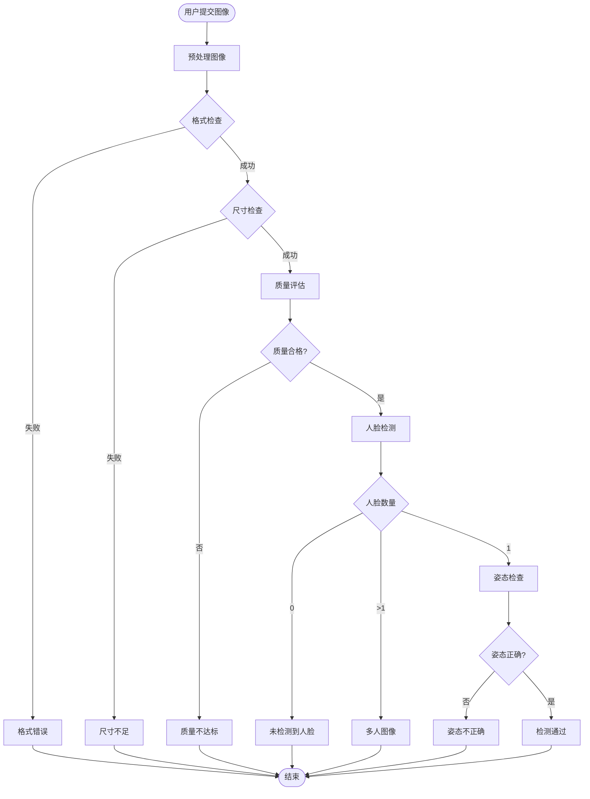
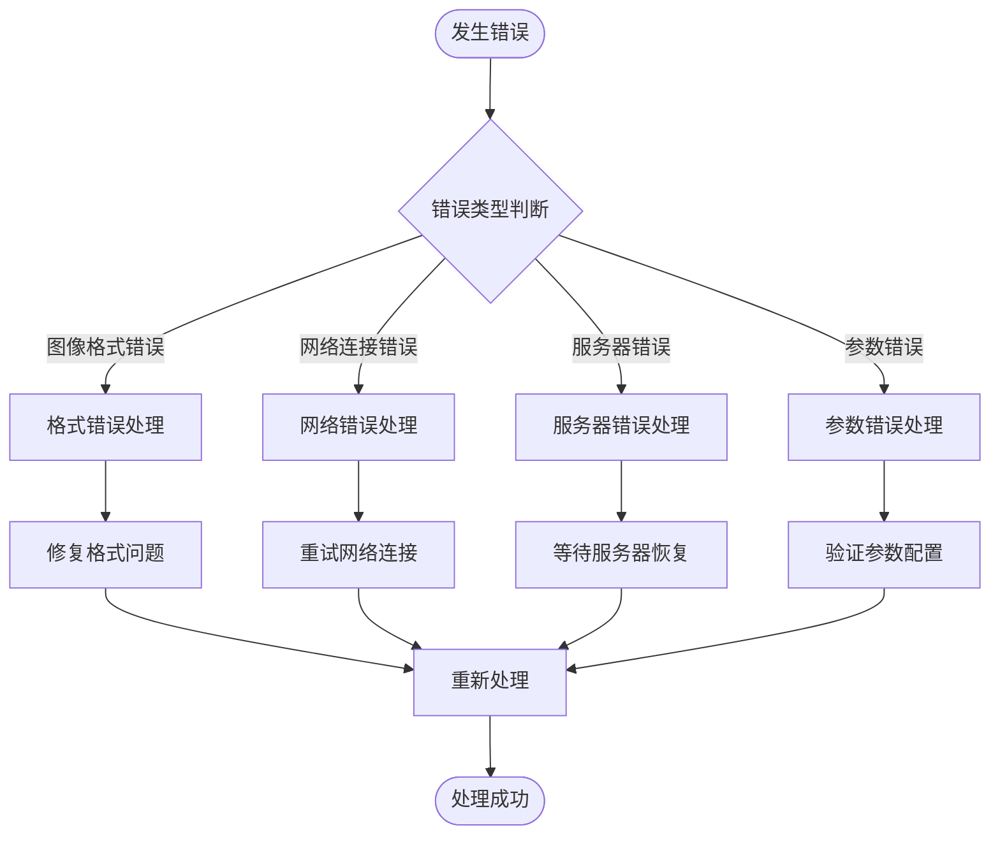

# 数字人模型配置

<cite>
**本文档引用的文件**
- [models.js](file://src/config/models.js)
- [DigitalHumanGenerator.jsx](file://src/components/DigitalHumanGenerator.jsx)
- [payloadBuilders.js](file://src/services/payloadBuilders.js)
- [fileUpload.js](file://src/utils/fileUpload.js)
</cite>

## 目录
1. [简介](#简介)
2. [项目结构概览](#项目结构概览)
3. [核心组件分析](#核心组件分析)
4. [架构设计](#架构设计)
5. [数字人模型配置详解](#数字人模型配置详解)
6. [特殊功能特性](#特殊功能特性)
7. [工作流程分析](#工作流程分析)
8. [最佳实践指南](#最佳实践指南)
9. [应用场景指导](#应用场景指导)
10. [故障排除指南](#故障排除指南)
11. [总结](#总结)

## 简介

通义万相前端应用的数字人模型配置系统为用户提供了完整的数字人生成解决方案，包括图像检测和语音驱动视频生成两大核心功能。该系统基于阿里通义实验室的先进AI技术，支持多种数字人应用场景，从基础的图像检测到复杂的语音驱动视频生成。

数字人模型配置系统采用模块化设计，通过统一的配置管理机制，实现了模型参数的标准化和可扩展性。系统不仅支持传统的文生图、图生图等基础功能，还专门针对数字人应用场景进行了深度优化。

## 项目结构概览

数字人模型配置系统主要分布在以下关键文件中：

**图表来源**
- [models.js](file://src/config/models.js#L790-L904)
- [DigitalHumanGenerator.jsx](file://src/components/DigitalHumanGenerator.jsx#L1-L313)
- [payloadBuilders.js](file://src/services/payloadBuilders.js#L715-L742)

**章节来源**
- [models.js](file://src/config/models.js#L790-L904)
- [DigitalHumanGenerator.jsx](file://src/components/DigitalHumanGenerator.jsx#L1-L313)

## 核心组件分析

### DIGITAL_HUMAN_MODELS 数组结构

数字人模型配置通过 `DIGITAL_HUMAN_MODELS` 数组进行集中管理，包含两个核心模型：

**图表来源**
- [models.js](file://src/config/models.js#L790-L830)

### 数字人检测模型 (wan2.2-s2v-detect)

检测模型专注于输入图像的质量验证和规范检查：

| 属性 | 值 | 描述 |
|------|-----|------|
| 模型ID | wan2.2-s2v-detect | 数字人图像检测专用模型 |
| 协议 | ASYNC_S2V | 异步语音驱动协议 |
| 端点 | /services/aigc/digitalhuman/image-detection | 图像检测服务地址 |
| 默认分辨率 | 1024*1024 | 标准检测分辨率 |
| 支持分辨率 | 1024*1024 | 专一的检测分辨率 |

**章节来源**
- [models.js](file://src/config/models.js#L792-L808)

### 语音驱动视频模型 (wan2.2-s2v)

主生成模型支持多种动作类型的视频生成：

| 属性 | 值 | 描述 |
|------|-----|------|
| 模型ID | wan2.2-s2v | 语音驱动视频生成模型 |
| 协议 | ASYNC_S2V | 异步语音驱动协议 |
| 端点 | /services/aigc/digitalhuman/speech-driven-video | 语音驱动视频服务地址 |
| 默认分辨率 | 480P | 标准视频分辨率 |
| 支持分辨率 | 480P, 720P | 可选视频分辨率 |

**章节来源**
- [models.js](file://src/config/models.js#L810-L830)

## 架构设计

数字人模型配置系统采用分层架构设计，确保了系统的可维护性和扩展性：

**图表来源**
- [DigitalHumanGenerator.jsx](file://src/components/DigitalHumanGenerator.jsx#L5-L130)
- [models.js](file://src/config/models.js#L1-L16)
- [payloadBuilders.js](file://src/services/payloadBuilders.js#L715-L742)

## 数字人模型配置详解

### 模型配置参数详解

每个数字人模型都包含详细的配置参数，用于控制模型的行为和输出：

#### 基础配置参数

| 参数名称 | 类型 | 必需 | 默认值 | 描述 |
|----------|------|------|--------|------|
| id | string | 是 | - | 模型唯一标识符 |
| name | string | 是 | - | 模型显示名称 |
| provider | string | 是 | - | 模型提供商 |
| description | string | 否 | - | 模型功能描述 |
| protocol | string | 是 | - | 通信协议类型 |
| endpoint | string | 是 | - | API服务端点 |
| requestFormat | string | 是 | - | 请求格式标识符 |
| outputType | string | 是 | - | 输出类型 (VIDEO/IMAGE) |
| defaultRes | string | 是 | - | 默认输出分辨率 |
| resolutions | Array | 是 | - | 支持的输出分辨率列表 |

#### 能力配置参数

数字人模型的能力配置通过 `capabilities` 对象进行管理：

**图表来源**
- [models.js](file://src/config/models.js#L802-L829)

**章节来源**
- [models.js](file://src/config/models.js#L790-L830)

## 特殊功能特性

### 输入图像检测功能

数字人检测模型提供全面的输入图像质量检查功能：

#### 图像验证 (image_validation)
- **功能描述**: 验证输入图像的基本格式和完整性
- **检查内容**: 文件格式、文件大小、编码格式
- **输出结果**: 验证通过/失败状态

#### 人脸检测 (face_detection)
- **功能描述**: 自动检测图像中的人脸位置和数量
- **检测能力**: 单人检测、多人检测、人脸质量评估
- **输出结果**: 人脸框坐标、置信度评分

#### 质量检查 (quality_check)
- **功能描述**: 评估图像的清晰度和视觉质量
- **检查维度**: 分辨率、对比度、色彩饱和度
- **输出标准**: 质量等级 (优秀/良好/一般/较差)

#### 人体检查 (humanoid_check)
- **功能描述**: 验证图像中是否存在合适的人体姿态
- **检查标准**: 正面朝向、身体完整、无遮挡
- **输出结果**: 人体姿态评估

**章节来源**
- [models.js](file://src/config/models.js#L802-L807)

### 规范检查功能

数字人模型的规范检查确保输入数据符合生成要求：

#### 清晰度评估
- **分辨率要求**: 至少达到1024*1024像素
- **清晰度阈值**: 像素密度和锐度评估
- **处理建议**: 不符合要求时提供优化建议

#### 单人正面检测
- **姿态要求**: 正面朝向，无侧脸或背影
- **头部占比**: 头部在画面中的最小占比
- **角度限制**: 旋转角度范围限制

#### 规范验证流程

**图表来源**
- [models.js](file://src/config/models.js#L796-L807)

**章节来源**
- [models.js](file://src/config/models.js#L792-L808)

### 视频生成功能

语音驱动视频模型支持多种动作类型的视频生成：

#### 动作类型支持

| 动作类型 | 功能描述 | 技术特点 |
|----------|----------|----------|
| speech | 说话动作 | 语音同步、自然口型运动 |
| singing | 唱歌动作 | 音调同步、情感表达 |
| performance | 表演动作 | 复杂肢体动作、表情变化 |

#### 视频生成参数

| 参数名称 | 类型 | 默认值 | 描述 |
|----------|------|--------|------|
| size | string | 480P | 输出视频分辨率 |
| style_type | string | speech | 动作类型选择 |
| audio_url | string | - | 音频输入URL |
| image_url | string | - | 人物图像URL |

**章节来源**
- [models.js](file://src/config/models.js#L818-L829)

## 工作流程分析

### 数字人生成完整流程

数字人生成系统的工作流程分为三个主要阶段：

**图表来源**
- [DigitalHumanGenerator.jsx](file://src/components/DigitalHumanGenerator.jsx#L73-L130)
- [payloadBuilders.js](file://src/services/payloadBuilders.js#L715-L742)

### 图像检测工作流程

图像检测作为数字人生成的前置步骤，具有严格的工作流程：

**图表来源**
- [DigitalHumanGenerator.jsx](file://src/components/DigitalHumanGenerator.jsx#L92-L101)
- [payloadBuilders.js](file://src/services/payloadBuilders.js#L715-L723)

**章节来源**
- [DigitalHumanGenerator.jsx](file://src/components/DigitalHumanGenerator.jsx#L73-L130)

## 最佳实践指南

### 图像准备最佳实践

#### 图像质量要求
- **分辨率**: 建议至少1024*1024像素，最佳2048*2048像素以上
- **清晰度**: 确保面部特征清晰可见，避免模糊或抖动
- **光线条件**: 均匀照明，避免强光直射或阴影过重
- **背景选择**: 简洁背景，避免复杂图案干扰

#### 人脸姿态要求
- **正面朝向**: 面部正对镜头，轻微侧脸允许±15度
- **头部大小**: 头部占画面比例建议30-50%
- **表情自然**: 放松表情，避免夸张或紧张
- **无遮挡**: 确保眼睛、嘴巴完全可见

### 模型选择策略

#### 检测模型使用场景
- **预检阶段**: 在正式生成前进行图像质量检查
- **批量处理**: 大规模图像筛选和分类
- **质量控制**: 作为生成流程的前置验证环节

#### 生成模型使用场景
- **单人视频**: 个人介绍、产品展示、教学视频
- **多人协作**: 团队会议、联合演示、互动节目
- **商业应用**: 广告宣传、虚拟主播、教育培训

### 性能优化建议

#### 文件处理优化
- **压缩策略**: 大图像自动压缩至合理大小
- **格式选择**: 优先使用JPEG格式，质量优先
- **尺寸控制**: 避免超过8MB的单个文件

#### 网络传输优化
- **缓存机制**: 利用浏览器缓存减少重复传输
- **并发控制**: 合理控制同时进行的任务数量
- **断点续传**: 支持大文件的分段传输

**章节来源**
- [fileUpload.js](file://src/utils/fileUpload.js#L6-L18)
- [DigitalHumanGenerator.jsx](file://src/components/DigitalHumanGenerator.jsx#L14-L50)

## 应用场景指导

### 教育培训场景

#### 在线课程制作
- **适用模型**: wan2.2-s2v
- **推荐参数**: 720P分辨率，speech动作类型
- **使用建议**: 准备标准的教学场景，确保光线充足

#### 学生作品展示
- **适用模型**: wan2.2-s2v-detect + wan2.2-s2v
- **流程建议**: 先进行图像检测，再生成视频
- **质量要求**: 高分辨率，清晰的面部特写

### 商业营销场景

#### 产品介绍视频
- **适用模型**: wan2.2-s2v
- **动作类型**: speech或performance
- **技术要点**: 稳定的背景，突出产品特征

#### 虚拟客服应用
- **适用模型**: wan2.2-s2v
- **部署方式**: 云端部署，实时响应
- **用户体验**: 低延迟，高清晰度

### 娱乐互动场景

#### 社交媒体内容
- **适用模型**: wan2.2-s2v
- **内容类型**: 短视频，快节奏剪辑
- **平台适配**: 根据平台特性调整分辨率

#### 虚拟偶像应用
- **适用模型**: wan2.2-s2v
- **个性化定制**: 表情、动作、声音的个性化设置
- **持续更新**: 定期更新模型，保持新鲜感

## 故障排除指南

### 常见问题诊断

#### 图像检测失败
**问题现象**: 图像检测返回"质量不达标"
**可能原因**:
- 图像分辨率过低
- 面部特征不够清晰
- 光线条件不佳
- 图像被压缩过度

**解决方法**:
1. 提供更高分辨率的图像
2. 改善拍摄环境的光线条件
3. 确保面部完全可见且清晰
4. 避免过度压缩图像

#### 视频生成异常
**问题现象**: 视频生成过程中出现错误
**可能原因**:
- 音频文件格式不支持
- 网络连接不稳定
- 服务器负载过高
- 参数配置错误

**解决方法**:
1. 确认音频文件格式为MP3或WAV
2. 检查网络连接稳定性
3. 稍后重试或降低并发数
4. 检查参数配置的正确性

### 错误处理机制

**图表来源**
- [DigitalHumanGenerator.jsx](file://src/components/DigitalHumanGenerator.jsx#L23-L28)
- [fileUpload.js](file://src/utils/fileUpload.js#L114-L144)

### 性能监控指标

#### 关键性能指标
- **响应时间**: API请求到响应的时间
- **成功率**: 成功生成视频的比例
- **资源利用率**: CPU、内存、网络的使用情况
- **并发处理能力**: 同时处理的任务数量

#### 监控建议
- **日志记录**: 记录关键操作和错误信息
- **性能统计**: 统计各项性能指标的变化趋势
- **告警机制**: 设置合理的阈值触发告警
- **定期评估**: 定期评估系统性能和用户体验

**章节来源**
- [DigitalHumanGenerator.jsx](file://src/components/DigitalHumanGenerator.jsx#L23-L49)
- [fileUpload.js](file://src/utils/fileUpload.js#L114-L144)

## 总结

通义万相前端应用的数字人模型配置系统是一个高度集成、功能完善的AI生成解决方案。通过精心设计的配置管理和模块化架构，系统实现了以下核心价值：

### 技术优势

1. **标准化配置**: 通过统一的配置管理，确保所有数字人模型的一致性和可维护性
2. **模块化设计**: 清晰的分层架构便于功能扩展和维护
3. **智能检测**: 全面的图像质量检查确保生成效果的稳定性
4. **灵活参数**: 支持多种分辨率和动作类型的灵活配置

### 应用价值

1. **教育领域**: 为在线教育提供高质量的数字人教学内容
2. **商业应用**: 支持企业营销和品牌推广的数字化转型
3. **娱乐产业**: 为社交媒体和虚拟偶像提供创新内容
4. **个人创作**: 降低数字人内容创作的技术门槛

### 发展前景

随着AI技术的不断进步，数字人模型配置系统将继续演进，为用户提供更加智能化、个性化的数字人生成体验。通过持续的功能优化和技术升级，系统将在更多领域发挥重要作用，推动数字化内容创作的普及和发展。