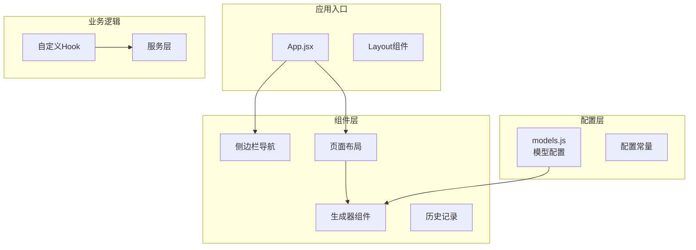
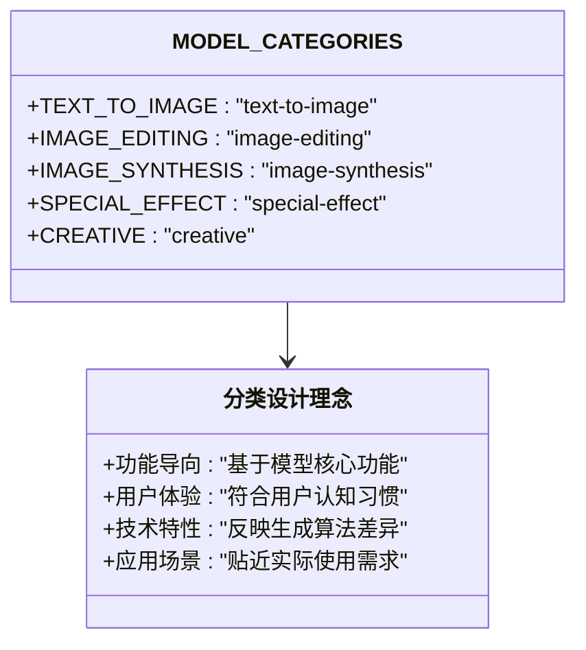
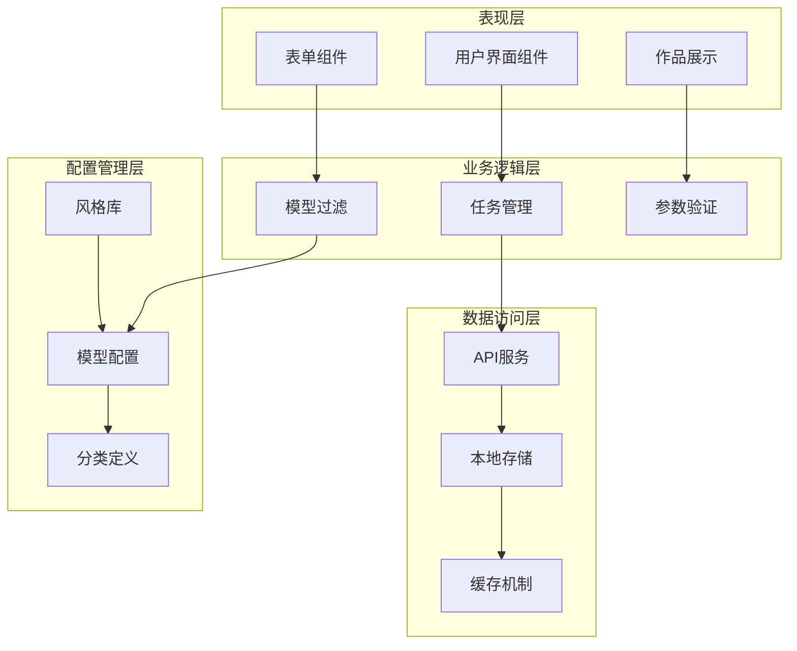
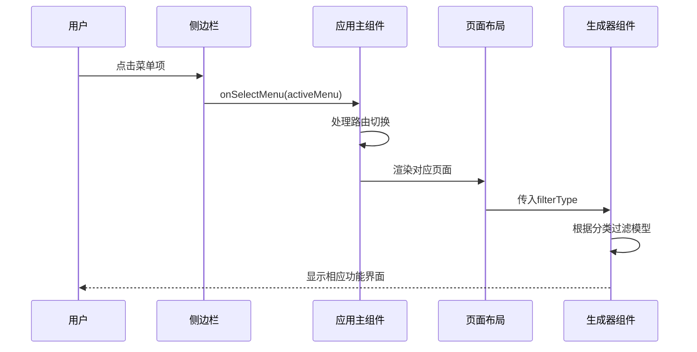
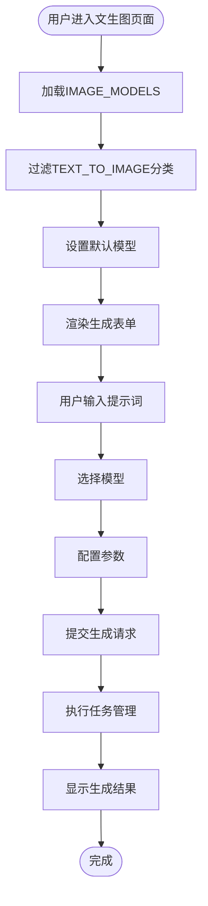
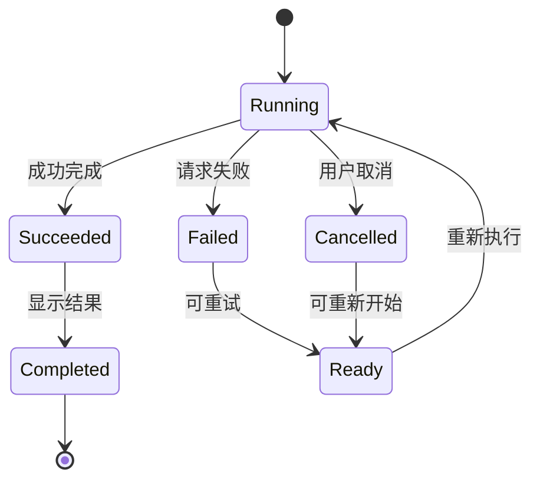
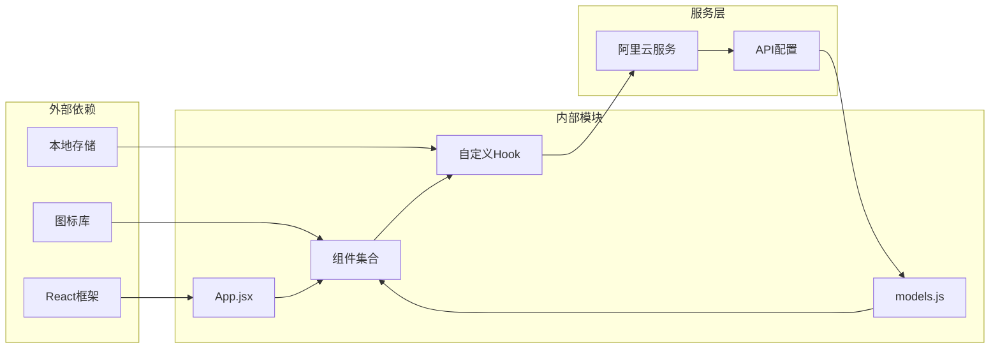

# 模型分类系统

<cite>
**本文档引用的文件**
- [src/config/models.js](file://src/config/models.js)
- [src/App.jsx](file://src/App.jsx)
- [src/components/Sidebar.jsx](file://src/components/Sidebar.jsx)
- [src/components/PageLayout.jsx](file://src/components/PageLayout.jsx)
- [src/components/ImageGenerator.jsx](file://src/components/ImageGenerator.jsx)
- [src/hooks/useTasks.js](file://src/hooks/useTasks.js)
</cite>

## 目录
1. [简介](#简介)
2. [项目结构](#项目结构)
3. [核心组件](#核心组件)
4. [架构概览](#架构概览)
5. [详细组件分析](#详细组件分析)
6. [依赖关系分析](#依赖关系分析)
7. [性能考虑](#性能考虑)
8. [故障排除指南](#故障排除指南)
9. [结论](#结论)

## 简介

通义万相前端应用的模型分类系统是一个基于React的应用程序，专注于AI生成内容的创作和管理。该系统通过精心设计的模型分类体系，为用户提供直观易用的AI创作工具。

本系统的核心是MODEL_CATEGORIES常量对象，它定义了五个主要的AI模型分类：TEXT_TO_IMAGE（纯文生图）、IMAGE_EDITING（图像编辑）、IMAGE_SYNTHESIS（图像合成/融合）、SPECIAL_EFFECT（特效类）和CREATIVE（创意类）。这些分类不仅体现了技术特性，更重要的是反映了用户的实际使用场景和工作流程。

## 项目结构

应用程序采用模块化的组件架构，主要分为以下几个核心部分：

**图表来源**
- [src/App.jsx](file://src/App.jsx#L1-L377)
- [src/config/models.js](file://src/config/models.js#L1-L1012)

**章节来源**
- [src/App.jsx](file://src/App.jsx#L1-L377)
- [src/config/models.js](file://src/config/models.js#L1-L1012)

## 核心组件

### 模型分类体系

MODEL_CATEGORIES常量对象定义了完整的AI模型分类体系：

**图表来源**
- [src/config/models.js](file://src/config/models.js#L18-L25)

### 分类特点详解

#### TEXT_TO_IMAGE（纯文生图）
- **设计理念**：专注于文本到图像的直接转换
- **使用场景**：概念设计、艺术创作、产品原型
- **典型模型**：万相2.6-T2I、通义千问-图像生成
- **特点**：支持丰富的艺术风格、高分辨率输出、智能提示词扩展

#### IMAGE_EDITING（图像编辑）
- **设计理念**：基于现有图像进行精确修改和增强
- **使用场景**：图像修复、风格转换、局部重绘
- **典型模型**：通义千问-图像编辑、万相2.1-通用图像编辑
- **特点**：支持多图输入输出、精确的局部编辑、批量处理能力

#### IMAGE_SYNTHESIS（图像合成/融合）
- **设计理念**：将多个图像源进行智能融合
- **使用场景**：图像拼接、内容扩展、风格混合
- **典型模型**：万相2.5-通用图像编辑（预览版）
- **特点**：支持多输入源、智能内容推理、保持视觉一致性

#### SPECIAL_EFFECT（特效类）
- **设计理念**：提供专业的视觉特效和应用功能
- **使用场景**：电商应用、虚拟试衣、背景生成
- **典型模型**：AI试衣、图像背景生成、鞋靴模特
- **特点**：针对特定行业需求、高质量输出、专业级效果

#### CREATIVE（创意类）
- **设计理念**：激发创意表达和个性化内容
- **使用场景**：文字艺术、海报设计、创意表达
- **典型模型**：创意文字-文字变形、创意文字-文字纹理
- **特点**：高度可定制、艺术性强、支持多种输出格式

**章节来源**
- [src/config/models.js](file://src/config/models.js#L18-L25)
- [src/config/models.js](file://src/config/models.js#L265-L788)

## 架构概览

系统采用分层架构设计，确保了良好的可维护性和扩展性：

**图表来源**
- [src/App.jsx](file://src/App.jsx#L1-L377)
- [src/hooks/useTasks.js](file://src/hooks/useTasks.js#L1-L333)
- [src/config/models.js](file://src/config/models.js#L1-L1012)

## 详细组件分析

### 模型分类在UI中的应用

#### 侧边栏导航集成

**图表来源**
- [src/components/Sidebar.jsx](file://src/components/Sidebar.jsx#L1-L149)
- [src/App.jsx](file://src/App.jsx#L71-L355)
- [src/components/PageLayout.jsx](file://src/components/PageLayout.jsx#L1-L76)

#### 文生图组件的分类实现

ImageGenerator组件展示了如何将模型分类系统应用到实际UI中：

**图表来源**
- [src/components/ImageGenerator.jsx](file://src/components/ImageGenerator.jsx#L1-L249)
- [src/config/models.js](file://src/config/models.js#L265-L421)

**章节来源**
- [src/components/Sidebar.jsx](file://src/components/Sidebar.jsx#L1-L149)
- [src/App.jsx](file://src/App.jsx#L71-L355)
- [src/components/PageLayout.jsx](file://src/components/PageLayout.jsx#L1-L76)
- [src/components/ImageGenerator.jsx](file://src/components/ImageGenerator.jsx#L1-L249)

### 任务管理系统与分类关联

useTasks Hook展示了如何将模型分类与任务管理相结合：

**图表来源**
- [src/hooks/useTasks.js](file://src/hooks/useTasks.js#L1-L333)

**章节来源**
- [src/hooks/useTasks.js](file://src/hooks/useTasks.js#L1-L333)

## 依赖关系分析

系统中的依赖关系展现了清晰的层次结构：

**图表来源**
- [src/config/models.js](file://src/config/models.js#L1-L1012)
- [src/App.jsx](file://src/App.jsx#L1-L377)
- [src/hooks/useTasks.js](file://src/hooks/useTasks.js#L1-L333)

**章节来源**
- [src/config/models.js](file://src/config/models.js#L1-L1012)
- [src/App.jsx](file://src/App.jsx#L1-L377)
- [src/hooks/useTasks.js](file://src/hooks/useTasks.js#L1-L333)

## 性能考虑

系统在性能优化方面采用了多项策略：

### 1. 模型加载优化
- 使用`useMemo`缓存过滤结果，避免重复计算
- 按需加载不同分类的模型配置
- 本地存储优化，减少重复渲染

### 2. 任务管理优化
- 自适应轮询间隔，根据任务状态动态调整
- 智能存储清理，限制历史记录数量
- 批量状态检查，提高效率

### 3. UI渲染优化
- 组件懒加载，减少初始包大小
- 条件渲染，只渲染必要的UI元素
- 事件防抖，避免频繁的状态更新

## 故障排除指南

### 常见问题及解决方案

#### 模型分类不显示
**问题描述**：某些分类的模型未在UI中显示
**解决步骤**：
1. 检查模型配置中的category字段
2. 验证MODEL_CATEGORIES常量的值
3. 确认组件中正确的过滤逻辑

#### 任务状态异常
**问题描述**：任务状态不正确或无法更新
**解决步骤**：
1. 检查API响应格式
2. 验证状态转换逻辑
3. 查看控制台错误信息

#### 性能问题
**问题描述**：页面加载缓慢或响应迟缓
**解决步骤**：
1. 检查是否有不必要的重新渲染
2. 优化模型配置的加载方式
3. 实施适当的缓存策略

**章节来源**
- [src/hooks/useTasks.js](file://src/hooks/useTasks.js#L164-L246)

## 结论

通义万相的模型分类系统通过精心设计的五分类体系，成功地将复杂的技术功能转化为直观易用的用户体验。每个分类都有其明确的设计理念和使用场景，确保用户能够快速找到适合其需求的AI工具。

系统的架构设计充分考虑了可扩展性和维护性，为未来的功能扩展和技术升级奠定了坚实的基础。通过模块化的组件设计和清晰的依赖关系，开发者可以轻松地添加新的模型分类或修改现有分类的实现。

这一分类体系不仅提升了用户体验，也为AI生成内容的创作和管理提供了标准化的解决方案，是构建专业级AI应用的重要基础设施。