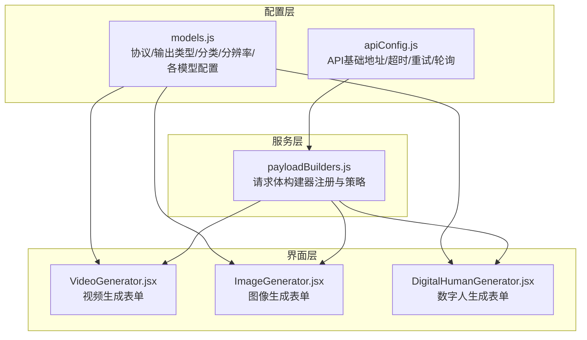
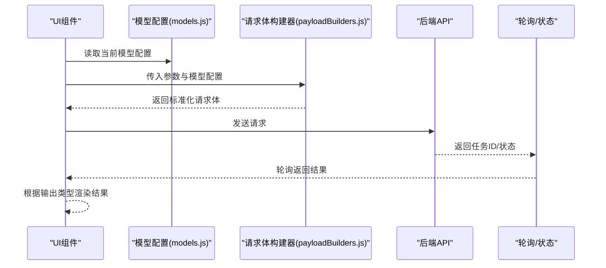
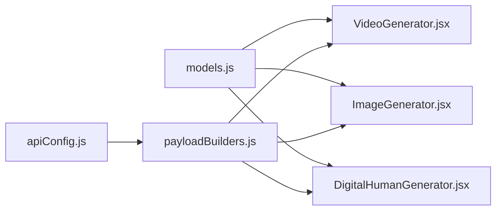

# 模型配置

<cite>
**本文引用的文件**
- [models.js](file://src/config/models.js)
- [apiConfig.js](file://src/config/apiConfig.js)
- [payloadBuilders.js](file://src/services/payloadBuilders.js)
- [VideoGenerator.jsx](file://src/components/VideoGenerator.jsx)
- [ImageGenerator.jsx](file://src/components/ImageGenerator.jsx)
- [DigitalHumanGenerator.jsx](file://src/components/DigitalHumanGenerator.jsx)
</cite>

## 目录
1. [简介](#简介)
2. [项目结构](#项目结构)
3. [核心组件](#核心组件)
4. [架构总览](#架构总览)
5. [详细组件分析](#详细组件分析)
6. [依赖关系分析](#依赖关系分析)
7. [性能考量](#性能考量)
8. [故障排查指南](#故障排查指南)
9. [结论](#结论)
10. [附录](#附录)

## 简介
本文件面向通义万相前端应用的模型配置系统，系统性梳理并解释 models.js 中定义的 AI 模型配置体系，包括协议常量、输出类型、模型分类、分辨率标签，以及各类模型（视频生成、图像到视频、参考视频、视频编辑、图像生成、数字人、图像翻译等）的配置结构与使用方法。文档还提供最佳实践、扩展指南与常见问题排查建议，帮助开发者在不改动核心逻辑的前提下安全地新增或调整模型配置。

## 项目结构
模型配置集中于配置层，UI 组件通过读取配置渲染表单并构造请求体；服务层通过 payload 构建器将通用参数映射为具体 API 请求格式。

图表来源
- [models.js](file://src/config/models.js#L1-L1012)
- [apiConfig.js](file://src/config/apiConfig.js#L1-L35)
- [payloadBuilders.js](file://src/services/payloadBuilders.js#L1-L829)
- [VideoGenerator.jsx](file://src/components/VideoGenerator.jsx#L1-L354)
- [ImageGenerator.jsx](file://src/components/ImageGenerator.jsx#L1-L249)
- [DigitalHumanGenerator.jsx](file://src/components/DigitalHumanGenerator.jsx#L113-L312)

章节来源
- [models.js](file://src/config/models.js#L1-L1012)
- [apiConfig.js](file://src/config/apiConfig.js#L1-L35)

## 核心组件
- 协议常量（PROTOCOLS）：统一抽象不同任务类型的后端协议，便于 UI 与服务层按协议路由。
- 输出类型（OUTPUT_TYPES）：区分图像与视频两类输出，影响结果处理与展示。
- 模型分类（MODEL_CATEGORIES）：用于 UI 过滤与分组，如“文本到图像”、“图像编辑”、“特效类”、“创意类”。
- 分辨率标签（RESOLUTION_LABELS）：将技术分辨率映射为用户友好的标签（如 480P/720P/1080P）。
- 模型集合：VIDEO_MODELS、I2V_MODELS、R2V_MODELS、VACE_PLUS_MODELS、IMAGE_MODELS、DIGITAL_HUMAN_MODELS、IMAGE_TRANSLATION_MODELS。
- 辅助配置：STYLES（艺术风格）、VIDEO_EFFECT_TEMPLATES（视频特效模板）、ALL_MODELS（聚合查询）。

章节来源
- [models.js](file://src/config/models.js#L1-L1012)

## 架构总览
模型配置系统采用“配置即契约”的设计：UI 组件只关心配置项，服务层通过 payload 构建器将配置映射为后端请求格式。API 基础配置统一管理超时、重试与轮询策略，确保异步任务的稳定处理。

图表来源
- [models.js](file://src/config/models.js#L1-L1012)
- [payloadBuilders.js](file://src/services/payloadBuilders.js#L1-L829)
- [apiConfig.js](file://src/config/apiConfig.js#L1-L35)

## 详细组件分析

### 协议常量（PROTOCOLS）
- 同步多模态（sync_multimodal）：用于需要即时响应的多模态任务（如图像编辑）。
- 异步文生图（async_t2i）：文本到图像的异步任务。
- 异步视频（async_video）：文本到视频的异步任务。
- 异步图生视频（async_i2v）：图像到视频的异步任务。
- 异步参考视频（async_r2v）：参考视频驱动的异步任务。
- 异步视频编辑（async_vace_plus）：统一视频编辑任务。
- 异步语音驱动视频（async_s2v）：数字人语音驱动视频任务。

用途与影响：
- 协议决定 UI 的交互形态（是否需要轮询、是否支持某些参数）。
- 服务层据此选择对应的 payload 构建器与后端端点。

章节来源
- [models.js](file://src/config/models.js#L1-L10)

### 输出类型（OUTPUT_TYPES）
- 图像（image）
- 视频（video）

用途：
- 影响结果处理流程（下载、播放、预览）与 UI 渲染。

章节来源
- [models.js](file://src/config/models.js#L12-L16)

### 模型分类（MODEL_CATEGORIES）
- 文本到图像（text-to-image）
- 图像编辑（image-editing）
- 图像合成/融合（image-synthesis）
- 特效类（special-effect）
- 创意类（creative）

用途：
- UI 过滤与分组展示，便于用户按功能域选择模型。

章节来源
- [models.js](file://src/config/models.js#L18-L25)

### 分辨率标签（RESOLUTION_LABELS）
- 480P/720P/1080P（标清/高清/FHD）
- 1280*720（16:9）
- 720*1280（9:16）
- 960*960（1:1）
- 832*1088（3:4）
- 1088*832（4:3）

用途：
- 将技术分辨率映射为用户可读标签，简化 UI 选择。

章节来源
- [models.js](file://src/config/models.js#L27-L37)

### 视频生成模型（VIDEO_MODELS）
典型字段与作用：
- id/name/provider/description：标识与说明。
- protocol：异步视频协议。
- endpoint/requestFormat：后端端点与请求格式。
- outputType：输出类型为视频。
- defaultRes/resolutions：默认分辨率与可用分辨率列表。
- capabilities：能力开关与功能集合，如 prompt_extend、shot_type、audio、negative_prompt、seed、frame_selection 等。

使用要点：
- UI 会根据 capabilities 动态显示高级参数（如镜头类型、音频输入、负面提示词、固定种子）。
- 不同模型支持的时长范围不同，UI 会根据所选模型自动限制可选时长。

章节来源
- [models.js](file://src/config/models.js#L39-L135)
- [VideoGenerator.jsx](file://src/components/VideoGenerator.jsx#L1-L354)

### 图像到视频模型（I2V_MODELS）
- 支持模板模式与常规模式，模板模式使用 template 字段，常规模式复用视频生成逻辑。
- 关键能力：prompt_extend、shot_type、audio、negative_prompt、seed、frame_selection（关键帧到视频）。

章节来源
- [models.js](file://src/config/models.js#L137-L216)
- [payloadBuilders.js](file://src/services/payloadBuilders.js#L574-L643)

### 参考视频模型（R2V_MODELS）
- 基于参考视频的角色与音色生成，支持多镜头与多角色。
- 关键能力：shot_type、negative_prompt、seed、multi_character、watermark。

章节来源
- [models.js](file://src/config/models.js#L218-L239)
- [payloadBuilders.js](file://src/services/payloadBuilders.js#L645-L665)

### 视频编辑统一模型（VACE_PLUS_MODELS）
- 支持多图参考、视频重绘、局部编辑、视频延展与画面扩展。
- 关键能力：prompt_extend、obj_or_bg、seed、watermark、functions（函数列表）。

章节来源
- [models.js](file://src/config/models.js#L241-L262)
- [payloadBuilders.js](file://src/services/payloadBuilders.js#L667-L709)

### 图像生成模型（IMAGE_MODELS）
覆盖范围广泛，按类别与能力差异分为多个子集：
- 通义千问图像编辑系列（qwen-image-edit-max/plus/）：同步多模态，支持多图输入/输出、负向提示词、水印、随机种子、输出数量 n。
- 万相通用图像编辑（wanx2.1-imageedit）：异步 T2I，支持多种函数（风格化、局部重绘、去水印、扩图、超分、上色、线稿生图、卡通特征控制等）。
- 万相图像编辑（wan2.5-i2i-preview）：同步多模态，数组合成，支持多图融合。
- 万相图像生成（wan2.6-image/wan2.6-t2i 等）：异步 T2I，支持风格、负向提示词、水印、随机种子、图文混排与最大输出张数等。
- 特效与创意模型：如 AI 试衣（aitryon/aitryon-plus）、背景生成（background-generation）、创意文字（wordart-semantic/texture）、表情包视频（emoji-v1）等。

章节来源
- [models.js](file://src/config/models.js#L264-L788)
- [ImageGenerator.jsx](file://src/components/ImageGenerator.jsx#L1-L249)
- [payloadBuilders.js](file://src/services/payloadBuilders.js#L121-L509)

### 数字人模型（DIGITAL_HUMAN_MODELS）
- 图像检测（wan2.2-s2v-detect）：校验输入图像是否满足数字人模型的输入规范。
- 语音驱动视频（wan2.2-s2v）：基于单张图片与音频生成说话/唱歌/表演视频，支持多种风格类型与分辨率。
- 动作迁移/换人：如视频换人（videoCharacterSwap）、图生动作（imageMotionTransfer）等。

章节来源
- [models.js](file://src/config/models.js#L790-L904)
- [DigitalHumanGenerator.jsx](file://src/components/DigitalHumanGenerator.jsx#L113-L312)
- [payloadBuilders.js](file://src/services/payloadBuilders.js#L711-L798)

### 图像翻译模型（IMAGE_TRANSLATION_MODELS）
- 通义千问图像翻译（qwen-mt-image）：支持源语言/目标语言、图像分段、领域提示、敏感词与术语等。

章节来源
- [models.js](file://src/config/models.js#L906-L928)
- [payloadBuilders.js](file://src/services/payloadBuilders.js#L280-L294)

### 请求体构建器（payloadBuilders.js）
- 采用策略模式，按 requestFormat 将 UI 参数映射为后端请求体。
- 提供通用参数构建器（buildParameters），自动处理 size/n/prompt_extend/negative_prompt/watermark/seed/duration 等。
- 针对不同模型格式提供专用构建器（multimodalMessages、text2image、imageArraySynthesis、functionImageEdit、sketchToImage、localRepaint、imageTranslation、styleRepaint、outPainting、virtualModel、backgroundGeneration、aiTryon、wordartSemantic、wordartTexture、videoGeneration、imageToVideo、referenceToVideo、videoEditing、digitalHumanDetect、digitalHumanS2V、emojiVideo、videoCharacterSwap、imageMotionTransfer）。
- 提供 payloadBuilders 注册表，便于按 requestFormat 查找对应构建器。

章节来源
- [payloadBuilders.js](file://src/services/payloadBuilders.js#L1-L829)

### UI 使用示例与参数映射
- 视频生成（VideoGenerator.jsx）：根据所选模型的 capabilities 动态显示/隐藏参数；将分辨率标签转换为实际尺寸；支持音频输入与模板模式。
- 图像生成（ImageGenerator.jsx）：按类别过滤文本到图像模型；根据模型能力启用风格、负向提示词、随机种子等。
- 数字人（DigitalHumanGenerator.jsx）：选择模型与风格类型，传入图片与音频 URL，按默认分辨率生成。

章节来源
- [VideoGenerator.jsx](file://src/components/VideoGenerator.jsx#L1-L354)
- [ImageGenerator.jsx](file://src/components/ImageGenerator.jsx#L1-L249)
- [DigitalHumanGenerator.jsx](file://src/components/DigitalHumanGenerator.jsx#L113-L312)

## 依赖关系分析

图表来源
- [models.js](file://src/config/models.js#L1-L1012)
- [apiConfig.js](file://src/config/apiConfig.js#L1-L35)
- [payloadBuilders.js](file://src/services/payloadBuilders.js#L1-L829)
- [VideoGenerator.jsx](file://src/components/VideoGenerator.jsx#L1-L354)
- [ImageGenerator.jsx](file://src/components/ImageGenerator.jsx#L1-L249)
- [DigitalHumanGenerator.jsx](file://src/components/DigitalHumanGenerator.jsx#L113-L312)

章节来源
- [models.js](file://src/config/models.js#L930-L1012)
- [payloadBuilders.js](file://src/services/payloadBuilders.js#L800-L829)

## 性能考量
- 异步任务的轮询与超时：API 配置提供请求超时与轮询间隔，避免长时间阻塞 UI。
- 能力开关与参数精简：仅在模型支持时传递参数，减少无效字段，降低后端处理开销。
- 分辨率与时长：合理选择分辨率与时长，平衡质量与耗时；UI 已根据模型能力自动限制可选项。
- 请求体构建：通过统一构建器减少重复逻辑，提高稳定性与可维护性。

章节来源
- [apiConfig.js](file://src/config/apiConfig.js#L8-L27)
- [payloadBuilders.js](file://src/services/payloadBuilders.js#L74-L119)

## 故障排查指南
- 缺少必要输入：
  - 图像编辑类模型需提供基准图片或至少一张输入图，否则构建器会抛出错误。
  - 数字人表情包生成需要人脸框与扩展框坐标，否则会提示先调用人脸检测。
- 参数不兼容：
  - 当模型不支持某能力（如 audio、seed、negative_prompt）时，UI 应隐藏对应开关；若仍传入，后端可能拒绝。
- 分辨率与时长：
  - 若所选分辨率不在模型支持列表，UI 会回退到默认分辨率；时长也受模型限制。
- 轮询与超时：
  - 异步任务若长时间未完成，检查轮询间隔与最大等待时间；确认后端状态返回值是否在结束集合中。

章节来源
- [payloadBuilders.js](file://src/services/payloadBuilders.js#L136-L138)
- [payloadBuilders.js](file://src/services/payloadBuilders.js#L177-L180)
- [payloadBuilders.js](file://src/services/payloadBuilders.js#L229-L232)
- [payloadBuilders.js](file://src/services/payloadBuilders.js#L258-L261)
- [payloadBuilders.js](file://src/services/payloadBuilders.js#L749-L751)
- [apiConfig.js](file://src/config/apiConfig.js#L21-L27)

## 结论
该模型配置系统通过“配置即契约”的方式，将 UI、服务层与后端协议解耦，既保证了灵活性，又降低了维护成本。通过统一的协议常量、输出类型、分类与分辨率标签，以及完善的模型配置与请求体构建器，开发者可以以最小代价扩展新的模型或调整现有配置。

## 附录

### 最佳实践与扩展指南
- 新增模型步骤
  1) 在对应模型集合（如 VIDEO_MODELS/IMAGE_MODELS/DIGITAL_HUMAN_MODELS）中添加配置项，确保包含 id、name、provider、description、protocol、endpoint、requestFormat、outputType、defaultRes、resolutions、capabilities。
  2) 若 requestFormat 未在 payloadBuilders.js 中实现，请新增对应构建器并在注册表中注册。
  3) 在 UI 组件中根据 capabilities 动态渲染参数控件；若涉及特殊输入（如模板、遮罩、参考图），在构建器中增加必要的校验与错误提示。
  4) 如需新增分辨率或能力开关，更新 RESOLUTION_LABELS 或 capabilities，并在 UI 与构建器中同步适配。
- 修改现有配置
  - 仅在确有必要时调整 capabilities，避免破坏已有 UI 行为。
  - 若要变更默认分辨率或时长，需同步更新 UI 的默认值与可用选项。
- 处理模型能力差异
  - 对于不支持的能力，UI 应隐藏相关控件；构建器中通过 capabilities 判断是否传递参数。
  - 对于需要前置处理的模型（如数字人检测），在 UI 中先调用检测接口再进入主流程。

章节来源
- [models.js](file://src/config/models.js#L1-L1012)
- [payloadBuilders.js](file://src/services/payloadBuilders.js#L800-L829)