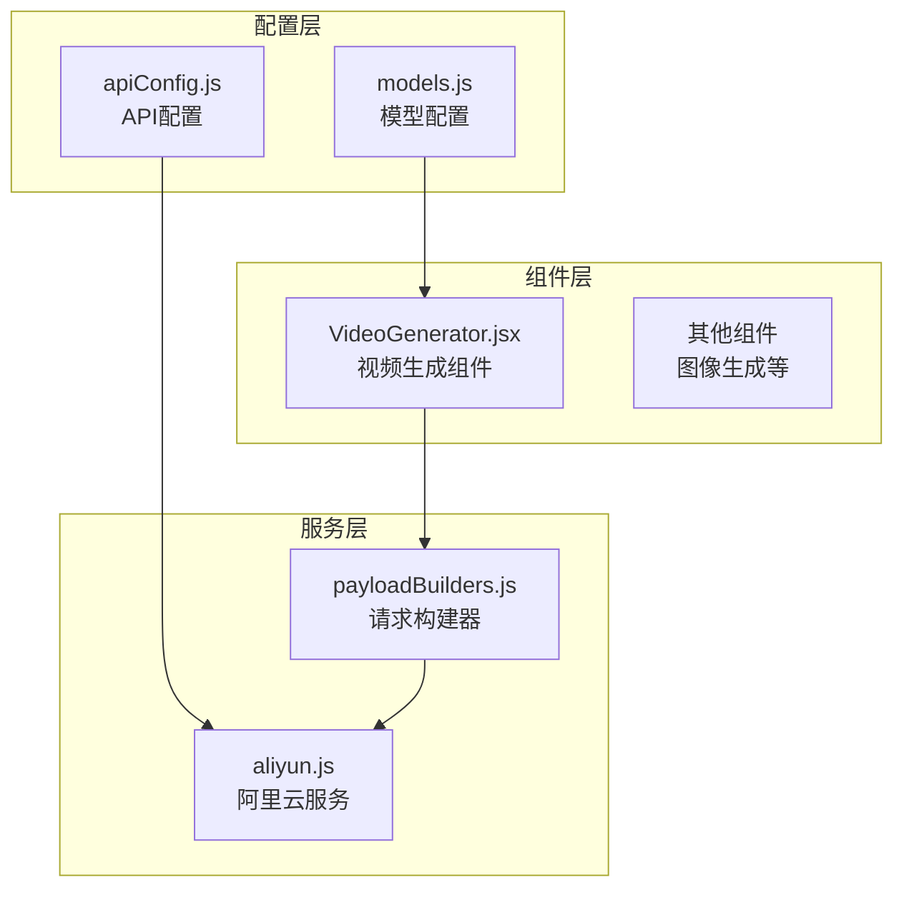
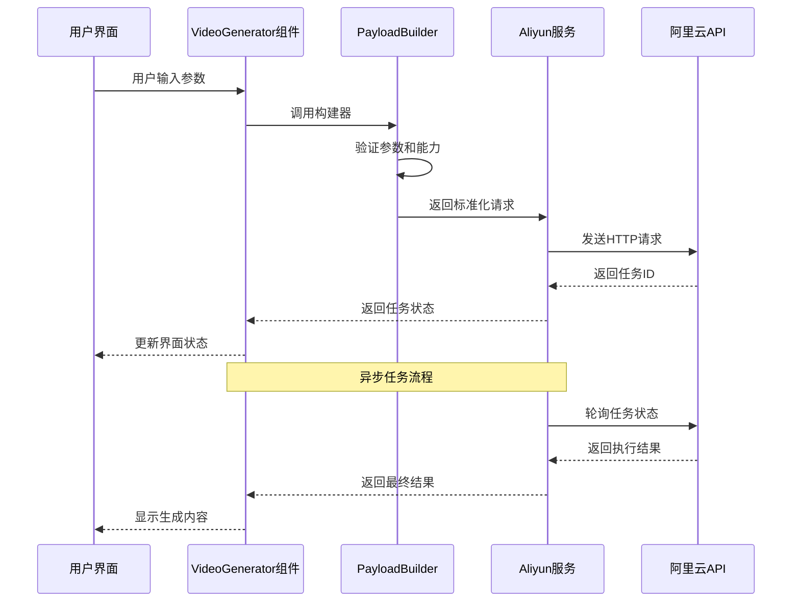
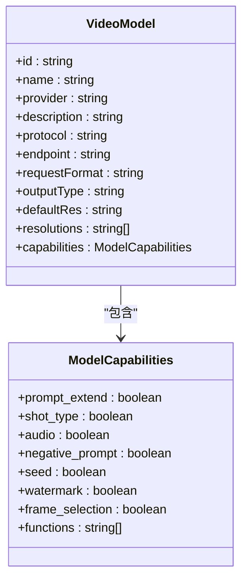
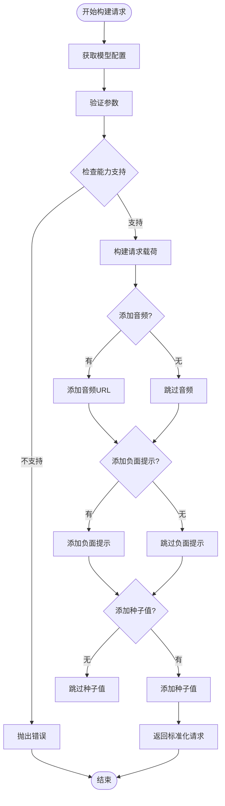
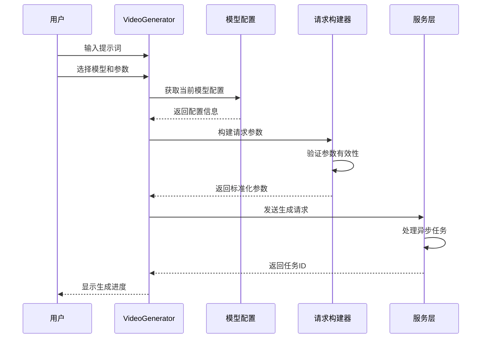
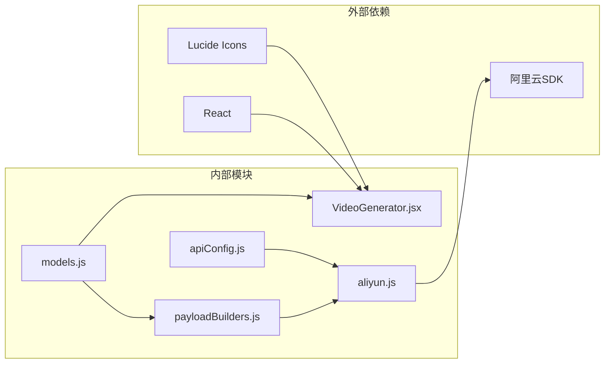

# 视频生成模型配置

<cite>
**本文档引用的文件**
- [models.js](file://src/config/models.js)
- [VideoGenerator.jsx](file://src/components/VideoGenerator.jsx)
- [payloadBuilders.js](file://src/services/payloadBuilders.js)
- [aliyun.js](file://src/services/aliyun.js)
- [apiConfig.js](file://src/config/apiConfig.js)
</cite>

## 目录
1. [简介](#简介)
2. [项目结构](#项目结构)
3. [核心组件](#核心组件)
4. [架构概览](#架构概览)
5. [详细组件分析](#详细组件分析)
6. [依赖关系分析](#依赖关系分析)
7. [性能考虑](#性能考虑)
8. [故障排除指南](#故障排除指南)
9. [结论](#结论)
10. [附录](#附录)

## 简介

本文档深入解析通义万相前端应用的视频生成模型配置系统，重点阐述VIDEO_MODELS数组中定义的视频生成模型配置。该系统采用配置驱动的设计模式，通过统一的模型配置、请求构建器和服务层实现，为用户提供灵活且高性能的视频生成体验。

系统支持多个版本的视频生成模型，包括万相2.6（Pro）、万相2.5（Preview）、万相2.2（Plus）、万相2.1（Turbo）和万相2.1（Plus）等不同版本，每个版本都有其独特的性能特点、功能特性和适用场景。

## 项目结构

项目采用模块化的架构设计，主要包含以下核心模块：

**图表来源**
- [models.js](file://src/config/models.js#L1-L135)
- [VideoGenerator.jsx](file://src/components/VideoGenerator.jsx#L1-L354)
- [payloadBuilders.js](file://src/services/payloadBuilders.js#L1-L829)
- [aliyun.js](file://src/services/aliyun.js#L1-L215)

**章节来源**
- [models.js](file://src/config/models.js#L1-L135)
- [VideoGenerator.jsx](file://src/components/VideoGenerator.jsx#L1-L354)

## 核心组件

### 模型配置系统

系统采用统一的模型配置管理，通过VIDEO_MODELS数组定义所有视频生成模型的配置信息。每个模型配置包含以下关键属性：

- **标识符系统**: 使用标准化的id命名规则，便于版本管理和用户识别
- **协议支持**: 通过PROTOCOLS常量定义不同的通信协议
- **输出类型**: 统一的OUTPUT_TYPES枚举管理输出格式
- **能力映射**: capabilities对象精确描述模型的功能特性

### 请求构建器模式

系统采用策略模式实现请求构建器，每个模型格式对应专门的构建器函数，确保：
- 配置驱动的扩展性
- 类型安全的参数验证
- 标准化的请求格式

### 服务层抽象

aliyun.js提供统一的服务接口，封装了：
- 异步/同步任务管理
- 超时控制机制
- 错误处理和重试逻辑
- 任务状态轮询

**章节来源**
- [models.js](file://src/config/models.js#L1-L135)
- [payloadBuilders.js](file://src/services/payloadBuilders.js#L1-L829)
- [aliyun.js](file://src/services/aliyun.js#L1-L215)

## 架构概览

系统采用分层架构设计，实现了配置、业务逻辑和服务层的有效分离：

**图表来源**
- [VideoGenerator.jsx](file://src/components/VideoGenerator.jsx#L74-L115)
- [payloadBuilders.js](file://src/services/payloadBuilders.js#L515-L571)
- [aliyun.js](file://src/services/aliyun.js#L50-L160)

## 详细组件分析

### VIDEO_MODELS配置详解

#### 万相2.6 (Pro) - wan2.6-t2v

作为最新版本的专业级模型，具备以下特性：

| 配置参数 | 值 | 说明 |
|---------|-----|------|
| id | wan2.6-t2v | 模型唯一标识符 |
| name | 万相2.6 (Pro) | 用户可见名称 |
| provider | 阿里通义实验室 | 提供方 |
| description | 2.6代专业版，支持多镜头叙事与音频驱动 | 功能描述 |
| protocol | ASYNC_VIDEO | 异步视频生成协议 |
| endpoint | /services/aigc/video-generation/video-synthesis | API端点 |
| requestFormat | videoGeneration | 请求格式 |
| outputType | VIDEO | 输出类型 |
| defaultRes | 1080P | 默认分辨率 |
| resolutions | ['720P', '1080P'] | 支持的分辨率列表 |
| capabilities | 丰富的功能集合 | 能力映射 |

**核心功能特性**:
- 多镜头叙事支持
- 音频驱动生成
- 智能提示词扩展
- 种子值控制
- 负面提示词
- 水印功能

#### 万相2.5 (Preview) - wan2.5-t2v-preview

预览版本，平衡功能与性能：

| 配置参数 | 值 | 说明 |
|---------|-----|------|
| id | wan2.5-t2v-preview | 模型标识符 |
| name | 万相2.5 (Preview) | 名称 |
| defaultRes | 1080P | 默认分辨率 |
| resolutions | ['480P', '720P', '1080P'] | 分辨率支持 |
| capabilities | 音频驱动、提示词扩展等 | 功能特性 |

**功能对比**:
- 支持更广泛的分辨率选项
- 音频驱动能力
- 负面提示词支持
- 种子值控制

#### 万相2.2 (Plus) - wan2.2-t2v-plus

稳定性增强版本：

| 配置参数 | 值 | 说明 |
|---------|-----|------|
| id | wan2.2-t2v-plus | 模型标识符 |
| name | 万相2.2 (Plus) | 名称 |
| description | 较2.1模型稳定性与成功率全面提升 | 性能改进 |
| defaultRes | 1080P | 默认分辨率 |
| capabilities | 无音频驱动 | 功能限制 |

**性能优化**:
- 稳定性显著提升
- 成功率提高
- 适中的性能表现

#### 万相2.1 (Turbo) - wanx2.1-t2v-turbo

极速版本，专注于速度优化：

| 配置参数 | 值 | 说明 |
|---------|-----|------|
| id | wanx2.1-t2v-turbo | 模型标识符 |
| name | 万相2.1 (Turbo) | 名称 |
| description | 较2.1模型速度提升50% | 性能改进 |
| defaultRes | 720P | 默认分辨率 |
| capabilities | 无音频驱动 | 功能限制 |

**速度优化特性**:
- 50%的速度提升
- 适中的分辨率支持
- 简化的功能集

#### 万相2.1 (Plus) - wanx2.1-t2v-plus

专业稳定版本：

| 配置参数 | 值 | 说明 |
|---------|-----|------|
| id | wanx2.1-t2v-plus | 模型标识符 |
| name | 万相2.1 (Plus) | 名称 |
| description | 稳定性与成功率全面提升 | 性能改进 |
| defaultRes | 720P | 默认分辨率 |
| capabilities | 无音频驱动 | 功能限制 |

**平衡特性**:
- 稳定性与性能的平衡
- 专业的使用体验
- 合理的资源消耗

### 能力映射系统

每个模型通过capabilities对象精确描述支持的功能：

**图表来源**
- [models.js](file://src/config/models.js#L52-L59)
- [models.js](file://src/config/models.js#L72-L79)

**章节来源**
- [models.js](file://src/config/models.js#L40-L135)

### 请求构建流程

系统通过payloadBuilders.js实现标准化的请求构建：

**图表来源**
- [payloadBuilders.js](file://src/services/payloadBuilders.js#L515-L571)

**章节来源**
- [payloadBuilders.js](file://src/services/payloadBuilders.js#L515-L571)

### 组件交互流程

VideoGenerator.jsx组件负责用户界面与后端服务的交互：

**图表来源**
- [VideoGenerator.jsx](file://src/components/VideoGenerator.jsx#L74-L115)
- [VideoGenerator.jsx](file://src/components/VideoGenerator.jsx#L1-L354)

**章节来源**
- [VideoGenerator.jsx](file://src/components/VideoGenerator.jsx#L1-L354)

## 依赖关系分析

系统采用松耦合的设计，各组件之间的依赖关系清晰明确：

**图表来源**
- [VideoGenerator.jsx](file://src/components/VideoGenerator.jsx#L1-L5)
- [models.js](file://src/config/models.js#L1-L1012)
- [payloadBuilders.js](file://src/services/payloadBuilders.js#L1-L829)
- [aliyun.js](file://src/services/aliyun.js#L1-L215)
- [apiConfig.js](file://src/config/apiConfig.js#L1-L35)

### 关键依赖关系

1. **配置驱动**: 所有业务逻辑都由models.js中的配置决定
2. **策略模式**: payloadBuilders.js实现请求构建策略
3. **服务抽象**: aliyun.js提供统一的服务接口
4. **类型安全**: 通过capabilities映射确保参数有效性

**章节来源**
- [models.js](file://src/config/models.js#L1-L1012)
- [payloadBuilders.js](file://src/services/payloadBuilders.js#L1-L829)
- [aliyun.js](file://src/services/aliyun.js#L1-L215)

## 性能考虑

### 模型性能对比

| 模型版本 | 生成速度 | 稳定性 | 功能丰富度 | 适用场景 |
|---------|---------|--------|------------|----------|
| 万相2.6 Pro | 中等 | 高 | 最丰富 | 专业创作、高质量需求 |
| 万相2.5 Preview | 中等 | 中等 | 丰富 | 快速原型、功能验证 |
| 万相2.2 Plus | 高 | 最高 | 中等 | 生产环境、稳定性优先 |
| 万相2.1 Turbo | 最高 | 中等 | 最少 | 速度优先、实时应用 |
| 万相2.1 Plus | 高 | 高 | 中等 | 平衡方案、一般应用 |

### 性能优化策略

1. **异步处理**: 所有视频生成任务采用异步模式
2. **超时控制**: 配置合理的请求和轮询超时时间
3. **缓存策略**: 利用capabilities映射避免重复计算
4. **资源管理**: 合理的并发控制和内存管理

## 故障排除指南

### 常见问题及解决方案

#### 模型配置错误

**问题**: "未知模型: wan2.6-t2v"
**原因**: 模型ID不在配置列表中
**解决**: 检查models.js中的VIDEO_MODELS配置

#### 参数验证失败

**问题**: "音频处理错误: 参数无效"
**原因**: 音频文件格式不支持或URL无效
**解决**: 确认音频文件类型为mp3或wav，或提供有效的URL

#### API调用超时

**问题**: "请求超时：请求花费时间过长"
**原因**: 网络延迟或服务器负载过高
**解决**: 检查网络连接，适当增加超时时间

#### 任务状态异常

**问题**: "异步任务未返回 task_id"
**原因**: 服务器响应格式异常
**解决**: 检查API端点配置和服务器状态

**章节来源**
- [aliyun.js](file://src/services/aliyun.js#L146-L160)
- [VideoGenerator.jsx](file://src/components/VideoGenerator.jsx#L47-L62)

## 结论

通义万相前端应用的视频生成模型配置系统展现了现代前端架构的最佳实践。通过配置驱动的设计、策略模式的应用和统一的服务抽象，系统实现了高度的可扩展性和维护性。

该系统的主要优势包括：
- **配置驱动**: 通过models.js集中管理所有模型配置
- **类型安全**: 通过capabilities映射确保参数有效性
- **扩展性强**: 新模型只需添加配置即可支持
- **性能优化**: 异步处理和超时控制机制
- **用户体验**: 直观的界面和丰富的功能选项

对于开发者而言，理解这套配置系统的架构设计和实现原理，有助于更好地扩展和维护视频生成功能。

## 附录

### 最佳实践指南

1. **模型选择建议**:
   - 专业创作：优先选择万相2.6 Pro
   - 生产环境：推荐万相2.2 Plus
   - 实时应用：考虑万相2.1 Turbo

2. **参数配置建议**:
   - 合理设置分辨率，平衡质量和性能
   - 适当使用负面提示词提高生成质量
   - 利用种子值实现结果的可重现性

3. **扩展开发指南**:
   - 在models.js中添加新的模型配置
   - 实现对应的请求构建器函数
   - 在VideoGenerator.jsx中更新UI组件
   - 测试异步任务的状态处理

4. **性能优化建议**:
   - 合理设置超时时间和重试策略
   - 实现任务队列管理避免过度并发
   - 添加本地缓存减少重复请求
   - 优化图片上传和处理流程