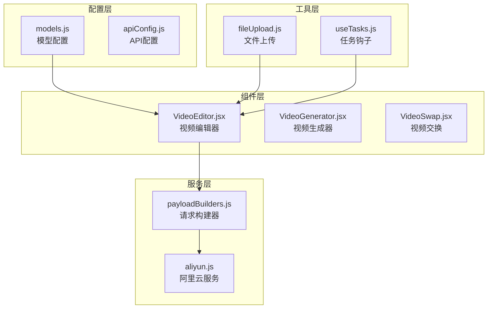
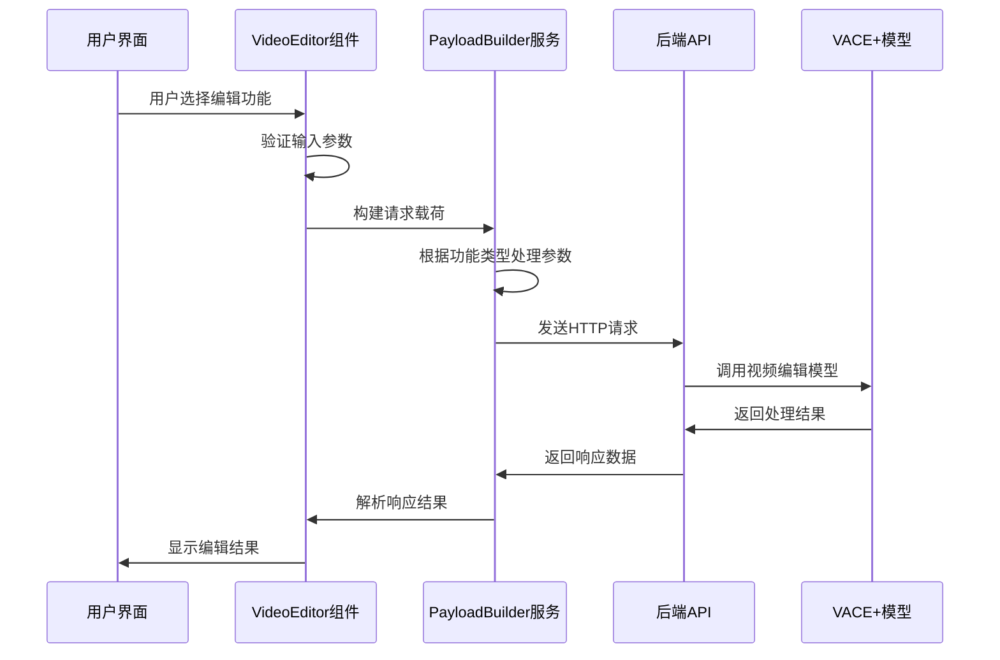
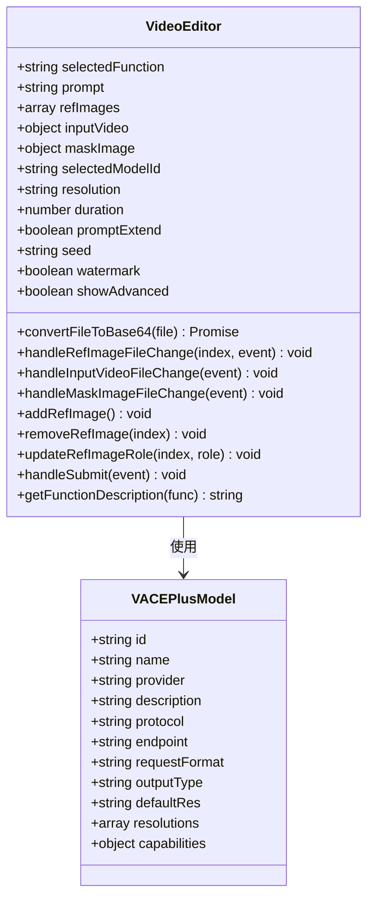
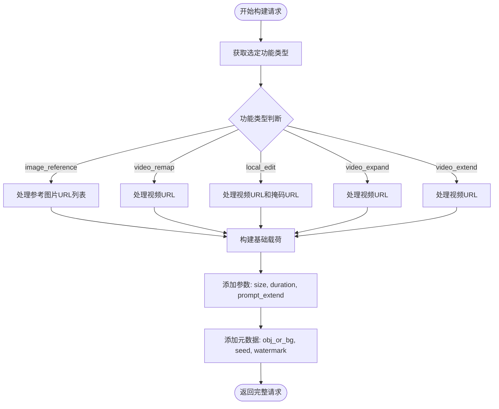
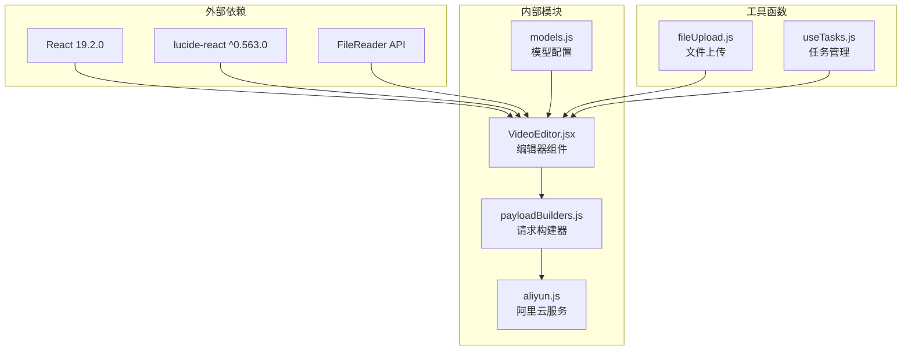

# 视频编辑统一模型配置

<cite>
**本文档引用的文件**
- [models.js](file://src/config/models.js)
- [VideoEditor.jsx](file://src/components/VideoEditor.jsx)
- [payloadBuilders.js](file://src/services/payloadBuilders.js)
- [package.json](file://package.json)
</cite>

## 目录
1. [简介](#简介)
2. [项目结构](#项目结构)
3. [核心组件](#核心组件)
4. [架构概览](#架构概览)
5. [详细组件分析](#详细组件分析)
6. [依赖关系分析](#依赖关系分析)
7. [性能考虑](#性能考虑)
8. [故障排除指南](#故障排除指南)
9. [结论](#结论)
10. [附录](#附录)

## 简介

本文档深入解析通义万相前端应用中的视频编辑统一模型配置，重点阐述VACE_PLUS_MODELS数组中定义的万相2.1（VACE+编辑）视频编辑统一模型。该模型作为通义万相的核心能力之一，提供了强大的视频编辑功能，包括多图参考、视频重绘、局部编辑、视频延展和画面扩展等五种编辑功能。

该统一模型旨在解决传统视频编辑工具的局限性，通过单一接口支持多种复杂的视频编辑操作，为用户提供更加便捷和高效的视频创作体验。模型配置涵盖了完整的功能参数、支持的操作类型以及详细的使用场景说明。

## 项目结构

通义万相前端应用采用模块化的项目结构，视频编辑功能主要分布在以下关键目录中：

**图表来源**
- [models.js](file://src/config/models.js#L1-L1012)
- [VideoEditor.jsx](file://src/components/VideoEditor.jsx#L1-L532)
- [payloadBuilders.js](file://src/services/payloadBuilders.js#L667-L829)

**章节来源**
- [models.js](file://src/config/models.js#L1-L1012)
- [VideoEditor.jsx](file://src/components/VideoEditor.jsx#L1-L532)
- [package.json](file://package.json#L1-L33)

## 核心组件

### VACE Plus 模型配置

VACE Plus（Video AI Creation Engine Plus）是通义万相的视频编辑统一模型，其核心配置定义如下：

| 配置项 | 值 | 描述 |
|--------|-----|------|
| 模型ID | `wanx2.1-vace-plus` | 唯一标识符 |
| 模型名称 | `万相2.1 (VACE+编辑)` | 用户可见名称 |
| 提供商 | 阿里通义实验室 | 技术提供方 |
| 协议 | `async_vace_plus` | 异步视频编辑协议 |
| 端点 | `/services/aigc/video-generation/video-synthesis` | API服务地址 |
| 请求格式 | `videoEditing` | 请求数据格式 |
| 输出类型 | `video` | 结果输出类型 |

### 支持的编辑功能

VACE Plus模型支持以下五种核心编辑功能：

1. **多图参考** (`image_reference`)
2. **视频重绘** (`video_remap`) 
3. **局部编辑** (`local_edit`)
4. **视频延展** (`video_extend`)
5. **画面扩展** (`video_expand`)

**章节来源**
- [models.js](file://src/config/models.js#L241-L262)

## 架构概览

视频编辑统一模型的系统架构采用分层设计，确保了功能的模块化和可扩展性：

**图表来源**
- [VideoEditor.jsx](file://src/components/VideoEditor.jsx#L120-L187)
- [payloadBuilders.js](file://src/services/payloadBuilders.js#L667-L709)

## 详细组件分析

### VideoEditor 组件分析

VideoEditor组件是视频编辑功能的核心界面组件，负责用户交互和参数收集：

#### 组件状态管理

**图表来源**
- [VideoEditor.jsx](file://src/components/VideoEditor.jsx#L5-L532)
- [models.js](file://src/config/models.js#L241-L262)

#### 功能选择机制

组件通过`selectedFunction`状态变量控制不同的编辑模式：

| 功能类型 | 参数要求 | 文件上传需求 | 掩码图像需求 |
|----------|----------|-------------|-------------|
| 多图参考 | 1-3张参考图 | ✅ 必需 | ❌ 不需要 |
| 视频重绘 | 输入视频 | ✅ 必需 | ❌ 不需要 |
| 局部编辑 | 输入视频 + 掩码图 | ✅ 必需 | ✅ 必需 |
| 画面扩展 | 输入视频 | ✅ 必需 | ❌ 不需要 |
| 视频延展 | 输入视频 | ✅ 必需 | ❌ 不需要 |

**章节来源**
- [VideoEditor.jsx](file://src/components/VideoEditor.jsx#L147-L173)

### PayloadBuilder 分析

PayloadBuilder服务负责将组件状态转换为API请求格式：

**图表来源**
- [payloadBuilders.js](file://src/services/payloadBuilders.js#L667-L709)

**章节来源**
- [payloadBuilders.js](file://src/services/payloadBuilders.js#L667-L709)

### VACE Plus 模型配置详解

#### 基础配置参数

| 参数 | 类型 | 默认值 | 描述 |
|------|------|--------|------|
| `id` | string | `wanx2.1-vace-plus` | 模型唯一标识符 |
| `name` | string | `万相2.1 (VACE+编辑)` | 模型显示名称 |
| `provider` | string | `阿里通义实验室` | 技术提供方 |
| `protocol` | string | `async_vace_plus` | 通信协议类型 |
| `endpoint` | string | `/services/aigc/video-generation/video-synthesis` | API服务端点 |
| `requestFormat` | string | `videoEditing` | 请求数据格式 |
| `outputType` | string | `video` | 输出数据类型 |

#### 分辨率配置

VACE Plus模型支持多种分辨率选项：

| 分辨率代码 | 实际尺寸 | 显示标签 |
|------------|----------|----------|
| `1280*720` | 1280×720 | 1280*720 (16:9) |
| `720*1280` | 720×1280 | 720*1280 (9:16) |
| `960*960` | 960×960 | 960*960 (1:1) |
| `832*1088` | 832×1088 | 832*1088 (3:4) |
| `1088*832` | 1088×832 | 1088*832 (4:3) |

#### 能力配置

模型具备以下核心能力：

| 能力项 | 类型 | 描述 |
|--------|------|------|
| `prompt_extend` | boolean | 智能提示词改写 |
| `obj_or_bg` | boolean | 主体/背景角色标注 |
| `seed` | boolean | 随机种子控制 |
| `watermark` | boolean | 水印添加 |
| `functions` | array | 支持的功能列表 |

**章节来源**
- [models.js](file://src/config/models.js#L241-L262)

## 依赖关系分析

视频编辑统一模型的依赖关系体现了清晰的分层架构：

**图表来源**
- [package.json](file://package.json#L12-L31)
- [VideoEditor.jsx](file://src/components/VideoEditor.jsx#L1-L5)
- [payloadBuilders.js](file://src/services/payloadBuilders.js#L804-L829)

**章节来源**
- [package.json](file://package.json#L12-L31)

## 性能考虑

### 内存优化策略

1. **文件处理优化**
   - 使用Base64编码进行临时存储
   - 及时清理预览URL对象
   - 限制同时上传的文件数量

2. **渲染性能优化**
   - 条件渲染不同功能的UI元素
   - 使用React状态管理减少不必要的重渲染
   - 优化文件选择器的事件处理

3. **网络传输优化**
   - 支持断点续传机制
   - 压缩上传的媒体文件
   - 实现请求队列管理

### 并发处理

组件支持多文件并发处理，但建议：
- 同时处理的文件数量不超过3个
- 大文件上传时提供进度反馈
- 实现错误重试机制

## 故障排除指南

### 常见问题及解决方案

#### 1. 功能选择验证失败

**问题症状**: 点击开始编辑按钮无响应

**可能原因**:
- 缺少必要的输入参数
- 文件类型不匹配
- 网络连接异常

**解决方案**:
- 检查所选功能对应的必需文件是否已上传
- 确认文件格式符合要求（图片: jpg/png/gif；视频: mp4/mov）
- 验证网络连接状态

#### 2. 编辑结果不符合预期

**问题症状**: 生成的视频质量不佳或内容不符

**可能原因**:
- 提示词描述不够清晰
- 参考图片质量过低
- 分辨率设置不当

**解决方案**:
- 优化提示词的描述性和具体性
- 使用高质量的参考图片
- 根据需求调整分辨率设置

#### 3. 性能问题

**问题症状**: 页面加载缓慢或操作卡顿

**可能原因**:
- 浏览器缓存不足
- 文件过大导致处理时间长
- 同时进行多个大文件操作

**解决方案**:
- 清理浏览器缓存
- 适当压缩文件大小
- 分批处理多个文件

**章节来源**
- [VideoEditor.jsx](file://src/components/VideoEditor.jsx#L120-L187)

## 结论

通义万相的视频编辑统一模型配置展现了现代AI视频编辑技术的发展趋势。通过VACE Plus模型，用户可以以统一的接口实现多种复杂的视频编辑功能，大大简化了视频创作流程。

该配置方案的主要优势包括：

1. **功能完整性**: 支持从基础到高级的全方位视频编辑需求
2. **用户体验**: 直观的界面设计和灵活的参数配置
3. **技术先进性**: 基于最新的AI技术，提供高质量的编辑效果
4. **扩展性强**: 模块化的架构便于功能扩展和技术升级

随着AI技术的不断发展，视频编辑统一模型将继续演进，为用户提供更加智能化和个性化的视频创作体验。

## 附录

### 最佳实践指南

#### 1. 参数配置最佳实践

- **提示词优化**: 使用具体、详细的描述，避免模糊表达
- **分辨率选择**: 根据最终用途选择合适的分辨率
- **时长设置**: 一般建议5-10秒，复杂场景可适当延长
- **随机种子**: 需要可复现结果时设置固定种子值

#### 2. 功能使用场景

- **多图参考**: 适合需要融合多个视觉元素的场景
- **视频重绘**: 适合完全重新创作视频内容
- **局部编辑**: 适合精确修改视频特定区域
- **视频延展**: 适合延长现有视频内容
- **画面扩展**: 适合扩大视频可视范围

#### 3. 性能优化建议

- 合理控制同时进行的编辑任务数量
- 使用高质量的输入素材
- 根据网络状况选择合适的分辨率
- 定期清理浏览器缓存