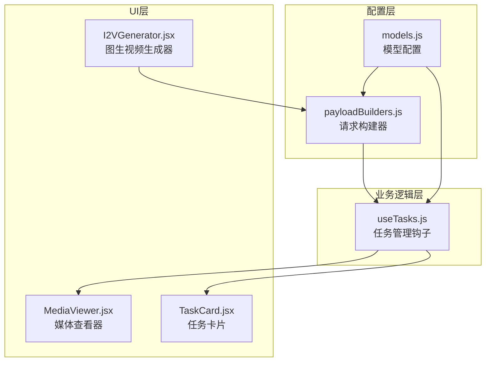
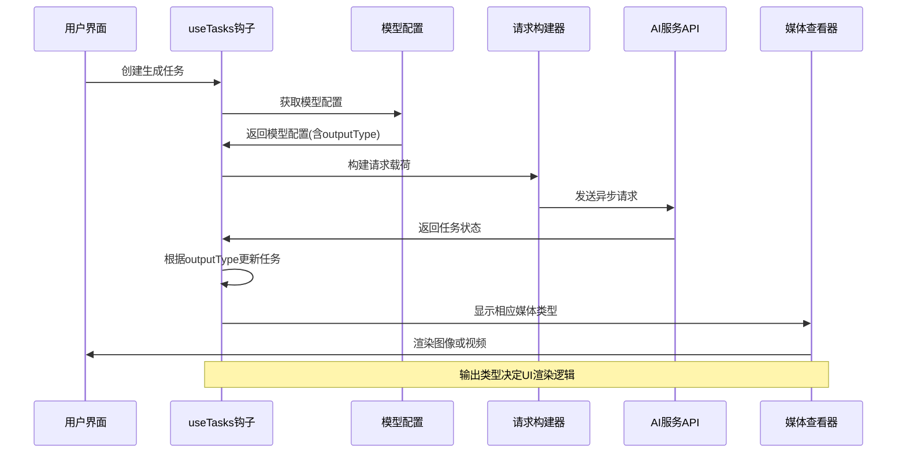
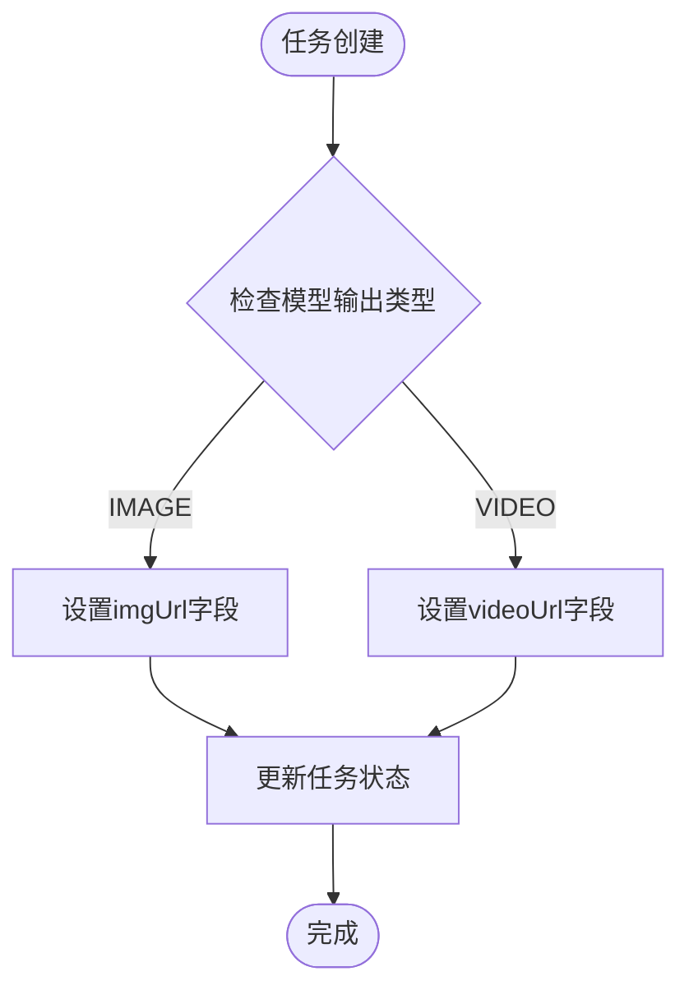
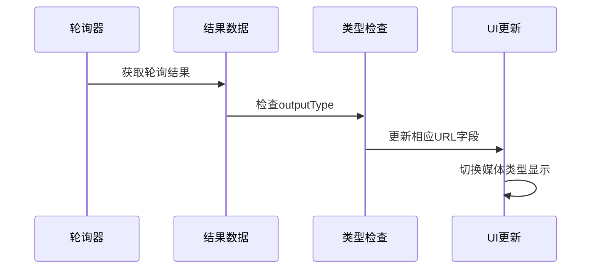
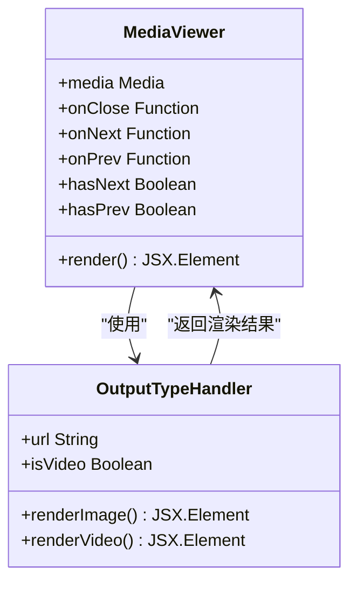
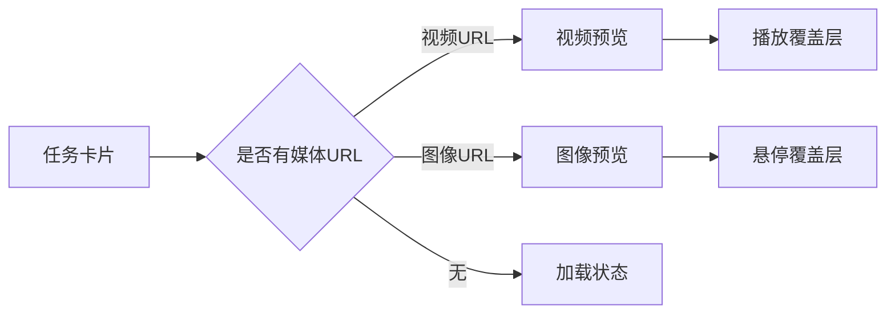
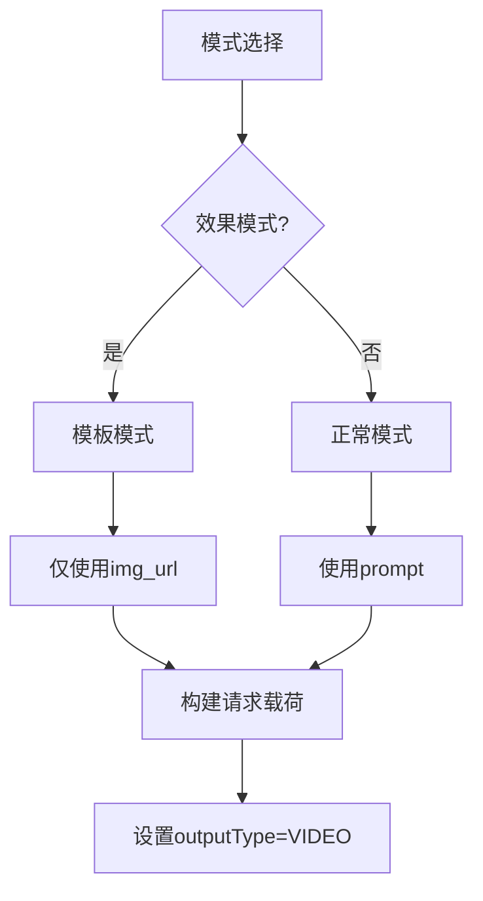
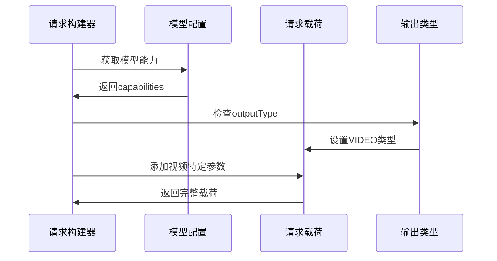
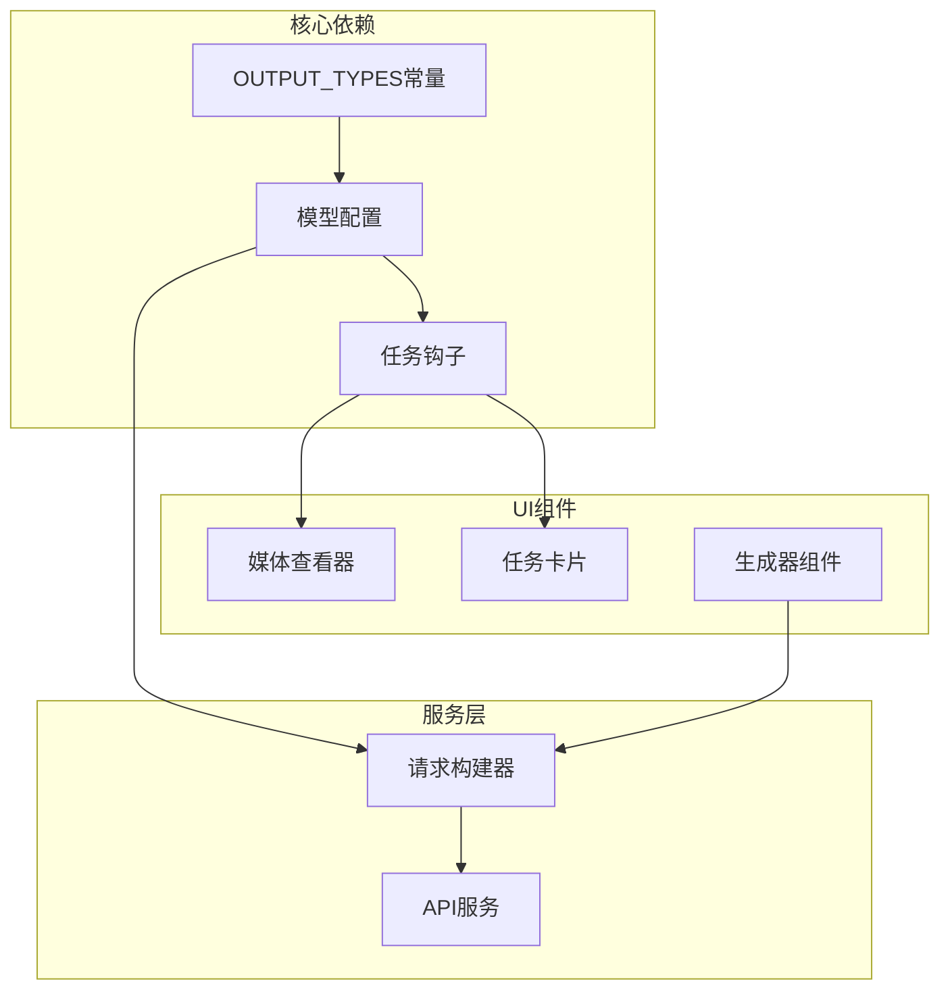

# 输出类型定义

<cite>
**本文档引用的文件**
- [models.js](file://src/config/models.js)
- [useTasks.js](file://src/hooks/useTasks.js)
- [MediaViewer.jsx](file://src/components/MediaViewer.jsx)
- [TaskCard.jsx](file://src/components/TaskCard.jsx)
- [I2VGenerator.jsx](file://src/components/I2VGenerator.jsx)
- [payloadBuilders.js](file://src/services/payloadBuilders.js)
</cite>

## 目录
1. [简介](#简介)
2. [项目结构](#项目结构)
3. [核心组件](#核心组件)
4. [架构概览](#架构概览)
5. [详细组件分析](#详细组件分析)
6. [依赖分析](#依赖分析)
7. [性能考虑](#性能考虑)
8. [故障排除指南](#故障排除指南)
9. [结论](#结论)
10. [附录](#附录)

## 简介
本文件深入解析通义万相前端应用的输出类型系统，重点阐述OUTPUT_TYPES常量对象中定义的图像和视频输出类型。该系统是整个AI生成工作流的核心配置，决定了任务处理流程、UI渲染逻辑和结果展示方式。本文档将详细说明：
- OUTPUT_TYPES常量的设计理念和应用场景
- 输出类型在模型配置中的作用机制
- 输出类型与不同AI模型的对应关系
- 实际开发中如何根据输出类型进行处理和优化
- 输出类型配置的最佳实践和扩展指南

## 项目结构
输出类型系统主要分布在以下关键文件中：



**图表来源**
- [models.js](file://src/config/models.js#L12-L16)
- [payloadBuilders.js](file://src/services/payloadBuilders.js#L532-L640)
- [useTasks.js](file://src/hooks/useTasks.js#L181-L332)

**章节来源**
- [models.js](file://src/config/models.js#L1-L1012)

## 核心组件
OUTPUT_TYPES常量对象定义了两种基本输出类型：

### OUTPUT_TYPES常量定义
```javascript
export const OUTPUT_TYPES = {
    IMAGE: 'image',
    VIDEO: 'video'
};
```

### 设计理念
- **统一抽象**: 将图像和视频输出抽象为统一的类型标识
- **可扩展性**: 为未来新增输出类型预留空间
- **一致性**: 在所有模型配置中保持一致的类型标识

### 应用场景
- **任务路由**: 根据输出类型决定任务处理路径
- **UI渲染**: 控制界面元素的显示和交互
- **结果处理**: 决定最终结果的存储和展示方式

**章节来源**
- [models.js](file://src/config/models.js#L12-L16)

## 架构概览
输出类型系统在整个应用架构中的位置和作用：



**图表来源**
- [useTasks.js](file://src/hooks/useTasks.js#L265-L312)
- [models.js](file://src/config/models.js#L48-L49)

## 详细组件分析

### 模型配置中的输出类型应用
在所有AI模型配置中，输出类型通过`outputType`字段明确指定：

#### 文本到图像模型配置示例
```javascript
{
    id: 'wan2.6-t2i',
    name: '万相2.6-T2I (文生图)',
    protocol: PROTOCOLS.ASYNC_T2I,
    endpoint: '/services/aigc/text2image/image-synthesis',
    requestFormat: 'text2image',
    outputType: OUTPUT_TYPES.IMAGE,
    defaultRes: '1280*1280',
    resolutions: ['1280*1280', '1104*1472', '1472*1104', '960*1696', '1696*960']
}
```

#### 视频生成模型配置示例
```javascript
{
    id: 'wan2.6-t2v',
    name: '万相2.6 (Pro)',
    protocol: PROTOCOLS.ASYNC_VIDEO,
    endpoint: '/services/aigc/video-generation/video-synthesis',
    requestFormat: 'videoGeneration',
    outputType: OUTPUT_TYPES.VIDEO,
    defaultRes: '1080P',
    resolutions: ['720P', '1080P']
}
```

**章节来源**
- [models.js](file://src/config/models.js#L40-L135)
- [models.js](file://src/config/models.js#L265-L478)

### 任务管理系统中的输出类型处理
任务管理系统根据输出类型动态调整UI行为：

#### 同步任务结果处理


**图表来源**
- [useTasks.js](file://src/hooks/useTasks.js#L291-L300)

#### 异步轮询结果处理


**图表来源**
- [useTasks.js](file://src/hooks/useTasks.js#L187-L203)

**章节来源**
- [useTasks.js](file://src/hooks/useTasks.js#L181-L332)

### 媒体查看器的输出类型适配
媒体查看器根据输出类型自动选择合适的渲染组件：



**图表来源**
- [MediaViewer.jsx](file://src/components/MediaViewer.jsx#L32-L33)

#### 输出类型判断逻辑
```javascript
const url = media.videoUrl || media.imgUrl;
const isVideo = !!media.videoUrl;
```

**章节来源**
- [MediaViewer.jsx](file://src/components/MediaViewer.jsx#L32-L33)

### 任务卡片的输出类型显示
任务卡片组件根据是否有媒体URL来决定显示内容：



**图表来源**
- [TaskCard.jsx](file://src/components/TaskCard.jsx#L48-L76)

**章节来源**
- [TaskCard.jsx](file://src/components/TaskCard.jsx#L9-L182)

### 图生视频生成器的输出类型集成
图生视频生成器在不同模式下处理输出类型：

#### 效果模式 vs 正常模式


**图表来源**
- [I2VGenerator.jsx](file://src/components/I2VGenerator.jsx#L132-L144)

**章节来源**
- [I2VGenerator.jsx](file://src/components/I2VGenerator.jsx#L109-L158)

### 请求构建器的输出类型处理
请求构建器根据模型配置和输出类型构建相应的请求载荷：

#### 视频生成请求构建


**图表来源**
- [payloadBuilders.js](file://src/services/payloadBuilders.js#L577-L640)

**章节来源**
- [payloadBuilders.js](file://src/services/payloadBuilders.js#L532-L640)

## 依赖分析
输出类型系统的关键依赖关系：



**图表来源**
- [models.js](file://src/config/models.js#L12-L16)
- [useTasks.js](file://src/hooks/useTasks.js#L294-L299)

**章节来源**
- [models.js](file://src/config/models.js#L1-L1012)
- [useTasks.js](file://src/hooks/useTasks.js#L181-L332)

## 性能考虑
基于输出类型系统的性能优化建议：

### 1. 条件渲染优化
- **延迟加载**: 根据输出类型动态导入相应的组件
- **虚拟滚动**: 大量媒体内容时使用虚拟滚动技术
- **懒加载策略**: 仅在需要时加载媒体资源

### 2. 缓存策略
- **类型缓存**: 缓存不同类型媒体的渲染配置
- **资源预加载**: 预加载可能需要的媒体资源
- **CDN优化**: 使用CDN加速不同类型媒体的传输

### 3. 内存管理
- **及时释放**: 任务完成后及时释放媒体资源
- **垃圾回收**: 定期清理不再使用的媒体对象
- **内存监控**: 监控不同类型媒体的内存占用

## 故障排除指南
常见输出类型相关问题及解决方案：

### 1. 输出类型不匹配问题
**症状**: 任务完成后UI显示错误的媒体类型
**原因**: 模型配置中的outputType与实际结果不符
**解决方案**: 
- 检查模型配置中的outputType设置
- 验证API返回结果的结构
- 确认轮询处理逻辑的正确性

### 2. 媒体资源加载失败
**症状**: 图像或视频无法正常显示
**原因**: URL失效或格式不支持
**解决方案**:
- 实现URL有效性检查
- 提供备用URL或降级方案
- 添加错误边界处理

### 3. UI渲染异常
**症状**: 响应式布局在不同媒体类型下表现异常
**解决方案**:
- 使用CSS Grid/Flexbox实现响应式布局
- 为不同媒体类型提供专门的样式类
- 实现媒体类型检测和样式切换

**章节来源**
- [MediaViewer.jsx](file://src/components/MediaViewer.jsx#L32-L33)
- [TaskCard.jsx](file://src/components/TaskCard.jsx#L48-L76)

## 结论
通义万相的输出类型系统通过简洁而强大的设计，实现了图像和视频输出类型的统一管理。该系统的关键优势包括：

1. **设计理念**: 通过OUTPUT_TYPES常量提供了清晰的抽象层次
2. **应用广泛**: 在模型配置、任务处理、UI渲染等多个层面发挥作用
3. **扩展性强**: 为未来的媒体类型扩展预留了充足的空间
4. **性能友好**: 通过条件渲染和懒加载等技术保证了良好的用户体验

该系统为AI生成应用的多媒体处理提供了坚实的基础，是整个前端架构的重要组成部分。

## 附录

### 输出类型最佳实践
1. **统一管理**: 所有媒体类型必须通过OUTPUT_TYPES常量进行定义
2. **类型安全**: 在编译时确保输出类型的正确性
3. **向后兼容**: 新增输出类型时保持现有接口的兼容性
4. **文档同步**: 更新相关文档以反映输出类型的变化

### 扩展指南
当需要添加新的输出类型时，建议遵循以下步骤：

1. **定义新类型**: 在OUTPUT_TYPES中添加新的类型常量
2. **更新模型配置**: 为相关模型设置正确的outputType
3. **实现UI适配**: 更新相关组件以支持新的媒体类型
4. **测试验证**: 确保新类型在所有场景下的正确性
5. **性能优化**: 考虑新类型的特殊需求进行性能优化