# 专用功能构建器

<cite>
**本文档引用的文件**
- [payloadBuilders.js](file://src/services/payloadBuilders.js)
- [models.js](file://src/config/models.js)
- [BackgroundGenerator.jsx](file://src/components/BackgroundGenerator.jsx)
- [AITryOn.jsx](file://src/components/AITryOn.jsx)
- [VideoEditor.jsx](file://src/components/VideoEditor.jsx)
- [DigitalHumanGenerator.jsx](file://src/components/DigitalHumanGenerator.jsx)
- [EmojiGenerator.jsx](file://src/components/EmojiGenerator.jsx)
- [VideoSwap.jsx](file://src/components/VideoSwap.jsx)
- [ImageMotion.jsx](file://src/components/ImageMotion.jsx)
- [ImageTranslator.jsx](file://src/components/ImageTranslator.jsx)
- [fileUpload.js](file://src/utils/fileUpload.js)
</cite>

## 目录
1. [简介](#简介)
2. [项目结构](#项目结构)
3. [核心组件](#核心组件)
4. [架构概览](#架构概览)
5. [详细组件分析](#详细组件分析)
6. [依赖关系分析](#依赖关系分析)
7. [性能考虑](#性能考虑)
8. [故障排除指南](#故障排除指南)
9. [结论](#结论)

## 简介

本文档深入解析了专用功能相关的负载构建器设计原理和实现细节。这些构建器负责将用户界面输入转换为标准化的API请求负载，支持虚拟模特、背景生成、AI试衣、文字艺术、视频编辑、数字人检测与生成、表情包视频、视频换人、图像运动传递和图像翻译等专用功能。

系统采用策略模式的负载构建器架构，每个构建器专门处理特定功能的请求格式，实现了高度模块化和可扩展性。通过统一的模型配置系统，构建器能够根据不同的AI模型能力动态调整请求参数。

## 项目结构

项目采用组件化架构，主要包含以下核心目录：

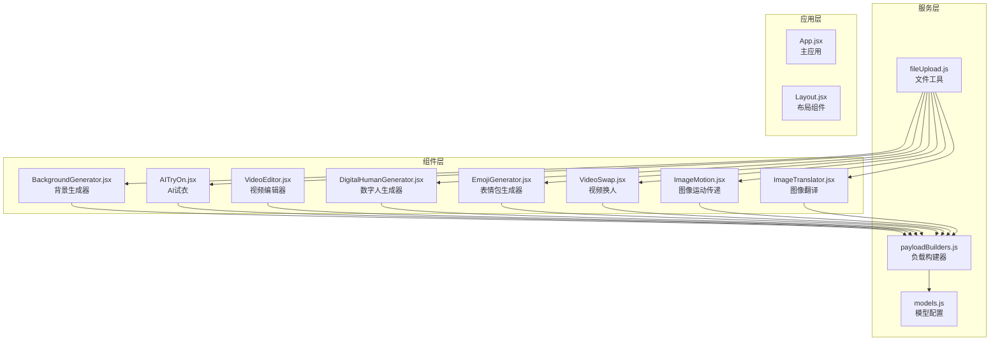

**图表来源**
- [payloadBuilders.js](file://src/services/payloadBuilders.js#L1-L829)
- [models.js](file://src/config/models.js#L1-L1012)

**章节来源**
- [payloadBuilders.js](file://src/services/payloadBuilders.js#L1-L829)
- [models.js](file://src/config/models.js#L1-L1012)

## 核心组件

### 负载构建器架构

系统的核心是策略模式的负载构建器，每个构建器负责特定功能的请求格式化：

```mermaid
classDiagram
class PayloadBuilder {
<<interface>>
+build(modelId, params, modelConfig) Payload
}
class VirtualModelBuilder {
+build(modelId, params, modelConfig) Payload
-validateInputs(params) void
-buildPayload(params) Payload
}
class BackgroundGenerationBuilder {
+build(modelId, params, modelConfig) Payload
-addReferenceSupport(params) void
-configureNoiseLevel(params) void
}
class AiTryonBuilder {
+build(modelId, params, modelConfig) Payload
-addGarmentSupport(params) void
-configureFaceRestoration(params) void
}
class WordartSemanticBuilder {
+build(modelId, params, modelConfig) Payload
-addFontSupport(params) void
-configureOutputFormat(params) void
}
class WordartTextureBuilder {
+build(modelId, params, modelConfig) Payload
-addImageSupport(params) void
-configureTextureStyles(params) void
}
class VideoEditingBuilder {
+build(modelId, params, modelConfig) Payload
-addFunctionSupport(params) void
-configureEditingModes(params) void
}
class DigitalHumanBuilder {
+build(modelId, params, modelConfig) Payload
-addDetectionSupport(params) void
-configureSpeechSupport(params) void
}
class EmojiVideoBuilder {
+build(modelId, params, modelConfig) Payload
-validateFaceCoordinates(params) void
-configureTemplateSupport(params) void
}
class VideoCharacterSwapBuilder {
+build(modelId, params, modelConfig) Payload
-addModeSupport(params) void
-configureResolution(params) void
}
class ImageMotionTransferBuilder {
+build(modelId, params, modelConfig) Payload
-addModeSupport(params) void
-configureResolution(params) void
}
class ImageTranslationBuilder {
+build(modelId, params, modelConfig) Payload
-addLanguageSupport(params) void
-configureTranslationOptions(params) void
}
PayloadBuilder <|.. VirtualModelBuilder
PayloadBuilder <|.. BackgroundGenerationBuilder
PayloadBuilder <|.. AiTryonBuilder
PayloadBuilder <|.. WordartSemanticBuilder
PayloadBuilder <|.. WordartTextureBuilder
PayloadBuilder <|.. VideoEditingBuilder
PayloadBuilder <|.. DigitalHumanBuilder
PayloadBuilder <|.. EmojiVideoBuilder
PayloadBuilder <|.. VideoCharacterSwapBuilder
PayloadBuilder <|.. ImageMotionTransferBuilder
PayloadBuilder <|.. ImageTranslationBuilder
```

**图表来源**
- [payloadBuilders.js](file://src/services/payloadBuilders.js#L347-L828)

### 模型配置系统

系统通过统一的模型配置管理所有AI模型的能力和端点：

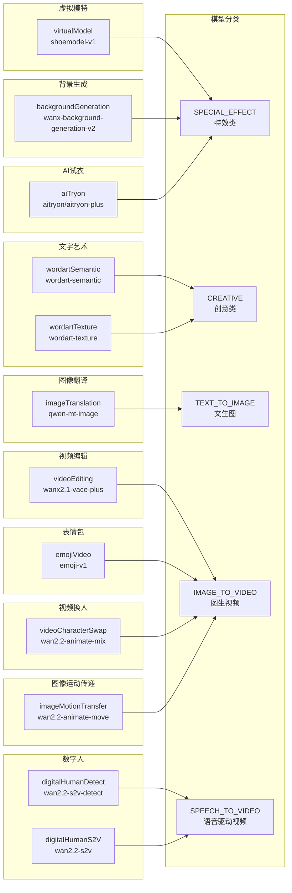

**图表来源**
- [models.js](file://src/config/models.js#L646-L904)

**章节来源**
- [payloadBuilders.js](file://src/services/payloadBuilders.js#L1-L829)
- [models.js](file://src/config/models.js#L1-L1012)

## 架构概览

系统采用分层架构，确保功能模块的独立性和可维护性：

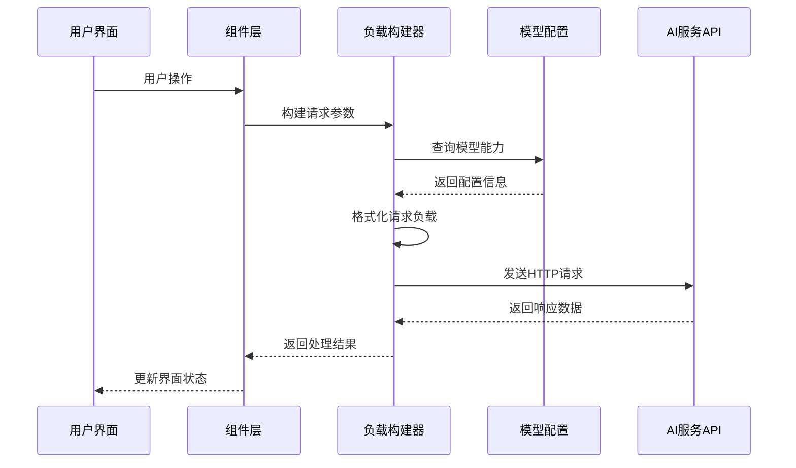

**图表来源**
- [payloadBuilders.js](file://src/services/payloadBuilders.js#L1-L829)
- [models.js](file://src/config/models.js#L1-L1012)

## 详细组件分析

### 虚拟模特构建器 (virtualModel)

虚拟模特构建器专门处理鞋靴模特功能，支持模板图像、鞋子图像和缩放参数的组合生成。

#### 设计原理

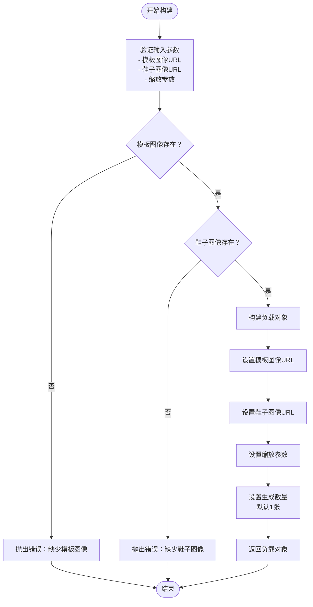

**图表来源**
- [payloadBuilders.js](file://src/services/payloadBuilders.js#L347-L363)

#### 实现细节

虚拟模特构建器的核心实现遵循以下设计原则：

1. **参数验证**: 确保模板图像和鞋子图像都是必需的输入
2. **灵活缩放**: 支持用户自定义缩放参数，实现精确的鞋靴布局控制
3. **批量生成**: 默认生成1张结果，支持通过参数调整生成数量
4. **错误处理**: 对缺失必需参数的情况抛出明确的错误信息

**章节来源**
- [payloadBuilders.js](file://src/services/payloadBuilders.js#L347-L363)
- [models.js](file://src/config/models.js#L646-L664)

### 背景生成构建器 (backgroundGeneration)

背景生成构建器支持多种引导方式的背景生成，包括参考图像、参考提示词和边缘元素引导。

#### 设计原理

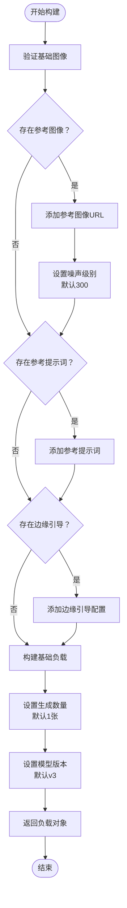

**图表来源**
- [payloadBuilders.js](file://src/services/payloadBuilders.js#L365-L398)

#### 实现细节

背景生成构建器支持以下高级功能：

1. **参考图像支持**: 当提供参考图像时自动启用噪声级别配置
2. **参考提示词权重**: 同时提供参考图像和提示词时自动计算权重
3. **边缘元素引导**: 支持前景和背景边缘的独立引导
4. **模型版本选择**: 支持v2和v3两个版本的模型选择

**章节来源**
- [payloadBuilders.js](file://src/services/payloadBuilders.js#L365-L398)
- [BackgroundGenerator.jsx](file://src/components/BackgroundGenerator.jsx#L1-L420)

### AI试衣构建器 (aiTryon)

AI试衣构建器实现虚拟试衣功能，支持人物图像、服装图像和面部修复选项的组合。

#### 设计原理

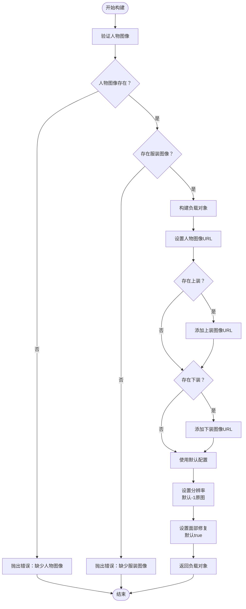

**图表来源**
- [payloadBuilders.js](file://src/services/payloadBuilders.js#L400-L425)

#### 实现细节

AI试衣构建器的关键特性：

1. **多服装支持**: 同时支持上装和下装的组合试穿
2. **分辨率控制**: 支持多种分辨率选项，包括原图保持
3. **面部修复**: 可选择保留原脸或生成新脸
4. **模型选择**: 支持基础版和Plus版的不同质量级别

**章节来源**
- [payloadBuilders.js](file://src/services/payloadBuilders.js#L400-L425)
- [AITryOn.jsx](file://src/components/AITryOn.jsx#L1-L251)

### 文字艺术构建器 (wordartSemantic & wordartTexture)

文字艺术构建器分为语义变形和纹理生成两个子系统，分别处理文字的几何变形和视觉效果。

#### 语义变形构建器 (wordartSemantic)

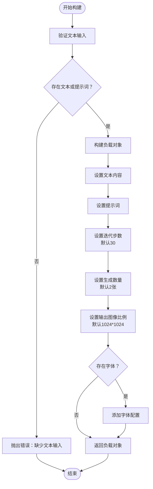

**图表来源**
- [payloadBuilders.js](file://src/services/payloadBuilders.js#L427-L454)

#### 纹理生成构建器 (wordartTexture)

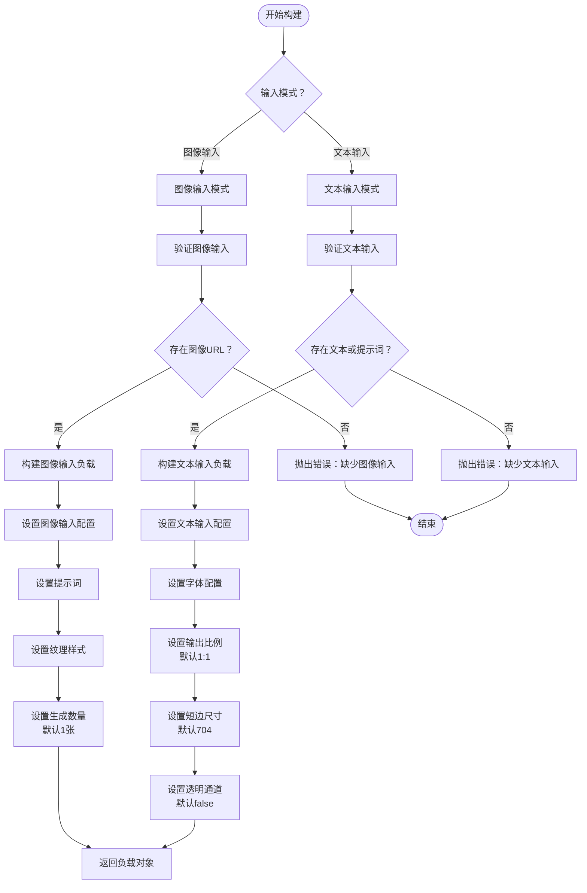

**图表来源**
- [payloadBuilders.js](file://src/services/payloadBuilders.js#L456-L509)

#### 实现细节

文字艺术构建器的特色功能：

1. **双模式支持**: 同时支持图像输入和文本输入两种模式
2. **字体系统**: 支持预设字体和自定义字体的混合使用
3. **纹理样式**: 提供材质、场景、光照等多种纹理风格
4. **透明通道**: 支持PNG格式的透明背景输出

**章节来源**
- [payloadBuilders.js](file://src/services/payloadBuilders.js#L427-L509)
- [models.js](file://src/config/models.js#L736-L787)

### 视频编辑构建器 (videoEditing)

视频编辑构建器支持多种编辑功能，包括多图参考、视频重绘、局部编辑、视频扩展和视频延展。

#### 设计原理

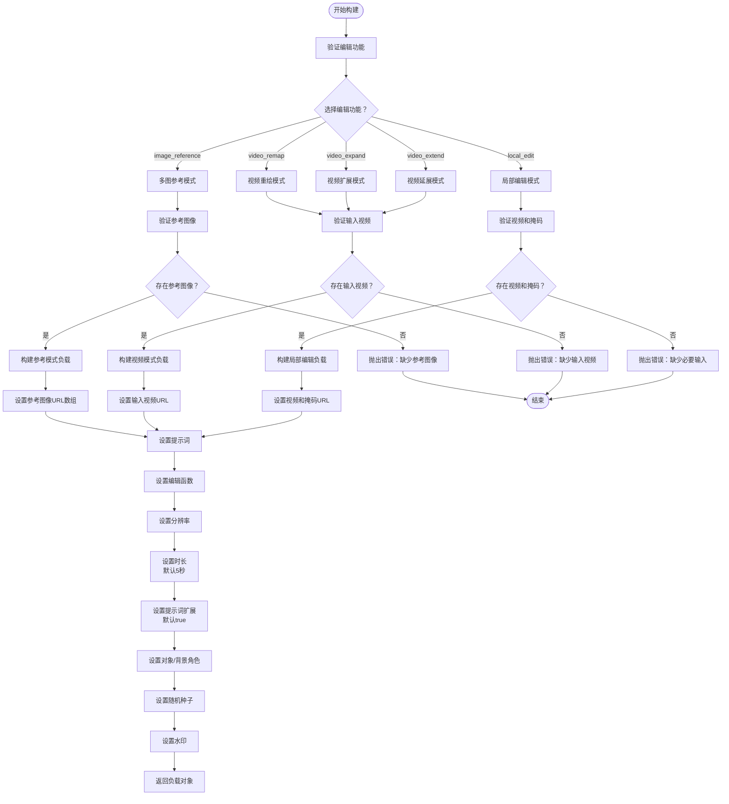

**图表来源**
- [payloadBuilders.js](file://src/services/payloadBuilders.js#L667-L709)

#### 实现细节

视频编辑构建器的功能矩阵：

1. **多函数支持**: 支持5种不同的编辑功能模式
2. **动态参数**: 根据选择的函数动态添加相应的参数
3. **角色标注**: 支持为参考图像标注主体或背景角色
4. **高级控制**: 提供随机种子、水印等高级参数控制

**章节来源**
- [payloadBuilders.js](file://src/services/payloadBuilders.js#L667-L709)
- [VideoEditor.jsx](file://src/components/VideoEditor.jsx#L1-L532)

### 数字人检测构建器 (digitalHumanDetect)

数字人检测构建器专门处理数字人图像的验证和检测功能。

#### 设计原理

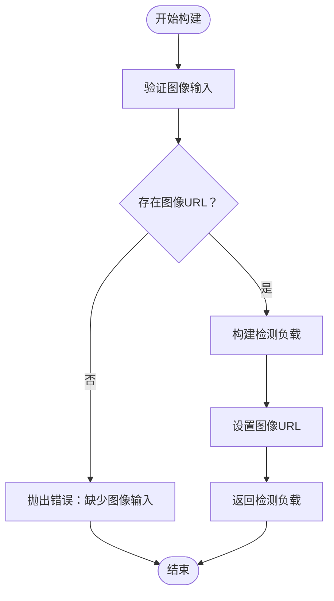

**图表来源**
- [payloadBuilders.js](file://src/services/payloadBuilders.js#L711-L723)

#### 实现细节

数字人检测构建器的特点：

1. **简单输入**: 仅需图像URL即可进行检测
2. **专用端点**: 使用专门的图像检测API端点
3. **验证功能**: 检查图像清晰度、单人检测、正面朝向等要求

**章节来源**
- [payloadBuilders.js](file://src/services/payloadBuilders.js#L711-L723)
- [DigitalHumanGenerator.jsx](file://src/components/DigitalHumanGenerator.jsx#L1-L313)

### 数字人S2V构建器 (digitalHumanS2V)

数字人S2V构建器支持基于语音驱动的数字人视频生成。

#### 设计原理

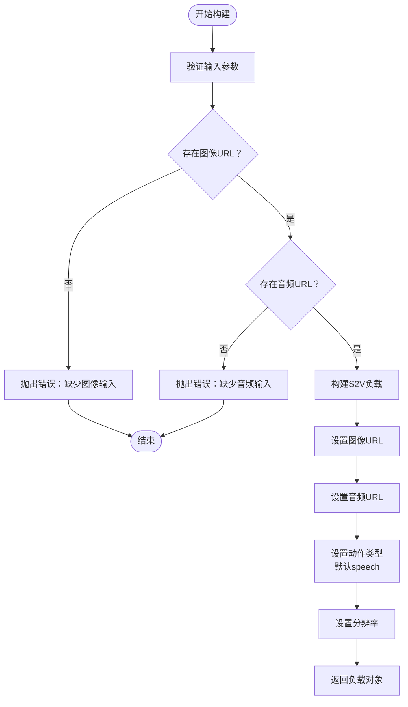

**图表来源**
- [payloadBuilders.js](file://src/services/payloadBuilders.js#L725-L742)

#### 实现细节

数字人S2V构建器的功能：

1. **多动作类型**: 支持说话、唱歌、表演三种动作类型
2. **语音驱动**: 基于音频内容生成同步的面部和身体动作
3. **分辨率控制**: 支持480P和720P两种分辨率选择
4. **风格化输出**: 生成自然流畅的数字人视频内容

**章节来源**
- [payloadBuilders.js](file://src/services/payloadBuilders.js#L725-L742)
- [DigitalHumanGenerator.jsx](file://src/components/DigitalHumanGenerator.jsx#L1-L313)

### 表情包视频构建器 (emojiVideo)

表情包视频构建器基于人脸检测坐标生成动态表情视频。

#### 设计原理

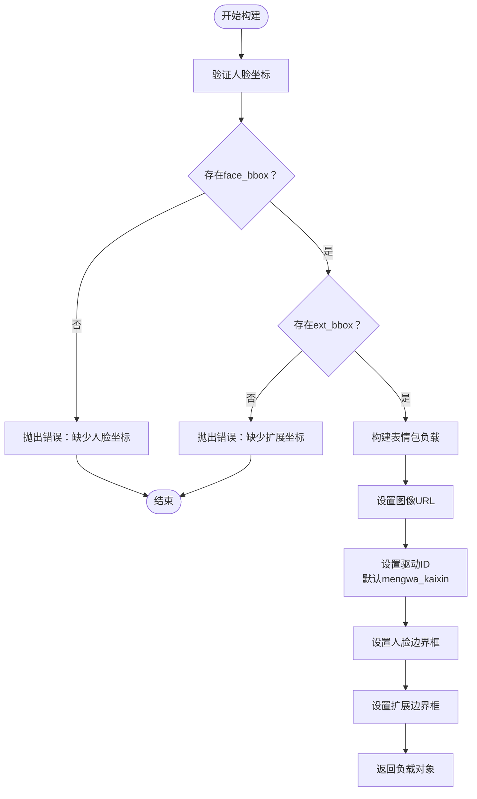

**图表来源**
- [payloadBuilders.js](file://src/services/payloadBuilders.js#L744-L762)

#### 实现细节

表情包视频构建器的特色：

1. **坐标验证**: 强制要求提供完整的人脸和扩展坐标
2. **模板系统**: 内置20种预设的表情包模板
3. **驱动机制**: 基于模板ID驱动特定的表情动画
4. **分辨率选择**: 支持480P和720P两种输出质量

**章节来源**
- [payloadBuilders.js](file://src/services/payloadBuilders.js#L744-L762)
- [EmojiGenerator.jsx](file://src/components/EmojiGenerator.jsx#L1-L273)

### 视频换人构建器 (videoCharacterSwap)

视频换人构建器支持将视频中的角色替换为指定人物。

#### 设计原理

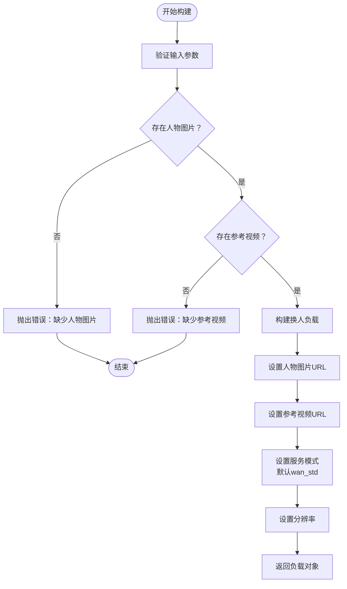

**图表来源**
- [payloadBuilders.js](file://src/services/payloadBuilders.js#L764-L780)

#### 实现细节

视频换人构建器的功能特性：

1. **双输入模式**: 需要人物图片和参考视频两个输入
2. **服务模式**: 支持标准模式和专业模式两种处理级别
3. **模式选择**: 标准模式注重速度，专业模式注重质量
4. **分辨率控制**: 支持480P和720P两种输出分辨率

**章节来源**
- [payloadBuilders.js](file://src/services/payloadBuilders.js#L764-L780)
- [VideoSwap.jsx](file://src/components/VideoSwap.jsx#L1-L212)

### 图像运动传递构建器 (imageMotionTransfer)

图像运动传递构建器将视频中的动作迁移到静态图像上。

#### 设计原理

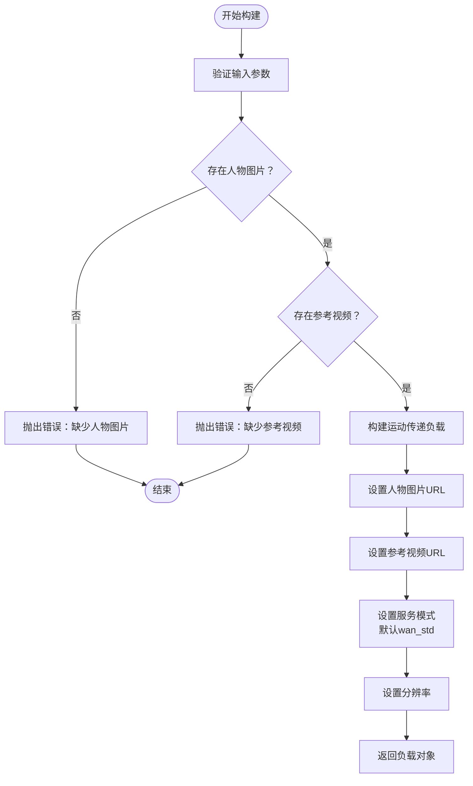

**图表来源**
- [payloadBuilders.js](file://src/services/payloadBuilders.js#L782-L798)

#### 实现细节

图像运动传递构建器的核心功能：

1. **动作迁移**: 将视频中的动作和表情迁移到图片上
2. **动态表现**: 为静态图像赋予动态的面部表情和身体动作
3. **模式选择**: 标准模式和专业模式提供不同的质量平衡
4. **分辨率适配**: 支持480P和720P两种输出质量

**章节来源**
- [payloadBuilders.js](file://src/services/payloadBuilders.js#L782-L798)
- [ImageMotion.jsx](file://src/components/ImageMotion.jsx#L1-L212)

### 图像翻译构建器 (imageTranslation)

图像翻译构建器支持图像中文本的精准翻译和排版保持。

#### 设计原理

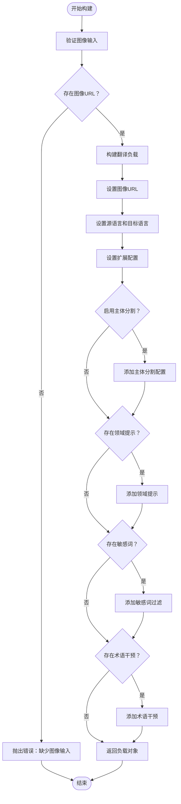

**图表来源**
- [payloadBuilders.js](file://src/services/payloadBuilders.js#L280-L294)

#### 实现细节

图像翻译构建器的专业功能：

1. **语言支持**: 支持14种语言的相互翻译
2. **领域定制**: 支持特定领域的术语和风格定制
3. **敏感词过滤**: 可配置敏感词的过滤规则
4. **术语管理**: 支持自定义术语表的术语干预
5. **主体分割**: 可选择跳过图像主体的文字识别

**章节来源**
- [payloadBuilders.js](file://src/services/payloadBuilders.js#L280-L294)
- [ImageTranslator.jsx](file://src/components/ImageTranslator.jsx#L1-L301)

## 依赖关系分析

系统各组件之间的依赖关系如下：

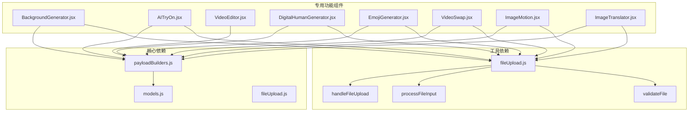

**图表来源**
- [payloadBuilders.js](file://src/services/payloadBuilders.js#L1-L829)
- [models.js](file://src/config/models.js#L1-L1012)
- [fileUpload.js](file://src/utils/fileUpload.js#L1-L182)

**章节来源**
- [payloadBuilders.js](file://src/services/payloadBuilders.js#L1-L829)
- [models.js](file://src/config/models.js#L1-L1012)
- [fileUpload.js](file://src/utils/fileUpload.js#L1-L182)

## 性能考虑

### 负载构建器优化策略

1. **延迟验证**: 在构建过程中只进行基本参数验证，避免昂贵的API调用
2. **参数合并**: 合并相似的构建逻辑，减少重复代码
3. **错误早发现**: 在构建阶段就发现配置错误，避免无效的API调用
4. **内存管理**: 及时清理不需要的中间变量，避免内存泄漏

### 文件上传优化

1. **智能压缩**: 对大文件进行自动压缩，控制base64大小
2. **类型验证**: 在上传前验证文件类型和大小，减少无效传输
3. **缓存策略**: 对已上传的文件进行缓存，避免重复上传
4. **并发控制**: 控制同时上传的文件数量，避免系统过载

### 模型配置优化

1. **能力检测**: 根据模型能力动态调整请求参数，避免不支持的配置
2. **默认值管理**: 为可选参数提供合理的默认值，简化用户配置
3. **协议适配**: 根据不同协议类型调整请求格式和参数结构
4. **端点路由**: 通过模型配置统一管理API端点，便于维护和扩展

## 故障排除指南

### 常见问题诊断

1. **参数验证错误**
   - 检查必需参数是否完整提供
   - 验证参数类型和格式是否正确
   - 确认参数值在允许范围内

2. **文件上传失败**
   - 检查文件类型和大小限制
   - 验证网络连接和服务器状态
   - 确认文件路径和权限设置

3. **模型配置错误**
   - 检查模型ID是否正确
   - 验证模型能力配置
   - 确认API端点可用性

4. **构建器异常**
   - 查看具体的错误消息
   - 检查输入参数的完整性
   - 验证构建器的适用性

### 调试技巧

1. **日志记录**: 在关键节点添加详细的日志信息
2. **参数打印**: 打印最终的请求参数，便于调试
3. **错误捕获**: 使用try-catch捕获和处理异常
4. **单元测试**: 为每个构建器编写单元测试

**章节来源**
- [payloadBuilders.js](file://src/services/payloadBuilders.js#L1-L829)
- [fileUpload.js](file://src/utils/fileUpload.js#L1-L182)

## 结论

专用功能构建器系统通过策略模式实现了高度模块化的架构设计，每个构建器专注于特定功能的请求格式化，确保了系统的可维护性和可扩展性。

系统的主要优势包括：

1. **模块化设计**: 每个构建器独立处理特定功能，降低耦合度
2. **统一接口**: 通过相同的接口规范处理不同类型的请求
3. **灵活配置**: 基于模型配置动态调整请求参数
4. **错误处理**: 提供完善的错误处理和验证机制
5. **性能优化**: 通过智能压缩和缓存提高系统性能

未来可以考虑的改进方向：

1. **构建器复用**: 进一步抽象公共逻辑，提高代码复用率
2. **配置管理**: 建立更完善的配置管理系统
3. **监控集成**: 添加性能监控和错误追踪功能
4. **文档完善**: 为每个构建器添加详细的使用文档

这个系统为AI功能的集成提供了坚实的基础，支持快速开发和部署新的专用功能。