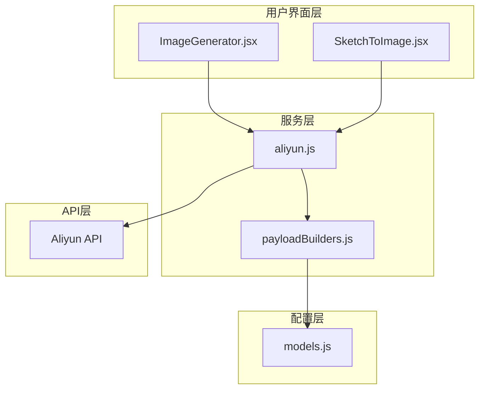
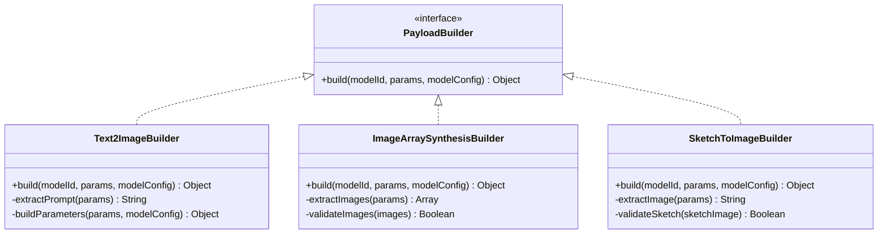
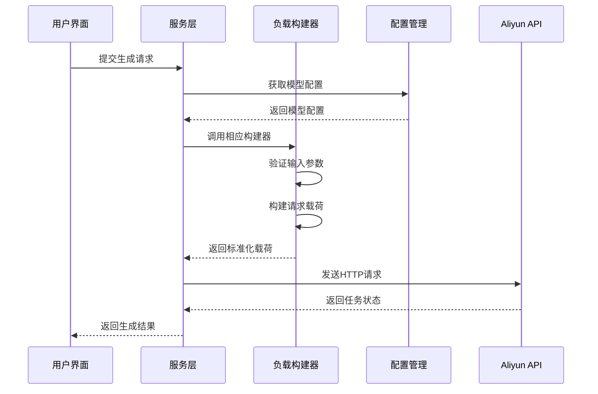
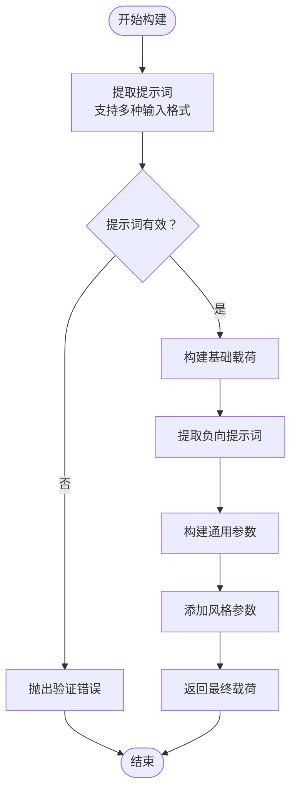
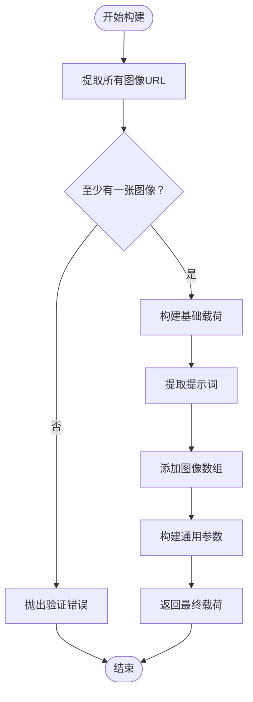
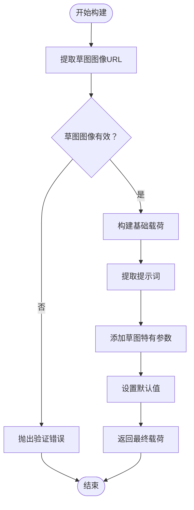
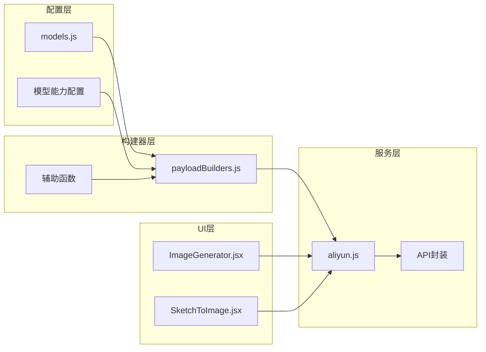

# 图像生成构建器

<cite>
**本文档引用的文件**
- [payloadBuilders.js](file://src/services/payloadBuilders.js)
- [SketchToImage.jsx](file://src/components/SketchToImage.jsx)
- [ImageGenerator.jsx](file://src/components/ImageGenerator.jsx)
- [models.js](file://src/config/models.js)
- [aliyun.js](file://src/services/aliyun.js)
</cite>

## 目录
1. [简介](#简介)
2. [项目结构](#项目结构)
3. [核心组件](#核心组件)
4. [架构概览](#架构概览)
5. [详细组件分析](#详细组件分析)
6. [依赖关系分析](#依赖关系分析)
7. [性能考虑](#性能考虑)
8. [故障排除指南](#故障排除指南)
9. [结论](#结论)

## 简介

本文档深入解析图像生成相关的负载构建器系统，重点涵盖三个核心构建器：text2image（文本到图像）、imageArraySynthesis（图像数组合成）和sketchToImage（草图到图像）。该系统采用策略模式设计，通过配置驱动的方式实现不同模型的请求载荷构建，确保新增模型时无需修改核心逻辑。

系统的核心价值在于：
- **模块化设计**：每个构建器独立负责特定格式的请求载荷构建
- **配置驱动**：通过模型配置文件实现灵活的参数映射
- **类型安全**：严格的参数验证和错误处理机制
- **扩展性**：易于添加新的图像生成模型和功能

## 项目结构

图像生成构建器系统主要由以下层次组成：

**图表来源**
- [payloadBuilders.js](file://src/services/payloadBuilders.js#L1-L828)
- [SketchToImage.jsx](file://src/components/SketchToImage.jsx#L1-L386)
- [ImageGenerator.jsx](file://src/components/ImageGenerator.jsx#L1-L249)
- [models.js](file://src/config/models.js#L1-L1012)

**章节来源**
- [payloadBuilders.js](file://src/services/payloadBuilders.js#L1-L828)
- [models.js](file://src/config/models.js#L1-L1012)

## 核心组件

### 负载构建器策略模式

系统采用策略模式实现负载构建器，每个构建器函数负责特定类型的请求载荷构建：

**图表来源**
- [payloadBuilders.js](file://src/services/payloadBuilders.js#L156-L168)
- [payloadBuilders.js](file://src/services/payloadBuilders.js#L174-L190)
- [payloadBuilders.js](file://src/services/payloadBuilders.js#L226-L249)

### 辅助工具函数

系统提供了多个辅助函数来处理常见的提取和验证任务：

- **提示词提取**：支持多种输入格式的提示词提取
- **图像URL提取**：支持单个和多个图像URL的提取
- **参数构建**：基于模型能力的参数标准化
- **内容构建**：多模态消息的内容数组构建

**章节来源**
- [payloadBuilders.js](file://src/services/payloadBuilders.js#L11-L72)

## 架构概览

系统采用分层架构设计，确保各层职责清晰分离：

**图表来源**
- [aliyun.js](file://src/services/aliyun.js#L50-L160)
- [payloadBuilders.js](file://src/services/payloadBuilders.js#L804-L828)

## 详细组件分析

### text2image 构建器

text2image构建器专门处理标准文本到图像的请求载荷构建，具有以下特点：

#### 设计原理

**图表来源**
- [payloadBuilders.js](file://src/services/payloadBuilders.js#L156-L168)

#### 参数处理流程

1. **提示词提取**：支持直接的prompt字段、template字段和多模态messages格式
2. **负向提示词**：根据模型能力配置条件性添加
3. **通用参数构建**：基于模型配置动态构建参数
4. **风格参数添加**：条件性添加style参数

#### 关键实现特性

- **多格式支持**：兼容不同的输入格式
- **能力感知**：根据模型配置决定参数添加
- **类型安全**：严格的参数验证和错误处理

**章节来源**
- [payloadBuilders.js](file://src/services/payloadBuilders.js#L156-L168)

### imageArraySynthesis 构建器

imageArraySynthesis构建器支持图像数组合成功能，处理多图像输入场景：

#### 设计原理

**图表来源**
- [payloadBuilders.js](file://src/services/payloadBuilders.js#L174-L190)

#### 多图像处理机制

1. **图像提取**：遍历messages内容数组提取所有图像URL
2. **参数验证**：确保至少有一个有效图像
3. **标准化处理**：将图像数组标准化为统一格式
4. **提示词集成**：将文本提示词与图像输入结合

#### 关键实现特性

- **批量处理**：支持多图像输入的统一处理
- **严格验证**：强制要求至少一个有效图像
- **格式标准化**：确保输出格式的一致性

**章节来源**
- [payloadBuilders.js](file://src/services/payloadBuilders.js#L174-L190)

### sketchToImage 构建器

sketchToImage构建器专门处理草图到图像的转换，具有独特的参数配置：

#### 设计原理

**图表来源**
- [payloadBuilders.js](file://src/services/payloadBuilders.js#L226-L249)

#### 草图特有参数配置

1. **草图权重**：控制草图结构对生成结果的影响程度
2. **草图提取**：自动从输入图像中提取草图
3. **草图颜色**：指定草图的颜色配置
4. **尺寸默认值**：针对草图生成的默认分辨率

#### 参数验证和默认值

- **必需参数**：草图图像URL必须存在
- **可选参数**：提供合理的默认值
- **范围限制**：对数值参数进行范围验证

**章节来源**
- [payloadBuilders.js](file://src/services/payloadBuilders.js#L226-L249)

## 依赖关系分析

系统采用松耦合的设计，通过配置驱动实现模块间的解耦：

**图表来源**
- [models.js](file://src/config/models.js#L265-L788)
- [payloadBuilders.js](file://src/services/payloadBuilders.js#L804-L828)
- [aliyun.js](file://src/services/aliyun.js#L1-L215)

### 组件耦合度分析

- **低耦合**：构建器与具体模型实现解耦
- **高内聚**：每个构建器专注于特定的载荷构建逻辑
- **配置驱动**：通过模型配置实现功能扩展
- **接口稳定**：构建器接口保持稳定，便于维护

**章节来源**
- [models.js](file://src/config/models.js#L265-L788)
- [payloadBuilders.js](file://src/services/payloadBuilders.js#L804-L828)

## 性能考虑

### 内存优化策略

1. **延迟加载**：只在需要时加载构建器函数
2. **参数复用**：避免重复计算相同的参数值
3. **对象池**：对于频繁创建的对象使用对象池技术

### 网络性能优化

1. **请求合并**：将多个小请求合并为批量请求
2. **缓存策略**：合理利用HTTP缓存机制
3. **超时控制**：实现合理的请求超时和重试机制

### 错误处理优化

1. **快速失败**：在参数验证阶段尽早发现错误
2. **错误分类**：区分可恢复错误和不可恢复错误
3. **重试策略**：实现指数退避的重试机制

## 故障排除指南

### 常见问题及解决方案

#### 文本到图像构建问题

**问题**：提示词提取失败
**原因**：输入格式不符合预期
**解决方案**：
- 检查输入参数格式
- 确认messages数组结构正确
- 验证text字段的存在性

#### 图像数组合成问题

**问题**：图像提取为空
**原因**：messages内容数组中没有有效的图像项
**解决方案**：
- 检查图像URL格式
- 验证image或image_url字段
- 确认文件可访问性

#### 草图到图像问题

**问题**：草图图像验证失败
**原因**：缺少必需的草图图像URL
**解决方案**：
- 确保上传了草图图像
- 验证图像URL的有效性
- 检查图像格式支持情况

#### 参数验证错误

**问题**：参数超出范围
**解决方案**：
- 检查参数范围限制
- 验证数据类型
- 确认必填参数完整性

**章节来源**
- [payloadBuilders.js](file://src/services/payloadBuilders.js#L156-L168)
- [payloadBuilders.js](file://src/services/payloadBuilders.js#L174-L190)
- [payloadBuilders.js](file://src/services/payloadBuilders.js#L226-L249)

## 结论

图像生成构建器系统通过策略模式和配置驱动的设计，实现了高度模块化和可扩展的图像生成请求载荷构建。三个核心构建器各自专注于特定的生成场景，同时共享统一的验证和错误处理机制。

### 主要优势

1. **设计优雅**：策略模式确保了良好的代码组织和扩展性
2. **配置驱动**：通过模型配置实现灵活的功能定制
3. **类型安全**：严格的参数验证和错误处理机制
4. **性能优化**：合理的内存管理和网络优化策略

### 应用场景

- **文本到图像生成**：适用于纯文本描述的图像生成需求
- **图像数组合成**：支持多图像融合和混合生成
- **草图到图像转换**：专门处理手绘草图的智能生成

### 最佳实践

1. **参数验证**：始终在构建前验证输入参数的有效性
2. **错误处理**：实现完善的错误捕获和用户友好的错误信息
3. **配置管理**：通过模型配置文件管理不同模型的能力差异
4. **性能监控**：建立性能指标监控和优化机制

该系统为图像生成应用提供了坚实的基础架构，支持未来功能的平滑扩展和维护。