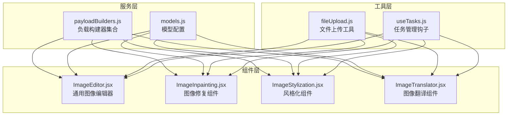
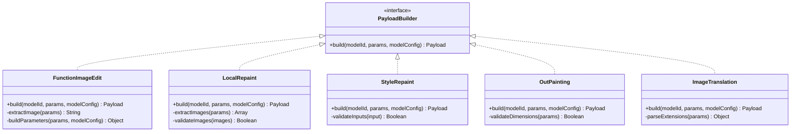
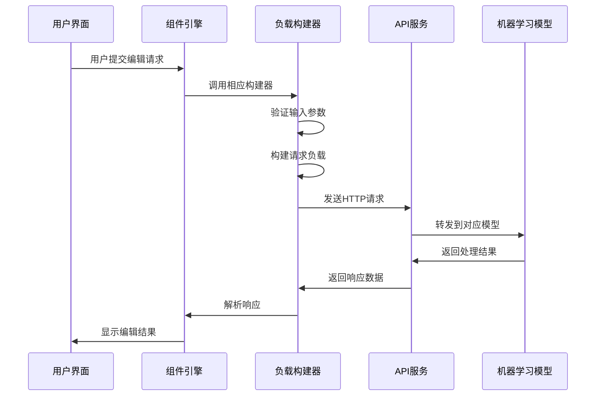
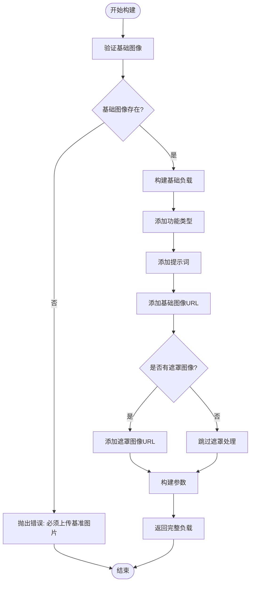
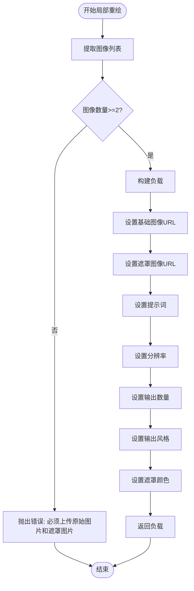
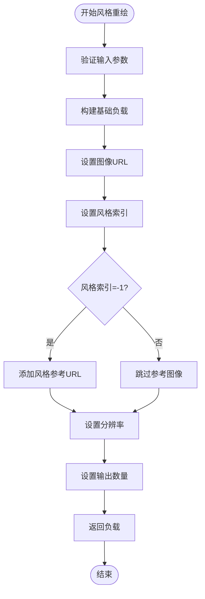
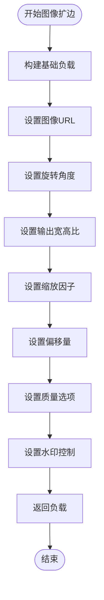
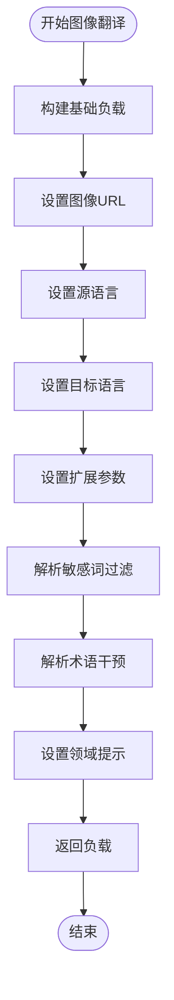
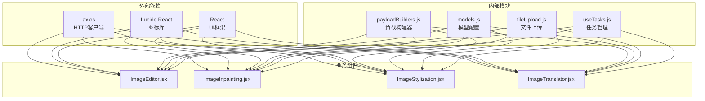

# 图像编辑构建器

<cite>
**本文档引用的文件**
- [payloadBuilders.js](file://src/services/payloadBuilders.js)
- [ImageEditor.jsx](file://src/components/ImageEditor.jsx)
- [ImageInpainting.jsx](file://src/components/ImageInpainting.jsx)
- [ImageStylization.jsx](file://src/components/ImageStylization.jsx)
- [ImageTranslator.jsx](file://src/components/ImageTranslator.jsx)
- [models.js](file://src/config/models.js)
</cite>

## 目录
1. [简介](#简介)
2. [项目结构](#项目结构)
3. [核心组件](#核心组件)
4. [架构概览](#架构概览)
5. [详细组件分析](#详细组件分析)
6. [依赖关系分析](#依赖关系分析)
7. [性能考虑](#性能考虑)
8. [故障排除指南](#故障排除指南)
9. [结论](#结论)
10. [附录](#附录)

## 简介

本文档深入分析了图像编辑相关的负载构建器系统，重点解释五个核心构建器的设计模式和实现原理：functionImageEdit（函数式图像编辑）、localRepaint（局部重绘）、styleRepaint（风格重绘）、outPainting（图像扩边）和imageTranslation（图像翻译）。该系统采用策略模式设计，通过统一的负载构建器接口处理不同类型的图像编辑任务，实现了高度模块化和可扩展的架构。

## 项目结构

项目采用组件化架构，主要包含以下关键目录和文件：



**图表来源**
- [payloadBuilders.js](file://src/services/payloadBuilders.js#L1-L829)
- [models.js](file://src/config/models.js#L265-L788)

**章节来源**
- [payloadBuilders.js](file://src/services/payloadBuilders.js#L1-L829)
- [models.js](file://src/config/models.js#L1-L1012)

## 核心组件

### 负载构建器策略模式

系统采用策略模式实现负载构建器，每个构建器负责特定格式的请求体构造。这种设计允许通过简单添加配置来支持新模型，而无需修改核心逻辑。



**图表来源**
- [payloadBuilders.js](file://src/services/payloadBuilders.js#L196-L345)

### 辅助工具函数

系统提供了多个辅助工具函数来处理常见的图像编辑任务：

- **extractPrompt**: 从参数中提取文本提示词
- **extractImage**: 从参数中提取单个图像URL
- **extractImages**: 从参数中提取所有图像URL
- **buildMultimodalContent**: 构建多模态消息内容数组

**章节来源**
- [payloadBuilders.js](file://src/services/payloadBuilders.js#L11-L72)

## 架构概览

系统采用分层架构，通过统一的负载构建器接口处理不同类型的图像编辑任务：



**图表来源**
- [ImageEditor.jsx](file://src/components/ImageEditor.jsx#L163-L230)
- [payloadBuilders.js](file://src/services/payloadBuilders.js#L804-L828)

## 详细组件分析

### functionImageEdit 构建器

functionImageEdit 是专门处理基于函数的图像编辑任务的构建器，支持多种编辑功能。

#### 设计模式与实现原理



**图表来源**
- [payloadBuilders.js](file://src/services/payloadBuilders.js#L196-L220)

#### 关键特性

1. **基础图像提取**: 使用 `extractImage` 函数从参数中提取基础图像URL
2. **功能类型选择**: 支持多种编辑功能，包括描述编辑、局部重绘、去水印等
3. **遮罩图像支持**: 可选的遮罩图像支持，用于精确控制编辑区域
4. **参数构建**: 通过 `buildParameters` 函数标准化参数

#### 参数配置指南

| 参数名称 | 类型 | 必需 | 默认值 | 描述 |
|---------|------|------|--------|------|
| function | String | 否 | description_edit | 编辑功能类型 |
| base_image_url | String | 是 | - | 基础图像URL |
| mask_image_url | String | 否 | - | 遮罩图像URL |
| prompt | String | 否 | - | 文本提示词 |

**章节来源**
- [payloadBuilders.js](file://src/services/payloadBuilders.js#L196-L220)
- [ImageEditor.jsx](file://src/components/ImageEditor.jsx#L174-L188)

### localRepaint 构建器

localRepaint 实现局部重绘功能，需要基础图像和遮罩图像的双重验证。

#### 设计模式与实现原理



**图表来源**
- [payloadBuilders.js](file://src/services/payloadBuilders.js#L255-L277)

#### 关键特性

1. **双重验证机制**: 必须提供至少两张图像（基础图像+遮罩图像）
2. **尺寸限制**: 默认分辨率为1024*1024，可根据需求调整
3. **遮罩颜色配置**: 支持RGB颜色数组配置，用于精确控制编辑区域
4. **风格输出**: 可选择输出风格，支持多种预设风格

#### 参数配置指南

| 参数名称 | 类型 | 必需 | 默认值 | 描述 |
|---------|------|------|--------|------|
| base_image_url | String | 是 | - | 基础图像URL |
| mask_image_url | String | 是 | - | 遮罩图像URL |
| prompt | String | 否 | - | 文本提示词 |
| size | String | 否 | 1024*1024 | 输出分辨率 |
| n | Number | 否 | 1 | 输出图像数量 |
| style | String | 否 | - | 输出风格 |
| mask_color | Array | 否 | [] | 遮罩颜色RGB数组 |

**章节来源**
- [payloadBuilders.js](file://src/services/payloadBuilders.js#L255-L277)
- [ImageInpainting.jsx](file://src/components/ImageInpainting.jsx#L116-L141)

### styleRepaint 构建器

styleRepaint 用于进行风格重绘，支持预设风格索引和自定义风格参考。

#### 设计模式与实现原理



**图表来源**
- [payloadBuilders.js](file://src/services/payloadBuilders.js#L300-L319)

#### 关键特性

1. **风格索引系统**: 支持0-40的预设风格索引
2. **风格参考支持**: 当风格索引为-1时，支持自定义风格参考图像
3. **参数标准化**: 自动处理必需参数和可选参数
4. **输出控制**: 限制输出数量为1张图像

#### 参数配置指南

| 参数名称 | 类型 | 必需 | 默认值 | 描述 |
|---------|------|------|--------|------|
| image_url | String | 是 | - | 输入图像URL |
| style_index | Number | 是 | - | 风格索引(0-40或-1) |
| style_ref_url | String | 否 | - | 自定义风格参考URL |
| size | String | 否 | - | 输出分辨率 |
| n | Number | 否 | 1 | 输出图像数量 |

**章节来源**
- [payloadBuilders.js](file://src/services/payloadBuilders.js#L300-L319)
- [ImageStylization.jsx](file://src/components/ImageStylization.jsx#L128-L149)

### outPainting 构建器

outPainting 实现图像扩边功能，提供丰富的参数控制选项。

#### 设计模式与实现原理



**图表来源**
- [payloadBuilders.js](file://src/services/payloadBuilders.js#L325-L345)

#### 关键特性

1. **角度控制**: 支持0-359度的逆时针旋转
2. **比例设置**: 支持输出宽高比配置
3. **缩放因子**: 独立控制X轴和Y轴缩放
4. **偏移量控制**: 四个方向的像素偏移量
5. **质量选项**: 最佳质量模式和图像大小限制
6. **水印控制**: 可选的水印添加功能

#### 参数配置指南

| 参数名称 | 类型 | 必需 | 默认值 | 描述 |
|---------|------|------|--------|------|
| image_url | String | 是 | - | 输入图像URL |
| angle | Number | 否 | 0 | 旋转角度(0-359) |
| output_ratio | String | 否 | '' | 输出宽高比 |
| x_scale | Number | 否 | 1.0 | X轴缩放因子 |
| y_scale | Number | 否 | 1.0 | Y轴缩放因子 |
| top_offset | Number | 否 | 0 | 上偏移量 |
| bottom_offset | Number | 否 | 0 | 下偏移量 |
| left_offset | Number | 否 | 0 | 左偏移量 |
| right_offset | Number | 否 | 0 | 右偏移量 |
| best_quality | Boolean | 否 | false | 最佳质量模式 |
| limit_image_size | Boolean | 否 | true | 限制图像大小 |
| add_watermark | Boolean | 否 | true | 添加水印 |

**章节来源**
- [payloadBuilders.js](file://src/services/payloadBuilders.js#L325-L345)
- [ImageEnhancement.jsx](file://src/components/ImageEnhancement.jsx#L104-L124)

### imageTranslation 构建器

imageTranslation 处理图像翻译任务，支持多语言和高级翻译选项。

#### 设计模式与实现原理



**图表来源**
- [payloadBuilders.js](file://src/services/payloadBuilders.js#L283-L294)

#### 关键特性

1. **多语言支持**: 支持14种语言的图像翻译
2. **主体分割**: 可选的主体文字跳过功能
3. **敏感词过滤**: 支持逗号分隔的敏感词列表
4. **术语干预**: 支持多行术语对配置
5. **领域提示**: 可选的领域描述和翻译风格提示

#### 参数配置指南

| 参数名称 | 类型 | 必需 | 默认值 | 描述 |
|---------|------|------|--------|------|
| image_url | String | 是 | - | 输入图像URL |
| source_lang | String | 是 | - | 源语言代码 |
| target_lang | String | 是 | - | 目标语言代码 |
| ext | Object | 否 | {} | 扩展参数对象 |
| ext.config.imageSegment | Boolean | 否 | false | 主体分割开关 |
| ext.domainHint | String | 否 | - | 领域提示 |
| ext.sensitives | Array | 否 | [] | 敏感词过滤列表 |
| ext.terminologies | Array | 否 | [] | 术语干预列表 |

**章节来源**
- [payloadBuilders.js](file://src/services/payloadBuilders.js#L283-L294)
- [ImageTranslator.jsx](file://src/components/ImageTranslator.jsx#L51-L96)

## 依赖关系分析

系统各组件之间的依赖关系如下：



**图表来源**
- [ImageEditor.jsx](file://src/components/ImageEditor.jsx#L1-L10)
- [payloadBuilders.js](file://src/services/payloadBuilders.js#L1-L10)

**章节来源**
- [ImageEditor.jsx](file://src/components/ImageEditor.jsx#L1-L55)
- [payloadBuilders.js](file://src/services/payloadBuilders.js#L804-L828)

## 性能考虑

### 内存优化策略

1. **图像预览缓存**: 使用本地状态存储图像预览，避免重复下载
2. **参数验证**: 在构建负载前进行参数验证，减少无效请求
3. **渐进式加载**: 支持大图像的渐进式压缩处理

### 网络优化策略

1. **批量请求**: 支持多图输入的批量处理
2. **连接复用**: 使用HTTP连接池减少连接开销
3. **超时控制**: 合理设置请求超时时间

### 错误处理优化

1. **重试机制**: 对临时性错误实施指数退避重试
2. **降级策略**: 在模型不可用时提供降级方案
3. **用户反馈**: 提供详细的错误信息和解决方案

## 故障排除指南

### 常见问题及解决方案

#### 图像上传问题

**问题**: 图像上传失败或格式不支持
**解决方案**: 
- 检查文件格式是否为支持的类型(JPG/PNG/WEBP)
- 确认文件大小不超过8MB限制
- 验证网络连接稳定性和服务器可用性

#### 参数验证错误

**问题**: 构建负载时抛出参数错误
**解决方案**:
- 检查必需参数是否完整提供
- 验证参数类型和范围是否正确
- 查看模型配置中的能力声明

#### 模型兼容性问题

**问题**: 某些功能在特定模型上不可用
**解决方案**:
- 查阅模型配置中的能力声明
- 选择支持相应功能的模型版本
- 参考模型文档了解功能限制

**章节来源**
- [payloadBuilders.js](file://src/services/payloadBuilders.js#L130-L139)
- [payloadBuilders.js](file://src/services/payloadBuilders.js#L177-L180)

## 结论

图像编辑构建器系统通过策略模式实现了高度模块化的架构设计，每个构建器专注于特定的图像编辑任务，同时共享通用的验证和参数处理机制。该系统具有以下优势：

1. **可扩展性**: 新增模型只需添加配置，无需修改核心逻辑
2. **一致性**: 统一的参数处理和错误处理机制
3. **灵活性**: 支持多种编辑功能和参数组合
4. **可靠性**: 完善的参数验证和错误处理

通过合理使用这些构建器，开发者可以轻松实现各种复杂的图像编辑功能，同时保持代码的可维护性和可扩展性。

## 附录

### 使用示例

#### 基础图像编辑示例
```javascript
// functionImageEdit 基础用法
const editPayload = functionImageEdit('wanx2.1-imageedit', {
    input: {
        function: 'description_edit',
        prompt: '将天空改为蓝色',
        base_image_url: 'https://example.com/image.jpg'
    },
    parameters: {
        n: 1,
        watermark: true
    }
});
```

#### 局部重绘示例
```javascript
// localRepaint 用法
const repaintPayload = localRepaint('wanx-x-painting', {
    input: {
        prompt: '在遮罩区域内添加花朵',
        base_image_url: 'https://example.com/base.jpg',
        mask_image_url: 'https://example.com/mask.jpg'
    },
    parameters: {
        size: '1024*1024',
        n: 1,
        style: '<auto>',
        mask_color: [[255,255,255]]
    }
});
```

#### 风格重绘示例
```javascript
// styleRepaint 用法
const stylePayload = styleRepaint('wanx-style-repaint-v1', {
    input: {
        image_url: 'https://example.com/photo.jpg',
        style_index: 0,
        style_ref_url: 'https://example.com/style_ref.jpg'
    },
    parameters: {
        size: '1024*1024',
        n: 1
    }
});
```

#### 图像扩边示例
```javascript
// outPainting 用法
const expandPayload = outPainting('image-out-painting', {
    input: {
        image_url: 'https://example.com/image.jpg'
    },
    parameters: {
        angle: 0,
        output_ratio: '',
        x_scale: 1.5,
        y_scale: 1.5,
        top_offset: 100,
        bottom_offset: 100,
        left_offset: 100,
        right_offset: 100,
        best_quality: true,
        limit_image_size: true,
        add_watermark: true
    }
});
```

#### 图像翻译示例
```javascript
// imageTranslation 用法
const translatePayload = imageTranslation('qwen-mt-image', {
    input: {
        image_url: 'https://example.com/image.jpg',
        source_lang: 'zh',
        target_lang: 'en',
        ext: {
            config: {
                imageSegment: true
            },
            domainHint: '电商产品描述',
            sensitives: ['敏感词1', '敏感词2'],
            terminologies: [
                { src: '原词', tgt: '译词' }
            ]
        }
    },
    parameters: {}
});
```

### 参数配置最佳实践

1. **图像质量**: 优先使用高质量图像作为基础输入
2. **提示词优化**: 提供具体、详细的文本描述
3. **参数组合**: 根据具体需求合理组合参数
4. **测试验证**: 在生产环境部署前进行充分测试