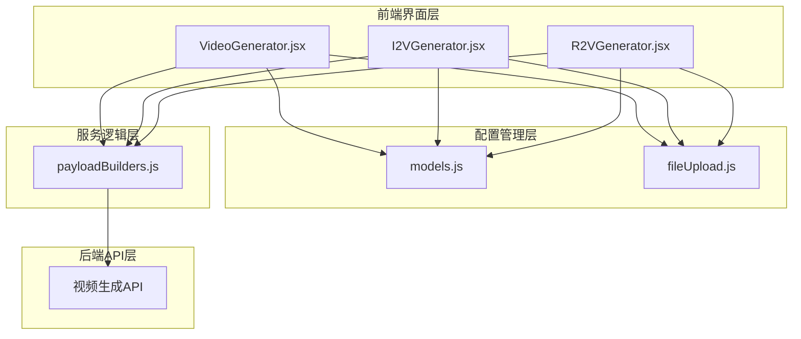
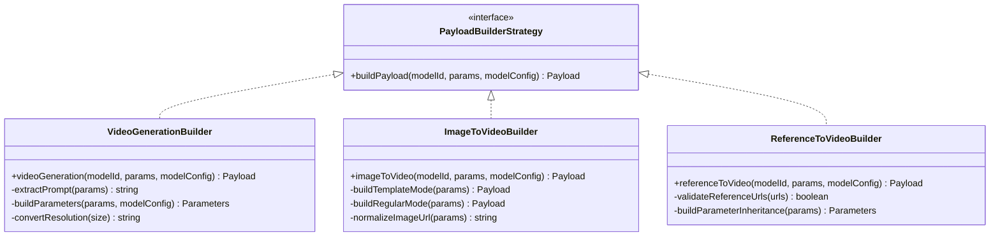
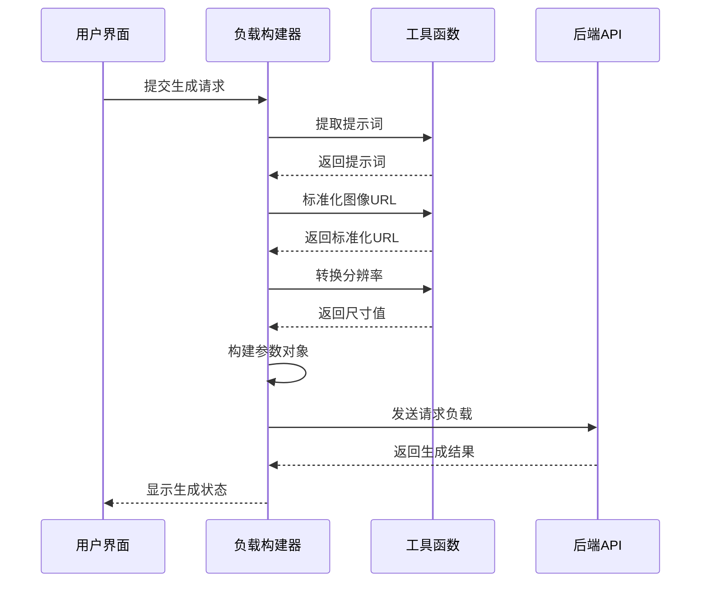
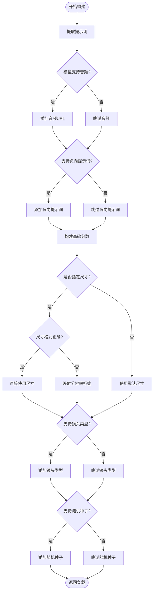
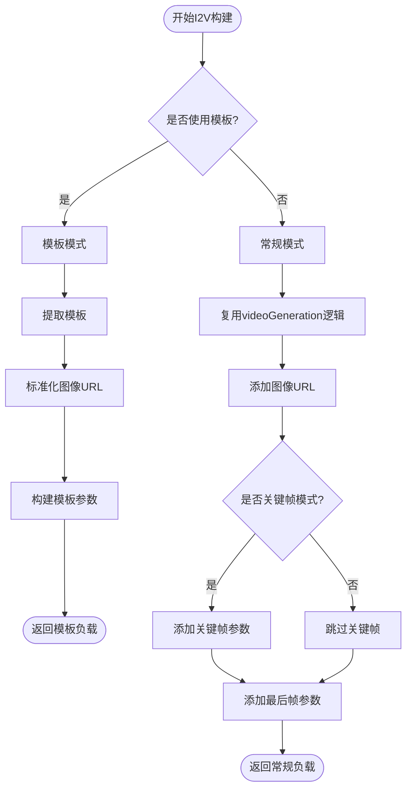
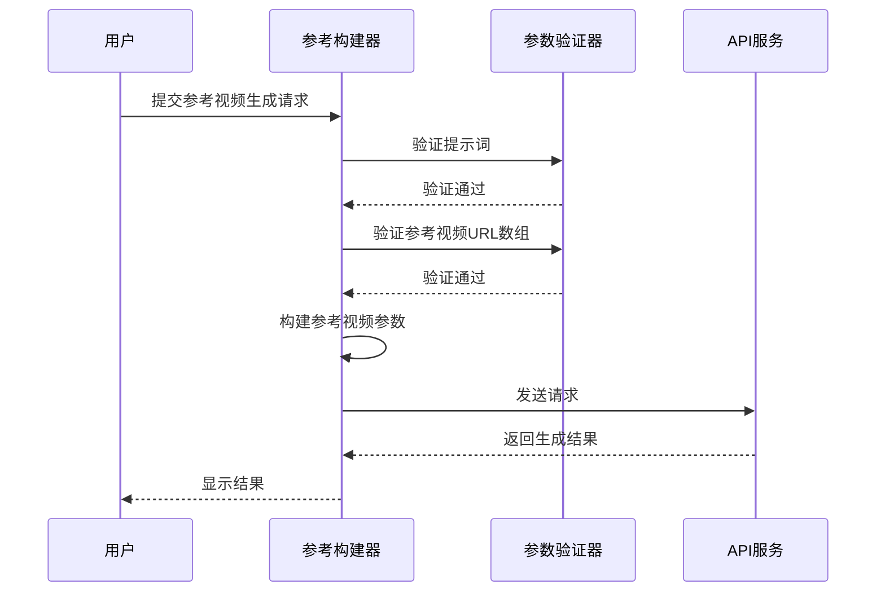
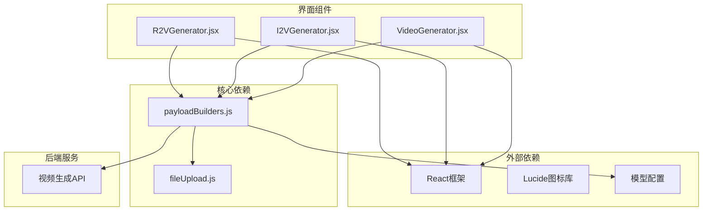

# 视频生成构建器

<cite>
**本文档引用的文件**
- [payloadBuilders.js](file://src/services/payloadBuilders.js)
- [VideoGenerator.jsx](file://src/components/VideoGenerator.jsx)
- [I2VGenerator.jsx](file://src/components/I2VGenerator.jsx)
- [R2VGenerator.jsx](file://src/components/R2VGenerator.jsx)
- [models.js](file://src/config/models.js)
- [fileUpload.js](file://src/utils/fileUpload.js)
</cite>

## 目录
1. [简介](#简介)
2. [项目结构](#项目结构)
3. [核心组件](#核心组件)
4. [架构概览](#架构概览)
5. [详细组件分析](#详细组件分析)
6. [依赖关系分析](#依赖关系分析)
7. [性能考虑](#性能考虑)
8. [故障排除指南](#故障排除指南)
9. [结论](#结论)

## 简介

本文档深入解析视频生成相关的负载构建器系统，重点涵盖三个核心视频生成构建器的设计模式和实现原理：`videoGeneration`（标准文本到视频）、`imageToVideo`（图像到视频）和`referenceToVideo`（参考视频生成）。该系统采用策略模式设计，通过统一的负载构建器接口处理不同类型的视频生成任务，支持多种分辨率、镜头类型和参数配置。

系统的核心价值在于：
- **统一接口**：所有视频生成任务通过相同的构建器接口处理
- **灵活配置**：支持多种模型能力的动态适配
- **类型安全**：严格的参数验证和错误处理机制
- **用户体验**：直观的UI组件配合强大的后端处理能力

## 项目结构

视频生成构建器系统采用模块化设计，主要包含以下核心模块：

**图表来源**
- [payloadBuilders.js](file://src/services/payloadBuilders.js#L1-L829)
- [VideoGenerator.jsx](file://src/components/VideoGenerator.jsx#L1-L354)
- [I2VGenerator.jsx](file://src/components/I2VGenerator.jsx#L1-L588)
- [R2VGenerator.jsx](file://src/components/R2VGenerator.jsx#L1-L380)
- [models.js](file://src/config/models.js#L1-L1012)

**章节来源**
- [payloadBuilders.js](file://src/services/payloadBuilders.js#L1-L829)
- [models.js](file://src/config/models.js#L1-L1012)

## 核心组件

### 负载构建器策略模式

系统采用策略模式设计，每个视频生成构建器都是一个独立的策略函数，负责构建特定格式的请求负载。这种设计允许轻松添加新的视频生成模型而无需修改现有代码。

**图表来源**
- [payloadBuilders.js](file://src/services/payloadBuilders.js#L515-L665)

### 辅助工具函数

系统提供了多个辅助工具函数来处理常见的视频生成任务：

- **提示词提取**：从复杂参数结构中提取文本提示
- **图像URL标准化**：统一不同格式的图像URL输入
- **分辨率映射**：将人类可读的分辨率标签转换为具体的尺寸值
- **参数构建**：根据模型能力动态构建参数对象

**章节来源**
- [payloadBuilders.js](file://src/services/payloadBuilders.js#L11-L119)

## 架构概览

视频生成构建器系统采用分层架构设计，确保了良好的可维护性和扩展性：

**图表来源**
- [payloadBuilders.js](file://src/services/payloadBuilders.js#L515-L665)
- [VideoGenerator.jsx](file://src/components/VideoGenerator.jsx#L74-L115)

## 详细组件分析

### videoGeneration 构建器

`videoGeneration` 构建器专门处理标准文本到视频的请求载荷构建，是整个系统的核心组件之一。

#### 设计模式与实现原理

该构建器采用条件分支和参数继承的设计模式，根据模型能力和用户输入动态构建请求负载：

**图表来源**
- [payloadBuilders.js](file://src/services/payloadBuilders.js#L515-L571)

#### 关键功能特性

1. **提示词提取机制**：支持从多种参数结构中提取提示词，包括直接的`prompt`字段、`template`字段和消息内容数组。

2. **音频支持处理**：只有当模型配置明确支持音频时才添加音频URL，确保API兼容性。

3. **负向提示词管理**：根据模型能力动态决定是否包含负向提示词参数。

4. **分辨率映射系统**：提供从人类可读的分辨率标签到具体尺寸值的映射：
   - 480P → 832×480
   - 720P → 1280×720  
   - 1080P → 1920×1080

5. **镜头类型控制**：对于支持多镜头叙事的模型，提供单镜头(single)和多镜头(multi)的选择。

6. **随机种子支持**：为需要可重现结果的场景提供固定的随机种子。

**章节来源**
- [payloadBuilders.js](file://src/services/payloadBuilders.js#L515-L571)

### imageToVideo 构建器

`imageToVideo` 构建器支持两种工作模式：模板模式和常规模式，为用户提供灵活的图像到视频生成选项。

#### 模板模式实现

模板模式专为视频特效设计，使用预定义的模板而非用户自定义提示词：

**图表来源**
- [payloadBuilders.js](file://src/services/payloadBuilders.js#L577-L643)

#### 图像URL标准化机制

系统实现了智能的图像URL标准化，支持多种输入格式：

- **img_url**：模板模式专用的图像URL字段
- **image_url**：常规模式的标准图像URL字段
- **base_image_url**：某些编辑模型的基准图像URL

#### 关键帧图像处理

系统支持关键帧到视频的高级功能：

1. **first_frame_image**：指定视频的起始帧图像
2. **last_frame_image**：指定视频的结束帧图像
3. **自动参数继承**：从videoGeneration构建器继承通用参数

**章节来源**
- [payloadBuilders.js](file://src/services/payloadBuilders.js#L577-L643)

### referenceToVideo 构建器

`referenceToVideo` 构建器专门处理基于参考视频的生成任务，支持多角色和多参考视频的复杂场景。

#### 参考视频生成流程

**图表来源**
- [payloadBuilders.js](file://src/services/payloadBuilders.js#L649-L665)

#### 参数继承机制

参考视频构建器采用参数继承设计，从基础视频生成参数中继承通用配置：

- **尺寸参数**：从父级参数继承分辨率设置
- **时长参数**：支持自定义视频时长
- **镜头类型**：多镜头叙事支持
- **随机种子**：可选的固定种子
- **水印设置**：可选的水印添加

**章节来源**
- [payloadBuilders.js](file://src/services/payloadBuilders.js#L649-L665)

## 依赖关系分析

视频生成构建器系统具有清晰的依赖层次结构：

**图表来源**
- [payloadBuilders.js](file://src/services/payloadBuilders.js#L1-L829)
- [VideoGenerator.jsx](file://src/components/VideoGenerator.jsx#L1-L354)
- [I2VGenerator.jsx](file://src/components/I2VGenerator.jsx#L1-L588)
- [R2VGenerator.jsx](file://src/components/R2VGenerator.jsx#L1-L380)

### 组件耦合度分析

系统的组件设计遵循低耦合高内聚的原则：

- **UI组件**：专注于用户交互，通过回调函数与业务逻辑分离
- **构建器模块**：独立处理负载构建逻辑，无UI依赖
- **工具函数**：提供通用的文件处理和验证功能
- **配置管理**：集中管理模型能力和参数规范

**章节来源**
- [models.js](file://src/config/models.js#L1-L1012)

## 性能考虑

### 内存优化策略

1. **文件处理优化**：系统采用Base64编码前的文件压缩策略，减少内存占用
2. **参数构建缓存**：重复使用的参数构建逻辑避免不必要的计算
3. **条件加载**：仅在需要时加载特定的构建器逻辑

### 网络传输优化

1. **数据压缩**：Base64编码前的图像压缩减少传输体积
2. **批量处理**：支持多参考视频的批量处理
3. **错误重试**：网络异常时的自动重试机制

### 用户体验优化

1. **异步处理**：生成过程中的异步处理避免界面阻塞
2. **进度反馈**：实时的状态更新和进度显示
3. **参数验证**：前端参数验证减少无效请求

## 故障排除指南

### 常见问题诊断

#### 参数验证错误

**问题症状**：构建器抛出参数验证错误
**可能原因**：
- 缺少必需的输入参数
- 参数格式不符合要求
- 模型能力不支持某些参数

**解决方案**：
1. 检查模型配置中的能力声明
2. 验证输入参数的完整性和格式
3. 确认模型支持所需的参数组合

#### 文件上传问题

**问题症状**：文件上传失败或处理错误
**可能原因**：
- 文件类型不支持
- 文件大小超出限制
- 网络连接异常

**解决方案**：
1. 检查文件类型和大小限制
2. 确认网络连接稳定
3. 使用浏览器开发者工具检查错误详情

#### 分辨率映射错误

**问题症状**：分辨率设置不生效
**可能原因**：
- 分辨率标签格式不正确
- 尺寸值格式不符合API要求

**解决方案**：
1. 确认使用正确的分辨率标签（480P/720P/1080P）
2. 检查自定义尺寸的格式（width*height）

**章节来源**
- [payloadBuilders.js](file://src/services/payloadBuilders.js#L11-L119)
- [fileUpload.js](file://src/utils/fileUpload.js#L114-L144)

## 结论

视频生成构建器系统通过精心设计的策略模式和模块化架构，成功实现了高度灵活和可扩展的视频生成解决方案。系统的主要优势包括：

### 技术优势

1. **设计模式优雅**：策略模式确保了良好的可扩展性和维护性
2. **类型安全**：严格的参数验证和错误处理机制
3. **用户体验**：直观的UI组件配合强大的后端处理能力
4. **性能优化**：合理的内存管理和网络传输优化

### 应用价值

1. **多场景支持**：覆盖从简单文本到视频到复杂的参考视频生成
2. **灵活配置**：支持多种模型能力和参数组合
3. **易于集成**：清晰的接口设计便于与其他系统集成
4. **可维护性强**：模块化设计降低了维护成本

### 未来发展方向

1. **模型扩展**：支持更多类型的视频生成模型
2. **性能优化**：进一步优化内存使用和网络传输
3. **功能增强**：增加更多高级特性和参数选项
4. **用户体验**：持续改进界面设计和交互体验

该系统为视频生成应用提供了坚实的技术基础，通过其灵活的设计和强大的功能，能够满足各种复杂的视频生成需求。