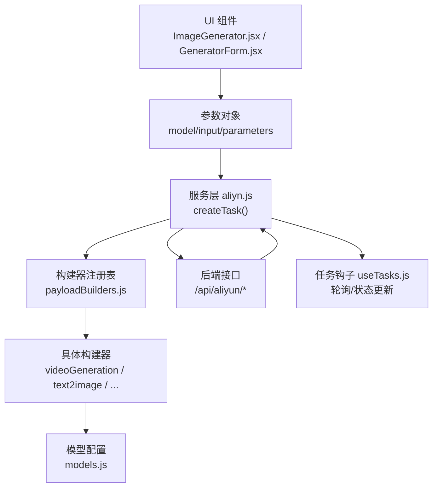
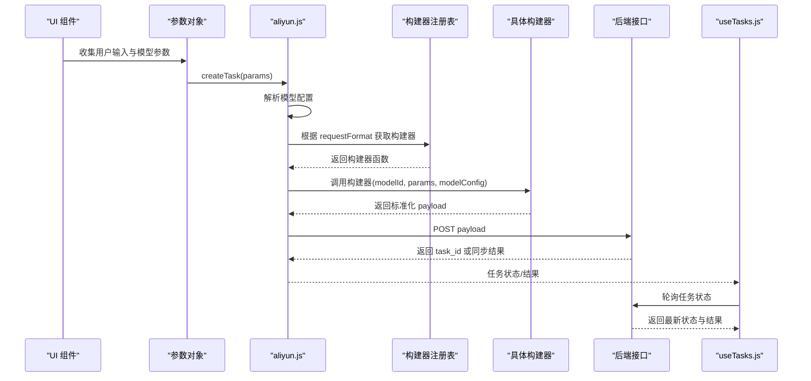
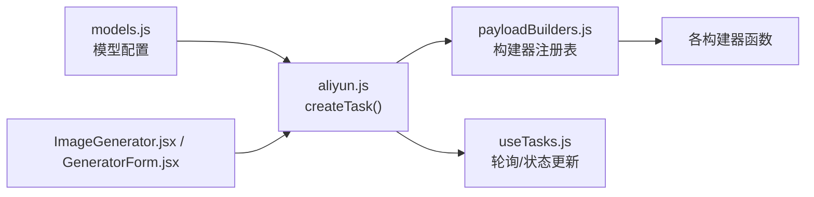

# 负载构建器

<cite>
**本文引用的文件列表**
- [payloadBuilders.js](file://src/services/payloadBuilders.js)
- [models.js](file://src/config/models.js)
- [aliyun.js](file://src/services/aliyun.js)
- [useTasks.js](file://src/hooks/useTasks.js)
- [ImageGenerator.jsx](file://src/components/ImageGenerator.jsx)
- [GeneratorForm.jsx](file://src/components/GeneratorForm.jsx)
- [apiConfig.js](file://src/config/apiConfig.js)
</cite>

## 目录
1. [简介](#简介)
2. [项目结构](#项目结构)
3. [核心组件](#核心组件)
4. [架构总览](#架构总览)
5. [详细组件分析](#详细组件分析)
6. [依赖关系分析](#依赖关系分析)
7. [性能考量](#性能考量)
8. [故障排查指南](#故障排查指南)
9. [结论](#结论)
10. [附录](#附录)

## 简介
本文件面向通义万相前端应用的“负载构建器”系统，系统性阐述 payloadBuilders.js 中定义的请求载荷构建器设计模式与实现机制。该系统采用“配置驱动 + 策略模式”的架构，通过统一的模型配置表与可插拔的构建器函数，实现对不同AI模型类型的动态请求载荷构造。文档覆盖以下要点：
- 如何根据不同模型能力动态构建标准化请求载荷
- 多种构建器工作机制与参数差异处理（必填/可选/默认值/校验）
- 构建器扩展指南（新增模型、修改构建逻辑、处理特殊参数格式）
- 错误处理、参数转换与性能优化建议

## 项目结构
与负载构建器直接相关的核心文件与职责如下：
- src/services/payloadBuilders.js：定义所有请求载荷构建器与构建器注册表
- src/config/models.js：定义模型配置、协议、输出类型、分辨率标签与各模型的能力开关
- src/services/aliyun.js：统一任务创建入口，依据模型配置选择构建器并发起请求
- src/hooks/useTasks.js：任务生命周期管理，负责轮询与结果解析
- src/components/ImageGenerator.jsx、src/components/GeneratorForm.jsx：UI层参数收集与传递
- src/config/apiConfig.js：API基础地址、超时与重试策略常量

图表来源
- [aliyun.js](file://src/services/aliyun.js#L50-L160)
- [payloadBuilders.js](file://src/services/payloadBuilders.js#L804-L829)
- [models.js](file://src/config/models.js#L1-L1012)

章节来源
- [payloadBuilders.js](file://src/services/payloadBuilders.js#L1-L829)
- [models.js](file://src/config/models.js#L1-L1012)
- [aliyun.js](file://src/services/aliyun.js#L1-L215)
- [useTasks.js](file://src/hooks/useTasks.js#L1-L333)
- [ImageGenerator.jsx](file://src/components/ImageGenerator.jsx#L1-L249)
- [GeneratorForm.jsx](file://src/components/GeneratorForm.jsx#L1-L208)
- [apiConfig.js](file://src/config/apiConfig.js#L1-L35)

## 核心组件
- 构建器注册表：集中导出所有构建器函数，并以字符串标识映射到对应函数，便于按模型配置动态选择
- 辅助工具函数：提取提示词、单/多图URL、构建多模态内容数组、按模型能力构建通用参数
- 模型配置：统一声明模型能力开关、默认分辨率、协议类型、输出类型、端点路径等

章节来源
- [payloadBuilders.js](file://src/services/payloadBuilders.js#L1-L119)
- [payloadBuilders.js](file://src/services/payloadBuilders.js#L804-L829)
- [models.js](file://src/config/models.js#L1-L1012)

## 架构总览
负载构建器遵循“配置驱动 + 策略模式”：
- 模型配置决定请求格式与端点
- 构建器根据模型能力与用户参数，组装标准化请求体
- 服务层统一发起请求并处理超时、重试与错误
- 任务钩子负责异步任务轮询与结果解析

图表来源
- [aliyun.js](file://src/services/aliyun.js#L50-L160)
- [payloadBuilders.js](file://src/services/payloadBuilders.js#L804-L829)
- [useTasks.js](file://src/hooks/useTasks.js#L164-L246)

## 详细组件分析

### 设计模式与策略选择
- 策略模式：每种模型类型对应一个构建器函数，统一输入输出接口，便于扩展与维护
- 配置驱动：模型配置决定端点、协议、请求格式、能力开关，构建器只关心参数映射与默认值
- 注册表：集中管理构建器，避免硬编码分支判断，提高可测试性与可维护性

章节来源
- [payloadBuilders.js](file://src/services/payloadBuilders.js#L804-L829)
- [models.js](file://src/config/models.js#L1-L1012)

### 辅助工具与通用参数构建
- 提示词提取：兼容 input.prompt、input.template、messages 第一项内容中的 text
- 单图/多图提取：兼容 image 与 image_url 字段，支持消息内容数组遍历
- 多模态内容构建：先拼接所有图片，再追加文本提示，保证顺序与兼容性
- 通用参数构建：按模型能力开关合并 size、n、prompt_extend、negative_prompt、watermark、seed、duration 等

章节来源
- [payloadBuilders.js](file://src/services/payloadBuilders.js#L11-L119)

### 视频类构建器

#### videoGeneration（标准文生视频）
- 输入：prompt（必填），可选 audio_url（需模型支持）、negative_prompt（需模型支持）
- 参数：duration 默认5；size 支持“480P/720P/1080P”或“宽*高”格式；prompt_extend 默认true；watermark 默认false
- 能力：根据模型能力开关决定是否注入 shot_type、seed

章节来源
- [payloadBuilders.js](file://src/services/payloadBuilders.js#L515-L571)
- [models.js](file://src/config/models.js#L39-L135)

#### imageToVideo（图生视频）
- 模板模式：当存在 template 时走模板模式，使用 template 与 img_url
- 普通模式：复用 videoGeneration 的逻辑，额外支持 img_url、first_frame_image、last_frame_image 的归一化
- 能力：根据模型能力决定是否支持音频、负向提示、帧选择等

章节来源
- [payloadBuilders.js](file://src/services/payloadBuilders.js#L577-L643)
- [models.js](file://src/config/models.js#L137-L216)

#### referenceToVideo（参考视频生视频）
- 输入：prompt（必填）、reference_video_urls（可选数组）、negative_prompt（可选）
- 参数：size、duration、shot_type、seed、watermark（可选）

章节来源
- [payloadBuilders.js](file://src/services/payloadBuilders.js#L649-L665)
- [models.js](file://src/config/models.js#L218-L239)

#### videoEditing（视频编辑统一模型）
- 输入：function（必填），prompt（必填），根据 function 类型附加不同参数
- 参数：size、duration、prompt_extend、obj_or_bg、seed、watermark

章节来源
- [payloadBuilders.js](file://src/services/payloadBuilders.js#L671-L709)
- [models.js](file://src/config/models.js#L242-L262)

### 图像类构建器

#### multimodalMessages（多模态消息）
- 输入：messages 数组，支持 image 与 image_url，最后追加 text
- 特殊处理：wan2.6-image 在无图片时启用 interleave 模式；qwen-image-edit 系列必须至少一张图片
- 参数：按模型能力合并通用参数

章节来源
- [payloadBuilders.js](file://src/services/payloadBuilders.js#L125-L150)
- [models.js](file://src/config/models.js#L265-L402)

#### text2image（标准文生图）
- 输入：prompt（必填），可选 negative_prompt
- 参数：size、n、prompt_extend、negative_prompt、watermark、seed、style（按能力）

章节来源
- [payloadBuilders.js](file://src/services/payloadBuilders.js#L156-L168)
- [models.js](file://src/config/models.js#L403-L557)

#### imageArraySynthesis（图像数组合成）
- 输入：prompt（必填），images（至少一张）
- 参数：size、n、prompt_extend、negative_prompt、watermark、seed

章节来源
- [payloadBuilders.js](file://src/services/payloadBuilders.js#L174-L190)
- [models.js](file://src/config/models.js#L361-L380)

#### functionImageEdit（函数式图像编辑）
- 输入：base_image_url（必填），prompt（必填），可选 mask_image_url
- 参数：size、n、prompt_extend、negative_prompt、watermark、seed、style

章节来源
- [payloadBuilders.js](file://src/services/payloadBuilders.js#L196-L220)
- [models.js](file://src/config/models.js#L329-L359)

#### sketchToImage（草图转图像）
- 输入：sketch_image_url（必填），prompt（必填）
- 参数：size 默认“768*768”，n 默认1，style、sketch_weight、sketch_extraction、sketch_color

章节来源
- [payloadBuilders.js](file://src/services/payloadBuilders.js#L226-L249)
- [models.js](file://src/config/models.js#L559-L578)

#### localRepaint（局部重绘）
- 输入：base_image_url（必填）、mask_image_url（必填）、prompt（必填）
- 参数：size 默认“1024*1024”，n 默认1，style、mask_color

章节来源
- [payloadBuilders.js](file://src/services/payloadBuilders.js#L255-L277)
- [models.js](file://src/config/models.js#L580-L599)

#### styleRepaint（风格重绘）
- 输入：image_url（必填）、style_index（必填），可选 style_ref_url
- 参数：size、n，默认1

章节来源
- [payloadBuilders.js](file://src/services/payloadBuilders.js#L300-L319)
- [models.js](file://src/config/models.js#L601-L618)

#### outPainting（图像扩展）
- 输入：image_url（必填）
- 参数：angle、output_ratio、x_scale、y_scale、top_offset、bottom_offset、left_offset、right_offset、best_quality、limit_image_size、add_watermark

章节来源
- [payloadBuilders.js](file://src/services/payloadBuilders.js#L325-L345)
- [models.js](file://src/config/models.js#L620-L645)

#### virtualModel（虚拟模特）
- 输入：template_image_url（必填）、shoe_image_url（必填）、scale（必填）
- 参数：n，默认1

章节来源
- [payloadBuilders.js](file://src/services/payloadBuilders.js#L351-L363)
- [models.js](file://src/config/models.js#L647-L664)

#### backgroundGeneration（背景生成）
- 输入：base_image_url（必填），可选 ref_image_url、ref_prompt
- 参数：n，默认1；model_version，默认“v3”；noise_level（当提供 ref_image_url 时默认300）；ref_prompt_weight（当同时提供 ref_image_url 与 ref_prompt 时默认0.5）

章节来源
- [payloadBuilders.js](file://src/services/payloadBuilders.js#L369-L398)
- [models.js](file://src/config/models.js#L666-L688)

#### aiTryon（AI试衣）
- 输入：person_image_url（必填），可选 top_garment_url、bottom_garment_url
- 参数：resolution，默认-1；restore_face，默认true

章节来源
- [payloadBuilders.js](file://src/services/payloadBuilders.js#L404-L425)
- [models.js](file://src/config/models.js#L689-L735)

#### wordartSemantic（文字语义变形）
- 输入：text 或 prompt（二者互换），prompt 或 text（二者互换）
- 参数：steps 默认30，n 默认2，output_image_ratio 默认“1024*1024”，可选 font_name、ttf_url

章节来源
- [payloadBuilders.js](file://src/services/payloadBuilders.js#L431-L454)
- [models.js](file://src/config/models.js#L737-L759)

#### wordartTexture（文字纹理）
- 输入：image_url 或 text（二选一）
- 图像输入模式：input.image.image_url、prompt、texture_style；参数 n 默认1
- 文本输入模式：input.text.text_content、font_name、output_image_ratio；参数 image_short_size 默认704、n 默认1、alpha_channel 默认false；可选 ref_image_url
- 输出：移除未定义字段，避免API错误

章节来源
- [payloadBuilders.js](file://src/services/payloadBuilders.js#L460-L509)
- [models.js](file://src/config/models.js#L761-L787)

### 参数差异与默认值处理
- 必填参数：多数构建器对关键输入（如 base_image_url、image_url、prompt、template、style_index 等）进行显式校验并抛出错误
- 可选参数：通过模型能力开关决定是否注入；若未提供且模型支持，则按默认值填充
- 默认值：针对分辨率、输出数量、步数、水印、种子等常见参数设定合理默认值
- 参数归一化：如 img_url 与 image_url、first_frame_url 与 first_frame_image 的互换映射

章节来源
- [payloadBuilders.js](file://src/services/payloadBuilders.js#L174-L249)
- [payloadBuilders.js](file://src/services/payloadBuilders.js#L577-L643)
- [payloadBuilders.js](file://src/services/payloadBuilders.js#L460-L509)

### 错误处理与参数转换
- 显式校验：对必填参数缺失抛出明确错误信息，帮助用户定位问题
- 参数转换：将人类可读分辨率标签映射为“宽*高”格式；将 messages 内容数组转换为统一结构
- 输出清理：wordartTexture 构建器在最终输出前移除未定义字段，避免API报错

章节来源
- [payloadBuilders.js](file://src/services/payloadBuilders.js#L136-L138)
- [payloadBuilders.js](file://src/services/payloadBuilders.js#L544-L551)
- [payloadBuilders.js](file://src/services/payloadBuilders.js#L504-L507)

### 性能与可用性优化
- 构建器内部避免重复计算：通用参数构建函数按能力开关一次性合并
- 参数归一化减少API层分支：如 img_url 归一化为 image_url，first_frame_url 归一化为 first_frame_image
- UI层参数收集：ImageGenerator.jsx 与 GeneratorForm.jsx 将用户输入标准化为统一结构，降低构建器复杂度

章节来源
- [payloadBuilders.js](file://src/services/payloadBuilders.js#L77-L119)
- [payloadBuilders.js](file://src/services/payloadBuilders.js#L577-L643)
- [ImageGenerator.jsx](file://src/components/ImageGenerator.jsx#L32-L48)
- [GeneratorForm.jsx](file://src/components/GeneratorForm.jsx#L66-L80)

## 依赖关系分析

图表来源
- [models.js](file://src/config/models.js#L1-L1012)
- [aliyun.js](file://src/services/aliyun.js#L50-L160)
- [payloadBuilders.js](file://src/services/payloadBuilders.js#L804-L829)
- [useTasks.js](file://src/hooks/useTasks.js#L164-L246)

章节来源
- [models.js](file://src/config/models.js#L1-L1012)
- [aliyun.js](file://src/services/aliyun.js#L1-L215)
- [payloadBuilders.js](file://src/services/payloadBuilders.js#L1-L829)
- [useTasks.js](file://src/hooks/useTasks.js#L1-L333)

## 性能考量
- 构建器复杂度：大多数构建器为O(n)（n为消息内容项数量），多图提取与内容拼接成本低
- 通用参数构建：按能力开关合并，避免冗余字段，减少请求体体积
- 超时与重试：服务层统一超时与指数退避重试，提升网络不稳定环境下的成功率
- 轮询策略：useTasks.js 采用自适应轮询间隔，新任务快速轮询，长时间任务逐步降频

章节来源
- [aliyun.js](file://src/services/aliyun.js#L20-L36)
- [useTasks.js](file://src/hooks/useTasks.js#L87-L104)

## 故障排查指南
- 未知模型/未知请求格式：服务层在创建任务时校验模型与请求格式，若不存在会抛出明确错误
- 网络错误/超时：服务层对网络错误与超时进行捕获与分类，便于前端展示友好提示
- 同步/异步响应差异：同步多模态响应结构与异步任务结构不同，轮询钩子已做兼容处理
- 参数缺失：构建器对必填参数进行显式校验，错误信息包含模型名称与缺失字段，便于定位

章节来源
- [aliyun.js](file://src/services/aliyun.js#L54-L68)
- [aliyun.js](file://src/services/aliyun.js#L146-L159)
- [payloadBuilders.js](file://src/services/payloadBuilders.js#L178-L202)
- [useTasks.js](file://src/hooks/useTasks.js#L164-L246)

## 结论
负载构建器系统通过“配置驱动 + 策略模式”，实现了对多模型、多任务类型的统一抽象与灵活扩展。其优势在于：
- 构建器职责单一、易于测试与维护
- 模型能力开关与默认值策略清晰，降低API差异带来的复杂度
- 服务层与任务钩子解耦，便于统一错误处理与性能优化

## 附录

### 扩展指南：新增模型支持
- 步骤1：在模型配置中新增条目，填写 id、name、provider、description、protocol、endpoint、requestFormat、outputType、defaultRes、resolutions、capabilities
- 步骤2：在 payloadBuilders.js 中新增对应的构建器函数，遵循现有模式（参数提取、能力开关、默认值、校验）
- 步骤3：在构建器注册表中导出并注册新构建器
- 步骤4：在 UI 层（如 ImageGenerator.jsx/GeneratorForm.jsx）补充必要的参数控件与默认值
- 步骤5：在服务层与任务钩子无需改动即可生效

章节来源
- [models.js](file://src/config/models.js#L1-L1012)
- [payloadBuilders.js](file://src/services/payloadBuilders.js#L804-L829)
- [ImageGenerator.jsx](file://src/components/ImageGenerator.jsx#L32-L48)
- [GeneratorForm.jsx](file://src/components/GeneratorForm.jsx#L66-L80)

### 修改现有构建逻辑
- 若需调整某模型的默认参数或能力开关，直接在 models.js 对应模型条目中修改
- 若需变更参数映射或校验规则，集中在 payloadBuilders.js 对应构建器中修改
- 若需引入新的参数格式（如新的消息内容类型），在辅助函数中扩展提取逻辑

章节来源
- [models.js](file://src/config/models.js#L1-L1012)
- [payloadBuilders.js](file://src/services/payloadBuilders.js#L11-L119)

### 特殊参数格式处理
- 多模态消息：先拼接所有图片，再追加文本，保证顺序与兼容性
- 分辨率映射：将“480P/720P/1080P”映射为“宽*高”
- 字段归一化：img_url、first_frame_url 等归一化为 API 所需字段名

章节来源
- [payloadBuilders.js](file://src/services/payloadBuilders.js#L53-L72)
- [payloadBuilders.js](file://src/services/payloadBuilders.js#L544-L551)
- [payloadBuilders.js](file://src/services/payloadBuilders.js#L621-L633)