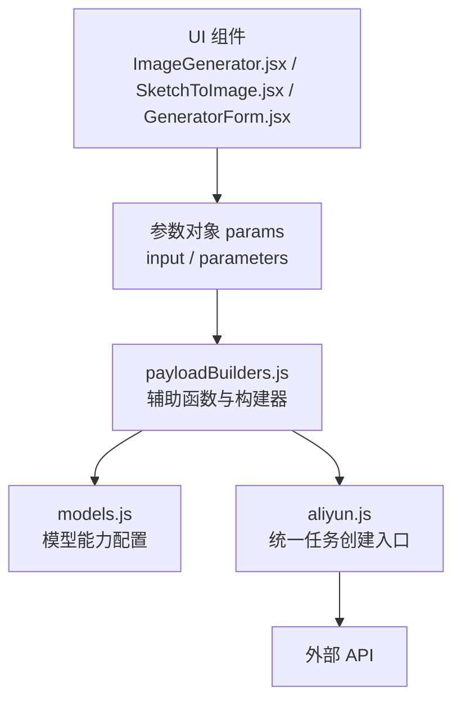
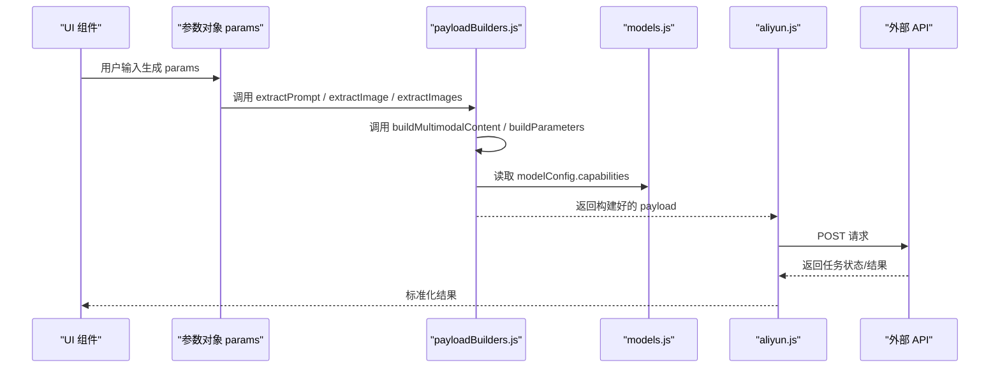
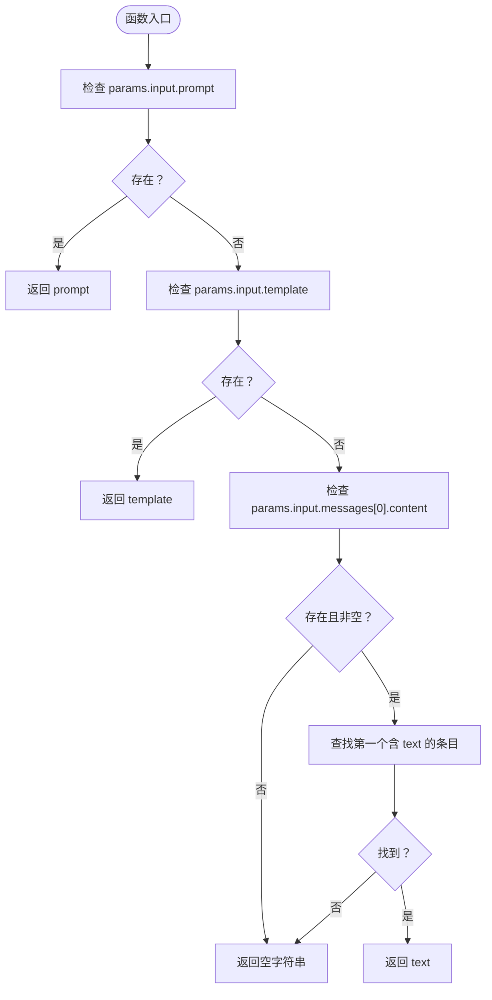
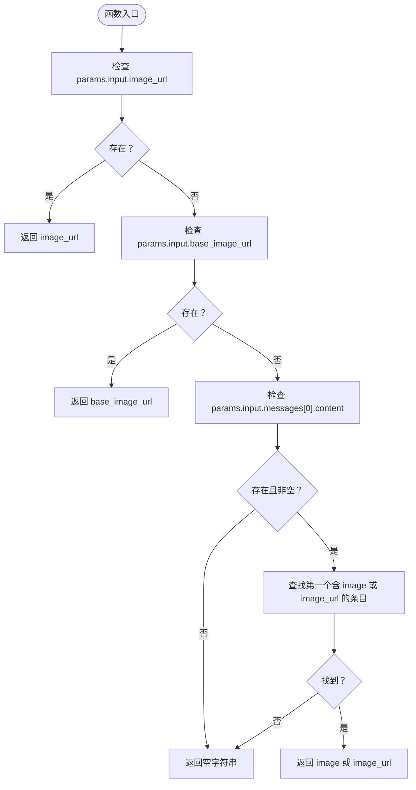
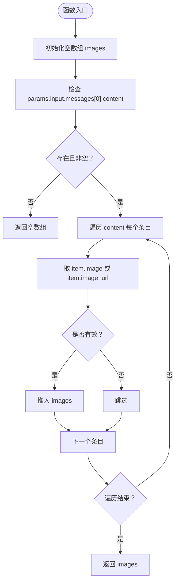
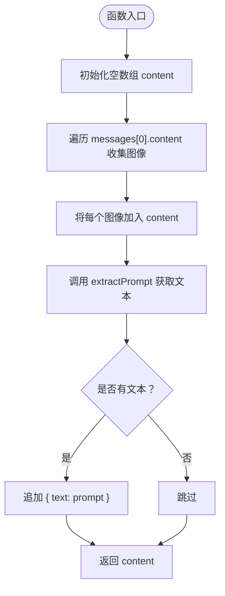
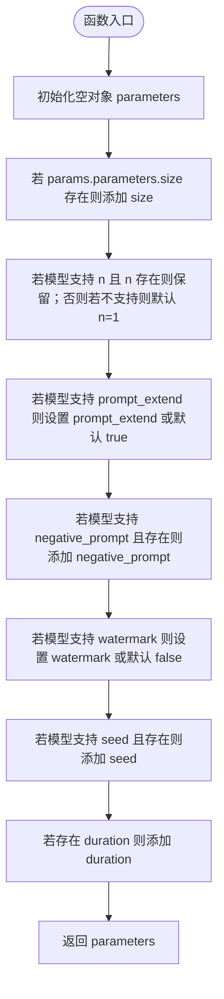
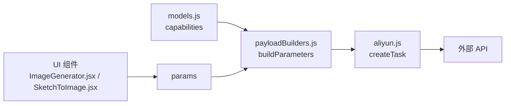

# 辅助函数

<cite>
**本文引用的文件列表**
- [payloadBuilders.js](file://src/services/payloadBuilders.js)
- [models.js](file://src/config/models.js)
- [aliyun.js](file://src/services/aliyun.js)
- [ImageGenerator.jsx](file://src/components/ImageGenerator.jsx)
- [SketchToImage.jsx](file://src/components/SketchToImage.jsx)
- [GeneratorForm.jsx](file://src/components/GeneratorForm.jsx)
</cite>

## 目录
1. [简介](#简介)
2. [项目结构](#项目结构)
3. [核心组件](#核心组件)
4. [架构概览](#架构概览)
5. [详细组件分析](#详细组件分析)
6. [依赖关系分析](#依赖关系分析)
7. [性能考量](#性能考量)
8. [故障排查指南](#故障排查指南)
9. [结论](#结论)
10. [附录](#附录)

## 简介
本文件聚焦于负载构建器中的核心辅助函数，系统性阐述以下五个关键函数的设计原理与实现细节：
- extractPrompt：从不同参数结构中提取文本提示词，兼容 params.input.prompt、params.input.template 与 params.input.messages 的混合式多模态结构。
- extractImage：从多种图像URL字段名中提取单个图像地址，包括 image_url、base_image_url，并支持从消息内容数组中解析图像资源。
- extractImages：批量提取消息内容数组中的所有图像URL，支持 item.image 与 item.image_url 两种字段形式。
- buildMultimodalContent：构建多模态内容数组，确保图像资源优先、文本提示词后置的顺序处理。
- buildParameters：依据模型配置能力动态构建通用参数，包括尺寸、输出数量、负向提示词、水印、种子等参数的条件性添加。

同时提供使用示例与扩展指南，帮助开发者在新增模型或调整参数时快速适配。

## 项目结构
该功能位于服务层，采用“策略模式”组织不同模型的请求体构造逻辑，核心文件如下：
- src/services/payloadBuilders.js：定义并导出所有负载构建器与辅助函数。
- src/config/models.js：模型能力与协议配置，为 buildParameters 提供能力开关。
- src/services/aliyun.js：统一的任务创建入口，按模型配置选择对应的构建器。
- src/components/*：UI 组件负责收集用户输入，形成 params 结构，交由构建器处理。

图表来源
- [payloadBuilders.js](file://src/services/payloadBuilders.js#L1-L829)
- [models.js](file://src/config/models.js#L1-L1012)
- [aliyun.js](file://src/services/aliyun.js#L1-L215)

章节来源
- [payloadBuilders.js](file://src/services/payloadBuilders.js#L1-L829)
- [models.js](file://src/config/models.js#L1-L1012)
- [aliyun.js](file://src/services/aliyun.js#L1-L215)

## 核心组件
本节概述五个核心辅助函数的功能定位与交互关系。

- extractPrompt：从 params.input 中抽取文本提示词，优先级为 prompt > template > messages[0].content 中的 text。
- extractImage：从 params.input 中抽取单个图像URL，优先级为 image_url > base_image_url > messages[0].content 中的 image 或 image_url。
- extractImages：遍历 messages[0].content，收集所有图像URL，支持 item.image 与 item.image_url。
- buildMultimodalContent：先收集所有图像，再追加文本提示词，保证多模态消息的顺序正确。
- buildParameters：根据 modelConfig.capabilities 动态拼装参数，仅在模型支持时添加对应字段；对 n、size、seed 等参数做条件性处理。

章节来源
- [payloadBuilders.js](file://src/services/payloadBuilders.js#L11-L119)

## 架构概览
下图展示从 UI 输入到最终请求体生成的关键流程，突出辅助函数在其中的作用。

图表来源
- [payloadBuilders.js](file://src/services/payloadBuilders.js#L11-L119)
- [models.js](file://src/config/models.js#L1-L1012)
- [aliyun.js](file://src/services/aliyun.js#L50-L160)

章节来源
- [aliyun.js](file://src/services/aliyun.js#L50-L160)

## 详细组件分析

### extractPrompt：文本提示词提取
- 设计目标：兼容多种输入形态，确保在不同 UI 场景下都能稳定提取文本提示词。
- 实现要点：
  - 优先从 params.input.prompt 获取文本。
  - 若无，则回退到 params.input.template。
  - 若仍无，尝试从 params.input.messages[0].content 中查找第一个包含 text 的条目。
  - 默认返回空字符串，避免后续处理报错。
- 复杂度：O(k)，k 为 messages[0].content 的长度；最坏情况遍历一次数组。
- 错误处理：若所有路径均为空，返回空字符串，调用方需自行判断是否需要提示用户输入。

图表来源
- [payloadBuilders.js](file://src/services/payloadBuilders.js#L11-L19)

章节来源
- [payloadBuilders.js](file://src/services/payloadBuilders.js#L11-L19)

### extractImage：单图像URL提取
- 设计目标：从多种可能的字段名中提取单个图像URL，覆盖编辑类与草图类模型的输入差异。
- 实现要点：
  - 优先从 params.input.image_url 获取。
  - 若无，则回退到 params.input.base_image_url。
  - 若仍无，尝试从 params.input.messages[0].content 中查找第一个包含 image 或 image_url 的条目。
  - 默认返回空字符串。
- 复杂度：O(k)，k 为 messages[0].content 的长度；最坏情况遍历一次数组。
- 错误处理：若所有路径均为空，返回空字符串，调用方可据此抛出“必须上传图片”的错误。

图表来源
- [payloadBuilders.js](file://src/services/payloadBuilders.js#L24-L33)

章节来源
- [payloadBuilders.js](file://src/services/payloadBuilders.js#L24-L33)

### extractImages：多图像URL提取
- 设计目标：从消息内容数组中提取所有图像URL，支持多图输入场景（如图像合成、局部重绘等）。
- 实现要点：
  - 遍历 params.input.messages[0].content。
  - 对每个条目，优先取 item.image，其次取 item.image_url。
  - 将有效URL推入数组并返回。
- 复杂度：O(k)，k 为 messages[0].content 的长度；线性扫描。
- 错误处理：忽略无效项，返回非空数组，调用方可据此校验“至少需要 N 张图片”。

图表来源
- [payloadBuilders.js](file://src/services/payloadBuilders.js#L38-L48)

章节来源
- [payloadBuilders.js](file://src/services/payloadBuilders.js#L38-L48)

### buildMultimodalContent：多模态内容构建
- 设计目标：构建多模态消息的 content 数组，确保图像资源优先、文本提示词后置，满足不同模型的消息结构要求。
- 实现要点：
  - 先遍历 messages[0].content，收集所有图像（item.image 或 item.image_url），按 { image: url } 形式加入 content。
  - 再调用 extractPrompt 获取文本提示词，若存在则追加 { text: prompt }。
  - 返回最终 content 数组。
- 复杂度：O(k)，k 为 messages[0].content 的长度；两次线性扫描（图像收集 + 文本追加）。
- 错误处理：若无图像且模型要求至少一张图片，应在上层构建器中显式校验并抛错。

图表来源
- [payloadBuilders.js](file://src/services/payloadBuilders.js#L53-L72)

章节来源
- [payloadBuilders.js](file://src/services/payloadBuilders.js#L53-L72)

### buildParameters：通用参数动态构建
- 设计目标：根据模型能力开关动态拼装参数，避免向 API 传递不支持的字段，减少无效参数导致的错误。
- 实现要点（逐项说明）：
  - 尺寸/分辨率 size：若 params.parameters.size 存在则直接使用。
  - 输出数量 n：若模型 capabilities.n 为真且 params.parameters.n 存在则保留；否则若模型不支持 n，则默认 n=1。
  - 提示词扩展 prompt_extend：若模型 capabilities.prompt_extend 存在，则使用 params.parameters.prompt_extend 或默认 true。
  - 负向提示词 negative_prompt：仅当模型 capabilities.negative_prompt 为真且 params.parameters.negative_prompt 存在时才添加。
  - 水印 watermark：若模型 capabilities.watermark 存在，则使用 params.parameters.watermark 或默认 false。
  - 种子 seed：若模型 capabilities.seed 为真且 params.parameters.seed 存在则添加。
  - 时长 duration：若 params.parameters.duration 存在则添加（视频类模型常用）。
- 复杂度：O(1)，常数时间参数映射。
- 错误处理：通过 capabilities 开关避免传递不支持字段；调用方可根据模型能力决定是否显示相关 UI。

图表来源
- [payloadBuilders.js](file://src/services/payloadBuilders.js#L77-L119)

章节来源
- [payloadBuilders.js](file://src/services/payloadBuilders.js#L77-L119)

## 依赖关系分析
- payloadBuilders.js 依赖 models.js 的 capabilities 字段来决定参数拼装策略。
- aliyun.js 在创建任务时，根据模型配置选择对应的构建器（如 multimodalMessages、text2image 等），并将 params 与 modelConfig 传入构建器。
- UI 组件负责收集用户输入，形成 params 结构，交由构建器处理。

图表来源
- [payloadBuilders.js](file://src/services/payloadBuilders.js#L77-L119)
- [models.js](file://src/config/models.js#L1-L1012)
- [aliyun.js](file://src/services/aliyun.js#L50-L160)

章节来源
- [aliyun.js](file://src/services/aliyun.js#L50-L160)

## 性能考量
- 时间复杂度：
  - extractPrompt/extractImage/extractImages/buildMultimodalContent 均为 O(k)，k 为 messages[0].content 的长度；通常内容规模较小，影响有限。
  - buildParameters 为 O(1)，参数映射开销极低。
- 空间复杂度：
  - extractImages 会创建一个新数组存储图像URL，最坏情况下与输入条目数量同阶。
  - 其余函数仅使用常数额外空间。
- 优化建议：
  - 若 UI 层能提前过滤无效条目，可减少构建器内部的遍历成本。
  - 对于大规模多模态消息，可在 UI 层限制 content 条目数量，避免过长的消息数组。

## 故障排查指南
- “必须上传至少一张图片”错误
  - 触发场景：某些模型（如 qwen-image-edit 系列）要求至少一张图片；wan2.6-image 在无图像时需启用 interleave 模式。
  - 定位方法：检查构建器中对 hasImages 的判断与模型 capabilities.enable_interleave 的处理。
  - 解决方案：确保 UI 已上传图像，或在无图像时启用 interleave 模式。
- “未知模型/未知请求格式”错误
  - 触发场景：模型 ID 不存在或 requestFormat 未注册。
  - 定位方法：确认 models.js 中是否存在该模型配置，以及 payloadBuilders.js 是否导出了对应构建器。
  - 解决方案：补充模型配置或修正模型 ID。
- “API 错误：参数不支持”
  - 触发场景：向 API 传递了模型不支持的参数（如 n、seed 等）。
  - 定位方法：检查 buildParameters 中的 capabilities 开关是否生效。
  - 解决方案：移除不支持的参数，或在 UI 中隐藏相关选项。

章节来源
- [payloadBuilders.js](file://src/services/payloadBuilders.js#L125-L150)
- [payloadBuilders.js](file://src/services/payloadBuilders.js#L174-L190)
- [aliyun.js](file://src/services/aliyun.js#L50-L160)

## 结论
上述五个辅助函数构成了负载构建器的核心基础设施，通过策略化的参数提取与动态参数拼装，实现了对多模型、多输入形态的统一支持。其设计遵循“最小暴露面、最大兼容性”的原则：在 UI 层尽可能简化输入，在服务层通过辅助函数屏蔽差异，最终生成标准化的请求体。配合模型配置的能力开关，既保证了灵活性，又避免了无效参数带来的错误。

## 附录

### 使用示例与扩展指南

- 文生图（text2image）
  - 输入结构：params.input.prompt、params.parameters.size/n/style 等。
  - 关键点：extractPrompt 从 prompt/template/messages 中提取文本；buildParameters 根据模型能力拼装 n/style。
  - 示例路径：[payloadBuilders.js](file://src/services/payloadBuilders.js#L156-L168)

- 多模态消息（multimodalMessages）
  - 输入结构：params.input.messages，其中 content 包含 text 与 image/image_url。
  - 关键点：buildMultimodalContent 先图像后文本；extractImage/extractImages 用于单图/多图场景。
  - 示例路径：[payloadBuilders.js](file://src/services/payloadBuilders.js#L125-L150)

- 图像编辑（functionImageEdit）
  - 输入结构：params.input.function/base_image_url/mask_image_url/prompt。
  - 关键点：extractImage 获取 base_image_url；mask_image_url 可选添加。
  - 示例路径：[payloadBuilders.js](file://src/services/payloadBuilders.js#L196-L220)

- 草图生图（sketchToImage）
  - 输入结构：params.input.messages（含 text 与 image_url）或 params.input.base_image_url。
  - 关键点：SketchToImage.jsx 已构造 messages 结构；extractPrompt/extractImage 用于提取。
  - 示例路径：[SketchToImage.jsx](file://src/components/SketchToImage.jsx#L90-L132)

- 视频生成（videoGeneration）
  - 输入结构：params.input.prompt/audio_url/negative_prompt；params.parameters.size/duration/prompt_extend/watermark/seed。
  - 关键点：buildParameters 根据模型 capabilities 动态拼装；size 支持标签映射为具体分辨率。
  - 示例路径：[payloadBuilders.js](file://src/services/payloadBuilders.js#L515-L571)

- 新增模型的扩展步骤
  - 在 models.js 中添加模型配置，设置 capabilities 开关与默认参数。
  - 在 payloadBuilders.js 中实现对应的构建器（或复用现有辅助函数）。
  - 在 UI 组件中提供必要的输入控件，并将用户输入整理为 params 结构。
  - 在 aliyun.js 中无需修改，会自动根据模型配置选择构建器。

章节来源
- [payloadBuilders.js](file://src/services/payloadBuilders.js#L125-L249)
- [SketchToImage.jsx](file://src/components/SketchToImage.jsx#L90-L132)
- [ImageGenerator.jsx](file://src/components/ImageGenerator.jsx#L32-L48)
- [GeneratorForm.jsx](file://src/components/GeneratorForm.jsx#L66-L80)