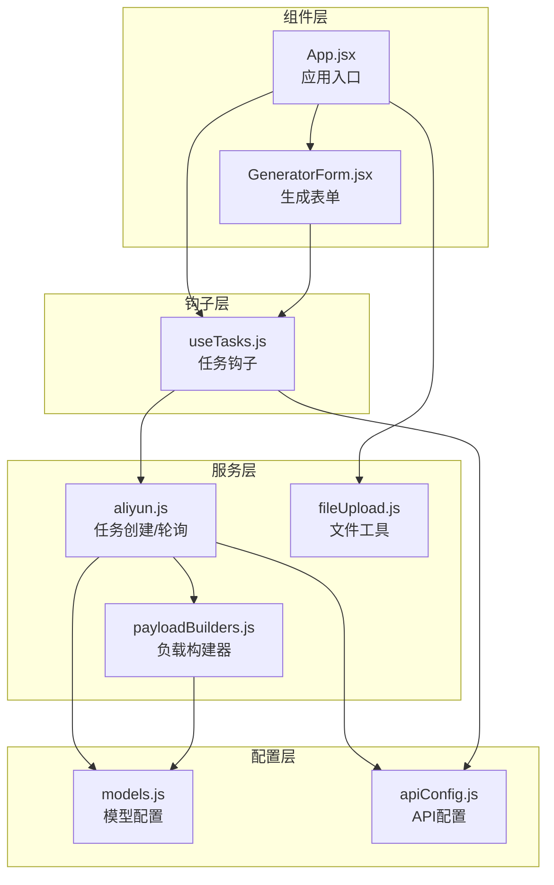
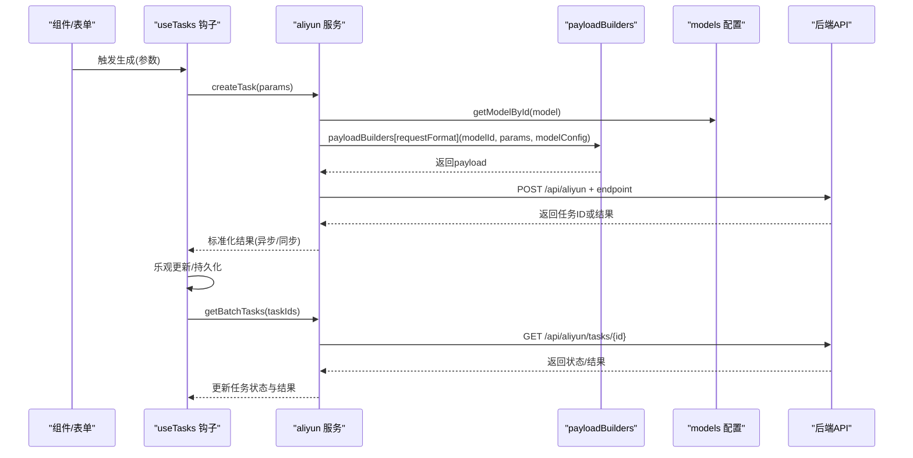
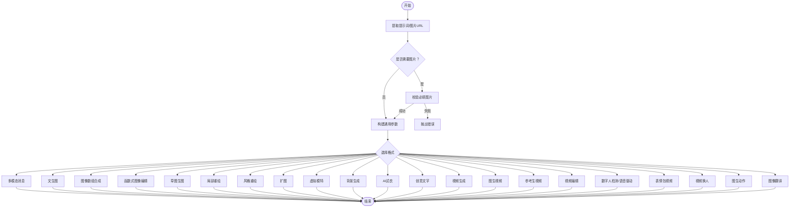
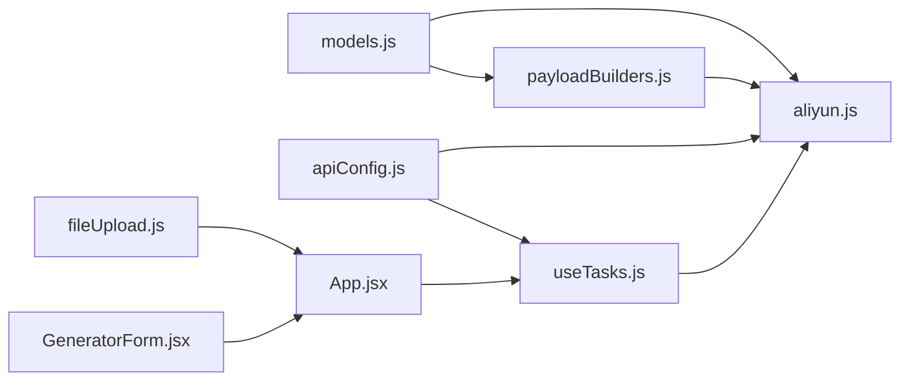

# 配置系统

<cite>
**本文引用的文件列表**
- [models.js](file://src/config/models.js)
- [apiConfig.js](file://src/config/apiConfig.js)
- [payloadBuilders.js](file://src/services/payloadBuilders.js)
- [aliyun.js](file://src/services/aliyun.js)
- [useTasks.js](file://src/hooks/useTasks.js)
- [fileUpload.js](file://src/utils/fileUpload.js)
- [App.jsx](file://src/App.jsx)
- [GeneratorForm.jsx](file://src/components/GeneratorForm.jsx)
</cite>

## 目录
1. [简介](#简介)
2. [项目结构](#项目结构)
3. [核心组件](#核心组件)
4. [架构总览](#架构总览)
5. [详细组件分析](#详细组件分析)
6. [依赖关系分析](#依赖关系分析)
7. [性能考量](#性能考量)
8. [故障排查指南](#故障排查指南)
9. [结论](#结论)
10. [附录](#附录)

## 简介
本文件面向通义万相前端应用的配置系统，系统性梳理了模型配置、API配置、负载构建器与任务轮询机制的设计与实现，帮助开发者理解如何扩展新的AI模型、定制配置选项，并在保证性能与可靠性的同时，实现稳定的异步任务管理。

## 项目结构
配置系统主要由以下模块组成：
- 模型配置：集中定义协议、输出类型、分辨率标签、模型分类与各模型的端点、请求格式、能力集等
- API配置：统一管理基础URL、超时、重试、轮询策略与本地存储键名
- 负载构建器：采用策略模式，按模型请求格式动态构造请求载荷
- 服务层：封装创建任务、轮询状态、批量轮询与重试逻辑
- 钩子层：任务生命周期管理、本地存储、自适应轮询与乐观更新
- 工具层：文件上传与校验，支持URL、Base64与File对象
- 组件层：表单与页面布局，负责收集用户输入并触发任务

图表来源
- [models.js](file://src/config/models.js#L1-L1012)
- [apiConfig.js](file://src/config/apiConfig.js#L1-L35)
- [payloadBuilders.js](file://src/services/payloadBuilders.js#L1-L829)
- [aliyun.js](file://src/services/aliyun.js#L1-L215)
- [useTasks.js](file://src/hooks/useTasks.js#L1-L333)
- [fileUpload.js](file://src/utils/fileUpload.js#L1-L182)
- [App.jsx](file://src/App.jsx#L1-L377)
- [GeneratorForm.jsx](file://src/components/GeneratorForm.jsx#L1-L208)

章节来源
- [models.js](file://src/config/models.js#L1-L1012)
- [apiConfig.js](file://src/config/apiConfig.js#L1-L35)
- [payloadBuilders.js](file://src/services/payloadBuilders.js#L1-L829)
- [aliyun.js](file://src/services/aliyun.js#L1-L215)
- [useTasks.js](file://src/hooks/useTasks.js#L1-L333)
- [fileUpload.js](file://src/utils/fileUpload.js#L1-L182)
- [App.jsx](file://src/App.jsx#L1-L377)
- [GeneratorForm.jsx](file://src/components/GeneratorForm.jsx#L1-L208)

## 核心组件
- 模型配置系统
  - 协议常量：同步多模态、异步文生图、异步视频、异步图生视频、异步参考生视频、视频编辑统一模型、语音驱动视频
  - 输出类型：图像、视频
  - 分类：文生图、图像编辑、图像合成、特效类、创意类
  - 分辨率标签：480P/720P/1080P及常见宽高比
  - 模型数组：视频模型、图生视频模型、参考生视频、视频编辑统一模型、图像模型、数字人模型、图像翻译模型
  - 辅助：样式列表、视频特效模板、按ID查询模型
- API配置系统
  - 基础URL、请求与轮询超时、重试次数与指数退避、轮询间隔与最大间隔、状态终止条件、本地存储键名
- 负载构建器
  - 策略模式：按请求格式映射到对应构建函数，自动注入模型ID、参数与能力集
  - 通用辅助：提取提示词、单/多图URL、构建多模态内容、通用参数装配
  - 典型格式：多模态消息、标准文生图、图像数组合成、函数式图像编辑、草图生图、局部重绘、风格重绘、扩图、虚拟模特、背景生成、AI试衣、创意文字、视频生成、图生视频、参考生视频、视频编辑、数字人检测/语音驱动、表情包视频、视频换人、图生动作、图像翻译
- 服务层
  - 创建任务：解析模型配置、选择构建器、构造请求、超时控制、异步/同步结果标准化
  - 轮询：单个/批量轮询，超时控制，错误处理
  - 重试：网络错误与超时自动重试，禁用对校验错误与未知模型的重试
- 钩子层
  - 任务持久化：本地存储清理Base64，迁移历史数据，容量不足时截断
  - 自适应轮询：新任务快速轮询，长时间任务逐步降低频率
  - 乐观更新：临时ID占位，成功后替换真实任务ID并回填结果
  - 批量轮询：并发检查多个任务状态，合并更新
- 工具层
  - 文件上传：大图压缩、Base64转换、URL/文件/对象输入处理、类型与大小校验

章节来源
- [models.js](file://src/config/models.js#L1-L1012)
- [apiConfig.js](file://src/config/apiConfig.js#L1-L35)
- [payloadBuilders.js](file://src/services/payloadBuilders.js#L1-L829)
- [aliyun.js](file://src/services/aliyun.js#L1-L215)
- [useTasks.js](file://src/hooks/useTasks.js#L1-L333)
- [fileUpload.js](file://src/utils/fileUpload.js#L1-L182)

## 架构总览
配置系统通过“配置驱动 + 策略模式”的方式实现高扩展性：
- 配置驱动：模型配置决定端点、请求格式、能力集与输出类型
- 策略模式：负载构建器按请求格式分别实现，新增模型只需在配置中声明请求格式并在构建器中实现对应格式
- 服务层：统一封装网络请求、超时与重试；异步/同步结果标准化
- 钩子层：统一任务生命周期管理、本地存储与轮询策略

图表来源
- [aliyun.js](file://src/services/aliyun.js#L50-L160)
- [payloadBuilders.js](file://src/services/payloadBuilders.js#L125-L150)
- [models.js](file://src/config/models.js#L1011-L1012)
- [useTasks.js](file://src/hooks/useTasks.js#L164-L246)

章节来源
- [aliyun.js](file://src/services/aliyun.js#L1-L215)
- [payloadBuilders.js](file://src/services/payloadBuilders.js#L1-L829)
- [models.js](file://src/config/models.js#L1-L1012)
- [useTasks.js](file://src/hooks/useTasks.js#L1-L333)

## 详细组件分析

### 模型配置系统（models.js）
- 设计要点
  - 协议与输出类型：统一抽象不同协议与输出类型，便于服务层与UI层识别
  - 模型分类：用于UI筛选与功能归类
  - 分辨率标签：统一分辨率表达，便于构建器转换为具体尺寸
  - 能力集：按模型能力启用/禁用参数，避免无效参数导致API错误
  - 模型数组：按功能域划分，集中维护，便于扩展
  - 查询工具：按ID查找模型，供服务层与UI层使用
- 数据结构复杂度
  - 模型数组规模与查询：线性遍历查找模型，适合当前规模；若模型数量增长，可考虑建立ID到索引的映射以降低查询成本
- 依赖链
  - 服务层通过ID查询模型配置
  - 负载构建器根据请求格式选择构建函数
  - UI层根据分类与能力集渲染界面
- 优化建议
  - 对ALL_MODELS建立索引映射，减少查找开销
  - 将能力集与默认参数抽离为独立配置，便于统一校验与默认值填充

章节来源
- [models.js](file://src/config/models.js#L1-L1012)

### API配置系统（apiConfig.js）
- 超时与重试
  - 请求超时：针对创建任务的长请求设置较长超时
  - 轮询超时：针对轮询接口设置较短超时，避免阻塞
  - 重试策略：最大尝试次数、初始延迟与指数退避，避免对校验错误与未知模型重试
- 轮询策略
  - 初始间隔、常规间隔、最大间隔与终止状态集合，支持自适应轮询
- 存储配置
  - 任务存储键、API密钥存储键、历史任务迁移键，保障数据兼容与持久化

章节来源
- [apiConfig.js](file://src/config/apiConfig.js#L1-L35)

### 负载构建器（payloadBuilders.js）
- 设计模式
  - 策略模式：每个请求格式对应一个构建函数，新增模型只需在配置中声明请求格式并在构建器中实现
- 通用辅助
  - 提取提示词、单/多图URL、构建多模态内容、通用参数装配（尺寸、输出数量、负向提示、水印、种子、时长等）
- 典型流程
  - 多模态消息：校验必填项（如图像编辑需至少一张图片），支持文本与图像混合
  - 文生图：支持风格参数与通用参数
  - 图像数组合成：校验至少一张图片
  - 函数式图像编辑：校验基准图片，支持掩码
  - 草图生图/局部重绘/风格重绘/扩图/虚拟模特/背景生成/AI试衣/创意文字/视频生成/图生视频/参考生视频/视频编辑/数字人检测/语音驱动/表情包视频/视频换人/图生动作/图像翻译：按各自能力集与输入要求构造payload
- 错误处理
  - 必填项缺失时抛出明确错误信息，便于上层捕获与提示

图表来源
- [payloadBuilders.js](file://src/services/payloadBuilders.js#L125-L150)
- [payloadBuilders.js](file://src/services/payloadBuilders.js#L156-L168)
- [payloadBuilders.js](file://src/services/payloadBuilders.js#L174-L190)
- [payloadBuilders.js](file://src/services/payloadBuilders.js#L196-L220)
- [payloadBuilders.js](file://src/services/payloadBuilders.js#L226-L249)
- [payloadBuilders.js](file://src/services/payloadBuilders.js#L255-L277)
- [payloadBuilders.js](file://src/services/payloadBuilders.js#L300-L319)
- [payloadBuilders.js](file://src/services/payloadBuilders.js#L325-L345)
- [payloadBuilders.js](file://src/services/payloadBuilders.js#L351-L363)
- [payloadBuilders.js](file://src/services/payloadBuilders.js#L369-L398)
- [payloadBuilders.js](file://src/services/payloadBuilders.js#L404-L425)
- [payloadBuilders.js](file://src/services/payloadBuilders.js#L431-L454)
- [payloadBuilders.js](file://src/services/payloadBuilders.js#L515-L571)
- [payloadBuilders.js](file://src/services/payloadBuilders.js#L577-L643)
- [payloadBuilders.js](file://src/services/payloadBuilders.js#L649-L665)
- [payloadBuilders.js](file://src/services/payloadBuilders.js#L671-L709)
- [payloadBuilders.js](file://src/services/payloadBuilders.js#L715-L723)
- [payloadBuilders.js](file://src/services/payloadBuilders.js#L729-L742)
- [payloadBuilders.js](file://src/services/payloadBuilders.js#L748-L762)
- [payloadBuilders.js](file://src/services/payloadBuilders.js#L768-L780)
- [payloadBuilders.js](file://src/services/payloadBuilders.js#L786-L798)
- [payloadBuilders.js](file://src/services/payloadBuilders.js#L283-L294)

章节来源
- [payloadBuilders.js](file://src/services/payloadBuilders.js#L1-L829)

### 服务层（aliyun.js）
- 创建任务
  - 解析模型配置与请求格式，选择构建器，构造payload
  - 超时控制：Promise.race实现请求超时
  - 异步/同步结果标准化：异步返回任务ID与状态，同步返回首个结果URL
  - 错误处理：区分网络错误、超时、未知模型与API错误
- 轮询
  - 单个/批量轮询，超时控制，错误处理
- 重试
  - 对网络错误与超时进行有限次数与指数退避的重试，禁用对校验错误与未知模型的重试

章节来源
- [aliyun.js](file://src/services/aliyun.js#L1-L215)

### 钩子层（useTasks.js）
- 乐观更新
  - 生成前插入临时ID的任务条目，成功后替换为真实任务ID并回填结果
- 本地存储
  - 清理Base64数据，迁移历史任务，容量不足时截断
- 自适应轮询
  - 新任务快速轮询，长时间任务降低频率，避免过度轮询
- 批量轮询
  - 并发检查多个任务状态，合并更新，减少UI抖动
- 状态更新策略
  - 仅在状态或媒体URL发生变化时更新，避免无意义重渲染

章节来源
- [useTasks.js](file://src/hooks/useTasks.js#L1-L333)

### 工具层（fileUpload.js）
- 文件处理
  - 大图压缩、Base64转换、URL/文件/对象输入处理
  - 类型与大小校验，错误提示
- 与配置系统的协作
  - 为多模态输入提供统一的URL或Base64，便于负载构建器提取

章节来源
- [fileUpload.js](file://src/utils/fileUpload.js#L1-L182)

## 依赖关系分析
- 配置驱动
  - 服务层依赖模型配置与API配置
  - 负载构建器依赖模型配置的能力集与请求格式
  - 钩子层依赖API配置的轮询与存储键
- 松耦合
  - 新增模型只需在配置中声明，无需修改服务层与构建器
- 潜在循环依赖
  - 当前未发现循环依赖；若未来扩展更多构建器或配置，建议保持单一方向依赖

图表来源
- [models.js](file://src/config/models.js#L1-L1012)
- [apiConfig.js](file://src/config/apiConfig.js#L1-L35)
- [payloadBuilders.js](file://src/services/payloadBuilders.js#L1-L829)
- [aliyun.js](file://src/services/aliyun.js#L1-L215)
- [useTasks.js](file://src/hooks/useTasks.js#L1-L333)
- [fileUpload.js](file://src/utils/fileUpload.js#L1-L182)
- [App.jsx](file://src/App.jsx#L1-L377)
- [GeneratorForm.jsx](file://src/components/GeneratorForm.jsx#L1-L208)

章节来源
- [models.js](file://src/config/models.js#L1-L1012)
- [apiConfig.js](file://src/config/apiConfig.js#L1-L35)
- [payloadBuilders.js](file://src/services/payloadBuilders.js#L1-L829)
- [aliyun.js](file://src/services/aliyun.js#L1-L215)
- [useTasks.js](file://src/hooks/useTasks.js#L1-L333)
- [fileUpload.js](file://src/utils/fileUpload.js#L1-L182)
- [App.jsx](file://src/App.jsx#L1-L377)
- [GeneratorForm.jsx](file://src/components/GeneratorForm.jsx#L1-L208)

## 性能考量
- 轮询优化
  - 新任务快速轮询，长时间任务降低频率，避免资源浪费
  - 批量轮询减少并发请求次数
- 超时与重试
  - 请求与轮询分别设置超时，防止阻塞
  - 对网络错误与超时进行有限次数与指数退避重试
- 存储优化
  - 本地存储清理Base64，迁移历史数据，容量不足时截断
- 构建器优化
  - 通用参数装配减少重复代码
  - 必填项校验提前失败，避免无效请求

[本节为通用性能讨论，不直接分析具体文件]

## 故障排查指南
- 常见错误与定位
  - 未知模型：服务层会抛出“未知模型”错误，检查模型ID是否正确
  - 未知请求格式：服务层会抛出“未知请求格式”，检查模型配置的requestFormat是否匹配
  - 必填项缺失：构建器会在缺少必要输入时抛出明确错误，检查输入参数
  - 网络错误/超时：服务层区分网络错误与超时，检查网络连接与超时设置
  - API错误：服务层解析API错误信息，检查请求体与权限
- 日志与调试
  - 开发环境打印请求与响应，便于定位问题
  - 轮询返回数据完整输出，便于分析状态变化
- 重试策略
  - 对网络错误与超时自动重试，避免对校验错误与未知模型重试

章节来源
- [aliyun.js](file://src/services/aliyun.js#L20-L36)
- [aliyun.js](file://src/services/aliyun.js#L146-L160)
- [useTasks.js](file://src/hooks/useTasks.js#L180-L233)

## 结论
配置系统通过“配置驱动 + 策略模式”的设计，实现了模型与请求格式的解耦，使得新增模型与自定义配置选项变得简单而可靠。配合服务层的超时与重试、钩子层的乐观更新与自适应轮询，以及工具层的文件处理，整体具备良好的扩展性、性能与可用性。

[本节为总结性内容，不直接分析具体文件]

## 附录

### 扩展指南：添加新的AI模型
- 步骤
  - 在模型配置中添加新模型条目，指定协议、端点、请求格式、默认分辨率、支持分辨率与能力集
  - 若请求格式尚未实现，新增对应的负载构建函数，遵循现有格式的参数与校验逻辑
  - 如需特殊能力或参数，扩展构建器中的通用参数装配或新增格式专用参数
  - 在UI层根据模型分类与能力集进行展示与交互
- 注意事项
  - 保持请求格式与模型配置一致
  - 必填项缺失时抛出明确错误，便于上层提示
  - 对于同步模型，确保返回结构符合服务层的标准化逻辑

章节来源
- [models.js](file://src/config/models.js#L1-L1012)
- [payloadBuilders.js](file://src/services/payloadBuilders.js#L1-L829)
- [aliyun.js](file://src/services/aliyun.js#L1-L215)

### 配置验证与最佳实践
- 配置验证
  - 模型ID唯一性与存在性检查
  - 请求格式与构建器映射一致性
  - 能力集与参数的匹配性
- 最佳实践
  - 保持配置简洁与可读性
  - 对关键参数设置默认值与范围限制
  - 在构建器中统一处理参数与校验，避免分散逻辑

[本节为通用指导，不直接分析具体文件]