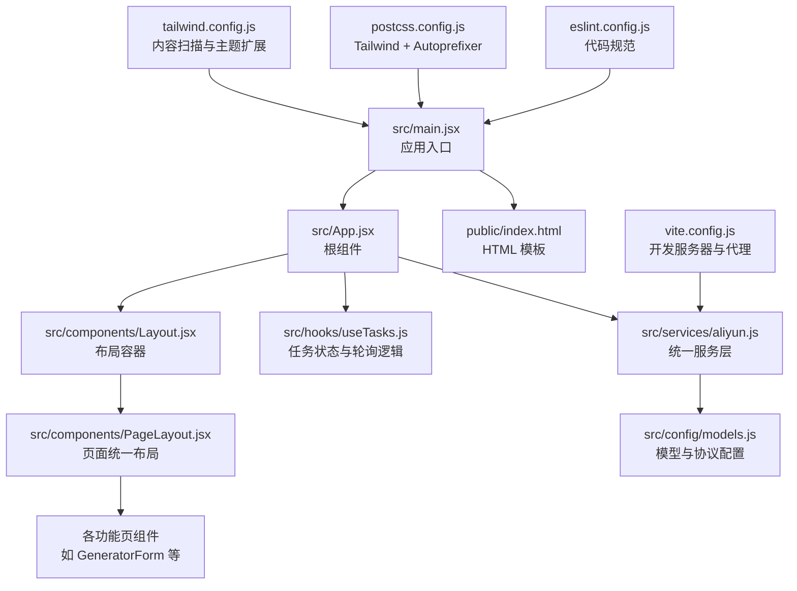
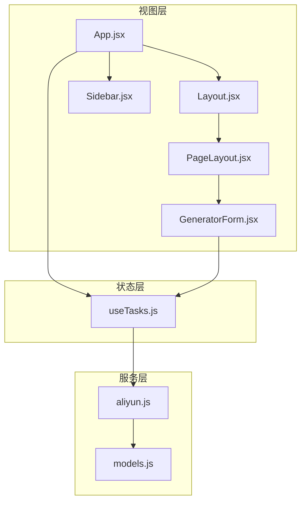
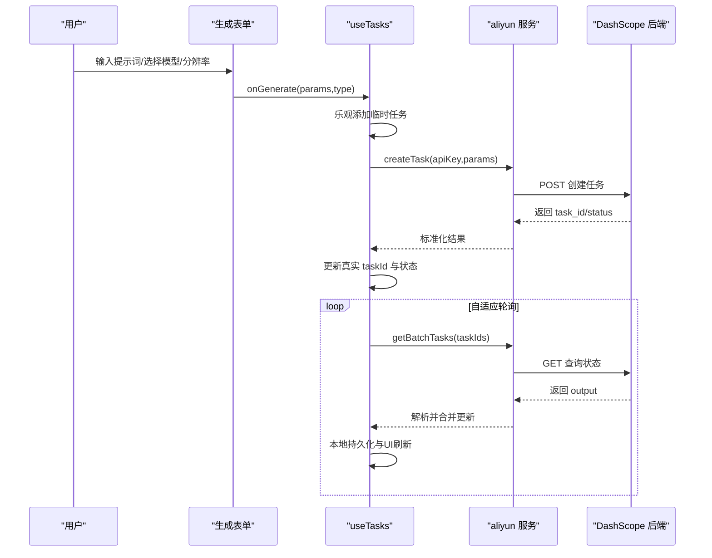
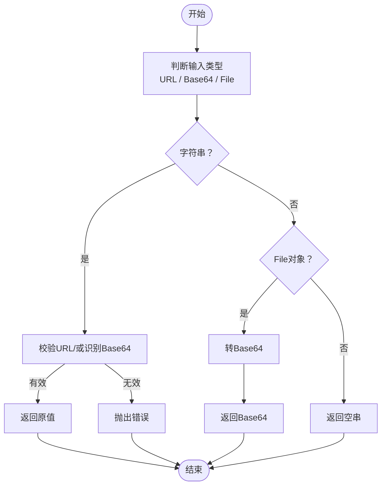
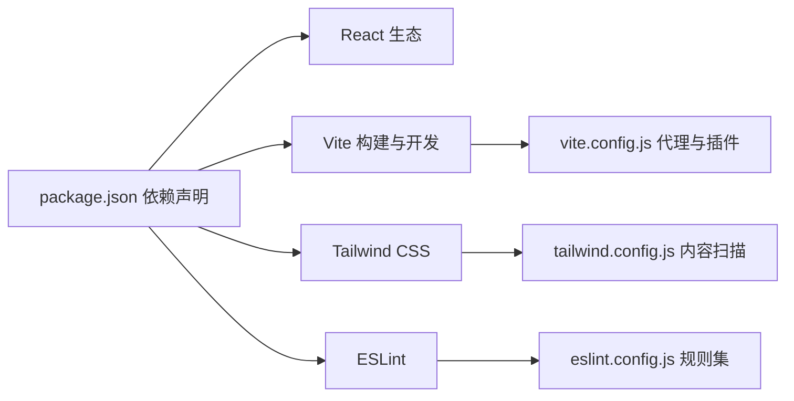

# 技术栈

<cite>
**本文引用的文件**
- [package.json](file://package.json)
- [vite.config.js](file://vite.config.js)
- [tailwind.config.js](file://tailwind.config.js)
- [postcss.config.js](file://postcss.config.js)
- [eslint.config.js](file://eslint.config.js)
- [src/main.jsx](file://src/main.jsx)
- [src/App.jsx](file://src/App.jsx)
- [src/components/Layout.jsx](file://src/components/Layout.jsx)
- [src/components/PageLayout.jsx](file://src/components/PageLayout.jsx)
- [src/components/Sidebar.jsx](file://src/components/Sidebar.jsx)
- [src/components/GeneratorForm.jsx](file://src/components/GeneratorForm.jsx)
- [src/hooks/useTasks.js](file://src/hooks/useTasks.js)
- [src/services/aliyun.js](file://src/services/aliyun.js)
- [src/utils/fileUpload.js](file://src/utils/fileUpload.js)
- [src/config/models.js](file://src/config/models.js)
</cite>

## 目录
1. [简介](#简介)
2. [项目结构](#项目结构)
3. [核心组件](#核心组件)
4. [架构总览](#架构总览)
5. [详细组件分析](#详细组件分析)
6. [依赖分析](#依赖分析)
7. [性能考虑](#性能考虑)
8. [故障排查指南](#故障排查指南)
9. [结论](#结论)

## 简介
本项目为通义万相前端应用，围绕 React 19.2.0 构建，采用 Vite 作为开发与构建工具，使用 Tailwind CSS 实现“实用优先”的样式体系，并通过 lucide-react 提供图标系统。项目通过统一的服务层对接 DashScope（阿里云）后端接口，实现多模态生成任务（文生图/文生视频/图生视频等）的可视化交互与历史管理。

技术选型背景与原则：
- React 19.2.0：组件化架构清晰，便于功能模块拆分与复用；配合 Hooks 实现状态与副作用管理。
- Vite：冷启动快、热更新高效、代理与构建体验优秀，适配本项目的多模型与多页面路由需求。
- Tailwind CSS：原子类与内容扫描机制，保证样式体积可控且易于维护；与组件样式高度解耦。
- lucide-react：轻量图标库，按需引入，减少打包体积。
- 开发工具链：ESLint 平台化配置、PostCSS + Tailwind 集成、自动前缀与样式优化。

## 项目结构
项目采用“按功能域划分”的目录组织方式，核心入口为 React 应用根节点，组件按业务域拆分，配置集中在根目录，服务与工具函数分别位于 services 与 utils。

图表来源
- [src/main.jsx](file://src/main.jsx#L1-L11)
- [src/App.jsx](file://src/App.jsx#L1-L377)
- [src/components/Layout.jsx](file://src/components/Layout.jsx#L1-L94)
- [src/components/PageLayout.jsx](file://src/components/PageLayout.jsx#L1-L76)
- [src/hooks/useTasks.js](file://src/hooks/useTasks.js#L1-L333)
- [src/services/aliyun.js](file://src/services/aliyun.js#L1-L215)
- [src/config/models.js](file://src/config/models.js#L1-L1012)
- [vite.config.js](file://vite.config.js#L1-L23)
- [tailwind.config.js](file://tailwind.config.js#L1-L12)
- [postcss.config.js](file://postcss.config.js#L1-L7)
- [eslint.config.js](file://eslint.config.js#L1-L30)

章节来源
- [src/main.jsx](file://src/main.jsx#L1-L11)
- [src/App.jsx](file://src/App.jsx#L1-L377)
- [vite.config.js](file://vite.config.js#L1-L23)
- [tailwind.config.js](file://tailwind.config.js#L1-L12)
- [postcss.config.js](file://postcss.config.js#L1-L7)
- [eslint.config.js](file://eslint.config.js#L1-L30)

## 核心组件
- 应用根组件负责路由式内容渲染与全局状态（API Key、菜单切换、任务执行），并通过 Layout 包裹页面内容。
- Layout 提供桌面/移动端双态导航与设置入口，承载主内容区与滚动区域。
- PageLayout 将“生成表单”固定置顶、“历史记录”可折叠展示，统一不同功能页的布局与交互。
- Sidebar 提供多组功能分类与子项导航，支持展开/收起与当前项高亮。
- GeneratorForm 为典型生成表单，包含提示词输入、模型选择、分辨率选择与提交按钮。
- useTasks 提供任务生命周期管理、乐观更新、本地持久化、自适应轮询与重试能力。
- aliyun 服务层封装创建任务、轮询状态、批量查询与超时/重试策略。
- fileUpload 工具处理文件转 Base64、压缩与输入校验，适配大图场景。
- models 配置集中管理模型协议、输出类型、分辨率标签与能力开关，支撑 UI 与请求构造。

章节来源
- [src/App.jsx](file://src/App.jsx#L1-L377)
- [src/components/Layout.jsx](file://src/components/Layout.jsx#L1-L94)
- [src/components/PageLayout.jsx](file://src/components/PageLayout.jsx#L1-L76)
- [src/components/Sidebar.jsx](file://src/components/Sidebar.jsx#L1-L149)
- [src/components/GeneratorForm.jsx](file://src/components/GeneratorForm.jsx#L1-L208)
- [src/hooks/useTasks.js](file://src/hooks/useTasks.js#L1-L333)
- [src/services/aliyun.js](file://src/services/aliyun.js#L1-L215)
- [src/utils/fileUpload.js](file://src/utils/fileUpload.js#L1-L182)
- [src/config/models.js](file://src/config/models.js#L1-L1012)

## 架构总览
整体采用“组件化 + 配置驱动 + 服务层抽象”的架构：
- 视图层：React 组件树，按功能域拆分，共享布局与通用控件。
- 状态层：useTasks Hook 管理任务列表、生成状态与轮询；本地存储持久化。
- 服务层：统一请求封装、超时控制、重试策略与异步/同步模型差异处理。
- 配置层：models.js 定义协议、输出类型、分辨率与能力，驱动 UI 与请求体构造。

图表来源
- [src/App.jsx](file://src/App.jsx#L1-L377)
- [src/components/Layout.jsx](file://src/components/Layout.jsx#L1-L94)
- [src/components/PageLayout.jsx](file://src/components/PageLayout.jsx#L1-L76)
- [src/components/Sidebar.jsx](file://src/components/Sidebar.jsx#L1-L149)
- [src/components/GeneratorForm.jsx](file://src/components/GeneratorForm.jsx#L1-L208)
- [src/hooks/useTasks.js](file://src/hooks/useTasks.js#L1-L333)
- [src/services/aliyun.js](file://src/services/aliyun.js#L1-L215)
- [src/config/models.js](file://src/config/models.js#L1-L1012)

## 详细组件分析

### React 组件化架构优势
- 可组合性：PageLayout 将“表单 + 历史”组合为统一页面骨架，降低重复代码。
- 可复用性：Sidebar 与 Layout 在多页面复用，统一导航与头部行为。
- 可测试性：组件职责单一，事件通过 props 下发，利于单元测试与集成测试。
- 可维护性：配置驱动（models.js）与服务层（aliyun.js）解耦 UI 与后端协议。

章节来源
- [src/components/PageLayout.jsx](file://src/components/PageLayout.jsx#L1-L76)
- [src/components/Layout.jsx](file://src/components/Layout.jsx#L1-L94)
- [src/components/Sidebar.jsx](file://src/components/Sidebar.jsx#L1-L149)
- [src/components/GeneratorForm.jsx](file://src/components/GeneratorForm.jsx#L1-L208)

### Vite 构建工具的性能特点
- 开发服务器：严格端口绑定、主机开放、反向代理 DashScope API，提升联调效率。
- 插件生态：React 插件提供 JSX 优化与 HMR；构建阶段按需处理资源。
- 产物体积：与 Tailwind 的内容扫描配合，按需产出样式，避免全量引入。

章节来源
- [vite.config.js](file://vite.config.js#L1-L23)

### Tailwind CSS 实用优先的设计理念
- 内容扫描：通过配置扫描 HTML 与 JS 文件，仅打包实际使用的样式，避免冗余。
- 原子类：通过组合类名实现复杂样式，降低 CSS 维护成本。
- 主题扩展：可在主题中扩展常用变量，统一品牌色与间距。

章节来源
- [tailwind.config.js](file://tailwind.config.js#L1-L12)
- [postcss.config.js](file://postcss.config.js#L1-L7)

### lucide-react 图标系统
- 按需引入：仅打包使用到的图标，减小体积。
- 一致性：统一尺寸与风格，提升界面一致性与可读性。

章节来源
- [src/components/Layout.jsx](file://src/components/Layout.jsx#L1-L94)
- [src/components/Sidebar.jsx](file://src/components/Sidebar.jsx#L1-L149)
- [src/components/GeneratorForm.jsx](file://src/components/GeneratorForm.jsx#L1-L208)

### 开发工具链
- ESLint：平台化配置，启用推荐规则与 React Hooks/React Refresh 插件，统一团队规范。
- PostCSS：集成 Tailwind 与 Autoprefixer，自动补全浏览器前缀。
- 类型支持：@types/react 与 @types/react-dom 提升开发体验与类型安全。

章节来源
- [eslint.config.js](file://eslint.config.js#L1-L30)
- [postcss.config.js](file://postcss.config.js#L1-L7)
- [package.json](file://package.json#L17-L31)

### 任务生命周期与轮询流程

图表来源
- [src/components/GeneratorForm.jsx](file://src/components/GeneratorForm.jsx#L66-L80)
- [src/hooks/useTasks.js](file://src/hooks/useTasks.js#L256-L312)
- [src/services/aliyun.js](file://src/services/aliyun.js#L50-L160)

### 文件上传与输入处理流程

图表来源
- [src/utils/fileUpload.js](file://src/utils/fileUpload.js#L114-L144)

### 模型配置与请求体构造
- models.js 定义协议常量、输出类型、分辨率标签与能力开关，驱动 UI 与请求体格式。
- aliyun.js 依据模型配置选择端点、请求格式与异步/同步分支，统一封装超时与重试。

章节来源
- [src/config/models.js](file://src/config/models.js#L1-L1012)
- [src/services/aliyun.js](file://src/services/aliyun.js#L50-L160)

## 依赖分析
- 运行时依赖：React 19.2.0、react-dom 19.2.0、lucide-react。
- 开发依赖：Vite、Tailwind CSS、PostCSS、Autoprefixer、ESLint 及相关插件。
- 代理与环境：Vite 配置代理 DashScope API，开发环境变量在服务层使用。

图表来源
- [package.json](file://package.json#L1-L33)
- [vite.config.js](file://vite.config.js#L1-L23)
- [tailwind.config.js](file://tailwind.config.js#L1-L12)
- [eslint.config.js](file://eslint.config.js#L1-L30)

章节来源
- [package.json](file://package.json#L1-L33)

## 性能考虑
- 本地存储优化：useTasks 对任务持久化时移除 Base64 数据，仅保留必要字段；超出配额时截断最近 20 条，避免内存溢出。
- 自适应轮询：根据任务年龄与轮询次数动态调整轮询间隔，减少无效请求与带宽占用。
- 样式体积控制：Tailwind 内容扫描仅打包实际使用类，避免全量样式。
- 图片处理：大图自动压缩后再转 Base64，降低传输与渲染压力。
- 组件渲染优化：PageLayout 使用 useMemo 缓存过滤后的任务列表，减少重渲染。

章节来源
- [src/hooks/useTasks.js](file://src/hooks/useTasks.js#L30-L84)
- [src/hooks/useTasks.js](file://src/hooks/useTasks.js#L86-L104)
- [src/utils/fileUpload.js](file://src/utils/fileUpload.js#L7-L18)

## 故障排查指南
- API Key 未配置：App 在未设置 Key 时弹出设置面板；请在设置中保存 Key 并确认其有效性。
- 任务状态异常：若出现“SUCCEEDED 但无媒体 URL”，轮询会保持 RUNNING 状态直至媒体 URL 返回；检查模型输出格式与网关返回。
- 轮询超时/网络错误：服务层对轮询与请求设置超时，同时对网络错误进行重试；请检查网络连通性与代理配置。
- 本地存储满：当 LocalStorage 配额不足时，自动保留最近 20 条任务；清理历史或降低生成频率。
- 图片过大导致 Base64 超限：使用内置压缩逻辑或降低分辨率；确认文件类型与大小限制。

章节来源
- [src/App.jsx](file://src/App.jsx#L50-L69)
- [src/hooks/useTasks.js](file://src/hooks/useTasks.js#L164-L246)
- [src/services/aliyun.js](file://src/services/aliyun.js#L170-L202)
- [src/utils/fileUpload.js](file://src/utils/fileUpload.js#L146-L182)

## 结论
本项目以 React 为核心，结合 Vite 的高性能开发体验与 Tailwind 的实用样式体系，构建了面向多模态生成任务的前端工作台。通过配置驱动与服务层抽象，实现了模型能力与 UI 的解耦；借助自适应轮询与本地持久化，提升了用户体验与系统稳定性。建议在后续迭代中持续关注：
- 模型能力与 UI 的动态映射完善；
- 大文件与高并发场景下的缓存与节流策略；
- 团队协作层面的 ESLint 规则与 PR 审查流程固化。