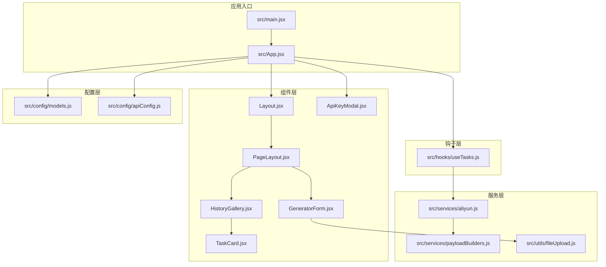
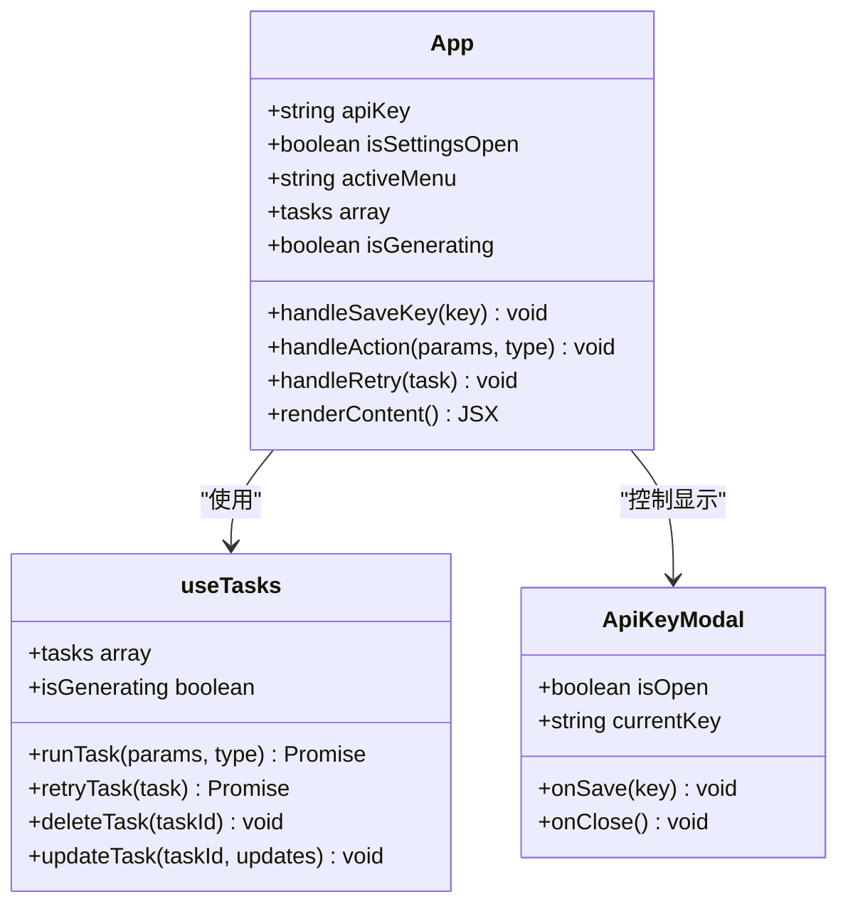
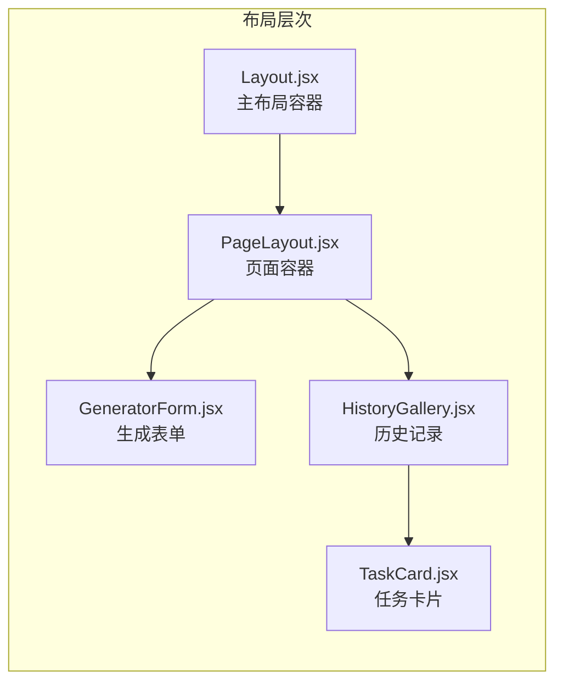
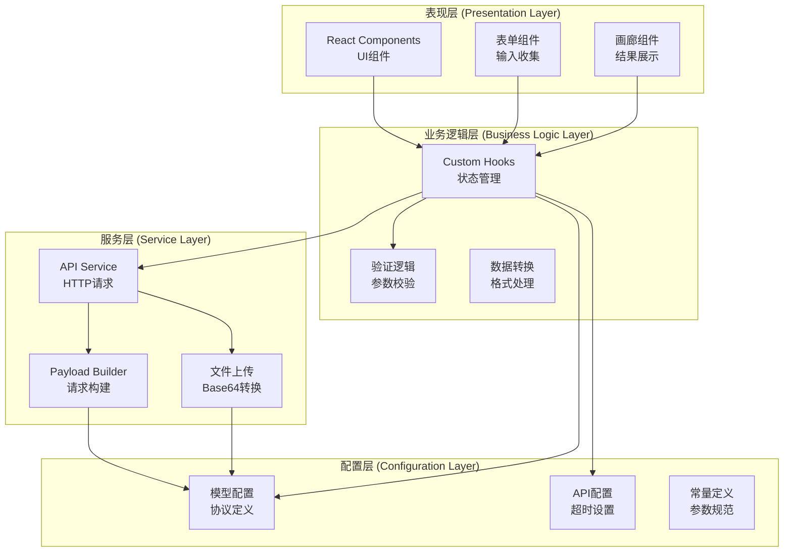
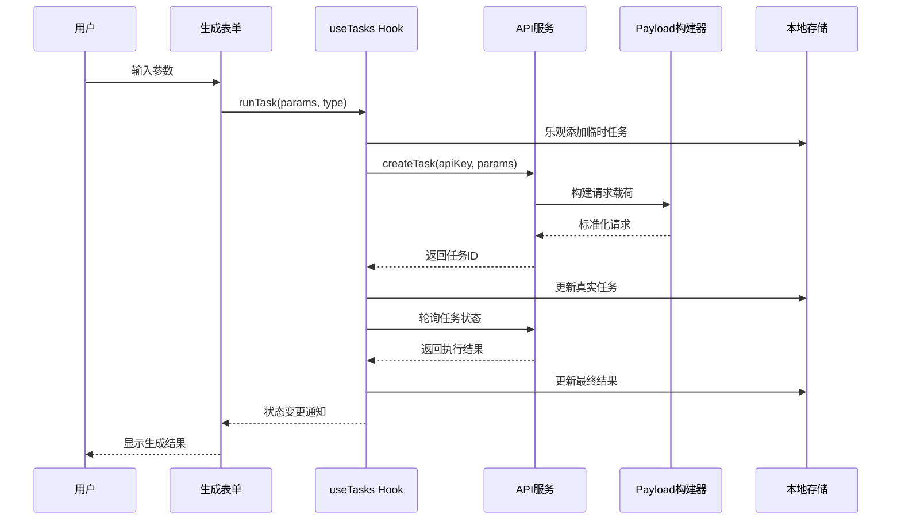
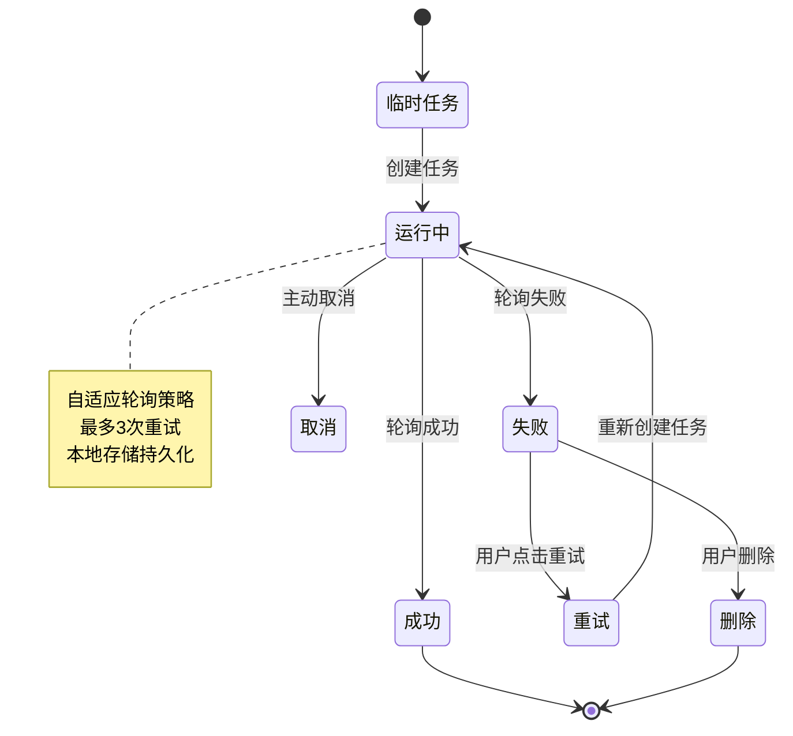
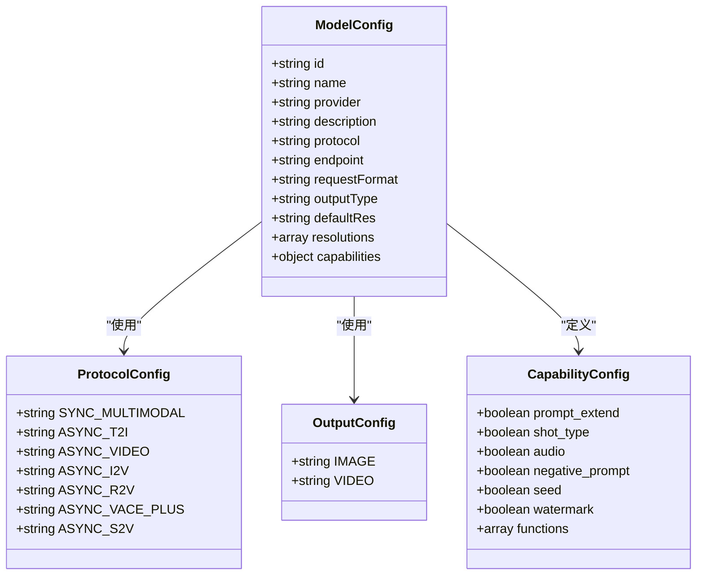
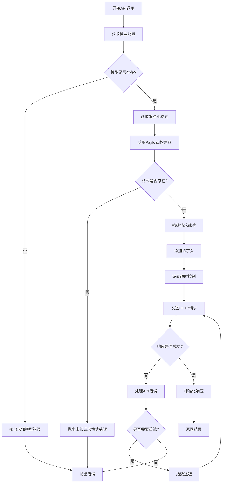
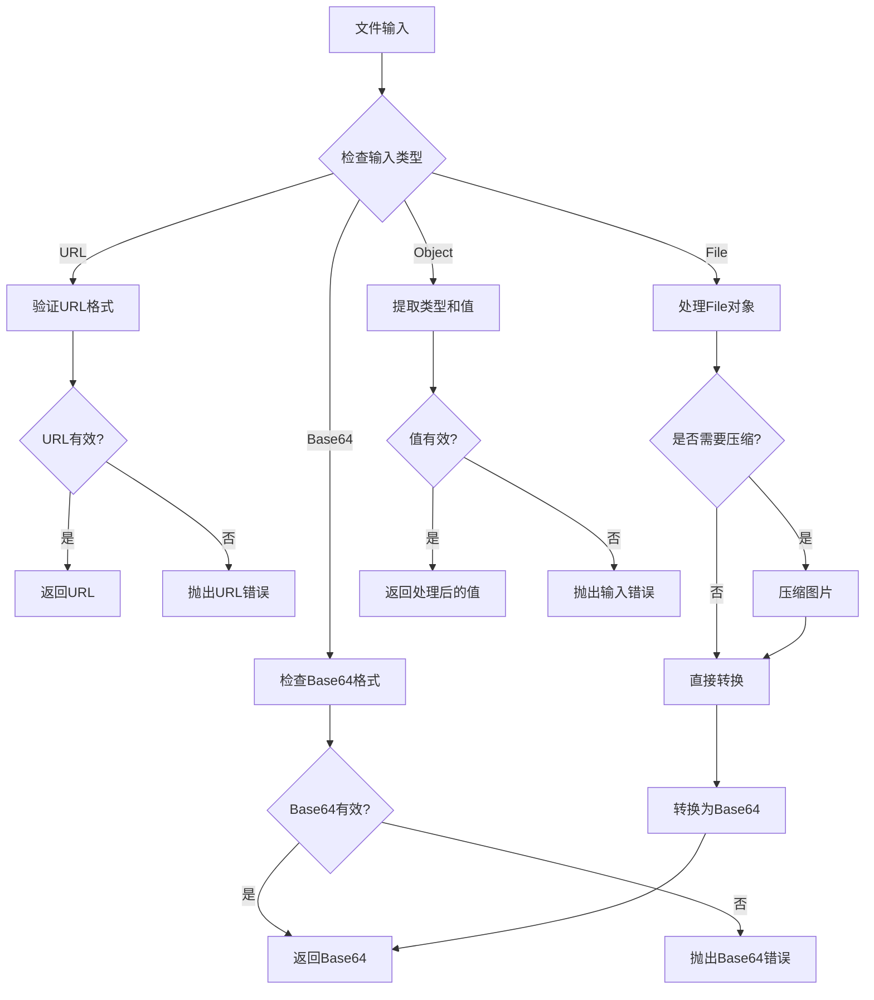

# 架构概览

<cite>
**本文档引用的文件**
- [README.md](file://README.md)
- [package.json](file://package.json)
- [src/App.jsx](file://src/App.jsx)
- [src/main.jsx](file://src/main.jsx)
- [src/config/models.js](file://src/config/models.js)
- [src/config/apiConfig.js](file://src/config/apiConfig.js)
- [src/hooks/useTasks.js](file://src/hooks/useTasks.js)
- [src/services/aliyun.js](file://src/services/aliyun.js)
- [src/services/payloadBuilders.js](file://src/services/payloadBuilders.js)
- [src/utils/fileUpload.js](file://src/utils/fileUpload.js)
- [src/components/Layout.jsx](file://src/components/Layout.jsx)
- [src/components/PageLayout.jsx](file://src/components/PageLayout.jsx)
- [src/components/GeneratorForm.jsx](file://src/components/GeneratorForm.jsx)
- [src/components/HistoryGallery.jsx](file://src/components/HistoryGallery.jsx)
- [src/components/TaskCard.jsx](file://src/components/TaskCard.jsx)
- [src/components/ApiKeyModal.jsx](file://src/components/ApiKeyModal.jsx)
</cite>

## 目录
1. [引言](#引言)
2. [项目结构](#项目结构)
3. [核心组件](#核心组件)
4. [架构概览](#架构概览)
5. [详细组件分析](#详细组件分析)
6. [依赖分析](#依赖分析)
7. [性能考虑](#性能考虑)
8. [故障排除指南](#故障排除指南)
9. [结论](#结论)

## 引言

通义万相前端应用是一个基于React + Vite的AI生成内容平台，提供了丰富的多模态AI模型能力。该项目采用现代化的前端架构设计，实现了高度模块化的组件化架构、配置驱动开发和服务层抽象等核心设计理念。

本项目的核心目标是为用户提供直观易用的AI生成工具界面，支持多种类型的AI生成任务，包括文生图、图生视频、视频编辑、图像处理等功能。通过统一的架构设计，项目实现了良好的可扩展性和维护性。

## 项目结构

项目采用典型的React应用结构，按照功能模块进行组织：



**图表来源**
- [src/main.jsx](file://src/main.jsx#L1-L11)
- [src/App.jsx](file://src/App.jsx#L1-L377)
- [src/config/models.js](file://src/config/models.js#L1-L1012)

**章节来源**
- [package.json](file://package.json#L1-L33)
- [README.md](file://README.md#L1-L17)

## 核心组件

### 应用主组件 (App.jsx)

App组件作为整个应用的根组件，实现了统一的任务管理和路由控制：



**图表来源**
- [src/App.jsx](file://src/App.jsx#L42-L377)
- [src/hooks/useTasks.js](file://src/hooks/useTasks.js#L9-L333)
- [src/components/ApiKeyModal.jsx](file://src/components/ApiKeyModal.jsx#L4-L111)

### 页面布局组件

页面采用分层布局设计，实现了响应式和移动端适配：



**图表来源**
- [src/components/Layout.jsx](file://src/components/Layout.jsx#L5-L94)
- [src/components/PageLayout.jsx](file://src/components/PageLayout.jsx#L9-L76)
- [src/components/GeneratorForm.jsx](file://src/components/GeneratorForm.jsx#L4-L208)
- [src/components/HistoryGallery.jsx](file://src/components/HistoryGallery.jsx#L6-L68)
- [src/components/TaskCard.jsx](file://src/components/TaskCard.jsx#L9-L182)

**章节来源**
- [src/App.jsx](file://src/App.jsx#L1-L377)
- [src/components/Layout.jsx](file://src/components/Layout.jsx#L1-L94)
- [src/components/PageLayout.jsx](file://src/components/PageLayout.jsx#L1-L76)

## 架构概览

项目采用四层架构设计，每层都有明确的职责分工：



**图表来源**
- [src/hooks/useTasks.js](file://src/hooks/useTasks.js#L1-L333)
- [src/services/aliyun.js](file://src/services/aliyun.js#L1-L215)
- [src/services/payloadBuilders.js](file://src/services/payloadBuilders.js#L1-L829)
- [src/config/models.js](file://src/config/models.js#L1-L1012)
- [src/config/apiConfig.js](file://src/config/apiConfig.js#L1-L35)

### 数据流架构

系统采用单向数据流设计，确保数据的一致性和可预测性：



**图表来源**
- [src/hooks/useTasks.js](file://src/hooks/useTasks.js#L256-L312)
- [src/services/aliyun.js](file://src/services/aliyun.js#L50-L160)
- [src/services/payloadBuilders.js](file://src/services/payloadBuilders.js#L125-L150)

## 详细组件分析

### 状态管理与任务生命周期

项目采用自定义Hook模式实现状态管理，实现了完整的任务生命周期管理：



**图表来源**
- [src/hooks/useTasks.js](file://src/hooks/useTasks.js#L256-L332)

#### 任务状态管理机制

任务状态管理采用了乐观更新和错误回滚相结合的策略：

1. **乐观更新**: 在API调用前先在本地添加临时任务，提升用户体验
2. **状态轮询**: 使用自适应轮询策略监控任务执行状态
3. **错误处理**: 实现指数退避重试机制
4. **数据持久化**: 使用localStorage存储任务历史

**章节来源**
- [src/hooks/useTasks.js](file://src/hooks/useTasks.js#L1-L333)

### 配置驱动开发模式

项目采用配置驱动的方式管理所有AI模型和API参数：



**图表来源**
- [src/config/models.js](file://src/config/models.js#L1-L1012)

#### 模型配置管理

系统支持多种类型的AI模型配置，包括：

1. **视频生成模型**: 文生视频、图生视频、参考生视频
2. **图像生成模型**: 文生图、图像编辑、风格迁移
3. **特殊效果模型**: 背景生成、AI试衣、数字人
4. **创意工具模型**: 文字变形、文字纹理

**章节来源**
- [src/config/models.js](file://src/config/models.js#L1-L1012)

### 服务层抽象设计

服务层实现了统一的API调用接口，支持多种请求格式和模型类型：



**图表来源**
- [src/services/aliyun.js](file://src/services/aliyun.js#L50-L160)
- [src/services/payloadBuilders.js](file://src/services/payloadBuilders.js#L1-L829)

**章节来源**
- [src/services/aliyun.js](file://src/services/aliyun.js#L1-L215)
- [src/services/payloadBuilders.js](file://src/services/payloadBuilders.js#L1-L829)

### 文件上传与处理

系统实现了灵活的文件处理机制，支持多种输入格式：



**图表来源**
- [src/utils/fileUpload.js](file://src/utils/fileUpload.js#L114-L144)

**章节来源**
- [src/utils/fileUpload.js](file://src/utils/fileUpload.js#L1-L182)

## 依赖分析

项目采用模块化依赖管理，各模块间耦合度低，内聚性强：

```mermaid
graph TB
subgraph "外部依赖"
REACT[react@^19.2.0]
REACDOM[react-dom@^19.2.0]
LUCIDE[lucide-react@^0.563.0]
end
subgraph "开发依赖"
VITE[vite@^7.2.4]
SWC[eslint@^9.39.1]
TAILWIND[tailwindcss@^3.4.19]
end
subgraph "内部模块"
APP[App.jsx]
LAYOUT[Layout.jsx]
SERVICES[services/*]
CONFIG[config/*]
HOOKS[hooks/*]
UTILS[utils/*]
end
APP --> LAYOUT
APP --> SERVICES
APP --> CONFIG
APP --> HOOKS
LAYOUT --> SERVICES
SERVICES --> CONFIG
HOOKS --> SERVICES
HOOKS --> CONFIG
UTILS --> CONFIG
```

**图表来源**
- [package.json](file://package.json#L12-L31)

### 核心依赖关系

1. **React生态系统**: 使用React 19作为核心框架，提供组件化开发能力
2. **UI库**: lucide-react提供图标支持，简化UI开发
3. **构建工具**: Vite提供快速开发体验和生产构建
4. **样式框架**: Tailwind CSS实现原子化样式管理

**章节来源**
- [package.json](file://package.json#L1-L33)

## 性能考虑

项目在多个层面实现了性能优化：

### 1. 状态管理优化
- 使用useMemo缓存计算结果，避免重复渲染
- 本地存储优化，限制存储大小防止内存溢出
- 自适应轮询策略，减少不必要的API调用

### 2. 组件渲染优化
- 使用React.memo包装纯展示组件
- 条件渲染和懒加载策略
- 合理的CSS类名管理，避免样式冲突

### 3. 网络请求优化
- 指数退避重试机制
- 超时控制和错误恢复
- 批量请求处理

### 4. 文件处理优化
- 图片压缩减少Base64大小
- 分块上传避免内存压力
- 缓存机制提升重复操作性能

## 故障排除指南

### 常见问题及解决方案

#### API密钥相关问题
- **问题**: API密钥无效或过期
- **解决**: 重新获取有效的API密钥，确保格式正确
- **预防**: 定期检查密钥状态，设置自动提醒

#### 任务执行失败
- **问题**: 任务长时间处于运行中状态
- **解决**: 检查网络连接，查看API响应状态
- **预防**: 实现超时处理和重试机制

#### 内存存储问题
- **问题**: 本地存储空间不足
- **解决**: 清理历史记录，限制存储数量
- **预防**: 实现存储配额监控

#### 文件上传失败
- **问题**: 大文件上传超时
- **解决**: 压缩文件或分块上传
- **预防**: 实现文件大小检查和压缩策略

**章节来源**
- [src/hooks/useTasks.js](file://src/hooks/useTasks.js#L74-L84)
- [src/services/aliyun.js](file://src/services/aliyun.js#L146-L160)
- [src/utils/fileUpload.js](file://src/utils/fileUpload.js#L7-L18)

## 结论

通义万相前端应用项目展现了现代React应用的最佳实践，通过以下关键设计实现了优秀的架构品质：

### 设计优势

1. **模块化架构**: 清晰的分层设计，各层职责明确，便于维护和扩展
2. **配置驱动**: 通过配置文件管理所有模型和参数，降低硬编码风险
3. **状态管理**: 自定义Hook实现集中状态管理，提升代码复用性
4. **错误处理**: 完善的错误处理和重试机制，提升系统稳定性
5. **性能优化**: 多层次的性能优化策略，确保良好的用户体验

### 可扩展性设计

- **插件化架构**: 通过配置文件轻松添加新模型和功能
- **抽象层设计**: 服务层抽象隐藏底层实现细节
- **事件驱动**: 基于事件的状态更新机制
- **缓存策略**: 智能缓存提升响应速度

### 维护性保障

- **类型安全**: TypeScript支持提供编译时类型检查
- **代码规范**: ESLint配置确保代码质量
- **测试友好**: 模块化设计便于单元测试
- **文档完善**: 清晰的注释和架构说明

该项目为AI生成内容应用提供了一个优秀的前端架构范例，其设计理念和实现模式可以为类似项目提供有价值的参考。