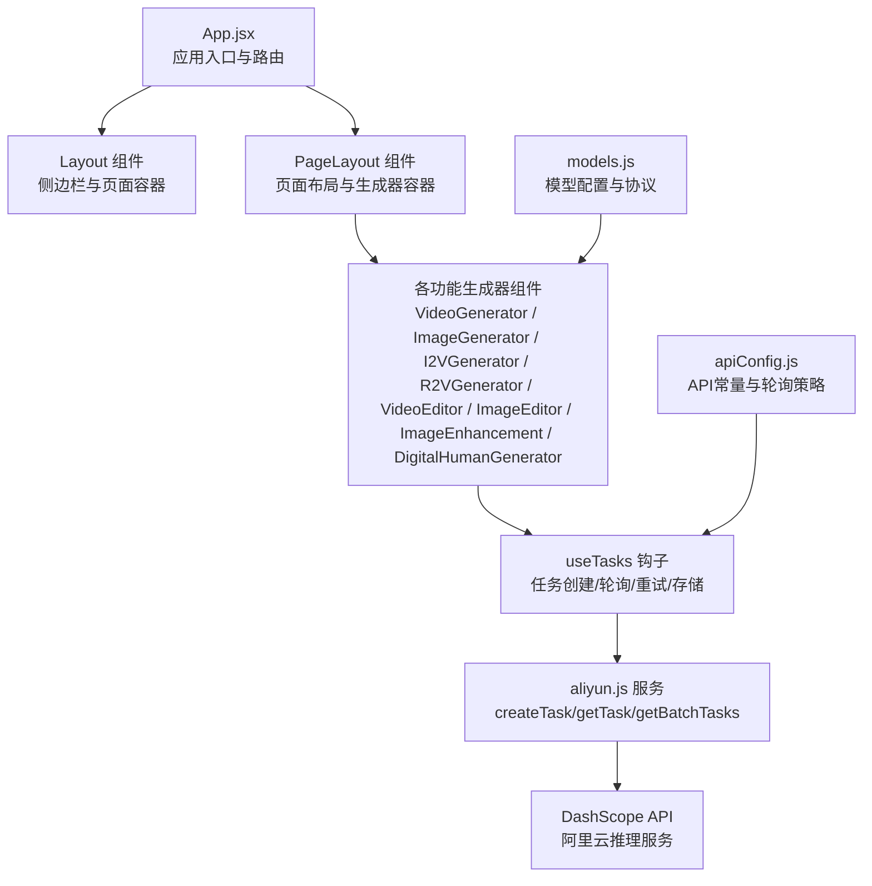
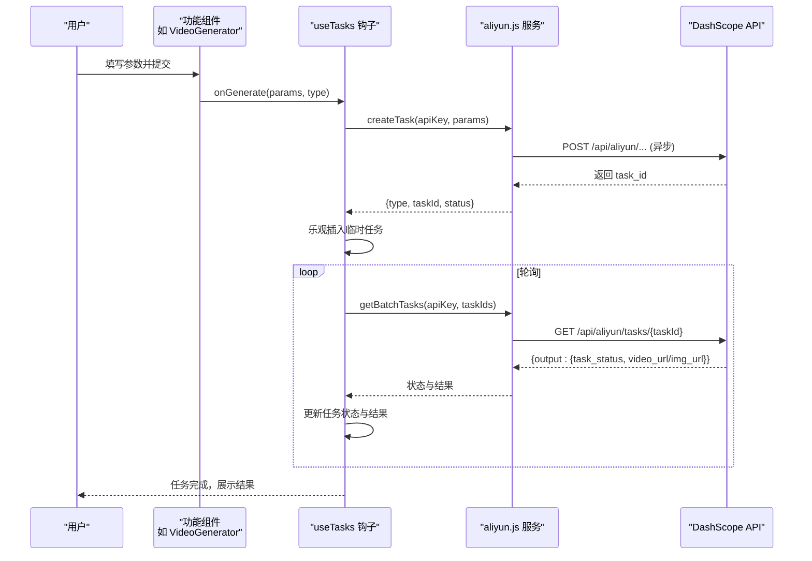
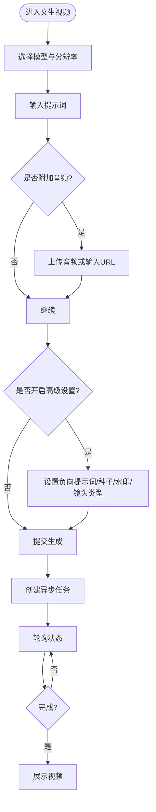
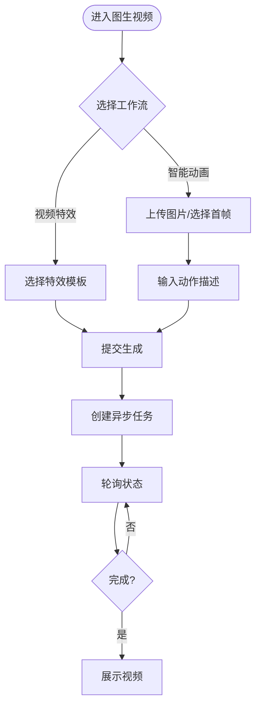
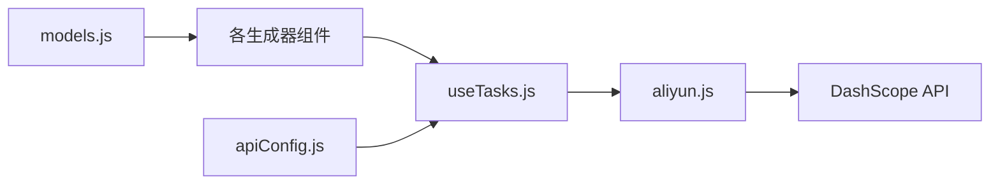

# 核心功能

<cite>
**本文档引用的文件**
- [App.jsx](file://src/App.jsx)
- [models.js](file://src/config/models.js)
- [apiConfig.js](file://src/config/apiConfig.js)
- [VideoGenerator.jsx](file://src/components/VideoGenerator.jsx)
- [ImageGenerator.jsx](file://src/components/ImageGenerator.jsx)
- [I2VGenerator.jsx](file://src/components/I2VGenerator.jsx)
- [R2VGenerator.jsx](file://src/components/R2VGenerator.jsx)
- [VideoEditor.jsx](file://src/components/VideoEditor.jsx)
- [ImageEditor.jsx](file://src/components/ImageEditor.jsx)
- [ImageEnhancement.jsx](file://src/components/ImageEnhancement.jsx)
- [DigitalHumanGenerator.jsx](file://src/components/DigitalHumanGenerator.jsx)
- [aliyun.js](file://src/services/aliyun.js)
- [useTasks.js](file://src/hooks/useTasks.js)
</cite>

## 目录
1. [简介](#简介)
2. [项目结构](#项目结构)
3. [核心组件](#核心组件)
4. [架构总览](#架构总览)
5. [详细组件分析](#详细组件分析)
6. [依赖关系分析](#依赖关系分析)
7. [性能考虑](#性能考虑)
8. [故障排除指南](#故障排除指南)
9. [结论](#结论)

## 简介
本项目为通义万相前端应用，提供基于阿里云 DashScope 的 AI 内容生成能力，覆盖视频与图像两大领域。用户可通过直观的图形界面，选择不同模型与参数，一键生成高质量视频与图像内容。系统通过统一的任务调度与轮询机制，保障异步任务的稳定执行与结果回传。

## 项目结构
- 应用入口与路由：App.jsx 统一管理侧边栏菜单、页面切换与任务生命周期。
- 配置层：models.js 定义模型协议、输出类型、分辨率标签与各模型配置；apiConfig.js 定义 API 基础地址、超时与轮询策略。
- 功能组件：各功能模块均以独立组件实现，负责表单收集、参数构建与调用统一任务钩子。
- 服务层：aliyun.js 封装 DashScope API 的任务创建与状态轮询。
- 任务钩子：useTasks.js 提供任务创建、轮询、重试、删除与本地持久化。

图表来源
- [App.jsx](file://src/App.jsx#L42-L377)
- [models.js](file://src/config/models.js#L1-L1012)
- [apiConfig.js](file://src/config/apiConfig.js#L1-L35)
- [aliyun.js](file://src/services/aliyun.js#L1-L215)
- [useTasks.js](file://src/hooks/useTasks.js#L1-L333)

章节来源
- [App.jsx](file://src/App.jsx#L42-L377)
- [models.js](file://src/config/models.js#L1-L1012)
- [apiConfig.js](file://src/config/apiConfig.js#L1-L35)

## 核心组件
- 视频生成（文生视频）：VideoGenerator.jsx
- 图像生成（文生图/创意文字/海报设计）：ImageGenerator.jsx
- 图生视频（I2V）：I2VGenerator.jsx
- 参考生视频（R2V）：R2VGenerator.jsx
- 视频编辑（VACE+统一模型）：VideoEditor.jsx
- 图像编辑（指令编辑/风格迁移/修复重绘/增强）：ImageEditor.jsx / ImageEnhancement.jsx
- 数字人生成（说话/唱歌/表演）：DigitalHumanGenerator.jsx

章节来源
- [VideoGenerator.jsx](file://src/components/VideoGenerator.jsx#L1-L354)
- [ImageGenerator.jsx](file://src/components/ImageGenerator.jsx#L1-L249)
- [I2VGenerator.jsx](file://src/components/I2VGenerator.jsx#L1-L588)
- [R2VGenerator.jsx](file://src/components/R2VGenerator.jsx#L1-L380)
- [VideoEditor.jsx](file://src/components/VideoEditor.jsx#L1-L604)
- [ImageEditor.jsx](file://src/components/ImageEditor.jsx#L1-L973)
- [ImageEnhancement.jsx](file://src/components/ImageEnhancement.jsx#L1-L513)
- [DigitalHumanGenerator.jsx](file://src/components/DigitalHumanGenerator.jsx#L1-L313)

## 架构总览
系统采用“配置驱动 + 统一任务钩子”的架构：
- 配置驱动：models.js 定义模型协议、端点、请求格式、输出类型与能力开关，组件通过配置生成参数。
- 统一任务钩子：useTasks.js 负责任务创建、乐观插入、轮询与本地持久化，屏蔽异步差异。
- API 服务：aliyun.js 封装 DashScope API，支持同步与异步任务，内置超时与重试逻辑。
- 用户交互：各功能组件提供直观表单，收集输入并调用 onGenerate，最终由 useTasks 统一处理。

图表来源
- [useTasks.js](file://src/hooks/useTasks.js#L256-L332)
- [aliyun.js](file://src/services/aliyun.js#L50-L215)
- [apiConfig.js](file://src/config/apiConfig.js#L9-L27)

章节来源
- [useTasks.js](file://src/hooks/useTasks.js#L1-L333)
- [aliyun.js](file://src/services/aliyun.js#L1-L215)
- [apiConfig.js](file://src/config/apiConfig.js#L1-L35)

## 详细组件分析

### 文生视频（VideoGenerator）
- 功能特点
  - 支持多代模型（2.6/2.5/2.2/2.1），提供分辨率、时长、镜头类型、音频驱动等参数。
  - 智能改写提示词、负向提示词、固定种子、水印等高级选项。
- 适用场景
  - 创意短片、广告片头、动画片段、演示视频等。
- 使用方法
  - 选择模型与分辨率，填写提示词，必要时上传音频，点击生成。
- 参数要点
  - 模型能力由 models.js 中的 capabilities 控制，组件按需渲染与校验。
  - 音频输入支持 URL 与文件，自动转为 base64 并注入 input。

图表来源
- [VideoGenerator.jsx](file://src/components/VideoGenerator.jsx#L74-L115)
- [models.js](file://src/config/models.js#L39-L135)
- [useTasks.js](file://src/hooks/useTasks.js#L256-L332)

章节来源
- [VideoGenerator.jsx](file://src/components/VideoGenerator.jsx#L1-L354)
- [models.js](file://src/config/models.js#L39-L135)

### 图生视频（I2V）
- 功能特点
  - 支持首帧/尾帧模式与特效模板；可选音频驱动；支持关键帧到视频（KF2V）。
  - 提供智能动画与视频特效两种工作流。
- 适用场景
  - 将静态图片转化为动态视频，或基于模板生成特定动效。
- 使用方法
  - 上传图片，选择工作流（智能动画/视频特效），填写提示词或选择模板，设置分辨率与时长，点击生成。

图表来源
- [I2VGenerator.jsx](file://src/components/I2VGenerator.jsx#L113-L172)
- [models.js](file://src/config/models.js#L137-L216)
- [useTasks.js](file://src/hooks/useTasks.js#L256-L332)

章节来源
- [I2VGenerator.jsx](file://src/components/I2VGenerator.jsx#L1-L588)
- [models.js](file://src/config/models.js#L137-L216)

### 参考生视频（R2V）
- 功能特点
  - 支持多角色参考视频，保持角色形象与音色生成新视频。
  - 提供镜头类型、负向提示词、水印等参数。
- 适用场景
  - 角色驱动剧情、多角色互动场景、角色风格迁移。
- 使用方法
  - 上传参考视频（最多3个），编写动作描述，设置分辨率与时长，点击生成。

章节来源
- [R2VGenerator.jsx](file://src/components/R2VGenerator.jsx#L1-L380)
- [models.js](file://src/config/models.js#L218-L239)

### 视频编辑（VACE+统一模型）
- 功能特点
  - 支持多图参考重绘、视频重绘、局部编辑、视频画面扩展与延展。
  - 可设置主体/背景角色、随机种子、水印与智能改写。
- 适用场景
  - 视频二次创作、局部修改、扩场景与延长视频。
- 使用方法
  - 选择功能，按需上传参考图/输入视频/掩码，填写提示词，设置参数，点击生成。

章节来源
- [VideoEditor.jsx](file://src/components/VideoEditor.jsx#L1-L604)
- [models.js](file://src/config/models.js#L241-L262)

### 图像生成（文生图/创意文字/海报设计）
- 功能特点
  - 支持多代文生图模型，提供分辨率、数量、智能改写、负向提示词、固定种子与艺术风格。
  - 预估费用，便于成本控制。
- 适用场景
  - 商品主图、海报设计、创意插画、品牌素材。
- 使用方法
  - 选择模型与分辨率，填写提示词，设置数量与参数，点击生成。

章节来源
- [ImageGenerator.jsx](file://src/components/ImageGenerator.jsx#L1-L249)
- [models.js](file://src/config/models.js#L264-L557)

### 图像编辑（指令编辑/风格迁移/修复重绘/增强）
- 功能特点
  - 指令编辑：支持多图输入与输出，可设置反向提示词、水印、种子等。
  - 风格迁移：支持多种艺术风格与风格参考图。
  - 修复重绘：支持局部重绘与掩码。
  - 增强：扩图、超分辨率、图像上色等。
- 适用场景
  - 图像修复、风格化、局部修改、画质增强。
- 使用方法
  - 选择模型与功能，上传输入图像与参考图/掩码，填写提示词（部分功能需要），设置参数，点击生成。

章节来源
- [ImageEditor.jsx](file://src/components/ImageEditor.jsx#L1-L973)
- [ImageEnhancement.jsx](file://src/components/ImageEnhancement.jsx#L1-L513)
- [models.js](file://src/config/models.js#L264-L788)

### 数字人生成（说话/唱歌/表演）
- 功能特点
  - 支持图像检测与语音驱动视频生成，可选择动作类型（说话/唱歌/表演）与分辨率。
  - 支持 URL 与文件两种输入方式。
- 适用场景
  - 数字人短视频、虚拟主播、动画角色表演。
- 使用方法
  - 上传人物图片与音频（非检测模型），选择动作类型与分辨率，点击生成。

章节来源
- [DigitalHumanGenerator.jsx](file://src/components/DigitalHumanGenerator.jsx#L1-L313)
- [models.js](file://src/config/models.js#L790-L800)

## 依赖关系分析
- 组件到配置：各生成器组件读取 models.js 中的模型列表与能力开关，动态渲染表单字段。
- 组件到服务：通过 onGenerate 回调将参数传递给 useTasks 钩子。
- 钩子到服务：useTasks 调用 aliyun.js 的 createTask/getTask，封装 DashScope API。
- 服务到 API：aliyun.js 依据模型配置拼接端点与请求格式，发送请求并处理响应。
- 配置到常量：apiConfig.js 提供超时、轮询与重试策略，影响 useTasks 的轮询行为。

图表来源
- [models.js](file://src/config/models.js#L1-L1012)
- [apiConfig.js](file://src/config/apiConfig.js#L1-L35)
- [useTasks.js](file://src/hooks/useTasks.js#L1-L333)
- [aliyun.js](file://src/services/aliyun.js#L1-L215)

章节来源
- [models.js](file://src/config/models.js#L1-L1012)
- [apiConfig.js](file://src/config/apiConfig.js#L1-L35)
- [useTasks.js](file://src/hooks/useTasks.js#L1-L333)
- [aliyun.js](file://src/services/aliyun.js#L1-L215)

## 性能考虑
- 轮询策略：useTasks.js 采用自适应轮询间隔，新任务初始更快轮询，稳定后降低频率，减少资源占用。
- 本地存储：任务历史持久化至 localStorage，自动清理过期任务，避免内存膨胀。
- 超时与重试：aliyun.js 对请求与轮询分别设置超时，对网络错误进行指数退避重试。
- 图像上传：组件在上传前进行压缩与 base64 转换，避免大文件直接传输导致的延迟。

## 故障排除指南
- API Key 未配置
  - 现象：点击生成弹出设置面板。
  - 处理：在设置中保存密钥，刷新页面后重试。
- 网络错误或超时
  - 现象：请求超时或网络错误提示。
  - 处理：检查网络连接，稍后重试；系统会自动进行有限次数的重试。
- 任务状态长时间不变
  - 现象：任务状态停留在 RUNNING。
  - 处理：确认 DashScope 服务可用；查看浏览器开发者工具 Network 面板；必要时刷新页面重试。
- 生成失败
  - 现象：任务状态为 FAILED。
  - 处理：点击重试按钮使用原始参数重新创建任务；检查输入参数与模型能力是否匹配。

章节来源
- [aliyun.js](file://src/services/aliyun.js#L146-L160)
- [useTasks.js](file://src/hooks/useTasks.js#L164-L246)

## 结论
本项目通过配置驱动与统一任务钩子，将复杂的 DashScope API 调用抽象为直观的图形界面，覆盖视频与图像的主流应用场景。组件化设计与完善的轮询/重试机制，确保了良好的用户体验与稳定性。用户只需选择合适的模型与参数，即可高效产出高质量内容。