# 项目介绍

<cite>
**本文档引用的文件**
- [README.md](file://README.md)
- [package.json](file://package.json)
- [vite.config.js](file://vite.config.js)
- [src/App.jsx](file://src/App.jsx)
- [src/main.jsx](file://src/main.jsx)
- [src/components/Layout.jsx](file://src/components/Layout.jsx)
- [src/components/PageLayout.jsx](file://src/components/PageLayout.jsx)
- [src/components/Sidebar.jsx](file://src/components/Sidebar.jsx)
- [src/hooks/useTasks.js](file://src/hooks/useTasks.js)
- [src/services/aliyun.js](file://src/services/aliyun.js)
- [src/services/payloadBuilders.js](file://src/services/payloadBuilders.js)
- [src/config/apiConfig.js](file://src/config/apiConfig.js)
- [src/config/models.js](file://src/config/models.js)
- [src/components/VideoGenerator.jsx](file://src/components/VideoGenerator.jsx)
- [src/components/ImageGenerator.jsx](file://src/components/ImageGenerator.jsx)
</cite>

## 目录
1. [引言](#引言)
2. [项目结构](#项目结构)
3. [核心组件](#核心组件)
4. [架构概览](#架构概览)
5. [详细组件分析](#详细组件分析)
6. [依赖关系分析](#依赖关系分析)
7. [性能考虑](#性能考虑)
8. [故障排除指南](#故障排除指南)
9. [结论](#结论)

## 引言

通义万相前端应用是一个基于React和Vite构建的AI内容生成平台，专门用于集成阿里云通义实验室的多种AI模型能力。该项目旨在为用户提供一个直观、高效的界面，通过简单的操作即可生成高质量的图像和视频内容。

### 核心价值

该项目的核心价值体现在以下几个方面：

- **一站式AI创作平台**：整合了多种AI模型，涵盖从文生图到视频生成的完整创作流程
- **企业级可靠性**：基于阿里云DashScope服务，提供稳定的服务保障
- **高度可扩展性**：采用模块化设计，便于添加新的AI模型和功能
- **用户体验优化**：提供直观的界面和流畅的操作体验

### 目标用户群体

- **内容创作者**：需要快速生成创意内容的设计师和营销人员
- **开发者**：希望集成AI生成能力的企业应用开发团队
- **企业用户**：需要批量生成营销素材的商业机构
- **教育工作者**：需要教学演示材料的教师和研究人员

### 主要功能模块

项目包含以下主要功能模块：

1. **视频生成**：文生视频、图生视频、参考生视频
2. **图像生成**：文生图、图像编辑、风格迁移
3. **数字人生成**：说话数字人、动作生成、表情包视频
4. **电商应用**：AI试衣、背景生成
5. **创意工具**：草图生图、创意文字、图像翻译

## 项目结构

该项目采用现代化的前端项目结构，基于React 19和Vite 7构建：

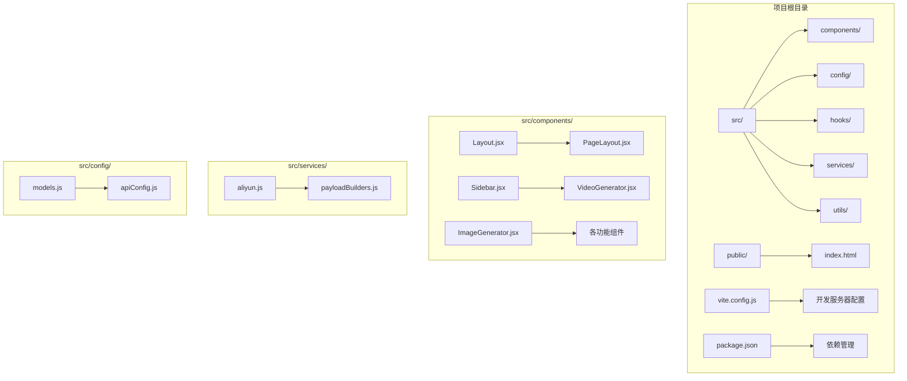

**图表来源**
- [src/App.jsx](file://src/App.jsx#L1-L377)
- [src/main.jsx](file://src/main.jsx#L1-L11)

### 技术栈选择

项目选择了React + Vite作为技术栈，主要基于以下优势：

- **开发体验**：Vite提供极快的冷启动和热更新
- **构建性能**：ESM原生支持，构建速度更快
- **生态兼容**：与现有React生态系统完全兼容
- **现代特性**：支持最新的JavaScript特性和React 19的新功能

**章节来源**
- [README.md](file://README.md#L1-L17)
- [package.json](file://package.json#L1-L33)

## 核心组件

### 应用入口点

应用的入口点位于`src/main.jsx`，负责初始化React应用并挂载到DOM中：

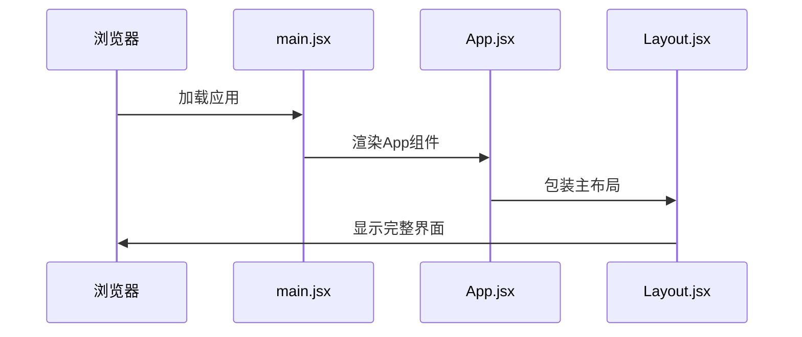

**图表来源**
- [src/main.jsx](file://src/main.jsx#L1-L11)
- [src/App.jsx](file://src/App.jsx#L1-L377)

### 布局系统

项目采用响应式布局设计，包含桌面端和移动端适配：

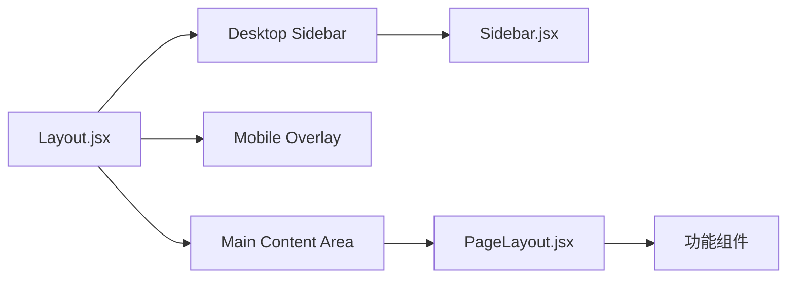

**图表来源**
- [src/components/Layout.jsx](file://src/components/Layout.jsx#L1-L94)
- [src/components/Sidebar.jsx](file://src/components/Sidebar.jsx#L1-L149)

### 任务管理系统

项目实现了完整的任务生命周期管理，包括任务创建、状态轮询和结果展示：

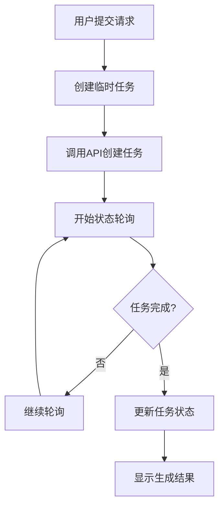

**图表来源**
- [src/hooks/useTasks.js](file://src/hooks/useTasks.js#L256-L332)

**章节来源**
- [src/App.jsx](file://src/App.jsx#L42-L377)
- [src/components/Layout.jsx](file://src/components/Layout.jsx#L1-L94)
- [src/hooks/useTasks.js](file://src/hooks/useTasks.js#L1-L333)

## 架构概览

项目采用分层架构设计，清晰分离了UI层、业务逻辑层和服务层：

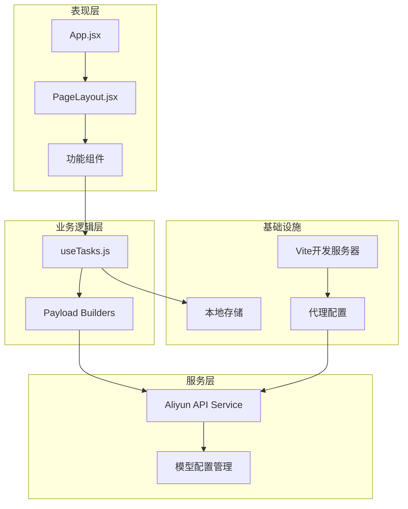

**图表来源**
- [src/App.jsx](file://src/App.jsx#L1-L377)
- [src/hooks/useTasks.js](file://src/hooks/useTasks.js#L1-L333)
- [src/services/aliyun.js](file://src/services/aliyun.js#L1-L215)
- [vite.config.js](file://vite.config.js#L1-L23)

### 数据流设计

项目实现了清晰的数据流向，从用户交互到最终结果展示：

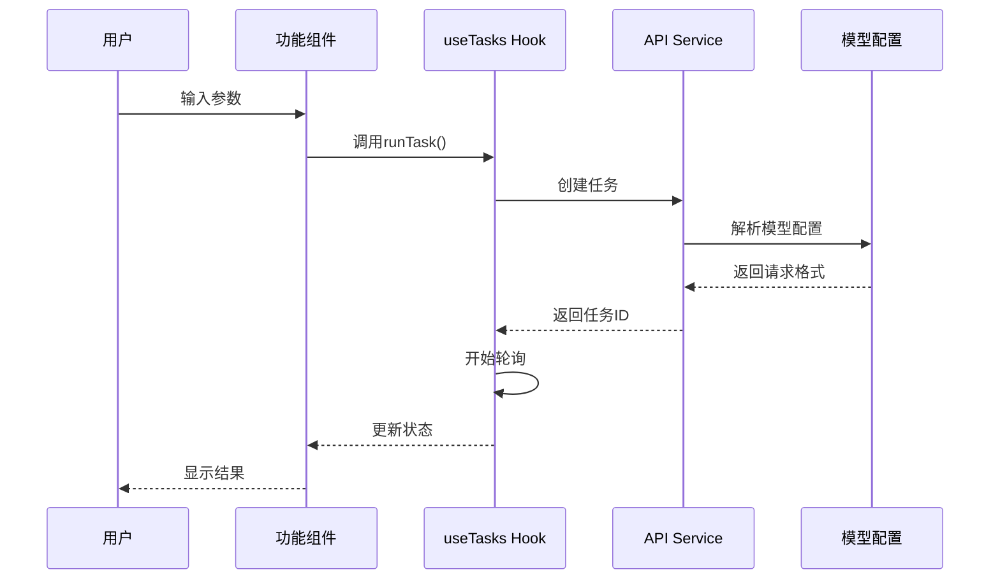

**图表来源**
- [src/components/VideoGenerator.jsx](file://src/components/VideoGenerator.jsx#L74-L115)
- [src/hooks/useTasks.js](file://src/hooks/useTasks.js#L256-L312)
- [src/services/aliyun.js](file://src/services/aliyun.js#L50-L160)

## 详细组件分析

### 视频生成组件

视频生成组件提供了完整的视频创作功能，支持多种模型和参数配置：

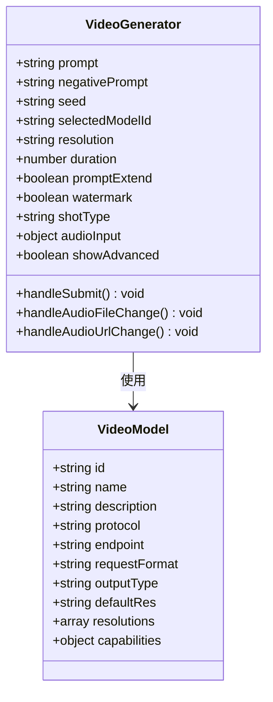

**图表来源**
- [src/components/VideoGenerator.jsx](file://src/components/VideoGenerator.jsx#L1-L200)
- [src/config/models.js](file://src/config/models.js#L40-L135)

### 图像生成组件

图像生成组件专注于文生图功能，提供了丰富的参数配置选项：

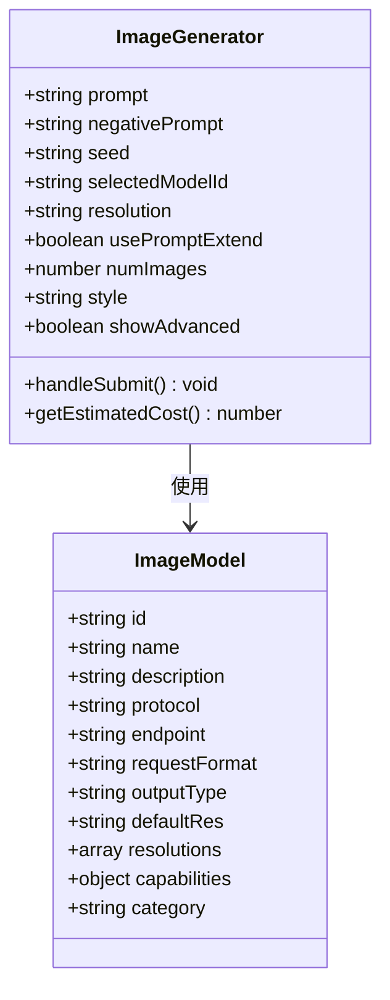

**图表来源**
- [src/components/ImageGenerator.jsx](file://src/components/ImageGenerator.jsx#L1-L200)
- [src/config/models.js](file://src/config/models.js#L265-L478)

### 任务管理Hook

任务管理Hook实现了复杂的状态管理和轮询逻辑：

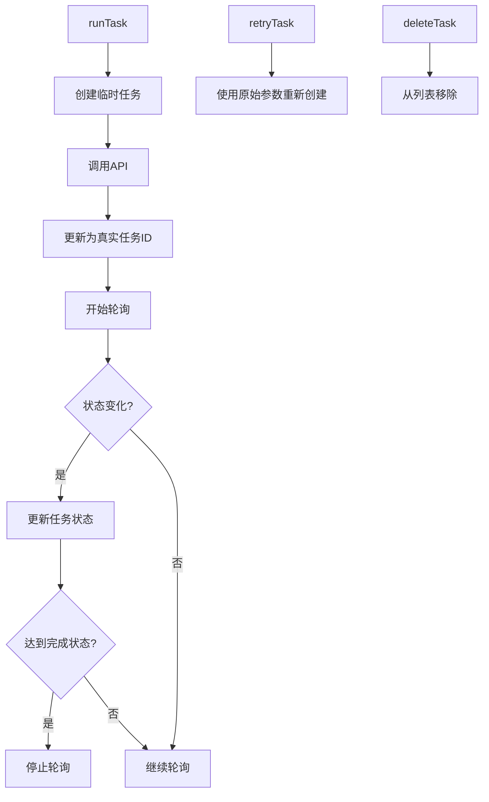

**图表来源**
- [src/hooks/useTasks.js](file://src/hooks/useTasks.js#L256-L332)

**章节来源**
- [src/components/VideoGenerator.jsx](file://src/components/VideoGenerator.jsx#L1-L200)
- [src/components/ImageGenerator.jsx](file://src/components/ImageGenerator.jsx#L1-L200)
- [src/hooks/useTasks.js](file://src/hooks/useTasks.js#L1-L333)

## 依赖关系分析

项目采用了模块化的依赖管理策略，确保各组件间的松耦合：

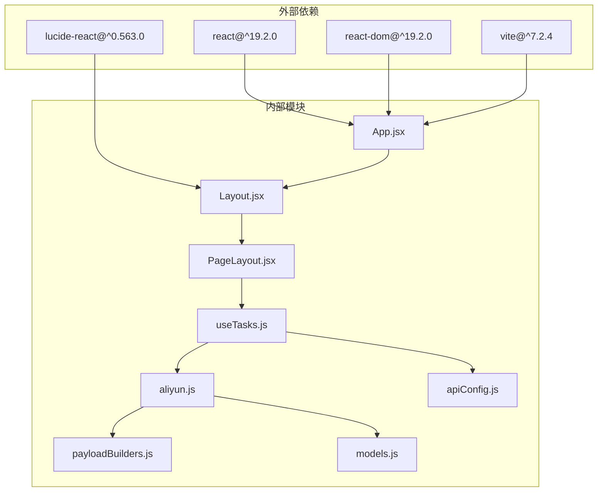

**图表来源**
- [package.json](file://package.json#L12-L31)
- [src/App.jsx](file://src/App.jsx#L1-L25)

### 开发环境配置

项目使用Vite作为构建工具，配置了完善的开发服务器和代理设置：

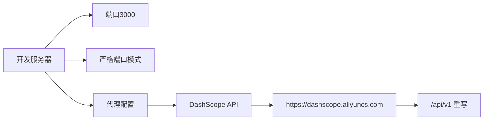

**图表来源**
- [vite.config.js](file://vite.config.js#L1-L23)

**章节来源**
- [package.json](file://package.json#L1-L33)
- [vite.config.js](file://vite.config.js#L1-L23)

## 性能考虑

项目在多个层面考虑了性能优化：

### 1. 智能轮询策略

任务轮询采用了自适应算法，根据任务状态动态调整轮询频率：

- **新任务**：1秒间隔，快速获取状态
- **活跃任务**：2秒间隔，平衡响应性和资源消耗
- **长时间任务**：最大5秒间隔，减少API压力

### 2. 本地存储优化

- **数据清理**：自动移除base64数据，节省存储空间
- **容量管理**：存储满时自动保留最近20条记录
- **类型迁移**：支持从旧版本存储格式升级

### 3. 组件优化

- **记忆化**：使用useMemo缓存过滤后的任务列表
- **条件渲染**：历史记录支持折叠，减少DOM节点
- **懒加载**：按需加载功能组件

## 故障排除指南

### 常见问题及解决方案

#### API密钥配置问题

**问题**：API Key状态显示为红色，无法生成内容

**解决方案**：
1. 点击设置按钮打开配置面板
2. 在API Key输入框中粘贴有效的密钥
3. 点击保存按钮确认配置

#### 任务状态异常

**问题**：任务长时间处于RUNNING状态

**解决方案**：
1. 检查网络连接是否正常
2. 查看浏览器控制台是否有错误信息
3. 等待轮询机制自动恢复
4. 如问题持续，尝试刷新页面重新开始

#### 生成结果为空

**问题**：任务状态显示SUCCEEDED但没有结果链接

**解决方案**：
1. 检查模型配置是否正确
2. 验证输入参数格式是否符合要求
3. 查看API响应日志获取更多信息

**章节来源**
- [src/components/Layout.jsx](file://src/components/Layout.jsx#L50-L70)
- [src/hooks/useTasks.js](file://src/hooks/useTasks.js#L210-L225)

## 结论

通义万相前端应用项目展现了现代AI内容生成平台的最佳实践。通过精心设计的架构和丰富的功能模块，该项目为用户提供了强大而易用的AI创作工具。

### 技术优势总结

1. **架构清晰**：分层设计确保了代码的可维护性和可扩展性
2. **用户体验优秀**：响应式设计和直观的界面提升了用户满意度
3. **性能优化到位**：智能轮询和本地存储策略保证了良好的性能表现
4. **企业级可靠**：基于阿里云服务，提供稳定的服务保障

### 未来发展方向

- **模型扩展**：持续集成新的AI模型，丰富创作能力
- **功能增强**：添加更多创意工具和编辑功能
- **性能优化**：进一步提升大文件处理和实时协作能力
- **生态建设**：构建开发者社区，促进应用生态发展

该项目不仅是一个功能完备的AI创作平台，更是探索AI技术在创意产业应用的有益尝试，为相关领域的发展提供了有价值的参考。