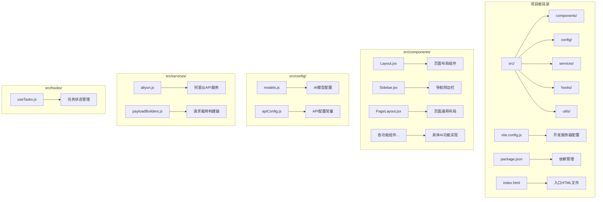
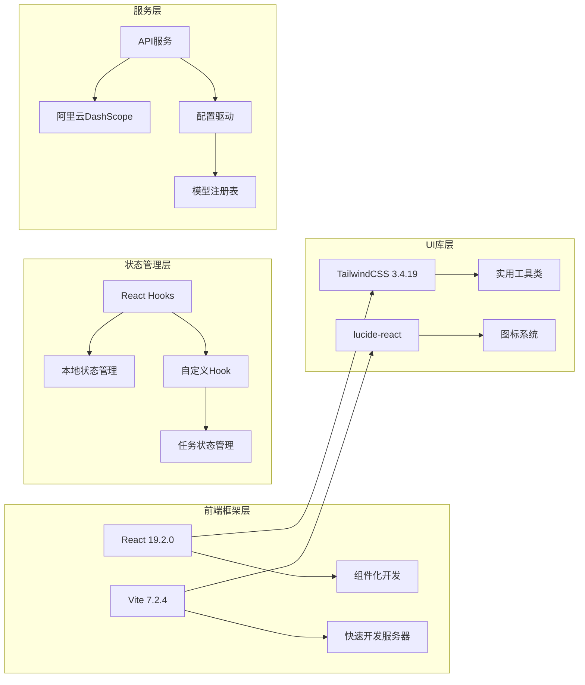
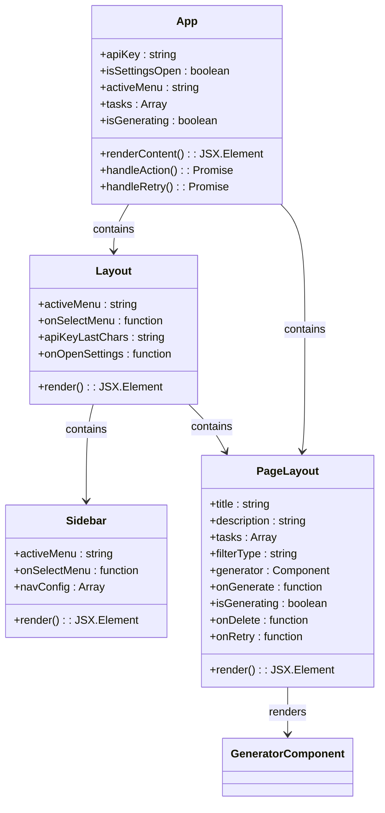
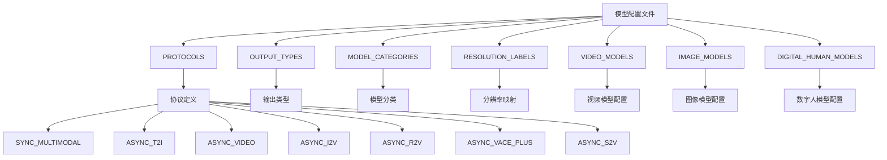
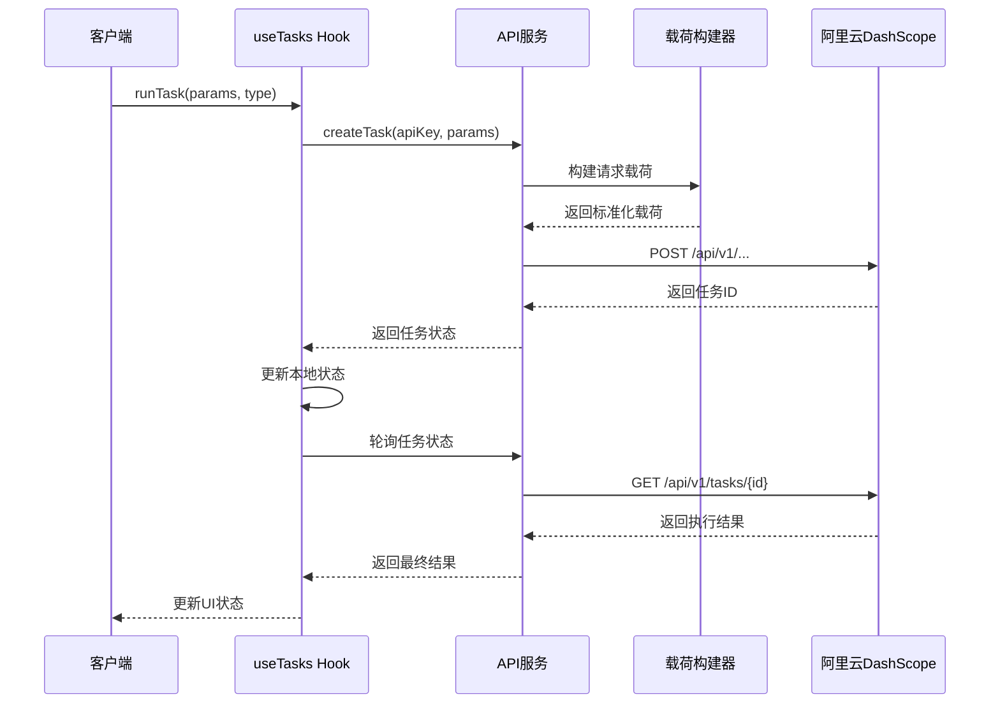

# 项目概述

<cite>
**本文档引用的文件**
- [README.md](file://README.md)
- [package.json](file://package.json)
- [vite.config.js](file://vite.config.js)
- [src/App.jsx](file://src/App.jsx)
- [src/main.jsx](file://src/main.jsx)
- [src/config/models.js](file://src/config/models.js)
- [src/config/apiConfig.js](file://src/config/apiConfig.js)
- [src/services/aliyun.js](file://src/services/aliyun.js)
- [src/services/payloadBuilders.js](file://src/services/payloadBuilders.js)
- [src/hooks/useTasks.js](file://src/hooks/useTasks.js)
- [src/components/Layout.jsx](file://src/components/Layout.jsx)
- [src/components/PageLayout.jsx](file://src/components/PageLayout.jsx)
- [src/components/Sidebar.jsx](file://src/components/Sidebar.jsx)
- [index.html](file://index.html)
</cite>

## 目录
1. [项目简介](#项目简介)
2. [项目结构](#项目结构)
3. [核心功能模块](#核心功能模块)
4. [技术架构](#技术架构)
5. [组件化设计](#组件化设计)
6. [配置驱动开发](#配置驱动开发)
7. [服务层抽象](#服务层抽象)
8. [性能优化策略](#性能优化策略)
9. [部署与环境配置](#部署与环境配置)
10. [总结](#总结)

## 项目简介

通义万相前端应用是一个基于React和Vite构建的AI内容生成平台，专门用于集成阿里云通义实验室的多种AI模型能力。该项目提供了一个现代化的用户界面，让用户能够轻松访问和使用各种AI生成功能，包括视频生成、图像生成、图像编辑、数字人生成等高级AI能力。

### 主要特性

- **多模态AI模型集成**：支持文本到图像、文本到视频、图像到视频等多种AI生成模型
- **实时任务管理**：提供异步任务处理和状态轮询机制
- **响应式设计**：支持桌面端和移动端的无缝体验
- **配置驱动架构**：通过配置文件管理所有AI模型和API端点
- **本地存储持久化**：支持任务历史记录的本地存储和恢复

## 项目结构

项目采用模块化的目录结构，按照功能和职责进行清晰的分离：



**图表来源**
- [src/App.jsx](file://src/App.jsx#L1-L377)
- [src/main.jsx](file://src/main.jsx#L1-L11)
- [src/components/Layout.jsx](file://src/components/Layout.jsx#L1-L94)

**章节来源**
- [src/App.jsx](file://src/App.jsx#L1-L377)
- [src/main.jsx](file://src/main.jsx#L1-L11)
- [package.json](file://package.json#L1-L33)

## 核心功能模块

### 视频创作中心

项目提供了完整的视频创作生态系统，涵盖从文本到视频的多种生成模式：

| 功能模块 | 模型名称 | 描述 | 技术特点 |
|---------|----------|------|----------|
| 文生视频 | wan2.6-t2v, wan2.5-t2v-preview | 基于文本描述生成高质量视频 | 支持音频驱动、多镜头叙事、分辨率控制 |
| 图生视频 | wan2.6-i2v, wan2.5-i2v-preview | 将静态图像转换为动态视频 | 支持关键帧驱动、模板模式、音频同步 |
| 参考生视频 | wan2.6-r2v | 基于参考视频生成新视频 | 多角色支持、音色保持、场景一致性 |
| 视频编辑 | wanx2.1-vace-plus | 统一的视频编辑模型 | 多图参考、局部编辑、视频扩展 |

### 图像创作中心

提供丰富的图像生成和编辑功能：

| 功能模块 | 模型名称 | 描述 | 主要能力 |
|---------|----------|------|----------|
| 文生图 | wan2.6-t2i, qwen-image-edit | 文本到图像生成 | 多种分辨率、风格控制、负向提示词 |
| 图像编辑 | qwen-image-edit系列 | 图像指令编辑 | 精确修改、风格迁移、物体移除 |
| 图像风格迁移 | 多种风格模型 | 艺术风格转换 | 全局/局部风格化、自定义风格 |
| 图像修复重绘 | 局部重绘模型 | 图像修复和重绘 | 去水印、瑕疵修复、内容扩展 |
| 草图生图 | wanx-sketch-to-image | 线稿转彩色图像 | 草图权重、颜色提取、风格融合 |

### 数字人与动效

专为数字人和动画效果设计的功能模块：

| 功能模块 | 模型名称 | 描述 | 技术特色 |
|---------|----------|------|----------|
| 数字人生成 | wan2.2-s2v | 基于图片和音频生成数字人 | 自然说话、唱歌、表演视频 |
| 动作生成 | wan2.2-animate系列 | 图片动作迁移 | 表情迁移、动作转换、姿态保持 |
| 表情包视频 | emoji-v1 | 表情包生成 | 预设模板、面部驱动、动态效果 |
| 视频换人 | wan2.2-animate-mix | 视频人物替换 | 保持场景一致性、光照色调 |

### 电商应用

针对电商场景的专业功能：

| 功能模块 | 模型名称 | 描述 | 应用价值 |
|---------|----------|------|----------|
| AI试衣 | aitryon系列 | 虚拟试穿效果 | 提升购物体验、减少退货率 |
| 背景生成 | background-generation | 商品背景生成 | 电商海报制作、产品展示 |

**章节来源**
- [src/config/models.js](file://src/config/models.js#L1-L1012)
- [src/App.jsx](file://src/App.jsx#L71-L355)

## 技术架构

### 前端技术栈

项目采用现代前端技术栈，确保开发效率和用户体验：



**图表来源**
- [package.json](file://package.json#L12-L31)
- [vite.config.js](file://vite.config.js#L1-L23)

### 核心设计理念

1. **配置驱动开发**：所有AI模型配置都集中在一个配置文件中，便于维护和扩展
2. **组件化设计**：每个AI功能都是独立的React组件，支持复用和组合
3. **服务层抽象**：API调用逻辑集中在服务层，便于测试和维护
4. **异步任务处理**：统一的任务管理系统支持长时间运行的AI生成任务

**章节来源**
- [package.json](file://package.json#L1-L33)
- [vite.config.js](file://vite.config.js#L1-L23)

## 组件化设计

### 页面布局架构

项目采用分层的组件架构，确保代码的可维护性和可扩展性：



**图表来源**
- [src/components/Layout.jsx](file://src/components/Layout.jsx#L1-L94)
- [src/components/PageLayout.jsx](file://src/components/PageLayout.jsx#L1-L76)
- [src/components/Sidebar.jsx](file://src/components/Sidebar.jsx#L1-L149)
- [src/App.jsx](file://src/App.jsx#L42-L377)

### 功能组件设计

每个AI功能都封装为独立的组件，具有以下特点：

- **统一接口**：所有功能组件都遵循相同的props接口
- **状态隔离**：组件内部管理自己的状态，避免状态泄漏
- **错误处理**：内置错误边界和用户友好的错误提示
- **加载状态**：提供视觉反馈，改善用户体验

**章节来源**
- [src/components/Layout.jsx](file://src/components/Layout.jsx#L1-L94)
- [src/components/PageLayout.jsx](file://src/components/PageLayout.jsx#L1-L76)
- [src/components/Sidebar.jsx](file://src/components/Sidebar.jsx#L1-L149)

## 配置驱动开发

### 模型配置系统

项目采用配置驱动的方式管理所有AI模型，这种设计提供了极大的灵活性：



**图表来源**
- [src/config/models.js](file://src/config/models.js#L1-L1012)

### 配置管理策略

1. **协议标准化**：统一不同类型的AI模型调用协议
2. **能力声明**：通过capabilities字段声明模型支持的功能
3. **端点抽象**：通过endpoint字段抽象API调用路径
4. **参数验证**：自动验证请求参数的完整性和正确性

**章节来源**
- [src/config/models.js](file://src/config/models.js#L1-L1012)
- [src/config/apiConfig.js](file://src/config/apiConfig.js#L1-L35)

## 服务层抽象

### API服务架构

项目的服务层提供了统一的API调用接口，隐藏了底层实现细节：



**图表来源**
- [src/services/aliyun.js](file://src/services/aliyun.js#L50-L160)
- [src/hooks/useTasks.js](file://src/hooks/useTasks.js#L256-L312)

### 任务管理机制

项目实现了完整的异步任务管理系统：

1. **乐观更新**：立即显示任务状态，提高响应速度
2. **批量轮询**：并发查询多个任务状态，提高效率
3. **自适应轮询**：根据任务状态动态调整轮询频率
4. **错误重试**：智能重试机制，提高成功率

**章节来源**
- [src/services/aliyun.js](file://src/services/aliyun.js#L1-L215)
- [src/hooks/useTasks.js](file://src/hooks/useTasks.js#L1-L333)

## 性能优化策略

### 前端性能优化

项目采用了多项性能优化策略：

1. **懒加载组件**：使用React.lazy实现组件的按需加载
2. **状态缓存**：使用useMemo和useCallback避免不必要的重渲染
3. **本地存储优化**：智能清理base64数据，节省存储空间
4. **轮询优化**：自适应轮询间隔，平衡响应性和资源消耗

### 开发体验优化

1. **热重载**：Vite提供的快速热重载功能
2. **代理配置**：开发服务器代理阿里云API
3. **TypeScript支持**：可选的TypeScript集成
4. **ESLint配置**：严格的代码质量检查

**章节来源**
- [src/hooks/useTasks.js](file://src/hooks/useTasks.js#L30-L84)
- [vite.config.js](file://vite.config.js#L1-L23)

## 部署与环境配置

### 开发环境配置

项目提供了完整的开发环境配置：

```mermaid
flowchart LR
A[Vite开发服务器] --> B[端口3000]
A --> C[严格端口模式]
A --> D[Host: true]
E[代理配置] --> F[/api/aliyun -> https://dashscope.aliyuncs.com]
E --> G[路径重写]
E --> H[Origin变更]
I[开发脚本] --> J[vite dev]
K[预览脚本] --> L[vite preview]
M[构建脚本] --> N[vite build]
```

**图表来源**
- [vite.config.js](file://vite.config.js#L7-L22)

### 生产环境部署

项目支持多种部署方式：

1. **Docker容器化**：完整的Docker配置文件
2. **Nginx反向代理**：生产环境的Web服务器配置
3. **自动化部署**：PowerShell和Shell脚本支持
4. **ECS云部署**：阿里云ECS一键部署脚本

**章节来源**
- [vite.config.js](file://vite.config.js#L1-L23)
- [package.json](file://package.json#L6-L11)

## 总结

通义万相前端应用项目展现了现代前端开发的最佳实践，通过精心设计的架构和模块化组织，成功地将复杂的AI功能包装成用户友好的界面。项目的核心优势包括：

### 技术优势

- **高度模块化**：清晰的组件分离和职责划分
- **配置驱动**：灵活的模型管理和API抽象
- **异步处理**：完善的任务管理和状态轮询机制
- **性能优化**：多层面的性能优化策略

### 设计优势

- **用户体验**：直观的界面设计和流畅的操作流程
- **可扩展性**：易于添加新功能和新AI模型
- **可维护性**：清晰的代码结构和完善的文档
- **跨平台支持**：优秀的桌面端和移动端兼容性

### 学习价值

对于初学者而言，这个项目提供了：
- React组件化开发的完整示例
- 配置驱动开发的设计模式
- 异步任务处理的最佳实践
- 现代前端工具链的使用方法

对于有经验的开发者而言，这个项目展示了：
- 复杂业务场景下的架构设计思路
- 多种性能优化策略的实际应用
- 企业级项目的工程化实践
- AI应用前端开发的技术挑战和解决方案

通过这个项目，开发者可以深入理解如何将复杂的AI能力转化为易用的前端应用，为构建下一代AI驱动的应用程序奠定坚实的基础。